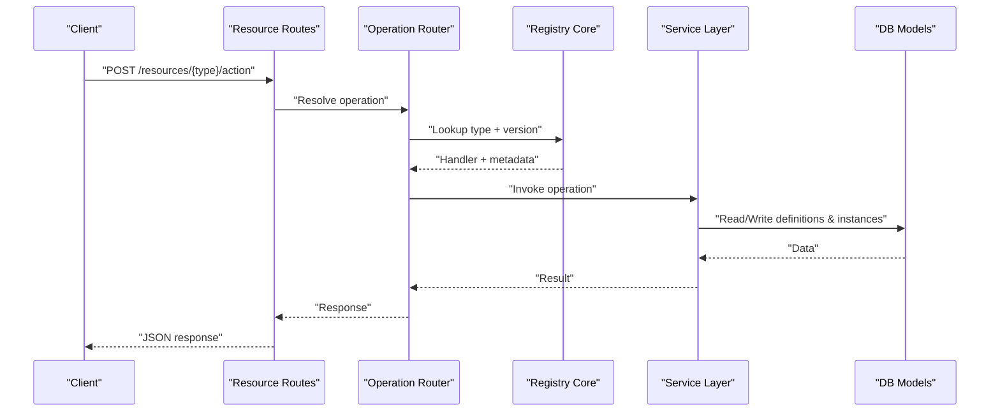
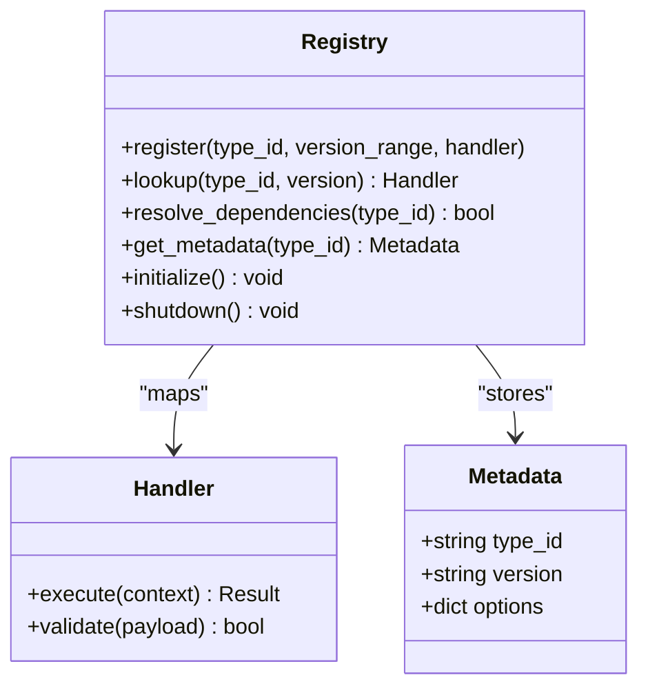
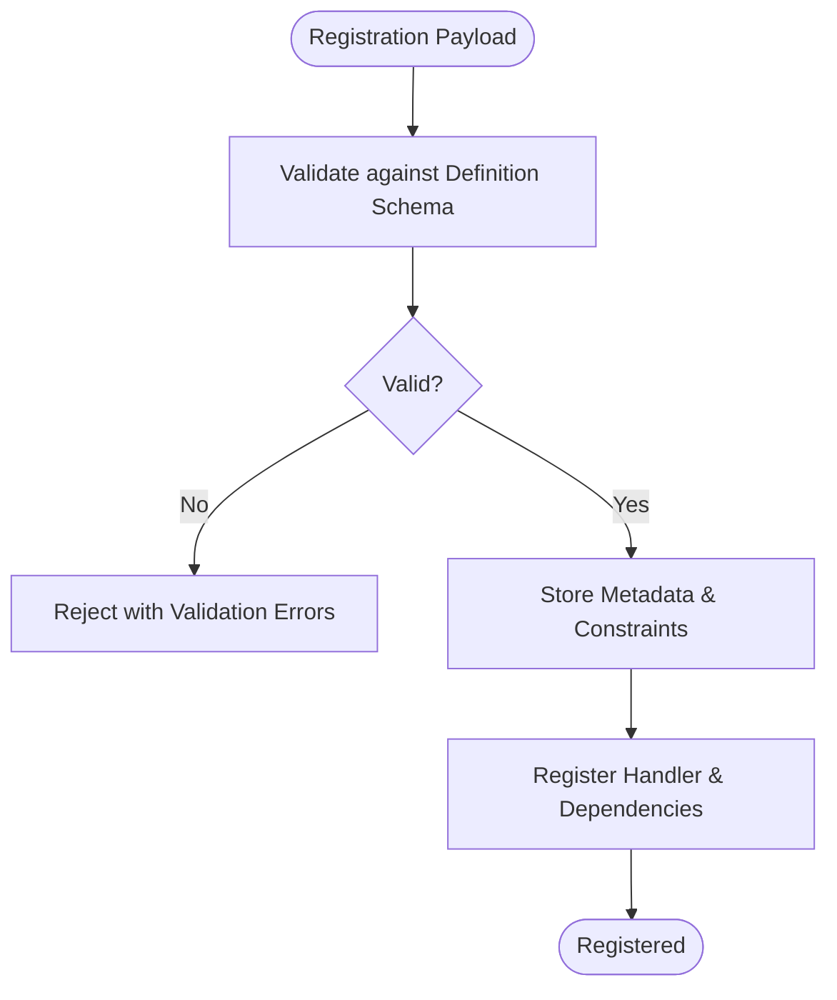
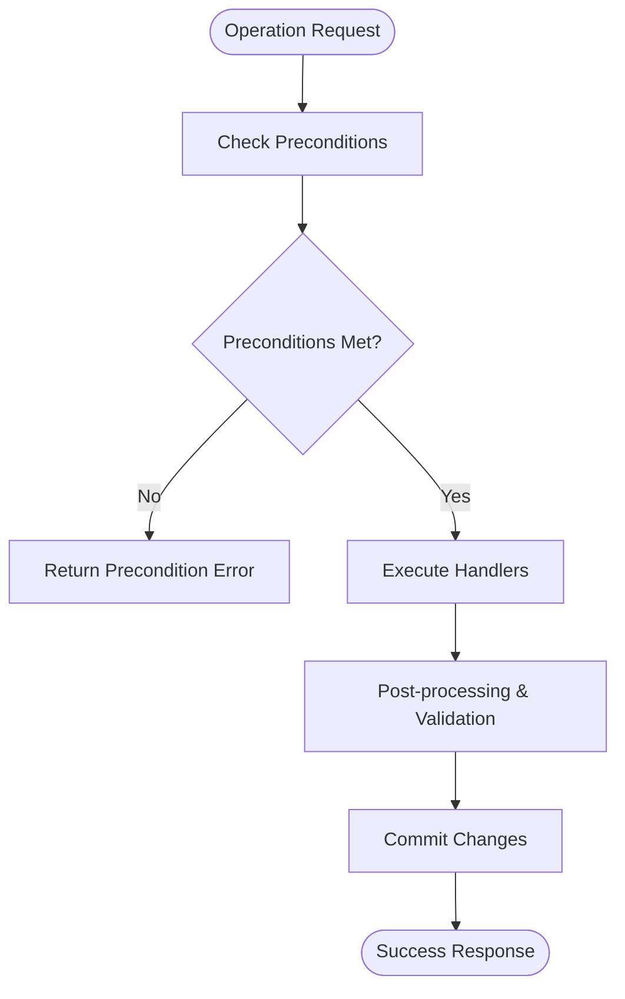
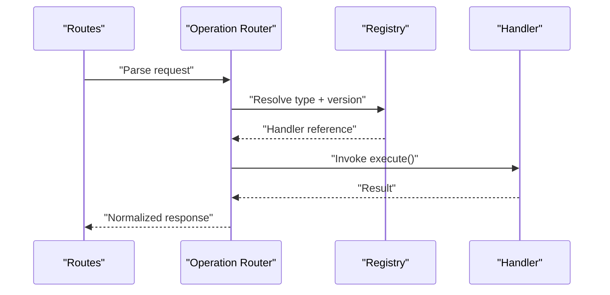
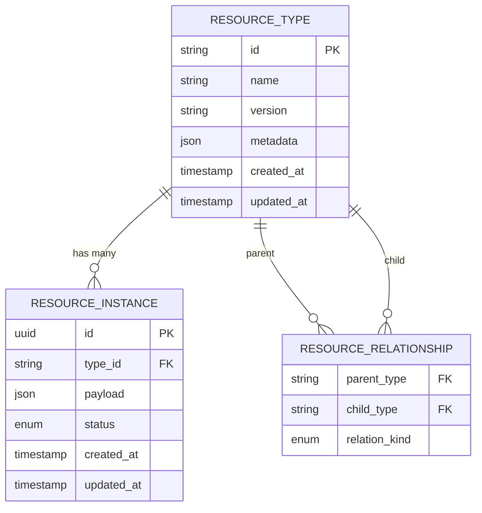
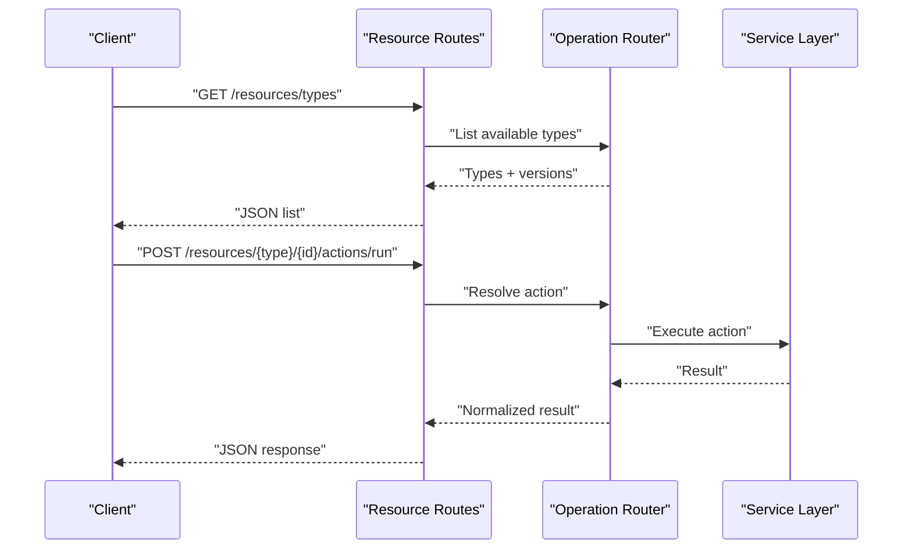
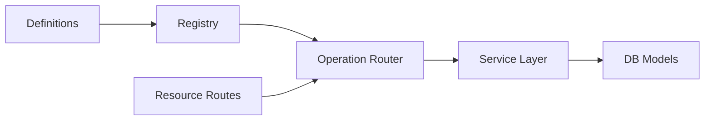

# Resource Registry System

<cite>
**Referenced Files in This Document**
- [registry.py](file://app/workplace_resources/registry.py)
- [definitions.py](file://app/workplace_resources/definitions.py)
- [service.py](file://app/workplace_resources/service.py)
- [operation_router.py](file://app/workplace_resources/operation_router.py)
- [workplace_resource_models.py](file://app/db/workplace_resource_models.py)
- [workplace_resource_routes.py](file://app/api/workplace_resource_routes.py)
- [test_workplace_resource_registry.py](file://tests/test_workplace_resource_registry.py)
- [test_workplace_resource_actions.py](file://tests/test_workplace_resource_actions.py)
- [test_workplace_operation_router.py](file://tests/test_workplace_operation_router.py)
</cite>

## Table of Contents
1. [Introduction](#introduction)
2. [Project Structure](#project-structure)
3. [Core Components](#core-components)
4. [Architecture Overview](#architecture-overview)
5. [Detailed Component Analysis](#detailed-component-analysis)
6. [Dependency Analysis](#dependency-analysis)
7. [Performance Considerations](#performance-considerations)
8. [Troubleshooting Guide](#troubleshooting-guide)
9. [Conclusion](#conclusion)

## Introduction
This document describes the resource registry system that powers dynamic discovery, registration, and lifecycle management of workplace resources. It explains how resource types are defined, validated, and resolved at runtime; how custom adapters integrate with the registry; and how versioning and dependency resolution work. It also provides guidance for extending the system with new resource types and optimizing performance for large registries.

## Project Structure
The resource registry is implemented under app/workplace_resources and integrates with database models, API routes, and tests. The key modules include:
- Registry core: dynamic registration and lookup
- Definitions: schema and metadata for resource types
- Service layer: orchestration and business logic
- Operation router: dispatching operations to registered handlers
- Database models: persistence of resource definitions and instances
- API routes: HTTP endpoints for resource operations
- Tests: coverage for registry behavior, actions, and routing

```mermaid
graph TB
subgraph "Workplace Resources"
REG["Registry Core<br/>dynamic registration & lookup"]
DEF["Definitions<br/>schema & metadata"]
SVC["Service Layer<br/>orchestration"]
ROUTER["Operation Router<br/>dispatch to handlers"]
end
subgraph "Persistence"
DBM["DB Models<br/>resource definitions & instances"]
end
subgraph "API"
API["Resource Routes<br/>HTTP endpoints"]
end
subgraph "Tests"
TREG["Registry Tests"]
TACT["Action Tests"]
TRT["Router Tests"]
end
API --> ROUTER
ROUTER --> REG
ROUTER --> SVC
REG --> DEF
SVC --> DBM
TREG --> REG
TACT --> ROUTER
TRT --> ROUTER
```

**Diagram sources**
- [registry.py](file://app/workplace_resources/registry.py)
- [definitions.py](file://app/workplace_resources/definitions.py)
- [service.py](file://app/workplace_resources/service.py)
- [operation_router.py](file://app/workplace_resources/operation_router.py)
- [workplace_resource_models.py](file://app/db/workplace_resource_models.py)
- [workplace_resource_routes.py](file://app/api/workplace_resource_routes.py)
- [test_workplace_resource_registry.py](file://tests/test_workplace_resource_registry.py)
- [test_workplace_resource_actions.py](file://tests/test_workplace_resource_actions.py)
- [test_workplace_operation_router.py](file://tests/test_workplace_operation_router.py)

**Section sources**
- [registry.py](file://app/workplace_resources/registry.py)
- [definitions.py](file://app/workplace_resources/definitions.py)
- [service.py](file://app/workplace_resources/service.py)
- [operation_router.py](file://app/workplace_resources/operation_router.py)
- [workplace_resource_models.py](file://app/db/workplace_resource_models.py)
- [workplace_resource_routes.py](file://app/api/workplace_resource_routes.py)
- [test_workplace_resource_registry.py](file://tests/test_workplace_resource_registry.py)
- [test_workplace_resource_actions.py](file://tests/test_workplace_resource_actions.py)
- [test_workplace_operation_router.py](file://tests/test_workplace_operation_router.py)

## Core Components
- Registry Core: Provides dynamic discovery and registration of resource types and their handlers. It maintains a type-to-handler mapping and supports versioned lookups and dependency resolution.
- Definitions: Encapsulates the resource definition schema, including type identifiers, version constraints, required fields, and metadata such as labels and descriptions.
- Service Layer: Coordinates resource operations across multiple adapters, enforces preconditions, and manages lifecycle transitions (create, read, update, delete).
- Operation Router: Maps incoming requests to the appropriate resource operation based on type, action, and context. It resolves dependencies and invokes the correct handler.
- Database Models: Persist resource definitions, relationships, and operational state. They provide the source of truth for available resource types and their attributes.
- API Routes: Expose HTTP endpoints for resource discovery, registration, and operations. They validate payloads using schemas and delegate to the service and router.
- Tests: Validate registry behavior, action execution, and routing correctness across scenarios including versioning and dependency resolution.

**Section sources**
- [registry.py](file://app/workplace_resources/registry.py)
- [definitions.py](file://app/workplace_resources/definitions.py)
- [service.py](file://app/workplace_resources/service.py)
- [operation_router.py](file://app/workplace_resources/operation_router.py)
- [workplace_resource_models.py](file://app/db/workplace_resource_models.py)
- [workplace_resource_routes.py](file://app/api/workplace_resource_routes.py)
- [test_workplace_resource_registry.py](file://tests/test_workplace_resource_registry.py)
- [test_workplace_resource_actions.py](file://tests/test_workplace_resource_actions.py)
- [test_workplace_operation_router.py](file://tests/test_workplace_operation_router.py)

## Architecture Overview
The resource registry follows a layered architecture:
- Presentation/API layer exposes endpoints for resource operations.
- Routing layer resolves the target resource type and action, then dispatches to the registry and service.
- Registry layer manages registrations, versions, and dependencies.
- Service layer orchestrates operations and interacts with persistence.
- Persistence layer stores definitions and instances.



**Diagram sources**
- [workplace_resource_routes.py](file://app/api/workplace_resource_routes.py)
- [operation_router.py](file://app/workplace_resources/operation_router.py)
- [registry.py](file://app/workplace_resources/registry.py)
- [service.py](file://app/workplace_resources/service.py)
- [workplace_resource_models.py](file://app/db/workplace_resource_models.py)

## Detailed Component Analysis

### Registry Core
Responsibilities:
- Dynamic registration of resource types and handlers
- Version-aware lookup and selection
- Dependency resolution among resource types
- Lifecycle hooks for initialization and cleanup

Key behaviors:
- Registration API accepts a type identifier, version constraints, and handler implementations.
- Lookup returns the best matching handler based on requested version and availability.
- Dependency graph is maintained to ensure prerequisites are satisfied before activation.
- Hooks allow deferred initialization and graceful shutdown.



**Diagram sources**
- [registry.py](file://app/workplace_resources/registry.py)

**Section sources**
- [registry.py](file://app/workplace_resources/registry.py)
- [test_workplace_resource_registry.py](file://tests/test_workplace_resource_registry.py)

### Definitions and Schema
Responsibilities:
- Define the resource definition schema used by the registry and API
- Enforce type validation rules and metadata structure
- Provide canonical field names and constraints

Key aspects:
- Type identifiers must be unique and follow naming conventions.
- Version strings adhere to semantic versioning or project-specific format.
- Required fields are enforced during registration and operation payloads.
- Optional metadata includes labels, descriptions, and capability flags.



**Diagram sources**
- [definitions.py](file://app/workplace_resources/definitions.py)

**Section sources**
- [definitions.py](file://app/workplace_resources/definitions.py)

### Service Layer
Responsibilities:
- Orchestrate multi-step operations across resource adapters
- Enforce preconditions and policies
- Manage lifecycle transitions (e.g., create -> active -> retired)
- Aggregate results from multiple handlers when needed

Key behaviors:
- Precondition checks use registry metadata and persisted state.
- Transactional boundaries ensure consistency across related updates.
- Error aggregation and retry strategies improve resilience.



**Diagram sources**
- [service.py](file://app/workplace_resources/service.py)

**Section sources**
- [service.py](file://app/workplace_resources/service.py)

### Operation Router
Responsibilities:
- Map incoming requests to resource types and actions
- Resolve version and dependencies
- Dispatch to the appropriate handler via the registry

Key behaviors:
- Path and query parameters determine type, action, and context.
- Version negotiation selects the best compatible handler.
- Dependency resolution ensures prerequisite resources exist.



**Diagram sources**
- [operation_router.py](file://app/workplace_resources/operation_router.py)
- [registry.py](file://app/workplace_resources/registry.py)

**Section sources**
- [operation_router.py](file://app/workplace_resources/operation_router.py)
- [test_workplace_operation_router.py](file://tests/test_workplace_operation_router.py)

### Database Models
Responsibilities:
- Persist resource definitions, versions, and metadata
- Track relationships between resource types
- Maintain operational state and audit trails

Key aspects:
- Unique constraints prevent duplicate registrations.
- Foreign keys enforce referential integrity for relationships.
- Indexes optimize queries for discovery and listing.



**Diagram sources**
- [workplace_resource_models.py](file://app/db/workplace_resource_models.py)

**Section sources**
- [workplace_resource_models.py](file://app/db/workplace_resource_models.py)

### API Routes
Responsibilities:
- Expose endpoints for resource discovery, registration, and operations
- Validate payloads using schemas
- Delegate to router and service layers

Key behaviors:
- Endpoints support CRUD-like operations and specialized actions.
- Responses are normalized and include error details.
- Authentication and authorization are enforced upstream.



**Diagram sources**
- [workplace_resource_routes.py](file://app/api/workplace_resource_routes.py)
- [operation_router.py](file://app/workplace_resources/operation_router.py)
- [service.py](file://app/workplace_resources/service.py)

**Section sources**
- [workplace_resource_routes.py](file://app/api/workplace_resource_routes.py)
- [test_workplace_resource_actions.py](file://tests/test_workplace_resource_actions.py)

## Dependency Analysis
The registry depends on definitions for schema enforcement, the service layer for orchestration, and database models for persistence. The router coordinates these components to fulfill requests.



**Diagram sources**
- [definitions.py](file://app/workplace_resources/definitions.py)
- [registry.py](file://app/workplace_resources/registry.py)
- [operation_router.py](file://app/workplace_resources/operation_router.py)
- [service.py](file://app/workplace_resources/service.py)
- [workplace_resource_models.py](file://app/db/workplace_resource_models.py)
- [workplace_resource_routes.py](file://app/api/workplace_resource_routes.py)

**Section sources**
- [registry.py](file://app/workplace_resources/registry.py)
- [definitions.py](file://app/workplace_resources/definitions.py)
- [operation_router.py](file://app/workplace_resources/operation_router.py)
- [service.py](file://app/workplace_resources/service.py)
- [workplace_resource_models.py](file://app/db/workplace_resource_models.py)
- [workplace_resource_routes.py](file://app/api/workplace_resource_routes.py)

## Performance Considerations
For large registries:
- Cache type-to-handler mappings and metadata behind a fast in-memory store with invalidation on registration changes.
- Use versioned indexes to accelerate lookup by type and version range.
- Defer heavy initialization until first access (lazy loading) to reduce startup time.
- Batch dependency resolution and memoize results per type to avoid repeated graph traversals.
- Apply pagination and filtering on listing endpoints to limit payload sizes.
- Prefer read replicas for discovery-heavy operations if persistence is distributed.

[No sources needed since this section provides general guidance]

## Troubleshooting Guide
Common issues and resolutions:
- Registration conflicts: Ensure unique type identifiers and non-overlapping version ranges. Check constraint violations in models.
- Version mismatch: Verify client-requested version falls within the registered range; adjust client or register additional versions.
- Missing dependencies: Inspect dependency graph and ensure prerequisite types are registered and active.
- Validation errors: Review definition schema requirements and payload shapes; align client inputs accordingly.
- Operational failures: Inspect service-layer logs for precondition failures and handler exceptions; confirm adapter contracts are met.

**Section sources**
- [test_workplace_resource_registry.py](file://tests/test_workplace_resource_registry.py)
- [test_workplace_resource_actions.py](file://tests/test_workplace_resource_actions.py)
- [test_workplace_operation_router.py](file://tests/test_workplace_operation_router.py)

## Conclusion
The resource registry system provides a robust foundation for dynamic discovery, registration, and lifecycle management of workplace resources. By adhering to the defined schemas, leveraging versioning and dependency resolution, and following the extension patterns outlined here, teams can safely introduce new resource types and operations while maintaining performance and reliability.