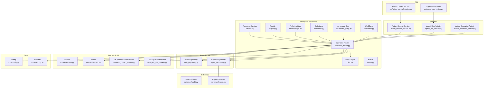
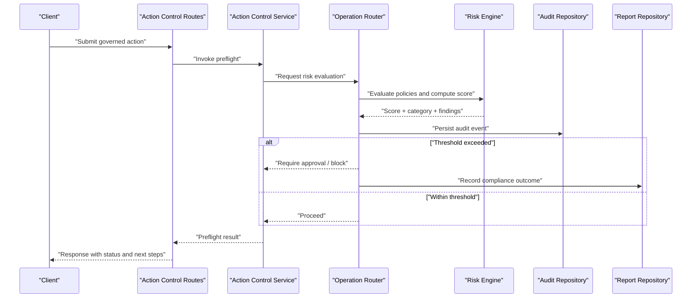
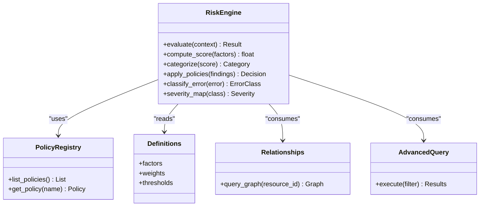
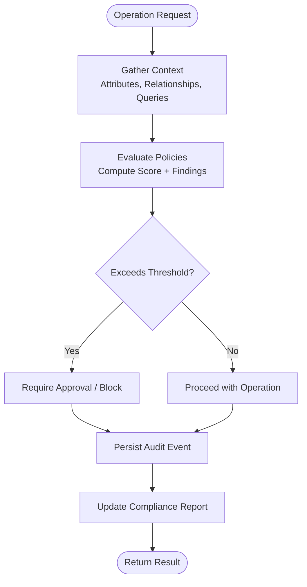
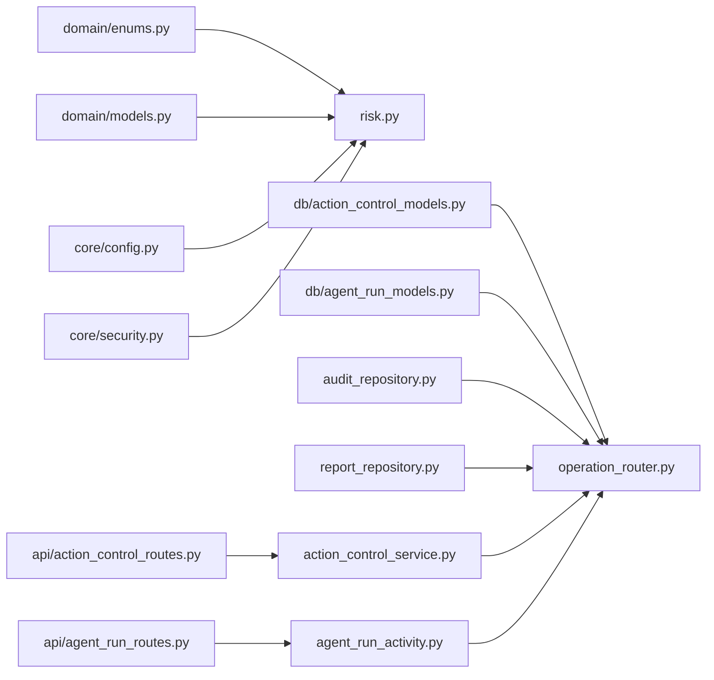

# Risk Assessment Framework

<cite>
**Referenced Files in This Document**
- [risk.py](file://app/workplace_resources/risk.py)
- [service.py](file://app/workplace_resources/service.py)
- [operation_router.py](file://app/workplace_resources/operation_router.py)
- [definitions.py](file://app/workplace_resources/definitions.py)
- [registry.py](file://app/workplace_resources/registry.py)
- [relationships.py](file://app/workplace_resources/relationships.py)
- [advanced_query.py](file://app/workplace_resources/advanced_query.py)
- [workflows.py](file://app/workplace_resources/workflows.py)
- [errors.py](file://app/workplace_resources/errors.py)
- [action_control_service.py](file://app/services/action_control_service.py)
- [agent_run_activity.py](file://app/services/agent_run_activity.py)
- [audit_repository.py](file://app/repositories/audit_repository.py)
- [report_repository.py](file://app/repositories/report_repository.py)
- [schemas/audit.py](file://app/schemas/audit.py)
- [schemas/report.py](file://app/schemas/report.py)
- [core/config.py](file://app/core/config.py)
- [core/security.py](file://app/core/security.py)
- [domain/enums.py](file://app/domain/enums.py)
- [domain/models.py](file://app/domain/models.py)
- [db/action_control_models.py](file://app/db/action_control_models.py)
- [db/agent_run_models.py](file://app/db/agent_run_models.py)
- [api/action_control_routes.py](file://app/api/action_control_routes.py)
- [api/agent_run_routes.py](file://app/api/agent_run_routes.py)
- [services/action_execution_activity.py](file://app/services/action_execution_activity.py)
</cite>

## Table of Contents
1. [Introduction](#introduction)
2. [Project Structure](#project-structure)
3. [Core Components](#core-components)
4. [Architecture Overview](#architecture-overview)
5. [Detailed Component Analysis](#detailed-component-analysis)
6. [Dependency Analysis](#dependency-analysis)
7. [Performance Considerations](#performance-considerations)
8. [Troubleshooting Guide](#troubleshooting-guide)
9. [Conclusion](#conclusion)
10. [Appendices](#appendices)

## Introduction
This document describes the risk assessment framework implemented within the application’s workplace resources layer and its integration with governance, audit, and reporting subsystems. It explains how risks are categorized and scored, how policies are evaluated, how compliance is checked, and how alerts and remediation guidance are produced. It also covers configuration, thresholds, error classification, severity levels, and examples for extending or customizing risk policies. Finally, it outlines audit logging, compliance reporting, and regulatory considerations.

## Project Structure
The risk assessment framework is primarily implemented under app/workplace_resources and integrates with services, repositories, schemas, and API routes that handle governed actions and agent runs. The following diagram maps key components to their source files:

**Diagram sources**
- [risk.py](file://app/workplace_resources/risk.py)
- [service.py](file://app/workplace_resources/service.py)
- [operation_router.py](file://app/workplace_resources/operation_router.py)
- [definitions.py](file://app/workplace_resources/definitions.py)
- [registry.py](file://app/workplace_resources/registry.py)
- [relationships.py](file://app/workplace_resources/relationships.py)
- [advanced_query.py](file://app/workplace_resources/advanced_query.py)
- [workflows.py](file://app/workplace_resources/workflows.py)
- [errors.py](file://app/workplace_resources/errors.py)
- [action_control_service.py](file://app/services/action_control_service.py)
- [agent_run_activity.py](file://app/services/agent_run_activity.py)
- [action_execution_activity.py](file://app/services/action_execution_activity.py)
- [audit_repository.py](file://app/repositories/audit_repository.py)
- [report_repository.py](file://app/repositories/report_repository.py)
- [schemas/audit.py](file://app/schemas/audit.py)
- [schemas/report.py](file://app/schemas/report.py)
- [domain/enums.py](file://app/domain/enums.py)
- [domain/models.py](file://app/domain/models.py)
- [db/action_control_models.py](file://app/db/action_control_models.py)
- [db/agent_run_models.py](file://app/db/agent_run_models.py)
- [api/action_control_routes.py](file://app/api/action_control_routes.py)
- [api/agent_run_routes.py](file://app/api/agent_run_routes.py)
- [core/config.py](file://app/core/config.py)
- [core/security.py](file://app/core/security.py)

**Section sources**
- [operation_router.py](file://app/workplace_resources/operation_router.py)
- [service.py](file://app/workplace_resources/service.py)
- [risk.py](file://app/workplace_resources/risk.py)

## Core Components
- Risk Engine: Implements scoring algorithms, categorization, and policy evaluation rules. It consumes contextual data (resource attributes, relationships, queries) and produces risk scores and categories.
- Operation Router: Orchestrates preflight checks, policy evaluation, and compliance gates before executing operations. It coordinates with the risk engine and triggers alerts when thresholds are exceeded.
- Resource Service: Provides higher-level workflows that integrate risk assessment into resource operations and lifecycle management.
- Registry and Definitions: Centralize available risk policies, scoring functions, and rule definitions. They enable extensibility and discoverability of risk capabilities.
- Relationships and Advanced Query: Supply context about resource topology and complex filtering used by risk evaluation.
- Workflows: Encapsulate multi-step processes where risk assessment influences state transitions and approvals.
- Errors: Standardizes error classification and severity mapping for risk-related failures.

Key responsibilities:
- Scoring: Combine weighted factors (e.g., sensitivity, exposure, change impact) into a numeric score.
- Categorization: Map scores to risk categories (e.g., low, medium, high, critical).
- Policy Evaluation: Apply configurable rules to determine pass/fail and required mitigations.
- Compliance Checking: Validate against organizational and regulatory constraints.
- Alerting: Emit alerts when thresholds are breached or exceptions occur.
- Audit and Reporting: Persist decisions and outcomes for compliance and audits.

**Section sources**
- [risk.py](file://app/workplace_resources/risk.py)
- [operation_router.py](file://app/workplace_resources/operation_router.py)
- [service.py](file://app/workplace_resources/service.py)
- [registry.py](file://app/workplace_resources/registry.py)
- [definitions.py](file://app/workplace_resources/definitions.py)
- [relationships.py](file://app/workplace_resources/relationships.py)
- [advanced_query.py](file://app/workplace_resources/advanced_query.py)
- [workflows.py](file://app/workplace_resources/workflows.py)
- [errors.py](file://app/workplace_resources/errors.py)

## Architecture Overview
The risk assessment framework sits at the boundary between operation orchestration and governance enforcement. Operations request preflight checks; the router invokes the risk engine to evaluate policies and compute scores. If thresholds are exceeded, the system enforces controls (e.g., require approval), emits alerts, and records audit events. Reports aggregate outcomes for compliance review.

**Diagram sources**
- [api/action_control_routes.py](file://app/api/action_control_routes.py)
- [action_control_service.py](file://app/services/action_control_service.py)
- [operation_router.py](file://app/workplace_resources/operation_router.py)
- [risk.py](file://app/workplace_resources/risk.py)
- [audit_repository.py](file://app/repositories/audit_repository.py)
- [report_repository.py](file://app/repositories/report_repository.py)

## Detailed Component Analysis

### Risk Engine
Responsibilities:
- Compute risk scores using weighted factors derived from resource attributes, relationships, and query results.
- Classify risks into categories based on configured thresholds.
- Evaluate policy rules to determine pass/fail and required mitigations.
- Produce structured findings including evidence references and remediation suggestions.

Scoring algorithm overview:
- Inputs: resource metadata, relationship graph, advanced query results, operator context, and policy parameters.
- Factors: sensitivity, exposure, change impact, historical incidents, and compliance posture.
- Aggregation: weighted sum or rule-based combination producing a normalized score.
- Output: numeric score, category, list of findings, and recommended mitigations.

Policy evaluation rules:
- Declarative rules defined in registry/definitions.
- Conditions check attribute values, relationships, and query outcomes.
- Actions include approve, require_approval, block, and warn.

Compliance checking mechanisms:
- Cross-reference domain enums and models for regulatory constraints.
- Enforce organization-specific policies via configuration.
- Generate compliance artifacts for reporting.

Error classification and severity:
- Maps operational errors to standardized classes and severities.
- Provides remediation suggestions per class.

Configuration and thresholds:
- Thresholds and weights loaded from core configuration.
- Supports environment-scoped overrides.

Integration points:
- Consumed by operation router and workflow orchestrators.
- Emits audit events and feeds report generation.

**Diagram sources**
- [risk.py](file://app/workplace_resources/risk.py)
- [registry.py](file://app/workplace_resources/registry.py)
- [definitions.py](file://app/workplace_resources/definitions.py)
- [relationships.py](file://app/workplace_resources/relationships.py)
- [advanced_query.py](file://app/workplace_resources/advanced_query.py)

**Section sources**
- [risk.py](file://app/workplace_resources/risk.py)
- [registry.py](file://app/workplace_resources/registry.py)
- [definitions.py](file://app/workplace_resources/definitions.py)
- [relationships.py](file://app/workplace_resources/relationships.py)
- [advanced_query.py](file://app/workplace_resources/advanced_query.py)

### Operation Router
Responsibilities:
- Orchestrate preflight checks and risk evaluation for operations.
- Enforce gating logic based on risk outcomes (approve, require approval, block).
- Trigger alerts and record audit events.
- Coordinate with services and repositories for execution and reporting.

Workflow flowchart:

**Diagram sources**
- [operation_router.py](file://app/workplace_resources/operation_router.py)
- [risk.py](file://app/workplace_resources/risk.py)
- [audit_repository.py](file://app/repositories/audit_repository.py)
- [report_repository.py](file://app/repositories/report_repository.py)

**Section sources**
- [operation_router.py](file://app/workplace_resources/operation_router.py)

### Resource Service and Workflows
Responsibilities:
- Provide higher-level workflows integrating risk assessment into resource lifecycle operations.
- Use the operation router to enforce governance at key stages (create, update, delete, deploy).
- Surface risk insights to users and downstream systems.

Integration with services:
- Action control service uses the router to gate actions.
- Agent run activity leverages risk outcomes to adjust execution paths.

**Section sources**
- [service.py](file://app/workplace_resources/service.py)
- [workflows.py](file://app/workplace_resources/workflows.py)
- [action_control_service.py](file://app/services/action_control_service.py)
- [agent_run_activity.py](file://app/services/agent_run_activity.py)

### Error Classification and Remediation
- Standardized error classes map to severity levels.
- Each class includes remediation suggestions to guide operators.
- Integration with audit and reporting ensures traceability.

**Section sources**
- [errors.py](file://app/workplace_resources/errors.py)

### Configuration and Security
- Thresholds, weights, and policy toggles are managed via core configuration.
- Security module provides access controls and context enrichment for risk evaluation.

**Section sources**
- [core/config.py](file://app/core/config.py)
- [core/security.py](file://app/core/security.py)

## Dependency Analysis
The risk assessment framework depends on domain models, database schemas, and repository interfaces to persist audit and report data. It interacts with API routes through services and activities.

**Diagram sources**
- [domain/enums.py](file://app/domain/enums.py)
- [domain/models.py](file://app/domain/models.py)
- [db/action_control_models.py](file://app/db/action_control_models.py)
- [db/agent_run_models.py](file://app/db/agent_run_models.py)
- [core/config.py](file://app/core/config.py)
- [core/security.py](file://app/core/security.py)
- [audit_repository.py](file://app/repositories/audit_repository.py)
- [report_repository.py](file://app/repositories/report_repository.py)
- [api/action_control_routes.py](file://app/api/action_control_routes.py)
- [api/agent_run_routes.py](file://app/api/agent_run_routes.py)
- [action_control_service.py](file://app/services/action_control_service.py)
- [agent_run_activity.py](file://app/services/agent_run_activity.py)
- [operation_router.py](file://app/workplace_resources/operation_router.py)
- [risk.py](file://app/workplace_resources/risk.py)

**Section sources**
- [operation_router.py](file://app/workplace_resources/operation_router.py)
- [risk.py](file://app/workplace_resources/risk.py)
- [audit_repository.py](file://app/repositories/audit_repository.py)
- [report_repository.py](file://app/repositories/report_repository.py)

## Performance Considerations
- Caching: Cache relationship graphs and advanced query results to reduce repeated computation during risk evaluation.
- Incremental Scoring: Recompute only affected factors when partial updates occur.
- Batch Processing: Aggregate multiple operations to minimize repository calls for audit and reporting.
- Asynchronous Auditing: Persist audit events asynchronously to avoid blocking operation flows.
- Threshold Tuning: Adjust weights and thresholds to balance false positives and operational throughput.

[No sources needed since this section provides general guidance]

## Troubleshooting Guide
Common issues and resolutions:
- Policy misconfiguration: Verify registry entries and definition weights; ensure thresholds align with organizational standards.
- Missing relationships: Confirm relationship queries return expected graphs; validate resource IDs and scopes.
- Excessive alerts: Tune thresholds and refine policy conditions; add exception handling for known benign cases.
- Audit gaps: Ensure audit repository writes succeed; check schema mappings and transaction boundaries.
- Compliance reports incomplete: Validate report repository inputs and aggregation logic; confirm coverage across all relevant operations.

Error classification tips:
- Map operational errors to standard classes using the error module.
- Assign severity levels consistently and attach remediation steps.
- Log detailed context for post-mortem analysis.

**Section sources**
- [errors.py](file://app/workplace_resources/errors.py)
- [audit_repository.py](file://app/repositories/audit_repository.py)
- [report_repository.py](file://app/repositories/report_repository.py)

## Conclusion
The risk assessment framework provides a robust foundation for evaluating and governing operations through configurable policies, scoring algorithms, and compliance checks. Its integration with audit and reporting supports transparency and accountability, while extensible registries and definitions allow organizations to tailor risk controls to their needs. Proper configuration, performance tuning, and troubleshooting practices ensure reliable operation aligned with governance objectives.

[No sources needed since this section summarizes without analyzing specific files]

## Appendices

### Examples of Custom Risk Policies
- Example: Data sensitivity policy
  - Condition: Resource attribute indicates “confidential” classification.
  - Action: Require approval if exposure exceeds internal network scope.
  - Mitigation: Restrict access and log additional details.
- Example: Change impact policy
  - Condition: High-impact change detected via advanced query results.
  - Action: Block unless approved by designated roles.
  - Mitigation: Schedule maintenance window and notify stakeholders.

These examples illustrate how to define conditions, actions, and mitigations using the registry and definitions modules.

**Section sources**
- [registry.py](file://app/workplace_resources/registry.py)
- [definitions.py](file://app/workplace_resources/definitions.py)

### Scoring Calculation Reference
- Inputs: sensitivity, exposure, change impact, historical incidents, compliance posture.
- Weights: Configurable per factor via definitions.
- Aggregation: Weighted sum normalized to a fixed range.
- Categories: Mapped by thresholds defined in configuration.

For implementation details, refer to the risk engine and definitions modules.

**Section sources**
- [risk.py](file://app/workplace_resources/risk.py)
- [definitions.py](file://app/workplace_resources/definitions.py)

### Integration with Governance Frameworks
- Align policy names and categories with organizational governance taxonomies.
- Export compliance artifacts via report repository for external auditors.
- Use domain enums and models to maintain consistency with enterprise data standards.

**Section sources**
- [domain/enums.py](file://app/domain/enums.py)
- [domain/models.py](file://app/domain/models.py)
- [report_repository.py](file://app/repositories/report_repository.py)

### Audit Logging and Compliance Reporting
- Audit events capture decision rationale, scores, categories, and mitigations.
- Reports aggregate outcomes over time, enabling trend analysis and regulatory submissions.
- Schemas define the structure of audit and report payloads.

**Section sources**
- [audit_repository.py](file://app/repositories/audit_repository.py)
- [report_repository.py](file://app/repositories/report_repository.py)
- [schemas/audit.py](file://app/schemas/audit.py)
- [schemas/report.py](file://app/schemas/report.py)

### Regulatory Requirements
- Maintain immutable audit trails for all governed actions.
- Ensure data retention and access controls comply with applicable regulations.
- Provide exportable reports for periodic compliance reviews.

[No sources needed since this section provides general guidance]