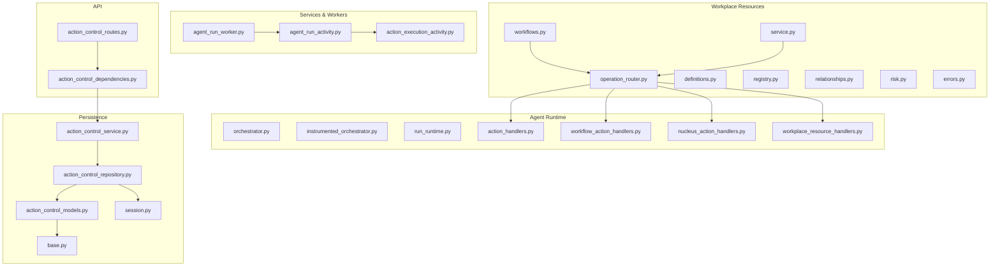
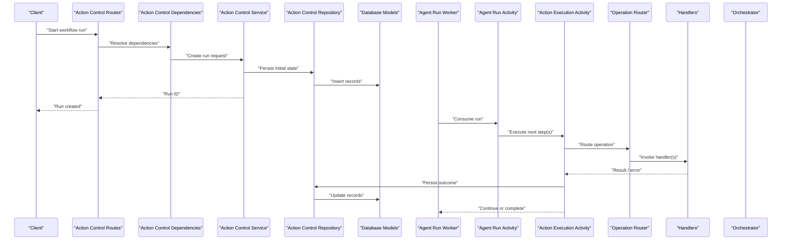
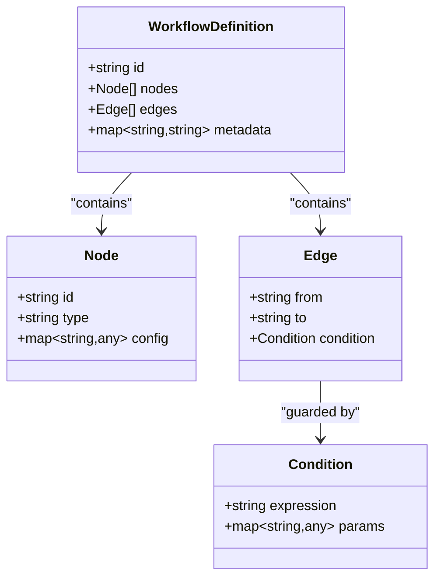
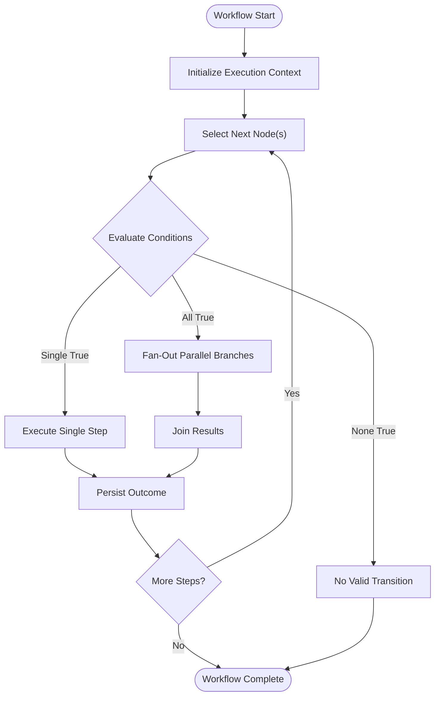
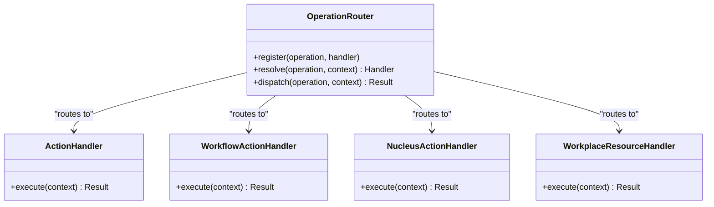
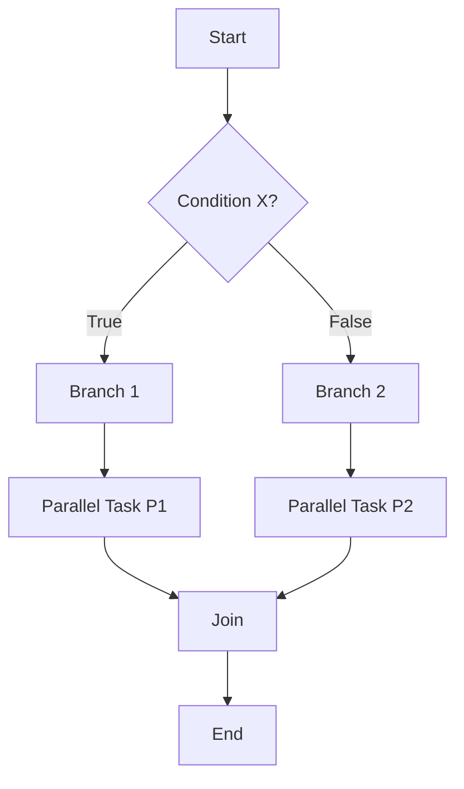
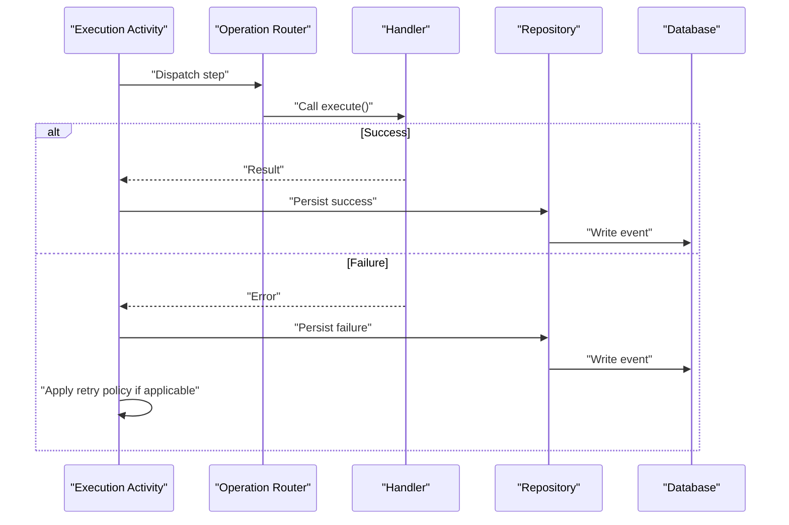
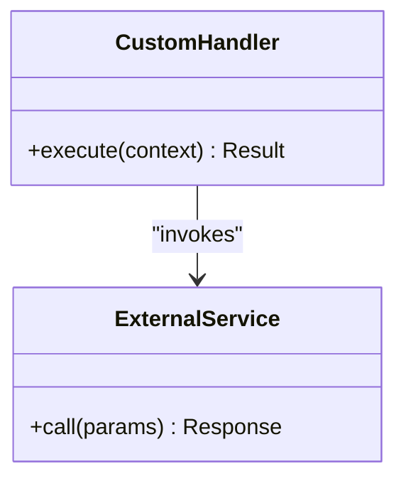
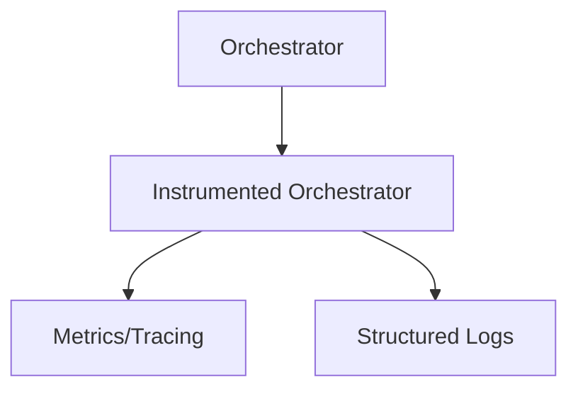
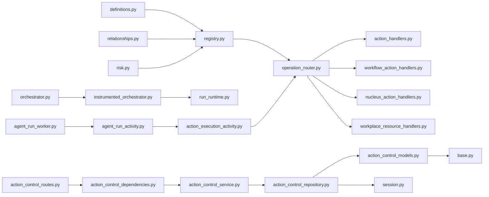

# Workflow Engine

<cite>
**Referenced Files in This Document**
- [WORKPLACE_WORKFLOWS.md](file://docs/WORKPLACE_WORKFLOWS.md)
- [workflows.py](file://app/workplace_resources/workflows.py)
- [operation_router.py](file://app/workplace_resources/operation_router.py)
- [service.py](file://app/workplace_resources/service.py)
- [definitions.py](file://app/workplace_resources/definitions.py)
- [registry.py](file://app/workplace_resources/registry.py)
- [relationships.py](file://app/workplace_resources/relationships.py)
- [risk.py](file://app/workplace_resources/risk.py)
- [errors.py](file://app/workplace_resources/errors.py)
- [agent_run_worker.py](file://app/services/agent_run_worker.py)
- [agent_run_activity.py](file://app/services/agent_run_activity.py)
- [action_execution_activity.py](file://app/services/action_execution_activity.py)
- [orchestrator.py](file://app/agent/orchestrator.py)
- [instrumented_orchestrator.py](file://app/agent/instrumented_orchestrator.py)
- [run_runtime.py](file://app/agent/run_runtime.py)
- [action_handlers.py](file://app/agent/action_handlers.py)
- [workflow_action_handlers.py](file://app/agent/workflow_action_handlers.py)
- [nucleus_action_handlers.py](file://app/agent/nucleus_action_handlers.py)
- [workplace_resource_handlers.py](file://app/agent/workplace_resource_handlers.py)
- [action_control_routes.py](file://app/api/action_control_routes.py)
- [action_control_dependencies.py](file://app/api/action_control_dependencies.py)
- [action_control_service.py](file://app/services/action_control_service.py)
- [action_control_repository.py](file://app/repositories/action_control_repository.py)
- [action_control_models.py](file://app/db/action_control_models.py)
- [base.py](file://app/db/base.py)
- [session.py](file://app/db/session.py)
- [test_workplace_workflows.py](file://tests/test_workplace_workflows.py)
</cite>

## Table of Contents
1. [Introduction](#introduction)
2. [Project Structure](#project-structure)
3. [Core Components](#core-components)
4. [Architecture Overview](#architecture-overview)
5. [Detailed Component Analysis](#detailed-component-analysis)
6. [Dependency Analysis](#dependency-analysis)
7. [Performance Considerations](#performance-considerations)
8. [Troubleshooting Guide](#troubleshooting-guide)
9. [Conclusion](#conclusion)
10. [Appendices](#appendices)

## Introduction
This document describes the workflow engine that powers declarative workplace workflows. It explains how workflows are defined, executed, and persisted; how operations are routed to handlers; how conditional branching and parallel execution are modeled; and how errors, retries, and monitoring are handled. It also provides guidance for extending the system with custom steps and integrating external systems.

## Project Structure
The workflow engine is implemented primarily under app/workplace_resources and integrates with the agent runtime and action control plane. Key areas:
- Declarative definitions and registry: definitions, registry, relationships, risk
- Execution orchestration: service layer, operation router, and worker integration
- Persistence and state: database models and repositories
- API surface: routes and dependencies for triggering and controlling runs
- Tests: end-to-end and unit tests validating behavior

**Diagram sources**
- [workflows.py](file://app/workplace_resources/workflows.py)
- [operation_router.py](file://app/workplace_resources/operation_router.py)
- [service.py](file://app/workplace_resources/service.py)
- [definitions.py](file://app/workplace_resources/definitions.py)
- [registry.py](file://app/workplace_resources/registry.py)
- [relationships.py](file://app/workplace_resources/relationships.py)
- [risk.py](file://app/workplace_resources/risk.py)
- [errors.py](file://app/workplace_resources/errors.py)
- [orchestrator.py](file://app/agent/orchestrator.py)
- [instrumented_orchestrator.py](file://app/agent/instrumented_orchestrator.py)
- [run_runtime.py](file://app/agent/run_runtime.py)
- [action_handlers.py](file://app/agent/action_handlers.py)
- [workflow_action_handlers.py](file://app/agent/workflow_action_handlers.py)
- [nucleus_action_handlers.py](file://app/agent/nucleus_action_handlers.py)
- [workplace_resource_handlers.py](file://app/agent/workplace_resource_handlers.py)
- [agent_run_worker.py](file://app/services/agent_run_worker.py)
- [agent_run_activity.py](file://app/services/agent_run_activity.py)
- [action_execution_activity.py](file://app/services/action_execution_activity.py)
- [action_control_routes.py](file://app/api/action_control_routes.py)
- [action_control_dependencies.py](file://app/api/action_control_dependencies.py)
- [action_control_service.py](file://app/services/action_control_service.py)
- [action_control_repository.py](file://app/repositories/action_control_repository.py)
- [action_control_models.py](file://app/db/action_control_models.py)
- [base.py](file://app/db/base.py)
- [session.py](file://app/db/session.py)

**Section sources**
- [WORKPLACE_WORKFLOWS.md](file://docs/WORKPLACE_WORKFLOWS.md)
- [workflows.py](file://app/workplace_resources/workflows.py)
- [operation_router.py](file://app/workplace_resources/operation_router.py)
- [service.py](file://app/workplace_resources/service.py)
- [definitions.py](file://app/workplace_resources/definitions.py)
- [registry.py](file://app/workplace_resources/registry.py)
- [relationships.py](file://app/workplace_resources/relationships.py)
- [risk.py](file://app/workplace_resources/risk.py)
- [errors.py](file://app/workplace_resources/errors.py)
- [agent_run_worker.py](file://app/services/agent_run_worker.py)
- [agent_run_activity.py](file://app/services/agent_run_activity.py)
- [action_execution_activity.py](file://app/services/action_execution_activity.py)
- [orchestrator.py](file://app/agent/orchestrator.py)
- [instrumented_orchestrator.py](file://app/agent/instrumented_orchestrator.py)
- [run_runtime.py](file://app/agent/run_runtime.py)
- [action_handlers.py](file://app/agent/action_handlers.py)
- [workflow_action_handlers.py](file://app/agent/workflow_action_handlers.py)
- [nucleus_action_handlers.py](file://app/agent/nucleus_action_handlers.py)
- [workplace_resource_handlers.py](file://app/agent/workplace_resource_handlers.py)
- [action_control_routes.py](file://app/api/action_control_routes.py)
- [action_control_dependencies.py](file://app/api/action_control_dependencies.py)
- [action_control_service.py](file://app/services/action_control_service.py)
- [action_control_repository.py](file://app/repositories/action_control_repository.py)
- [action_control_models.py](file://app/db/action_control_models.py)
- [base.py](file://app/db/base.py)
- [session.py](file://app/db/session.py)

## Core Components
- Declarative workflow definition: The workflow schema and validation rules define nodes, edges, conditions, and execution semantics. See definitions and related documentation.
- Operation routing: The router maps declared operations to handler implementations (built-in and custom).
- Execution context: The runtime constructs a per-run context carrying inputs, outputs, metadata, and side-effect boundaries.
- State machine transitions: Nodes represent states; edges represent transitions guarded by conditions.
- Parallelism and branching: The engine supports conditional branches and parallel fan-out/fan-in patterns as described in the workflow docs.
- Error handling and retries: Failures propagate through the runtime with retry policies where applicable.
- Persistence: Run state and events are persisted via the action control plane and repository layer.

**Section sources**
- [definitions.py](file://app/workplace_resources/definitions.py)
- [operation_router.py](file://app/workplace_resources/operation_router.py)
- [run_runtime.py](file://app/agent/run_runtime.py)
- [WORKPLACE_WORKFLOWS.md](file://docs/WORKPLACE_WORKFLOWS.md)
- [action_control_repository.py](file://app/repositories/action_control_repository.py)
- [action_control_models.py](file://app/db/action_control_models.py)

## Architecture Overview
The workflow engine sits on top of the agent runtime and action control plane. Workflows are declared declaratively, validated against schemas, and executed by orchestrating actions. The operation router dispatches each step to the appropriate handler. Worker services drive durable execution and persistence.

**Diagram sources**
- [action_control_routes.py](file://app/api/action_control_routes.py)
- [action_control_dependencies.py](file://app/api/action_control_dependencies.py)
- [action_control_service.py](file://app/services/action_control_service.py)
- [action_control_repository.py](file://app/repositories/action_control_repository.py)
- [action_control_models.py](file://app/db/action_control_models.py)
- [agent_run_worker.py](file://app/services/agent_run_worker.py)
- [agent_run_activity.py](file://app/services/agent_run_activity.py)
- [action_execution_activity.py](file://app/services/action_execution_activity.py)
- [operation_router.py](file://app/workplace_resources/operation_router.py)
- [action_handlers.py](file://app/agent/action_handlers.py)
- [workflow_action_handlers.py](file://app/agent/workflow_action_handlers.py)
- [nucleus_action_handlers.py](file://app/agent/nucleus_action_handlers.py)
- [workplace_resource_handlers.py](file://app/agent/workplace_resource_handlers.py)

## Detailed Component Analysis

### Declarative Workflow Definition Syntax
- Schema-driven definitions: Nodes, edges, conditions, and execution parameters are defined using typed structures validated at load time.
- Contextual references: Relationships and resource bindings allow dynamic resolution of targets and inputs.
- Risk and policy overlays: Risk scoring and policy constraints can be attached to steps or entire workflows.

**Diagram sources**
- [definitions.py](file://app/workplace_resources/definitions.py)
- [relationships.py](file://app/workplace_resources/relationships.py)
- [risk.py](file://app/workplace_resources/risk.py)

**Section sources**
- [definitions.py](file://app/workplace_resources/definitions.py)
- [relationships.py](file://app/workplace_resources/relationships.py)
- [risk.py](file://app/workplace_resources/risk.py)
- [WORKPLACE_WORKFLOWS.md](file://docs/WORKPLACE_WORKFLOWS.md)

### State Machine Transitions and Execution Context
- States: Each node represents a state; transitions occur when edge conditions evaluate to true.
- Context: Per-run context carries inputs, intermediate outputs, and execution metadata.
- Deterministic evaluation: Conditions are evaluated within a controlled environment to ensure reproducibility.

**Diagram sources**
- [workflows.py](file://app/workplace_resources/workflows.py)
- [run_runtime.py](file://app/agent/run_runtime.py)

**Section sources**
- [workflows.py](file://app/workplace_resources/workflows.py)
- [run_runtime.py](file://app/agent/run_runtime.py)

### Operation Routing System
- Registration: Handlers register themselves with the router by operation name or capability.
- Resolution: The router selects the best matching handler based on operation, resource type, and context.
- Extensibility: Custom handlers implement standard interfaces and integrate seamlessly.

**Diagram sources**
- [operation_router.py](file://app/workplace_resources/operation_router.py)
- [action_handlers.py](file://app/agent/action_handlers.py)
- [workflow_action_handlers.py](file://app/agent/workflow_action_handlers.py)
- [nucleus_action_handlers.py](file://app/agent/nucleus_action_handlers.py)
- [workplace_resource_handlers.py](file://app/agent/workplace_resource_handlers.py)

**Section sources**
- [operation_router.py](file://app/workplace_resources/operation_router.py)
- [action_handlers.py](file://app/agent/action_handlers.py)
- [workflow_action_handlers.py](file://app/agent/workflow_action_handlers.py)
- [nucleus_action_handlers.py](file://app/agent/nucleus_action_handlers.py)
- [workplace_resource_handlers.py](file://app/agent/workplace_resource_handlers.py)

### Conditional Branching and Parallel Execution Patterns
- Conditional branching: Edges carry expressions evaluated against the execution context.
- Parallel fan-out: Multiple outgoing edges can be enabled simultaneously; results are aggregated at join points.
- Anti-patterns: Avoid unbounded fan-out; prefer bounded concurrency and timeouts.

[No sources needed since this diagram shows conceptual workflow, not actual code structure]

**Section sources**
- [WORKPLACE_WORKFLOWS.md](file://docs/WORKPLACE_WORKFLOWS.md)
- [workflows.py](file://app/workplace_resources/workflows.py)

### Error Handling, Retry Mechanisms, and Workflow Persistence
- Error propagation: Exceptions raised by handlers bubble up to the execution activity, which persists failure details and updates run state.
- Retries: Where supported, transient failures trigger retries with backoff before marking a step failed.
- Persistence: The action control plane persists run lifecycle events and outcomes; workers resume from persisted state after restarts.

**Diagram sources**
- [action_execution_activity.py](file://app/services/action_execution_activity.py)
- [operation_router.py](file://app/workplace_resources/operation_router.py)
- [action_control_repository.py](file://app/repositories/action_control_repository.py)
- [action_control_models.py](file://app/db/action_control_models.py)

**Section sources**
- [action_execution_activity.py](file://app/services/action_execution_activity.py)
- [action_control_repository.py](file://app/repositories/action_control_repository.py)
- [action_control_models.py](file://app/db/action_control_models.py)
- [errors.py](file://app/workplace_resources/errors.py)

### Custom Step Implementations and External Integrations
- Implement handlers: Create a new handler class implementing the expected interface and register it with the router.
- External calls: Use HTTP clients or SDKs inside handlers; wrap network calls with retries and timeouts.
- Idempotency: Ensure handlers are idempotent to support safe retries and resumability.

**Diagram sources**
- [action_handlers.py](file://app/agent/action_handlers.py)
- [operation_router.py](file://app/workplace_resources/operation_router.py)

**Section sources**
- [action_handlers.py](file://app/agent/action_handlers.py)
- [operation_router.py](file://app/workplace_resources/operation_router.py)

### Monitoring, Debugging Tools, and Observability
- Instrumentation: The instrumented orchestrator wraps core orchestration paths to emit metrics and traces.
- Logging: Structured logs around routing, execution, and persistence aid debugging.
- Event stream: Runs emit lifecycle events persisted for inspection and replay.

**Diagram sources**
- [orchestrator.py](file://app/agent/orchestrator.py)
- [instrumented_orchestrator.py](file://app/agent/instrumented_orchestrator.py)

**Section sources**
- [orchestrator.py](file://app/agent/orchestrator.py)
- [instrumented_orchestrator.py](file://app/agent/instrumented_orchestrator.py)

## Dependency Analysis
The workflow engine depends on:
- Definitions and registry for schema and handler discovery
- Operation router for dispatch
- Agent runtime components for orchestration and execution
- Action control plane for persistence and lifecycle management
- Database session and models for storage

**Diagram sources**
- [definitions.py](file://app/workplace_resources/definitions.py)
- [registry.py](file://app/workplace_resources/registry.py)
- [relationships.py](file://app/workplace_resources/relationships.py)
- [risk.py](file://app/workplace_resources/risk.py)
- [operation_router.py](file://app/workplace_resources/operation_router.py)
- [action_handlers.py](file://app/agent/action_handlers.py)
- [workflow_action_handlers.py](file://app/agent/workflow_action_handlers.py)
- [nucleus_action_handlers.py](file://app/agent/nucleus_action_handlers.py)
- [workplace_resource_handlers.py](file://app/agent/workplace_resource_handlers.py)
- [orchestrator.py](file://app/agent/orchestrator.py)
- [instrumented_orchestrator.py](file://app/agent/instrumented_orchestrator.py)
- [run_runtime.py](file://app/agent/run_runtime.py)
- [agent_run_worker.py](file://app/services/agent_run_worker.py)
- [agent_run_activity.py](file://app/services/agent_run_activity.py)
- [action_execution_activity.py](file://app/services/action_execution_activity.py)
- [action_control_routes.py](file://app/api/action_control_routes.py)
- [action_control_dependencies.py](file://app/api/action_control_dependencies.py)
- [action_control_service.py](file://app/services/action_control_service.py)
- [action_control_repository.py](file://app/repositories/action_control_repository.py)
- [action_control_models.py](file://app/db/action_control_models.py)
- [base.py](file://app/db/base.py)
- [session.py](file://app/db/session.py)

**Section sources**
- [definitions.py](file://app/workplace_resources/definitions.py)
- [registry.py](file://app/workplace_resources/registry.py)
- [relationships.py](file://app/workplace_resources/relationships.py)
- [risk.py](file://app/workplace_resources/risk.py)
- [operation_router.py](file://app/workplace_resources/operation_router.py)
- [action_handlers.py](file://app/agent/action_handlers.py)
- [workflow_action_handlers.py](file://app/agent/workflow_action_handlers.py)
- [nucleus_action_handlers.py](file://app/agent/nucleus_action_handlers.py)
- [workplace_resource_handlers.py](file://app/agent/workplace_resource_handlers.py)
- [orchestrator.py](file://app/agent/orchestrator.py)
- [instrumented_orchestrator.py](file://app/agent/instrumented_orchestrator.py)
- [run_runtime.py](file://app/agent/run_runtime.py)
- [agent_run_worker.py](file://app/services/agent_run_worker.py)
- [agent_run_activity.py](file://app/services/agent_run_activity.py)
- [action_execution_activity.py](file://app/services/action_execution_activity.py)
- [action_control_routes.py](file://app/api/action_control_routes.py)
- [action_control_dependencies.py](file://app/api/action_control_dependencies.py)
- [action_control_service.py](file://app/services/action_control_service.py)
- [action_control_repository.py](file://app/repositories/action_control_repository.py)
- [action_control_models.py](file://app/db/action_control_models.py)
- [base.py](file://app/db/base.py)
- [session.py](file://app/db/session.py)

## Performance Considerations
- Prefer batch operations and minimize round-trips to external systems.
- Use bounded concurrency for parallel branches to avoid resource exhaustion.
- Cache stable lookups (e.g., resource descriptors) within a run’s context.
- Keep handler logic lightweight; offload heavy work to background tasks where possible.
- Tune retry backoff and max attempts to balance resilience and throughput.

[No sources needed since this section provides general guidance]

## Troubleshooting Guide
Common issues and remedies:
- Handler not found: Verify registration with the operation router and correct operation names.
- Condition never satisfied: Inspect context values and expression syntax used in edges.
- Non-idempotent handlers: Refactor to support retries without side effects duplication.
- Persistence failures: Check database connectivity and transaction boundaries in the repository layer.
- Orchestration stalls: Review instrumentation logs and metrics for stuck steps or deadlocks.

**Section sources**
- [errors.py](file://app/workplace_resources/errors.py)
- [operation_router.py](file://app/workplace_resources/operation_router.py)
- [action_execution_activity.py](file://app/services/action_execution_activity.py)
- [action_control_repository.py](file://app/repositories/action_control_repository.py)
- [instrumented_orchestrator.py](file://app/agent/instrumented_orchestrator.py)

## Conclusion
The workflow engine combines declarative definitions, robust routing, and durable execution to deliver reliable, extensible automation. By following the patterns outlined here—typed definitions, clear handler contracts, careful error handling, and observability—you can build complex workflows that are maintainable and performant.

[No sources needed since this section summarizes without analyzing specific files]

## Appendices

### Example Workflow Patterns
- Approval gate: Sequential steps with a conditional branch requiring human approval before proceeding.
- Data enrichment pipeline: Fan-out to multiple enrichment steps, then join and validate results.
- Rollback-capable deployment: Execute changes with compensating actions on failure.

[No sources needed since this section doesn't analyze specific files]

### Integration Examples
- External API call: Wrap HTTP requests with retries and timeouts; map responses into the execution context.
- Message queue producer/consumer: Publish events upon completion; consume downstream signals to resume workflows.

[No sources needed since this section doesn't analyze specific files]

### Validation and Tests
Use the provided test suite to validate workflow behavior, including routing, persistence, and error scenarios.

**Section sources**
- [test_workplace_workflows.py](file://tests/test_workplace_workflows.py)