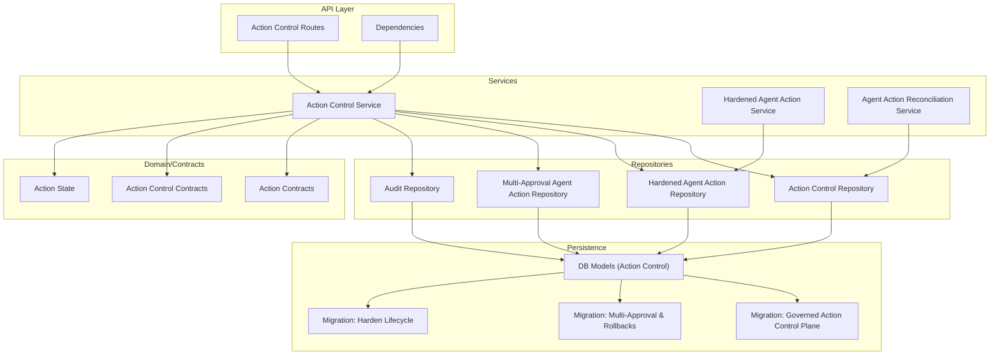
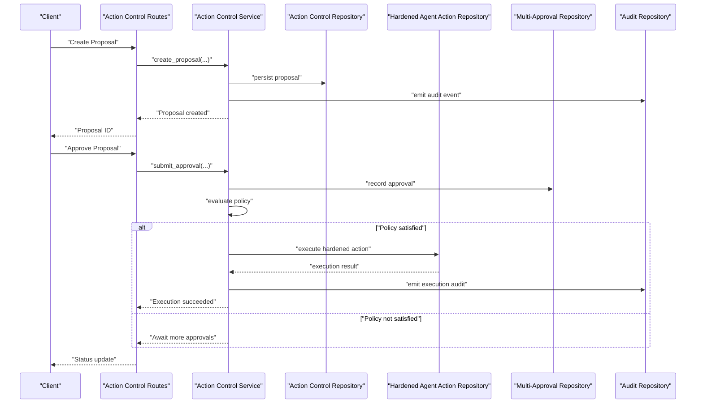
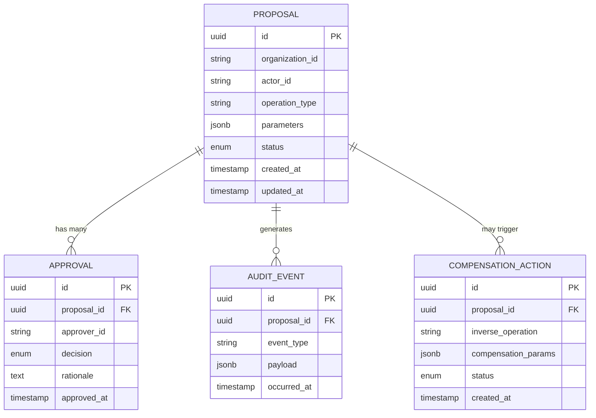
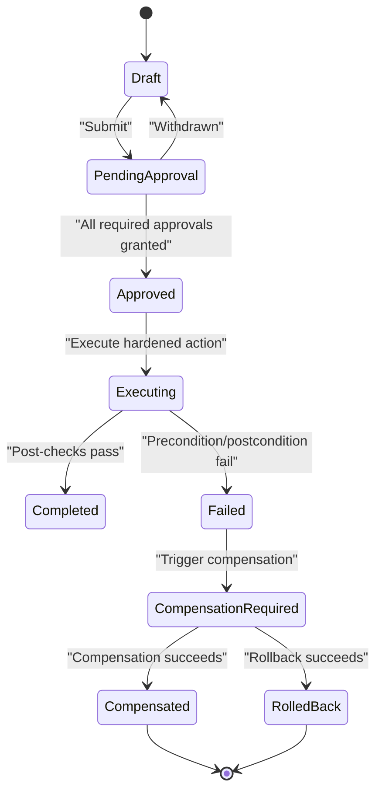
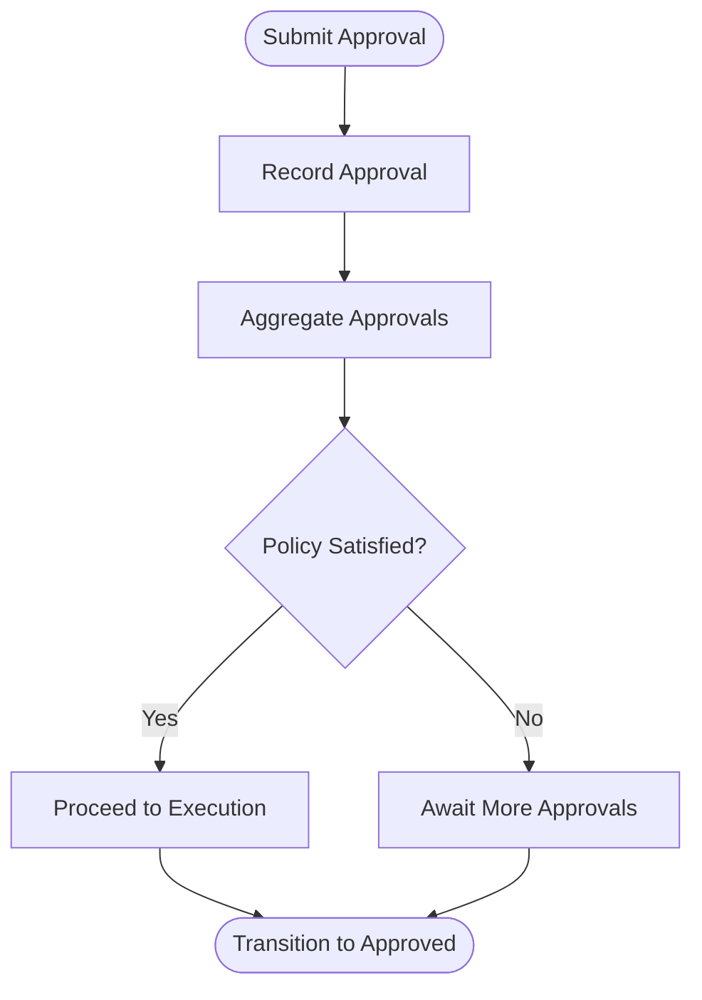
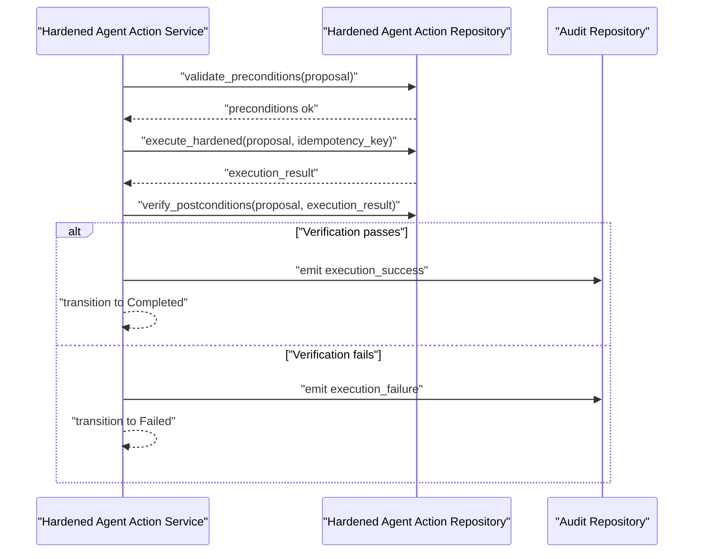
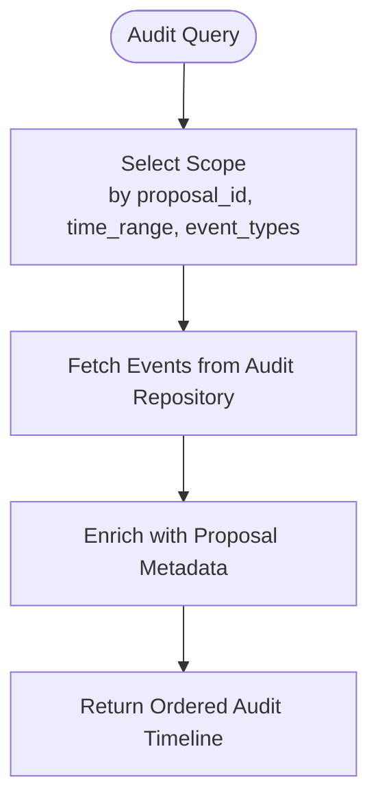
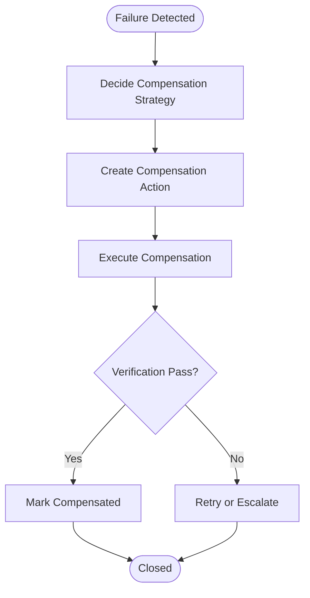
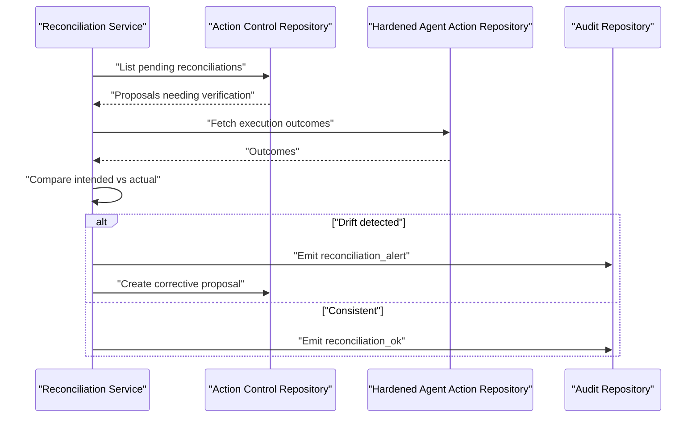
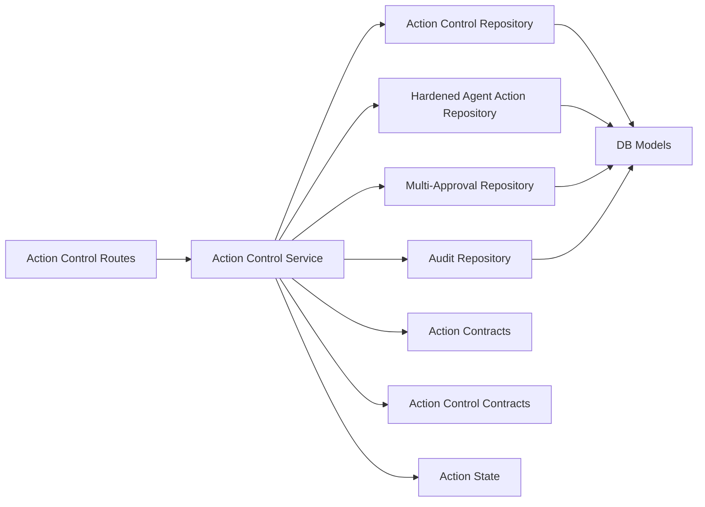

# Action Control & Governance Models

<cite>
**Referenced Files in This Document**
- [action_control_models.py](file://app/db/action_control_models.py)
- [action_control_repository.py](file://app/repositories/action_control_repository.py)
- [action_control_service.py](file://app/services/action_control_service.py)
- [hardened_agent_action_repository.py](file://app/repositories/hardened_agent_action_repository.py)
- [multi_approval_agent_action_repository.py](file://app/repositories/multi_approval_agent_action_repository.py)
- [hardened_agent_action_service.py](file://app/services/hardened_agent_action_service.py)
- [agent_action_reconciliation_service.py](file://app/services/agent_action_reconciliation_service.py)
- [action_control_routes.py](file://app/api/action_control_routes.py)
- [action_control_dependencies.py](file://app/api/action_control_dependencies.py)
- [action_contracts.py](file://app/agent/action_contracts.py)
- [action_control_contracts.py](file://app/agent/action_control_contracts.py)
- [action_state.py](file://app/agent/action_state.py)
- [audit_repository.py](file://app/repositories/audit_repository.py)
- [0017_governed_action_control_plane.py](file://alembic/versions/0017_governed_action_control_plane.py)
- [0008_add_multi_approval_and_rollbacks.py](file://alembic/versions/0008_add_multi_approval_and_rollbacks.py)
- [0005_harden_agent_action_lifecycle.py](file://alembic/versions/0005_harden_agent_action_lifecycle.py)
- [GOVERNED_ACTION_CONTROL_PLANE.md](file://docs/GOVERNED_ACTION_CONTROL_PLANE.md)
</cite>

## Table of Contents
1. [Introduction](#introduction)
2. [Project Structure](#project-structure)
3. [Core Components](#core-components)
4. [Architecture Overview](#architecture-overview)
5. [Detailed Component Analysis](#detailed-component-analysis)
6. [Dependency Analysis](#dependency-analysis)
7. [Performance Considerations](#performance-considerations)
8. [Troubleshooting Guide](#troubleshooting-guide)
9. [Conclusion](#conclusion)
10. [Appendices](#appendices)

## Introduction
This document describes the data model and control-plane design for governed actions, including proposal workflows, approval hierarchies, audit trails, rollback mechanisms, hardened execution, multi-approval systems, and compensation actions. It explains state transitions, security boundaries, compliance requirements, and integration between action models and the governance framework. It also provides examples of complex approval workflows, audit query patterns, and reconciliation processes.

## Project Structure
The governed action control plane spans database models, repositories, services, API routes, contracts, and migrations:

**Diagram sources**
- [action_control_routes.py](file://app/api/action_control_routes.py)
- [action_control_dependencies.py](file://app/api/action_control_dependencies.py)
- [action_control_service.py](file://app/services/action_control_service.py)
- [hardened_agent_action_service.py](file://app/services/hardened_agent_action_service.py)
- [agent_action_reconciliation_service.py](file://app/services/agent_action_reconciliation_service.py)
- [action_control_repository.py](file://app/repositories/action_control_repository.py)
- [hardened_agent_action_repository.py](file://app/repositories/hardened_agent_action_repository.py)
- [multi_approval_agent_action_repository.py](file://app/repositories/multi_approval_agent_action_repository.py)
- [audit_repository.py](file://app/repositories/audit_repository.py)
- [action_contracts.py](file://app/agent/action_contracts.py)
- [action_control_contracts.py](file://app/agent/action_control_contracts.py)
- [action_state.py](file://app/agent/action_state.py)
- [action_control_models.py](file://app/db/action_control_models.py)
- [0017_governed_action_control_plane.py](file://alembic/versions/0017_governed_action_control_plane.py)
- [0008_add_multi_approval_and_rollbacks.py](file://alembic/versions/0008_add_multi_approval_and_rollbacks.py)
- [0005_harden_agent_action_lifecycle.py](file://alembic/versions/0005_harden_agent_action_lifecycle.py)

**Section sources**
- [GOVERNED_ACTION_CONTROL_PLANE.md](file://docs/GOVERNED_ACTION_CONTROL_PLANE.md)

## Core Components
- Data models define the entities for proposals, approvals, audit events, rollbacks, and compensation actions.
- Repositories encapsulate persistence and enforce invariants such as idempotency, ordering, and authorization checks.
- Services orchestrate workflows across repositories, apply policies, and emit audit events.
- API routes expose controlled endpoints with dependency injection for services and repositories.
- Contracts define request/response shapes and event schemas used by clients and integrations.

Key responsibilities:
- Proposal lifecycle management and validation
- Multi-approval policy evaluation and enforcement
- Hardened execution with preconditions and post-execution verification
- Audit trail capture and querying
- Rollback and compensation action handling
- Reconciliation between intended and actual outcomes

**Section sources**
- [action_control_models.py](file://app/db/action_control_models.py)
- [action_control_repository.py](file://app/repositories/action_control_repository.py)
- [action_control_service.py](file://app/services/action_control_service.py)
- [hardened_agent_action_repository.py](file://app/repositories/hardened_agent_action_repository.py)
- [multi_approval_agent_action_repository.py](file://app/repositories/multi_approval_agent_action_repository.py)
- [hardened_agent_action_service.py](file://app/services/hardened_agent_action_service.py)
- [agent_action_reconciliation_service.py](file://app/services/agent_action_reconciliation_service.py)
- [action_contracts.py](file://app/agent/action_contracts.py)
- [action_control_contracts.py](file://app/agent/action_control_contracts.py)
- [action_state.py](file://app/agent/action_state.py)
- [audit_repository.py](file://app/repositories/audit_repository.py)

## Architecture Overview
The governed action control plane enforces a strict separation between intent (proposal), policy (approvals), execution (hardened), and evidence (audit). The flow is designed to be auditable, reversible where possible, and resilient to partial failures via compensation.

**Diagram sources**
- [action_control_routes.py](file://app/api/action_control_routes.py)
- [action_control_service.py](file://app/services/action_control_service.py)
- [action_control_repository.py](file://app/repositories/action_control_repository.py)
- [hardened_agent_action_repository.py](file://app/repositories/hardened_agent_action_repository.py)
- [multi_approval_agent_action_repository.py](file://app/repositories/multi_approval_agent_action_repository.py)
- [audit_repository.py](file://app/repositories/audit_repository.py)

## Detailed Component Analysis

### Data Model Entities
The core entities include:
- Proposal: Captures intent, target resource, operation type, parameters, and metadata.
- Approval: Records approver identity, timestamp, decision, and rationale; supports multiple approvers and hierarchical rules.
- Audit Event: Immutable record of lifecycle transitions, decisions, and execution results.
- Rollback/Compensation Action: Inverse operations or compensations triggered on failure or policy violation.
- Execution Context: Pre/post conditions, environment bindings, and outcome verification artifacts.

These entities are persisted through the action control models and enforced by repository constraints.

**Diagram sources**
- [action_control_models.py](file://app/db/action_control_models.py)
- [0017_governed_action_control_plane.py](file://alembic/versions/0017_governed_action_control_plane.py)
- [0008_add_multi_approval_and_rollbacks.py](file://alembic/versions/0008_add_multi_approval_and_rollbacks.py)
- [0005_harden_agent_action_lifecycle.py](file://alembic/versions/0005_harden_agent_action_lifecycle.py)

**Section sources**
- [action_control_models.py](file://app/db/action_control_models.py)
- [0017_governed_action_control_plane.py](file://alembic/versions/0017_governed_action_control_plane.py)
- [0008_add_multi_approval_and_rollbacks.py](file://alembic/versions/0008_add_multi_approval_and_rollbacks.py)
- [0005_harden_agent_action_lifecycle.py](file://alembic/versions/0005_harden_agent_action_lifecycle.py)

### Proposal Workflow and State Transitions
Proposals follow a deterministic lifecycle:
- Draft -> Pending Approval -> Approved -> Executing -> Completed | Failed
- On failure or policy violation, proposals may transition to Compensation Required and then to Compensated or Rolled Back.

State transitions are guarded by repository-level checks and service-level policy evaluation.

**Diagram sources**
- [action_state.py](file://app/agent/action_state.py)
- [action_control_service.py](file://app/services/action_control_service.py)
- [hardened_agent_action_repository.py](file://app/repositories/hardened_agent_action_repository.py)

**Section sources**
- [action_state.py](file://app/agent/action_state.py)
- [action_control_service.py](file://app/services/action_control_service.py)
- [hardened_agent_action_repository.py](file://app/repositories/hardened_agent_action_repository.py)

### Multi-Approval System and Hierarchies
- Multiple approvers can be required per proposal based on policy.
- Approvals are recorded with identity, decision, and rationale.
- Policy evaluation aggregates approvals and enforces hierarchy (e.g., role-based thresholds).
- The multi-approval repository ensures atomic recording and consistent aggregation.

**Diagram sources**
- [multi_approval_agent_action_repository.py](file://app/repositories/multi_approval_agent_action_repository.py)
- [action_control_service.py](file://app/services/action_control_service.py)

**Section sources**
- [multi_approval_agent_action_repository.py](file://app/repositories/multi_approval_agent_action_repository.py)
- [action_control_service.py](file://app/services/action_control_service.py)

### Hardened Action Execution Model
Hardened execution enforces:
- Preconditions validation before execution
- Idempotent execution with deduplication keys
- Post-execution verification against expected outcomes
- Automatic compensation if verification fails

**Diagram sources**
- [hardened_agent_action_service.py](file://app/services/hardened_agent_action_service.py)
- [hardened_agent_action_repository.py](file://app/repositories/hardened_agent_action_repository.py)
- [audit_repository.py](file://app/repositories/audit_repository.py)

**Section sources**
- [hardened_agent_action_service.py](file://app/services/hardened_agent_action_service.py)
- [hardened_agent_action_repository.py](file://app/repositories/hardened_agent_action_repository.py)
- [audit_repository.py](file://app/repositories/audit_repository.py)

### Audit Trails and Query Patterns
Audit events are immutable and cover:
- Proposal creation and updates
- Approval submissions and decisions
- Execution attempts and outcomes
- Compensation triggers and results

Common query patterns:
- Filter by proposal ID and event type
- Time-bounded queries for compliance windows
- Aggregations by approver or operation type
- Joining audit events with proposal metadata for reporting

**Diagram sources**
- [audit_repository.py](file://app/repositories/audit_repository.py)
- [action_control_repository.py](file://app/repositories/action_control_repository.py)

**Section sources**
- [audit_repository.py](file://app/repositories/audit_repository.py)
- [action_control_repository.py](file://app/repositories/action_control_repository.py)

### Rollback and Compensation Actions
- Compensation actions are defined as inverse operations tied to proposals.
- They are triggered automatically on failure or manually upon policy review.
- Compensation lifecycle mirrors proposal lifecycle with its own state transitions and audit trail.

**Diagram sources**
- [action_control_models.py](file://app/db/action_control_models.py)
- [action_control_service.py](file://app/services/action_control_service.py)

**Section sources**
- [action_control_models.py](file://app/db/action_control_models.py)
- [action_control_service.py](file://app/services/action_control_service.py)

### Reconciliation Processes
Reconciliation compares intended state (from proposals and approvals) with actual state (from execution results and external systems):
- Detects drift and inconsistencies
- Triggers corrective actions or escalations
- Produces reports for compliance and auditing

**Diagram sources**
- [agent_action_reconciliation_service.py](file://app/services/agent_action_reconciliation_service.py)
- [action_control_repository.py](file://app/repositories/action_control_repository.py)
- [hardened_agent_action_repository.py](file://app/repositories/hardened_agent_action_repository.py)
- [audit_repository.py](file://app/repositories/audit_repository.py)

**Section sources**
- [agent_action_reconciliation_service.py](file://app/services/agent_action_reconciliation_service.py)
- [action_control_repository.py](file://app/repositories/action_control_repository.py)
- [hardened_agent_action_repository.py](file://app/repositories/hardened_agent_action_repository.py)
- [audit_repository.py](file://app/repositories/audit_repository.py)

### Security Boundaries and Compliance Requirements
- Authorization checks at API and service layers ensure only permitted actors can propose, approve, or execute.
- Proposals are scoped to organizations and actors; cross-boundary access is denied.
- Audit events provide tamper-evident records for compliance audits.
- Policies enforce minimum approvals, role-based thresholds, and operational constraints.

Integration points:
- Contracts define secure request/response envelopes and event schemas.
- Dependencies inject authenticated context into services and repositories.

**Section sources**
- [action_control_routes.py](file://app/api/action_control_routes.py)
- [action_control_dependencies.py](file://app/api/action_control_dependencies.py)
- [action_contracts.py](file://app/agent/action_contracts.py)
- [action_control_contracts.py](file://app/agent/action_control_contracts.py)

## Dependency Analysis
The following diagram shows key dependencies among components:

**Diagram sources**
- [action_control_routes.py](file://app/api/action_control_routes.py)
- [action_control_service.py](file://app/services/action_control_service.py)
- [action_control_repository.py](file://app/repositories/action_control_repository.py)
- [hardened_agent_action_repository.py](file://app/repositories/hardened_agent_action_repository.py)
- [multi_approval_agent_action_repository.py](file://app/repositories/multi_approval_agent_action_repository.py)
- [audit_repository.py](file://app/repositories/audit_repository.py)
- [action_contracts.py](file://app/agent/action_contracts.py)
- [action_control_contracts.py](file://app/agent/action_control_contracts.py)
- [action_state.py](file://app/agent/action_state.py)
- [action_control_models.py](file://app/db/action_control_models.py)

**Section sources**
- [action_control_routes.py](file://app/api/action_control_routes.py)
- [action_control_service.py](file://app/services/action_control_service.py)
- [action_control_repository.py](file://app/repositories/action_control_repository.py)
- [hardened_agent_action_repository.py](file://app/repositories/hardened_agent_action_repository.py)
- [multi_approval_agent_action_repository.py](file://app/repositories/multi_approval_agent_action_repository.py)
- [audit_repository.py](file://app/repositories/audit_repository.py)
- [action_contracts.py](file://app/agent/action_contracts.py)
- [action_control_contracts.py](file://app/agent/action_control_contracts.py)
- [action_state.py](file://app/agent/action_state.py)
- [action_control_models.py](file://app/db/action_control_models.py)

## Performance Considerations
- Use idempotency keys to prevent duplicate executions under concurrency.
- Batch audit event writes where appropriate to reduce I/O overhead.
- Index audit events by proposal_id and occurred_at for efficient queries.
- Apply optimistic locking or version fields on proposals to avoid lost updates.
- Cache policy evaluation results when safe to improve throughput.

[No sources needed since this section provides general guidance]

## Troubleshooting Guide
Common issues and resolutions:
- Missing approvals: Ensure all required approvers have submitted decisions; check policy thresholds.
- Execution failures: Review audit events for precondition/postcondition violations; verify environment bindings.
- Compensation loops: Inspect compensation action states and outcomes; escalate if repeated failures occur.
- Reconciliation drift: Investigate discrepancies between intended and actual states; create corrective proposals.

Operational tips:
- Use audit timeline queries to reconstruct sequences around failures.
- Validate idempotency keys to detect duplicates.
- Monitor policy satisfaction metrics to identify bottlenecks.

**Section sources**
- [audit_repository.py](file://app/repositories/audit_repository.py)
- [action_control_service.py](file://app/services/action_control_service.py)
- [hardened_agent_action_service.py](file://app/services/hardened_agent_action_service.py)

## Conclusion
The governed action control plane provides a robust foundation for proposal-driven operations with strong auditability, multi-approval enforcement, hardened execution, and compensation capabilities. Its layered architecture separates concerns across API, services, repositories, and persistence, enabling clear security boundaries and compliance support. By leveraging audit trails and reconciliation processes, organizations can maintain trust and integrity in automated actions.

[No sources needed since this section summarizes without analyzing specific files]

## Appendices

### Example Complex Approval Workflows
- Cross-functional approvals requiring both technical and business sign-offs.
- Escalation paths when initial approvers are unavailable.
- Conditional approvals based on risk scores or resource sensitivity.

[No sources needed since this section doesn't analyze specific files]

### Integration Between Action Models and Governance Framework
- Contracts define wire formats and event schemas consumed by governance tools.
- Dependencies inject authenticated context and policy evaluators into services.
- Migrations evolve schema to support new governance features without breaking existing flows.

**Section sources**
- [action_contracts.py](file://app/agent/action_contracts.py)
- [action_control_contracts.py](file://app/agent/action_control_contracts.py)
- [action_control_dependencies.py](file://app/api/action_control_dependencies.py)
- [0017_governed_action_control_plane.py](file://alembic/versions/0017_governed_action_control_plane.py)
- [0008_add_multi_approval_and_rollbacks.py](file://alembic/versions/0008_add_multi_approval_and_rollbacks.py)
- [0005_harden_agent_action_lifecycle.py](file://alembic/versions/0005_harden_agent_action_lifecycle.py)