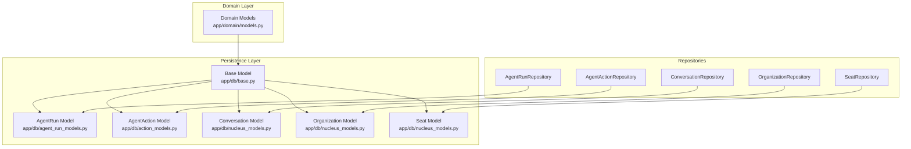
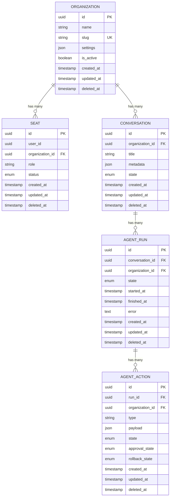
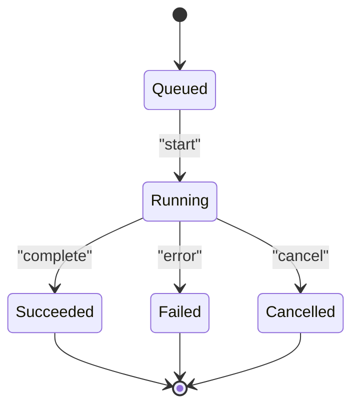
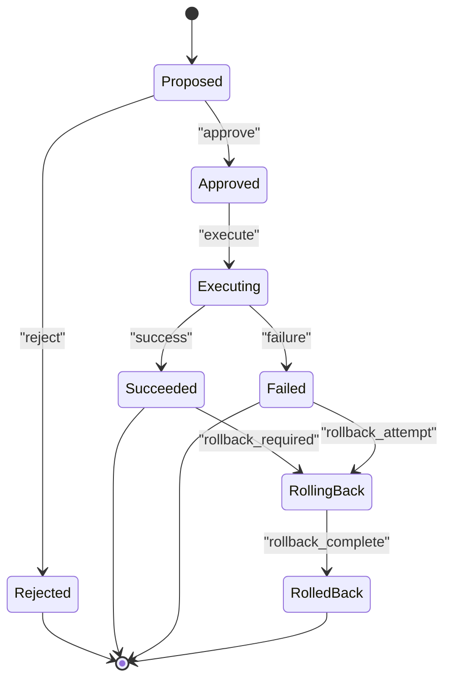

# Core Domain Models

<cite>
**Referenced Files in This Document**
- [agent_run_models.py](file://app/db/agent_run_models.py)
- [action_models.py](file://app/db/action_models.py)
- [nucleus_models.py](file://app/db/nucleus_models.py)
- [base.py](file://app/db/base.py)
- [models.py](file://app/domain/models.py)
- [0016_agent_conversations_runs_events.py](file://alembic/versions/0016_agent_conversations_runs_events.py)
- [0017_governed_action_control_plane.py](file://alembic/versions/0017_governed_action_control_plane.py)
- [0019_conversation_store.py](file://alembic/versions/0019_conversation_store.py)
- [0021_context_memory.py](file://alembic/versions/0021_context_memory.py)
- [agent_run_repository.py](file://app/repositories/agent_run_repository.py)
- [agent_action_repository.py](file://app/repositories/agent_action_repository.py)
- [conversation_repository.py](file://app/repositories/conversation_repository.py)
- [organization_repository.py](file://app/repositories/organization_repository.py)
- [seat_repository.py](file://app/repositories/seat_repository.py)
</cite>

## Table of Contents
1. [Introduction](#introduction)
2. [Project Structure](#project-structure)
3. [Core Components](#core-components)
4. [Architecture Overview](#architecture-overview)
5. [Detailed Component Analysis](#detailed-component-analysis)
6. [Dependency Analysis](#dependency-analysis)
7. [Performance Considerations](#performance-considerations)
8. [Troubleshooting Guide](#troubleshooting-guide)
9. [Conclusion](#conclusion)
10. [Appendices](#appendices)

## Introduction
This document describes the core domain data models for AgentRun, AgentAction, Conversation, Organization, and Seat. It covers entity relationships, field definitions, types, constraints, indexes, lifecycle states, business rules, and performance considerations. It also provides example queries and access patterns to help you work with these entities effectively.

## Project Structure
The data model is implemented across:
- ORM model definitions under app/db
- Domain-level models and enums under app/domain
- Repository layer under app/repositories
- Database migrations under alembic/versions



[No sources needed since this diagram shows conceptual workflow, not actual code structure]

## Core Components
This section summarizes the five core entities and their responsibilities:
- AgentRun: Represents a single execution of an agent over a conversation, capturing its state, timing, and metadata.
- AgentAction: Represents a proposed or executed action within a run, including approvals, rollbacks, and audit trails.
- Conversation: A thread of interaction between a user and an agent, containing messages and context.
- Organization: The top-level tenant boundary that groups users, seats, runs, and actions.
- Seat: A licensed assignment for a user within an organization, controlling access and capacity.

Key cross-cutting concerns:
- All entities are scoped by organization_id where applicable.
- Many entities use soft deletes via deleted_at.
- Audit fields (created_by, updated_by, created_at, updated_at) are commonly present.
- Enumerated states drive lifecycles for runs and actions.

**Section sources**
- [agent_run_models.py](file://app/db/agent_run_models.py)
- [action_models.py](file://app/db/action_models.py)
- [nucleus_models.py](file://app/db/nucleus_models.py)
- [base.py](file://app/db/base.py)
- [models.py](file://app/domain/models.py)

## Architecture Overview
The persistence architecture uses SQLAlchemy ORM models with Alembic migrations. Repositories encapsulate query logic and enforce business rules. Migrations define schema evolution and constraints.

```mermaid
classDiagram
class Base {
+id
+created_at
+updated_at
+deleted_at
+created_by
+updated_by
}
class Organization {
+id
+name
+slug
+settings
+is_active
}
class Seat {
+id
+user_id
+organization_id
+role
+status
}
class Conversation {
+id
+organization_id
+title
+metadata
+state
}
class AgentRun {
+id
+conversation_id
+organization_id
+state
+started_at
+finished_at
+error
}
class AgentAction {
+id
+run_id
+organization_id
+type
+payload
+state
+approval_state
+rollback_state
}
Base <|-- Organization
Base <|-- Seat
Base <|-- Conversation
Base <|-- AgentRun
Base <|-- AgentAction
Organization ||--o{ Seat : "has many"
Organization ||--o{ Conversation : "has many"
Conversation ||--o{ AgentRun : "has many"
AgentRun ||--o{ AgentAction : "has many"
```

**Diagram sources**
- [base.py](file://app/db/base.py)
- [nucleus_models.py](file://app/db/nucleus_models.py)
- [agent_run_models.py](file://app/db/agent_run_models.py)
- [action_models.py](file://app/db/action_models.py)

## Detailed Component Analysis

### Organization
Purpose:
- Top-level tenant boundary for multi-tenancy.
- Holds configuration and visibility settings.

Key fields and types:
- id: Primary key (UUID or integer).
- name: Human-readable organization name.
- slug: Unique, URL-safe identifier.
- settings: JSON-like configuration blob.
- is_active: Boolean flag for enabling/disabling.
- Audit fields: created_at, updated_at, deleted_at, created_by, updated_by.

Constraints and indexes:
- Unique constraint on slug.
- Indexes on is_active and created_at for filtering and listing.

Lifecycle:
- Active/inactive toggle controls feature availability.
- Soft delete via deleted_at.

Business rules:
- Slug uniqueness enforced at DB level.
- Seats and conversations must belong to an active organization for most operations.

Example queries:
- List active organizations ordered by creation time.
- Lookup by slug for routing.

**Section sources**
- [nucleus_models.py](file://app/db/nucleus_models.py)
- [organization_repository.py](file://app/repositories/organization_repository.py)

### Seat
Purpose:
- Represents a licensed seat assigned to a user within an organization.
- Controls access and capacity per organization.

Key fields and types:
- id: Primary key.
- user_id: Reference to the user account.
- organization_id: Foreign key to Organization.
- role: Role or permission set (e.g., admin, member).
- status: Active, suspended, pending.
- Audit fields: created_at, updated_at, deleted_at, created_by, updated_by.

Constraints and indexes:
- Unique constraint on (user_id, organization_id) to prevent duplicate assignments.
- Index on organization_id for membership lookups.
- Index on status for filtering.

Lifecycle:
- Pending -> Active -> Suspended -> Deleted (soft).
- Transitions governed by repository/service layer.

Business rules:
- Only active seats may perform actions.
- Seat count may be capped by organization plan.

Example queries:
- Find all active seats for an organization.
- Check if a user has an active seat in an organization.

**Section sources**
- [nucleus_models.py](file://app/db/nucleus_models.py)
- [seat_repository.py](file://app/repositories/seat_repository.py)

### Conversation
Purpose:
- A thread of interactions between a user and an agent.
- Contains messages, context, and optional metadata.

Key fields and types:
- id: Primary key.
- organization_id: Foreign key to Organization.
- title: Short human-readable summary.
- metadata: JSON-like storage for flexible attributes.
- state: e.g., open, archived, closed.
- Audit fields: created_at, updated_at, deleted_at, created_by, updated_by.

Constraints and indexes:
- Index on organization_id for tenant-scoped queries.
- Index on state for filtering.
- Optional full-text index on title and metadata depending on migration.

Lifecycle:
- Created when a new chat session starts.
- Can be archived or closed after completion.

Business rules:
- Conversations are always scoped to an organization.
- Deletion is soft; hard deletes require administrative action.

Example queries:
- List recent conversations for a user within an organization.
- Search conversations by keyword (if FTS enabled).

**Section sources**
- [nucleus_models.py](file://app/db/nucleus_models.py)
- [conversation_repository.py](file://app/repositories/conversation_repository.py)
- [0019_conversation_store.py](file://alembic/versions/0019_conversation_store.py)
- [0021_context_memory.py](file://alembic/versions/0021_context_memory.py)

### AgentRun
Purpose:
- Captures a single execution of an agent over a conversation.
- Tracks state transitions, timing, and errors.

Key fields and types:
- id: Primary key.
- conversation_id: Foreign key to Conversation.
- organization_id: Foreign key to Organization.
- state: e.g., queued, running, succeeded, failed, cancelled.
- started_at, finished_at: Timestamps for duration tracking.
- error: Error message or stack trace snippet.
- Audit fields: created_at, updated_at, deleted_at, created_by, updated_by.

Constraints and indexes:
- Index on conversation_id for run history.
- Index on organization_id for tenant scoping.
- Index on state for status dashboards.

Lifecycle:
- Queued -> Running -> Succeeded/Failed/Cancelled.
- Retries and backoff handled by orchestration layer.

Business rules:
- Runs are immutable once completed except for appending events.
- Errors should be captured without blocking subsequent runs.

Example queries:
- Get latest run for a conversation.
- Count runs by state for monitoring.

**Section sources**
- [agent_run_models.py](file://app/db/agent_run_models.py)
- [0016_agent_conversations_runs_events.py](file://alembic/versions/0016_agent_conversations_runs_events.py)

### AgentAction
Purpose:
- Represents a proposed or executed action within a run.
- Supports approval workflows, rollbacks, and auditability.

Key fields and types:
- id: Primary key.
- run_id: Foreign key to AgentRun.
- organization_id: Foreign key to Organization.
- type: Action category (e.g., read, write, execute).
- payload: JSON-like parameters and results.
- state: e.g., proposed, approved, rejected, executing, succeeded, failed, rolled_back.
- approval_state: Multi-approval tracking if applicable.
- rollback_state: Rollback progress/status.
- Audit fields: created_at, updated_at, deleted_at, created_by, updated_by.

Constraints and indexes:
- Index on run_id for action timeline.
- Index on organization_id for tenant scoping.
- Index on state and approval_state for control plane UIs.

Lifecycle:
- Proposed -> Approved/Rejected -> Executing -> Succeeded/Failed -> Rolled Back (optional).
- Multi-approval and rollback flows supported by migrations.

Business rules:
- Actions cannot be executed until approved according to policy.
- Rollbacks must succeed before marking action as fully resolved.

Example queries:
- List pending approvals for an organization.
- Retrieve action history for a run.

**Section sources**
- [action_models.py](file://app/db/action_models.py)
- [0017_governed_action_control_plane.py](file://alembic/versions/0017_governed_action_control_plane.py)

## Dependency Analysis
Relationships among core entities:
- Organization owns Seats and Conversations.
- Conversation contains multiple AgentRuns.
- AgentRun contains multiple AgentActions.
- All entities are soft-deletable and auditable.



**Diagram sources**
- [nucleus_models.py](file://app/db/nucleus_models.py)
- [agent_run_models.py](file://app/db/agent_run_models.py)
- [action_models.py](file://app/db/action_models.py)

**Section sources**
- [nucleus_models.py](file://app/db/nucleus_models.py)
- [agent_run_models.py](file://app/db/agent_run_models.py)
- [action_models.py](file://app/db/action_models.py)

## Performance Considerations
- Use organization_id filters on all queries to leverage partitioning and indexing.
- Prefer indexed columns (state, created_at, organization_id) for list views and dashboards.
- Avoid loading large JSON payloads unless necessary; consider separate tables for heavy metadata.
- For high-throughput writes (runs, actions), batch inserts and avoid N+1 queries.
- Enable full-text search only where needed due to indexing overhead.
- Monitor slow queries on joins across conversation->run->action chains; consider denormalized summaries for reporting.

[No sources needed since this section provides general guidance]

## Troubleshooting Guide
Common issues and resolutions:
- Missing organization_id: Ensure every query includes tenant scoping to prevent cross-tenant leakage.
- Stale state: Validate state transitions against allowed transitions; log unexpected changes.
- Approval bottlenecks: Inspect approval_state and rollback_state to identify stuck actions.
- Soft delete anomalies: Confirm deleted_at is set consistently and excluded from default selects.
- Index misses: Add missing indexes for frequently filtered columns (e.g., state, organization_id).

Operational checks:
- Verify unique constraints (e.g., seat per user per organization).
- Review foreign key integrity for orphaned records.
- Audit logs for unauthorized state transitions.

**Section sources**
- [agent_run_repository.py](file://app/repositories/agent_run_repository.py)
- [agent_action_repository.py](file://app/repositories/agent_action_repository.py)
- [conversation_repository.py](file://app/repositories/conversation_repository.py)
- [organization_repository.py](file://app/repositories/organization_repository.py)
- [seat_repository.py](file://app/repositories/seat_repository.py)

## Conclusion
The core domain models form a robust, multi-tenant foundation for agent-driven workflows. Clear boundaries around Organization, Seat, Conversation, AgentRun, and AgentAction enable secure, scalable operations with strong auditability and governance. Proper indexing, state management, and repository usage will ensure reliable performance and maintainability.

[No sources needed since this section summarizes without analyzing specific files]

## Appendices

### Lifecycle State Diagrams

#### AgentRun Lifecycle


**Diagram sources**
- [agent_run_models.py](file://app/db/agent_run_models.py)
- [0016_agent_conversations_runs_events.py](file://alembic/versions/0016_agent_conversations_runs_events.py)

#### AgentAction Lifecycle


**Diagram sources**
- [action_models.py](file://app/db/action_models.py)
- [0017_governed_action_control_plane.py](file://alembic/versions/0017_governed_action_control_plane.py)

### Example Queries and Access Patterns
- List active seats for an organization:
  - Filter by organization_id and status = active.
  - Order by created_at descending.
- Get latest run for a conversation:
  - Filter by conversation_id, order by started_at desc, limit 1.
- Pending approvals:
  - Filter AgentAction by state = proposed and approval_state = pending.
- Recent conversations:
  - Filter by organization_id and state = open, order by updated_at desc.

[No sources needed since this section provides general guidance]