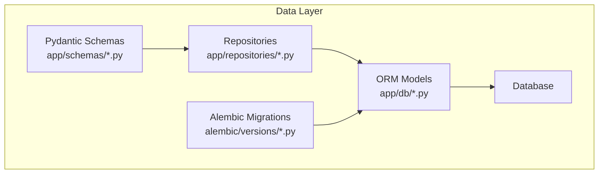
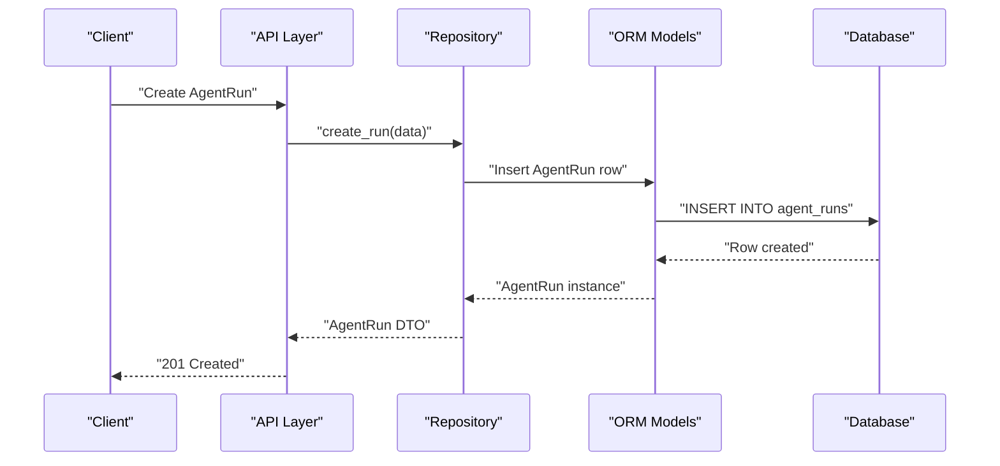
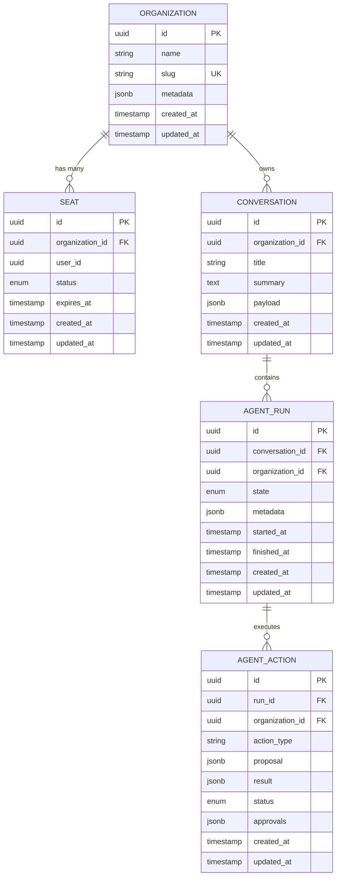
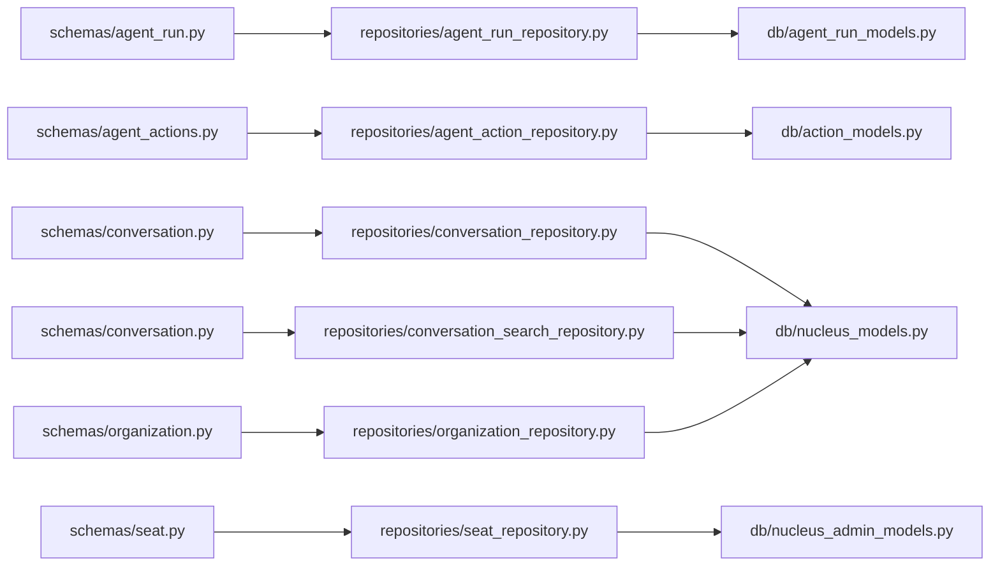

# Data Models & Database Design

<cite>
**Referenced Files in This Document**
- [alembic/versions/0016_agent_conversations_runs_events.py](file://alembic/versions/0016_agent_conversations_runs_events.py)
- [alembic/versions/0017_governed_action_control_plane.py](file://alembic/versions/0017_governed_action_control_plane.py)
- [alembic/versions/0019_conversation_store.py](file://alembic/versions/0019_conversation_store.py)
- [alembic/versions/0020_fts_search.py](file://alembic/versions/0020_fts_search.py)
- [alembic/versions/0021_context_memory.py](file://alembic/versions/0021_context_memory.py)
- [alembic/versions/0022_compaction_overlays.py](file://alembic/versions/0022_compaction_overlays.py)
- [app/db/base.py](file://app/db/base.py)
- [app/db/agent_run_models.py](file://app/db/agent_run_models.py)
- [app/db/action_models.py](file://app/db/action_models.py)
- [app/db/action_control_models.py](file://app/db/action_control_models.py)
- [app/db/nucleus_models.py](file://app/db/nucleus_models.py)
- [app/db/nucleus_admin_models.py](file://app/db/nucleus_admin_models.py)
- [app/db/workplace_resource_models.py](file://app/db/workplace_resource_models.py)
- [app/repositories/agent_run_repository.py](file://app/repositories/agent_run_repository.py)
- [app/repositories/agent_action_repository.py](file://app/repositories/agent_action_repository.py)
- [app/repositories/conversation_repository.py](file://app/repositories/conversation_repository.py)
- [app/repositories/conversation_search_repository.py](file://app/repositories/conversation_search_repository.py)
- [app/repositories/seat_repository.py](file://app/repositories/seat_repository.py)
- [app/repositories/organization_repository.py](file://app/repositories/organization_repository.py)
- [app/schemas/agent_run.py](file://app/schemas/agent_run.py)
- [app/schemas/agent_actions.py](file://app/schemas/agent_actions.py)
- [app/schemas/conversation.py](file://app/schemas/conversation.py)
- [app/schemas/seat.py](file://app/schemas/seat.py)
- [app/schemas/organization.py](file://app/schemas/organization.py)
</cite>

## Table of Contents
1. [Introduction](#introduction)
2. [Project Structure](#project-structure)
3. [Core Components](#core-components)
4. [Architecture Overview](#architecture-overview)
5. [Detailed Component Analysis](#detailed-component-analysis)
6. [Dependency Analysis](#dependency-analysis)
7. [Performance Considerations](#performance-considerations)
8. [Troubleshooting Guide](#troubleshooting-guide)
9. [Conclusion](#conclusion)
10. [Appendices](#appendices)

## Introduction
This document provides comprehensive data model documentation for the application’s database schema and entity relationships. It focuses on core domain models including AgentRun, AgentAction, Conversation, Organization, and Seat entities. The document details field definitions, data types, constraints, validation rules, primary and foreign key relationships, indexes, and performance optimizations. It also explains the Alembic-based migration strategy, lifecycle management, retention policies, archival strategies, security considerations (encryption, access controls, privacy), and common query patterns with examples.

## Project Structure
The data layer is organized into:
- ORM model definitions under app/db
- Repository implementations under app/repositories
- Pydantic schemas under app/schemas
- Alembic migrations under alembic/versions

[No sources needed since this diagram shows conceptual structure]

## Core Components
This section summarizes the core entities and their responsibilities:
- AgentRun: Represents a single execution context for an agent, including state, timestamps, and metadata.
- AgentAction: Captures proposed or executed actions within a run, including approvals, rollbacks, and audit trails.
- Conversation: Stores conversation threads and messages, with full-text search support.
- Organization: Defines tenant boundaries and organizational metadata.
- Seat: Represents user seats assigned to organizations with lifecycle states.

Key implementation references:
- ORM models: [app/db/agent_run_models.py](file://app/db/agent_run_models.py), [app/db/action_models.py](file://app/db/action_models.py), [app/db/nucleus_models.py](file://app/db/nucleus_models.py), [app/db/nucleus_admin_models.py](file://app/db/nucleus_admin_models.py), [app/db/workplace_resource_models.py](file://app/db/workplace_resource_models.py)
- Repositories: [app/repositories/agent_run_repository.py](file://app/repositories/agent_run_repository.py), [app/repositories/agent_action_repository.py](file://app/repositories/agent_action_repository.py), [app/repositories/conversation_repository.py](file://app/repositories/conversation_repository.py), [app/repositories/conversation_search_repository.py](file://app/repositories/conversation_search_repository.py), [app/repositories/seat_repository.py](file://app/repositories/seat_repository.py), [app/repositories/organization_repository.py](file://app/repositories/organization_repository.py)
- Schemas: [app/schemas/agent_run.py](file://app/schemas/agent_run.py), [app/schemas/agent_actions.py](file://app/schemas/agent_actions.py), [app/schemas/conversation.py](file://app/schemas/conversation.py), [app/schemas/seat.py](file://app/schemas/seat.py), [app/schemas/organization.py](file://app/schemas/organization.py)

**Section sources**
- [app/db/agent_run_models.py](file://app/db/agent_run_models.py)
- [app/db/action_models.py](file://app/db/action_models.py)
- [app/db/nucleus_models.py](file://app/db/nucleus_models.py)
- [app/db/nucleus_admin_models.py](file://app/db/nucleus_admin_models.py)
- [app/db/workplace_resource_models.py](file://app/db/workplace_resource_models.py)
- [app/repositories/agent_run_repository.py](file://app/repositories/agent_run_repository.py)
- [app/repositories/agent_action_repository.py](file://app/repositories/agent_action_repository.py)
- [app/repositories/conversation_repository.py](file://app/repositories/conversation_repository.py)
- [app/repositories/conversation_search_repository.py](file://app/repositories/conversation_search_repository.py)
- [app/repositories/seat_repository.py](file://app/repositories/seat_repository.py)
- [app/repositories/organization_repository.py](file://app/repositories/organization_repository.py)
- [app/schemas/agent_run.py](file://app/schemas/agent_run.py)
- [app/schemas/agent_actions.py](file://app/schemas/agent_actions.py)
- [app/schemas/conversation.py](file://app/schemas/conversation.py)
- [app/schemas/seat.py](file://app/schemas/seat.py)
- [app/schemas/organization.py](file://app/schemas/organization.py)

## Architecture Overview
High-level data architecture:
- API layer uses Pydantic schemas for request/response validation.
- Repositories implement persistence logic using SQLAlchemy ORM models.
- ORM models map to relational tables defined by Alembic migrations.
- Full-text search and compaction overlays are introduced via dedicated migrations.

[No sources needed since this diagram shows conceptual workflow]

## Detailed Component Analysis

### Entity Relationship Model
The following ER diagram captures the primary entities and their relationships:

**Diagram sources**
- [alembic/versions/0016_agent_conversations_runs_events.py](file://alembic/versions/0016_agent_conversations_runs_events.py)
- [alembic/versions/0017_governed_action_control_plane.py](file://alembic/versions/0017_governed_action_control_plane.py)
- [alembic/versions/0019_conversation_store.py](file://alembic/versions/0019_conversation_store.py)

**Section sources**
- [alembic/versions/0016_agent_conversations_runs_events.py](file://alembic/versions/0016_agent_conversations_runs_events.py)
- [alembic/versions/0017_governed_action_control_plane.py](file://alembic/versions/0017_governed_action_control_plane.py)
- [alembic/versions/0019_conversation_store.py](file://alembic/versions/0019_conversation_store.py)

### AgentRun
Purpose:
- Tracks a single agent execution lifecycle tied to a conversation and organization.

Key fields (representative):
- id: Primary key (UUID)
- conversation_id: Foreign key to conversations
- organization_id: Foreign key to organizations
- state: Enum representing run lifecycle (e.g., pending, running, succeeded, failed)
- metadata: JSONB for flexible runtime context
- started_at, finished_at: Timestamps for duration tracking
- created_at, updated_at: Audit timestamps

Constraints and validations:
- Non-null foreign keys enforce referential integrity.
- State transitions validated at repository/service layers.

Indexes and performance:
- Indexes on organization_id, conversation_id, and state for efficient filtering and listing.

Lifecycle management:
- Creation upon conversation initiation.
- Transition to finished when all actions complete or errors occur.

Retention and archival:
- Archive runs older than policy-defined thresholds; retain minimal metadata for analytics.

Security considerations:
- Row-level access controlled by organization_id.
- Sensitive metadata should be encrypted at rest if required.

Common queries:
- List recent runs by organization and state.
- Fetch run details with associated actions.

**Section sources**
- [app/db/agent_run_models.py](file://app/db/agent_run_models.py)
- [app/repositories/agent_run_repository.py](file://app/repositories/agent_run_repository.py)
- [app/schemas/agent_run.py](file://app/schemas/agent_run.py)
- [alembic/versions/0016_agent_conversations_runs_events.py](file://alembic/versions/0016_agent_conversations_runs_events.py)

### AgentAction
Purpose:
- Represents proposed or executed actions within a run, including multi-approval workflows and rollbacks.

Key fields (representative):
- id: Primary key (UUID)
- run_id: Foreign key to agent_runs
- organization_id: Foreign key to organizations
- action_type: String identifying action category
- proposal: JSONB describing intended operation
- result: JSONB capturing outcome
- status: Enum (e.g., pending, approved, rejected, rolled_back)
- approvals: JSONB array of approval records
- created_at, updated_at: Audit timestamps

Constraints and validations:
- Status transitions enforced by repositories/services.
- Approval records validated against policy.

Indexes and performance:
- Indexes on run_id, organization_id, and status for querying proposals and approvals.

Lifecycle management:
- Proposal creation, approval gating, execution, and optional rollback.

Retention and archival:
- Retain approved/rolled-back actions for auditability; purge stale pending proposals per policy.

Security considerations:
- Access control scoped by organization_id and user roles.
- Approvals must be cryptographically signed where applicable.

Common queries:
- Find pending proposals for a run.
- Retrieve approved actions with approval history.

**Section sources**
- [app/db/action_models.py](file://app/db/action_models.py)
- [app/repositories/agent_action_repository.py](file://app/repositories/agent_action_repository.py)
- [app/schemas/agent_actions.py](file://app/schemas/agent_actions.py)
- [alembic/versions/0017_governed_action_control_plane.py](file://alembic/versions/0017_governed_action_control_plane.py)

### Conversation
Purpose:
- Stores conversation threads and messages, supporting full-text search.

Key fields (representative):
- id: Primary key (UUID)
- organization_id: Foreign key to organizations
- title: Human-readable title
- summary: Optional summary text
- payload: JSONB containing message history
- created_at, updated_at: Audit timestamps

Constraints and validations:
- Payload validated against conversation schema.

Indexes and performance:
- Full-text search index on title and summary.
- Index on organization_id for tenant isolation.

Lifecycle management:
- Created when a new chat session starts.
- Updated incrementally as messages arrive.

Retention and archival:
- Compact payloads periodically; archive old conversations based on retention policy.

Security considerations:
- Tenant-scoped access via organization_id.
- Sensitive content should be encrypted at rest.

Common queries:
- Search conversations by keyword across title and summary.
- Retrieve conversation payload by ID.

**Section sources**
- [app/db/nucleus_models.py](file://app/db/nucleus_models.py)
- [app/repositories/conversation_repository.py](file://app/repositories/conversation_repository.py)
- [app/repositories/conversation_search_repository.py](file://app/repositories/conversation_search_repository.py)
- [app/schemas/conversation.py](file://app/schemas/conversation.py)
- [alembic/versions/0019_conversation_store.py](file://alembic/versions/0019_conversation_store.py)
- [alembic/versions/0020_fts_search.py](file://alembic/versions/0020_fts_search.py)

### Organization
Purpose:
- Defines tenant boundaries and organizational metadata.

Key fields (representative):
- id: Primary key (UUID)
- name: Organization display name
- slug: Unique identifier for routing and scoping
- metadata: JSONB for extensible attributes
- created_at, updated_at: Audit timestamps

Constraints and validations:
- Slug uniqueness enforced.

Indexes and performance:
- Unique index on slug.
- Index on created_at for administrative queries.

Lifecycle management:
- Created during tenant provisioning.
- Updated via admin operations.

Retention and archival:
- Organizations persist indefinitely unless explicitly deleted.

Security considerations:
- All resources scoped by organization_id.
- Admin-only mutations require elevated privileges.

Common queries:
- Lookup organization by slug.
- List organizations with pagination.

**Section sources**
- [app/db/nucleus_models.py](file://app/db/nucleus_models.py)
- [app/repositories/organization_repository.py](file://app/repositories/organization_repository.py)
- [app/schemas/organization.py](file://app/schemas/organization.py)

### Seat
Purpose:
- Represents user seats assigned to organizations with lifecycle states.

Key fields (representative):
- id: Primary key (UUID)
- organization_id: Foreign key to organizations
- user_id: Identifier for the seat holder
- status: Enum (e.g., active, expired, revoked)
- expires_at: Expiration timestamp
- created_at, updated_at: Audit timestamps

Constraints and validations:
- Status transitions enforced by seat repository.
- Expiration checks prevent usage after expiry.

Indexes and performance:
- Index on organization_id and status for seat management.
- Index on expires_at for cleanup jobs.

Lifecycle management:
- Seats issued upon user assignment; expired or revoked over time.

Retention and archival:
- Expired seats archived after grace period.

Security considerations:
- Access to seat-related operations restricted to admins.
- Enforce expiration at runtime.

Common queries:
- List active seats for an organization.
- Find expiring seats within a window.

**Section sources**
- [app/db/nucleus_admin_models.py](file://app/db/nucleus_admin_models.py)
- [app/repositories/seat_repository.py](file://app/repositories/seat_repository.py)
- [app/schemas/seat.py](file://app/schemas/seat.py)

### Compaction Overlays and Context Memory
Purpose:
- Introduce compaction overlays to reduce payload sizes and manage context memory efficiently.

Key aspects:
- Compaction overlays store delta updates to conversation payloads.
- Context memory tracks summarized state for long-running sessions.

Indexes and performance:
- Indexes on overlay versioning and memory keys.

Lifecycle management:
- Periodic compaction jobs merge overlays and update summaries.

Security considerations:
- Ensure compaction preserves sensitive data handling policies.

**Section sources**
- [alembic/versions/0021_context_memory.py](file://alembic/versions/0021_context_memory.py)
- [alembic/versions/0022_compaction_overlays.py](file://alembic/versions/0022_compaction_overlays.py)

## Dependency Analysis
Component dependencies between repositories, models, and schemas:

**Diagram sources**
- [app/schemas/agent_run.py](file://app/schemas/agent_run.py)
- [app/schemas/agent_actions.py](file://app/schemas/agent_actions.py)
- [app/schemas/conversation.py](file://app/schemas/conversation.py)
- [app/schemas/organization.py](file://app/schemas/organization.py)
- [app/schemas/seat.py](file://app/schemas/seat.py)
- [app/repositories/agent_run_repository.py](file://app/repositories/agent_run_repository.py)
- [app/repositories/agent_action_repository.py](file://app/repositories/agent_action_repository.py)
- [app/repositories/conversation_repository.py](file://app/repositories/conversation_repository.py)
- [app/repositories/conversation_search_repository.py](file://app/repositories/conversation_search_repository.py)
- [app/repositories/organization_repository.py](file://app/repositories/organization_repository.py)
- [app/repositories/seat_repository.py](file://app/repositories/seat_repository.py)
- [app/db/agent_run_models.py](file://app/db/agent_run_models.py)
- [app/db/action_models.py](file://app/db/action_models.py)
- [app/db/nucleus_models.py](file://app/db/nucleus_models.py)
- [app/db/nucleus_admin_models.py](file://app/db/nucleus_admin_models.py)

**Section sources**
- [app/schemas/agent_run.py](file://app/schemas/agent_run.py)
- [app/schemas/agent_actions.py](file://app/schemas/agent_actions.py)
- [app/schemas/conversation.py](file://app/schemas/conversation.py)
- [app/schemas/organization.py](file://app/schemas/organization.py)
- [app/schemas/seat.py](file://app/schemas/seat.py)
- [app/repositories/agent_run_repository.py](file://app/repositories/agent_run_repository.py)
- [app/repositories/agent_action_repository.py](file://app/repositories/agent_action_repository.py)
- [app/repositories/conversation_repository.py](file://app/repositories/conversation_repository.py)
- [app/repositories/conversation_search_repository.py](file://app/repositories/conversation_search_repository.py)
- [app/repositories/organization_repository.py](file://app/repositories/organization_repository.py)
- [app/repositories/seat_repository.py](file://app/repositories/seat_repository.py)
- [app/db/agent_run_models.py](file://app/db/agent_run_models.py)
- [app/db/action_models.py](file://app/db/action_models.py)
- [app/db/nucleus_models.py](file://app/db/nucleus_models.py)
- [app/db/nucleus_admin_models.py](file://app/db/nucleus_admin_models.py)

## Performance Considerations
- Indexing strategy:
  - Add composite indexes on frequently filtered columns (e.g., organization_id + state).
  - Use partial indexes for active records to reduce index size.
- Query optimization:
  - Prefer selective filters and pagination to avoid large result sets.
  - Use projection queries to fetch only necessary fields.
- Full-text search:
  - Configure appropriate search configurations and trigrams for fuzzy matching.
- Compaction:
  - Schedule background jobs to compact conversation payloads and merge overlays.
- Connection pooling:
  - Tune connection pool sizes based on workload characteristics.

[No sources needed since this section provides general guidance]

## Troubleshooting Guide
Common issues and resolutions:
- Migration failures:
  - Verify dependency order in Alembic versions.
  - Roll back problematic migrations and reapply fixes.
- Constraint violations:
  - Check referential integrity before inserts/updates.
  - Validate JSONB payloads against schemas.
- Performance regressions:
  - Analyze slow queries with EXPLAIN ANALYZE.
  - Review missing indexes and adjust query plans.
- Concurrency conflicts:
  - Implement optimistic locking or advisory locks for critical sections.

**Section sources**
- [alembic/versions/0016_agent_conversations_runs_events.py](file://alembic/versions/0016_agent_conversations_runs_events.py)
- [alembic/versions/0017_governed_action_control_plane.py](file://alembic/versions/0017_governed_action_control_plane.py)
- [alembic/versions/0019_conversation_store.py](file://alembic/versions/0019_conversation_store.py)
- [alembic/versions/0020_fts_search.py](file://alembic/versions/0020_fts_search.py)
- [alembic/versions/0021_context_memory.py](file://alembic/versions/0021_context_memory.py)
- [alembic/versions/0022_compaction_overlays.py](file://alembic/versions/0022_compaction_overlays.py)

## Conclusion
The data model centers around tightly scoped entities—AgentRun, AgentAction, Conversation, Organization, and Seat—each governed by clear constraints, indexes, and lifecycle policies. Alembic migrations provide a robust evolution path, while repositories and schemas ensure consistent data access and validation. Security and performance considerations are embedded throughout, from tenant isolation to compaction strategies.

[No sources needed since this section summarizes without analyzing specific files]

## Appendices

### Migration Strategy Using Alembic
- Versioned migrations under alembic/versions define schema changes incrementally.
- Each migration targets specific features (e.g., governed action control plane, FTS search, compaction overlays).
- Apply migrations in order; validate with tests before deployment.

**Section sources**
- [alembic/versions/0016_agent_conversations_runs_events.py](file://alembic/versions/0016_agent_conversations_runs_events.py)
- [alembic/versions/0017_governed_action_control_plane.py](file://alembic/versions/0017_governed_action_control_plane.py)
- [alembic/versions/0019_conversation_store.py](file://alembic/versions/0019_conversation_store.py)
- [alembic/versions/0020_fts_search.py](file://alembic/versions/0020_fts_search.py)
- [alembic/versions/0021_context_memory.py](file://alembic/versions/0021_context_memory.py)
- [alembic/versions/0022_compaction_overlays.py](file://alembic/versions/0022_compaction_overlays.py)

### Security Considerations
- Encryption at rest for sensitive JSONB fields (e.g., payloads, metadata).
- Row-level access control enforced via organization_id.
- Role-based permissions for admin operations (seats, organizations).
- Privacy requirements: minimize PII storage; use tokenization where possible.

**Section sources**
- [app/db/nucleus_models.py](file://app/db/nucleus_models.py)
- [app/db/nucleus_admin_models.py](file://app/db/nucleus_admin_models.py)
- [app/repositories/seat_repository.py](file://app/repositories/seat_repository.py)
- [app/repositories/organization_repository.py](file://app/repositories/organization_repository.py)

### Common Queries and Data Access Patterns
- Create a new conversation and initialize an agent run.
- Propose an action and await approvals.
- Execute approved action and record results.
- Search conversations by keywords.
- List active seats for an organization.

Example paths:
- [app/repositories/conversation_repository.py](file://app/repositories/conversation_repository.py)
- [app/repositories/agent_run_repository.py](file://app/repositories/agent_run_repository.py)
- [app/repositories/agent_action_repository.py](file://app/repositories/agent_action_repository.py)
- [app/repositories/conversation_search_repository.py](file://app/repositories/conversation_search_repository.py)
- [app/repositories/seat_repository.py](file://app/repositories/seat_repository.py)

**Section sources**
- [app/repositories/conversation_repository.py](file://app/repositories/conversation_repository.py)
- [app/repositories/agent_run_repository.py](file://app/repositories/agent_run_repository.py)
- [app/repositories/agent_action_repository.py](file://app/repositories/agent_action_repository.py)
- [app/repositories/conversation_search_repository.py](file://app/repositories/conversation_search_repository.py)
- [app/repositories/seat_repository.py](file://app/repositories/seat_repository.py)