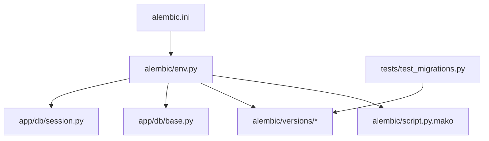
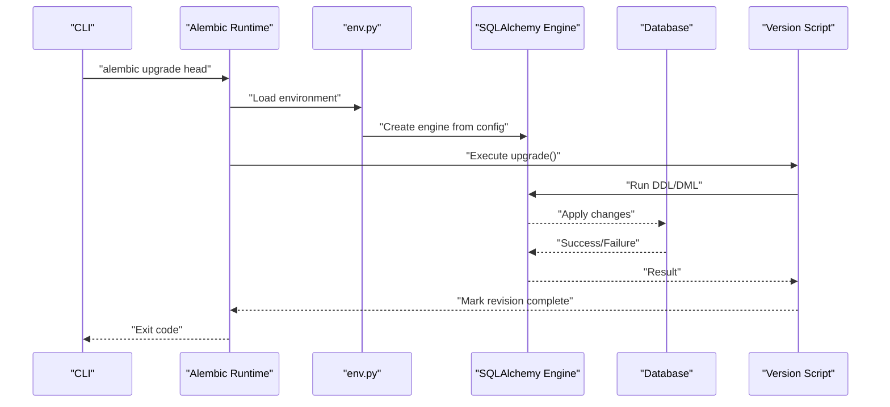
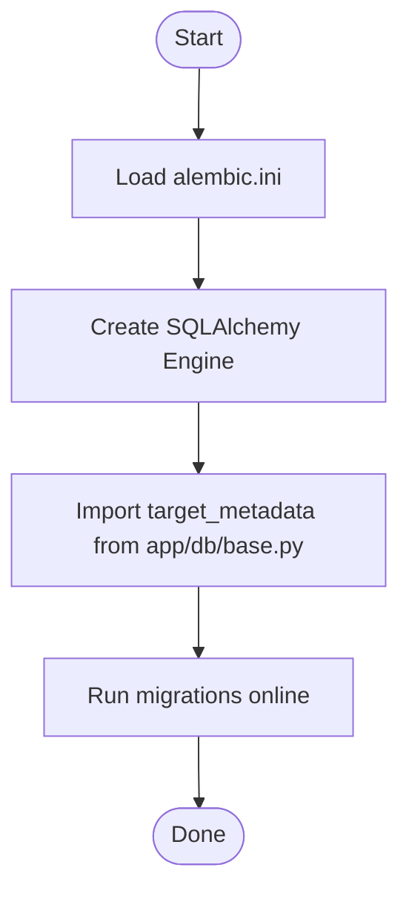
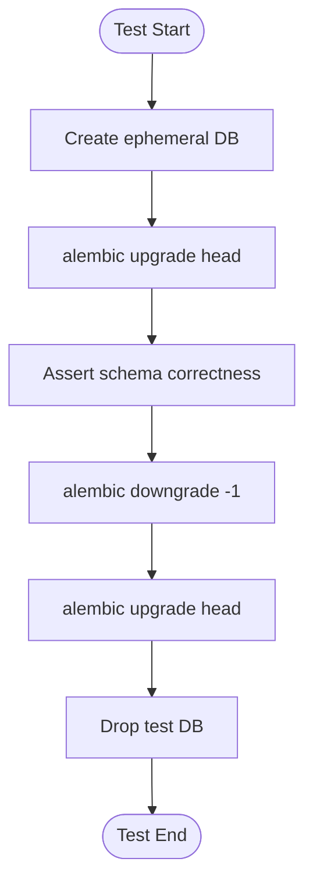
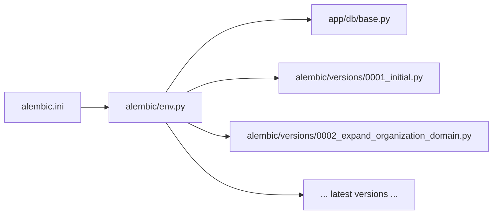

# Database Migrations & Schema Evolution

<cite>
**Referenced Files in This Document**
- [alembic.ini](file://alembic.ini)
- [alembic/env.py](file://alembic/env.py)
- [alembic/script.py.mako](file://alembic/script.py.mako)
- [alembic/versions/0001_initial.py](file://alembic/versions/0001_initial.py)
- [alembic/versions/0002_expand_organization_domain.py](file://alembic/versions/0002_expand_organization_domain.py)
- [alembic/versions/0003_remove_chatbot_permissions.py](file://alembic/versions/0003_remove_chatbot_permissions.py)
- [alembic/versions/0004_add_agent_action_approvals.py](file://alembic/versions/0004_add_agent_action_approvals.py)
- [alembic/versions/0005_harden_agent_action_lifecycle.py](file://alembic/versions/0005_harden_agent_action_lifecycle.py)
- [alembic/versions/0006_expand_operational_actions.py](file://alembic/versions/0006_expand_operational_actions.py)
- [alembic/versions/0007_complete_inverse_lifecycle.py](file://alembic/versions/0007_complete_inverse_lifecycle.py)
- [alembic/versions/0008_add_multi_approval_and_rollbacks.py](file://alembic/versions/0008_add_multi_approval_and_rollbacks.py)
- [alembic/versions/0009_operational_hardening.py](file://alembic/versions/0009_operational_hardening.py)
- [alembic/versions/0010_add_organization_overview.py](file://alembic/versions/0010_add_organization_overview.py)
- [alembic/versions/0011_nucleus_organization_schema.py](file://alembic/versions/0011_nucleus_organization_schema.py)
- [alembic/versions/0012_resource_preconditions.py](file://alembic/versions/0012_resource_preconditions.py)
- [alembic/versions/0013_nucleus_admin.py](file://alembic/versions/0013_nucleus_admin.py)
- [alembic/versions/0014_workplace_resources.py](file://alembic/versions/0014_workplace_resources.py)
- [alembic/versions/0015_workplace_workflows.py](file://alembic/versions/0015_workplace_workflows.py)
- [alembic/versions/0016_agent_conversations_runs_events.py](file://alembic/versions/0016_agent_conversations_runs_events.py)
- [alembic/versions/0017_governed_action_control_plane.py](file://alembic/versions/0017_governed_action_control_plane.py)
- [alembic/versions/0018_replace_local_users.py](file://alembic/versions/0018_replace_local_users.py)
- [alembic/versions/0019_conversation_store.py](file://alembic/versions/0019_conversation_store.py)
- [alembic/versions/0020_fts_search.py](file://alembic/versions/0020_fts_search.py)
- [alembic/versions/0021_context_memory.py](file://alembic/versions/0021_context_memory.py)
- [alembic/versions/0022_compaction_overlays.py](file://alembic/versions/0022_compaction_overlays.py)
- [app/db/base.py](file://app/db/base.py)
- [app/db/session.py](file://app/db/session.py)
- [tests/test_migrations.py](file://tests/test_migrations.py)
</cite>

## Table of Contents
1. [Introduction](#introduction)
2. [Project Structure](#project-structure)
3. [Core Components](#core-components)
4. [Architecture Overview](#architecture-overview)
5. [Detailed Component Analysis](#detailed-component-analysis)
6. [Dependency Analysis](#dependency-analysis)
7. [Performance Considerations](#performance-considerations)
8. [Troubleshooting Guide](#troubleshooting-guide)
9. [Conclusion](#conclusion)
10. [Appendices](#appendices)

## Introduction
This document explains the database migration strategy using Alembic for schema evolution and data transformations. It covers naming conventions, versioning, rollback procedures, complex migration patterns (data transforms, backward compatibility), environment configuration, custom operations, testing strategies, and production deployment practices. The goal is to provide a clear, actionable guide for safe schema evolution and data integrity maintenance across development, staging, and production environments.

## Project Structure
The project uses Alembic with a conventional directory layout:
- alembic.ini: Alembic configuration including database URL and script locations.
- alembic/env.py: Migration runtime environment setup, engine configuration, and target metadata binding.
- alembic/script.py.mako: Template used when generating new migrations.
- alembic/versions: All migration scripts, each representing a single incremental change.
- app/db: SQLAlchemy models and session configuration consumed by migrations via env.py.
- tests/test_migrations.py: Tests validating migration idempotency and round-trip behavior.

**Diagram sources**
- [alembic.ini](file://alembic.ini)
- [alembic/env.py](file://alembic/env.py)
- [alembic/script.py.mako](file://alembic/script.py.mako)
- [alembic/versions/0001_initial.py](file://alembic/versions/0001_initial.py)
- [app/db/base.py](file://app/db/base.py)
- [app/db/session.py](file://app/db/session.py)
- [tests/test_migrations.py](file://tests/test_migrations.py)

**Section sources**
- [alembic.ini](file://alembic.ini)
- [alembic/env.py](file://alembic/env.py)
- [alembic/script.py.mako](file://alembic/script.py.mako)
- [alembic/versions/0001_initial.py](file://alembic/versions/0001_initial.py)
- [app/db/base.py](file://app/db/base.py)
- [app/db/session.py](file://app/db/session.py)
- [tests/test_migrations.py](file://tests/test_migrations.py)

## Core Components
- Configuration: alembic.ini defines the database URL and migration script paths.
- Environment: alembic/env.py configures the SQLAlchemy engine, imports target metadata, and sets up transactional DDL where supported.
- Templates: alembic/script.py.mako provides the default scaffolding for new migrations.
- Versions: Each file under alembic/versions represents an atomic, ordered change with explicit upgrade() and downgrade() functions.
- Models: app/db/base.py centralizes declarative base and metadata; app/db/session.py provides session/connection utilities used by migrations.
- Testing: tests/test_migrations.py validates that migrations can be applied and rolled back without errors and that the resulting schema matches expectations.

Key responsibilities:
- Ensure migrations are reversible and idempotent where possible.
- Keep schema changes small and focused per migration.
- Use explicit connection contexts for DDL and data operations.
- Maintain backward compatibility during multi-step evolutions.

**Section sources**
- [alembic.ini](file://alembic.ini)
- [alembic/env.py](file://alembic/env.py)
- [alembic/script.py.mako](file://alembic/script.py.mako)
- [alembic/versions/0001_initial.py](file://alembic/versions/0001_initial.py)
- [app/db/base.py](file://app/db/base.py)
- [app/db/session.py](file://app/db/session.py)
- [tests/test_migrations.py](file://tests/test_migrations.py)

## Architecture Overview
Alembic orchestrates migrations against the configured database using the SQLAlchemy engine defined in env.py. Migrations import target metadata from app/db/base.py to ensure consistency between ORM models and migration definitions.

**Diagram sources**
- [alembic/env.py](file://alembic/env.py)
- [alembic/versions/0001_initial.py](file://alembic/versions/0001_initial.py)

## Detailed Component Analysis

### Naming Conventions and Versioning Strategy
- File naming: Numeric prefix followed by a descriptive slug, e.g., 0001_initial.py, 0002_expand_organization_domain.py.
- Ordering: Strictly ascending numeric prefixes ensure deterministic ordering.
- Descriptive titles: Slugs summarize intent (e.g., add_* for additions, remove_* for deletions, expand_* for schema growth).
- Atomicity: Each migration encapsulates one logical change set.

Examples in this repository:
- Initial schema creation: [alembic/versions/0001_initial.py](file://alembic/versions/0001_initial.py)
- Domain expansion: [alembic/versions/0002_expand_organization_domain.py](file://alembic/versions/0002_expand_organization_domain.py)
- Permission removal: [alembic/versions/0003_remove_chatbot_permissions.py](file://alembic/versions/0003_remove_chatbot_permissions.py)
- Approval lifecycle hardening: [alembic/versions/0005_harden_agent_action_lifecycle.py](file://alembic/versions/0005_harden_agent_action_lifecycle.py)
- Multi-approval and rollbacks: [alembic/versions/0008_add_multi_approval_and_rollbacks.py](file://alembic/versions/0008_add_multi_approval_and_rollbacks.py)
- Governance control plane: [alembic/versions/0017_governed_action_control_plane.py](file://alembic/versions/0017_governed_action_control_plane.py)
- Full-text search: [alembic/versions/0020_fts_search.py](file://alembic/versions/0020_fts_search.py)

Best practices:
- Keep names concise but unambiguous.
- Avoid generic names like “update” or “fix”.
- Group related changes into a single migration unless they cross feature boundaries.

**Section sources**
- [alembic/versions/0001_initial.py](file://alembic/versions/0001_initial.py)
- [alembic/versions/0002_expand_organization_domain.py](file://alembic/versions/0002_expand_organization_domain.py)
- [alembic/versions/0003_remove_chatbot_permissions.py](file://alembic/versions/0003_remove_chatbot_permissions.py)
- [alembic/versions/0005_harden_agent_action_lifecycle.py](file://alembic/versions/0005_harden_agent_action_lifecycle.py)
- [alembic/versions/0008_add_multi_approval_and_rollbacks.py](file://alembic/versions/0008_add_multi_approval_and_rollbacks.py)
- [alembic/versions/0017_governed_action_control_plane.py](file://alembic/versions/0017_governed_action_control_plane.py)
- [alembic/versions/0020_fts_search.py](file://alembic/versions/0020_fts_search.py)

### Rollback Procedures
- Downgrade direction: Every migration should implement a corresponding downgrade() to reverse upgrade().
- Safe reversibility: Prefer additive changes (new columns, tables) with non-destructive defaults to simplify downgrades.
- Data cleanup: When removing columns or constraints, ensure data migration precedes structural changes and that downgrade restores original state.

Representative examples:
- Removing permissions: [alembic/versions/0003_remove_chatbot_permissions.py](file://alembic/versions/0003_remove_chatbot_permissions.py)
- Hardening lifecycle fields: [alembic/versions/0005_harden_agent_action_lifecycle.py](file://alembic/versions/0005_harden_agent_action_lifecycle.py)
- Adding approvals and rollbacks: [alembic/versions/0008_add_multi_approval_and_rollbacks.py](file://alembic/versions/0008_add_multi_approval_and_rollbacks.py)
- Replacing local users model: [alembic/versions/0018_replace_local_users.py](file://alembic/versions/0018_replace_local_users.py)

Operational commands:
- Apply all pending migrations: alembic upgrade head
- Rollback one step: alembic downgrade -1
- Rollback to specific revision: alembic downgrade <revision_id>

**Section sources**
- [alembic/versions/0003_remove_chatbot_permissions.py](file://alembic/versions/0003_remove_chatbot_permissions.py)
- [alembic/versions/0005_harden_agent_action_lifecycle.py](file://alembic/versions/0005_harden_agent_action_lifecycle.py)
- [alembic/versions/0008_add_multi_approval_and_rollbacks.py](file://alembic/versions/0008_add_multi_approval_and_rollbacks.py)
- [alembic/versions/0018_replace_local_users.py](file://alembic/versions/0018_replace_local_users.py)

### Complex Migration Patterns

#### Data Transformations
- Bulk updates: Use explicit connections and batched updates to avoid long locks.
- Backfilling defaults: Populate new columns with computed values before making them required.
- Example areas:
  - Expanding organization domain: [alembic/versions/0002_expand_organization_domain.py](file://alembic/versions/0002_expand_organization_domain.py)
  - Operational hardening: [alembic/versions/0009_operational_hardening.py](file://alembic/versions/0009_operational_hardening.py)
  - Context memory compaction overlays: [alembic/versions/0021_context_memory.py](file://alembic/versions/0021_context_memory.py)

#### Schema Evolution and Backward Compatibility
- Additive-first approach: Introduce nullable columns and indexes first, then backfill, then enforce constraints.
- Dual-write/read windows: For breaking changes, support both old and new structures temporarily.
- Examples:
  - Nucleus organization schema: [alembic/versions/0011_nucleus_organization_schema.py](file://alembic/versions/0011_nucleus_organization_schema.py)
  - Resource preconditions: [alembic/versions/0012_resource_preconditions.py](file://alembic/versions/0012_resource_preconditions.py)
  - Workplace resources and workflows: [alembic/versions/0014_workplace_resources.py](file://alembic/versions/0014_workplace_resources.py), [alembic/versions/0015_workplace_workflows.py](file://alembic/versions/0015_workplace_workflows.py)
  - Agent conversations, runs, events: [alembic/versions/0016_agent_conversations_runs_events.py](file://alembic/versions/0016_agent_conversations_runs_events.py)
  - Governed action control plane: [alembic/versions/0017_governed_action_control_plane.py](file://alembic/versions/0017_governed_action_control_plane.py)
  - Conversation store: [alembic/versions/0019_conversation_store.py](file://alembic/versions/0019_conversation_store.py)
  - FTS search: [alembic/versions/0020_fts_search.py](file://alembic/versions/0020_fts_search.py)
  - Compaction overlays: [alembic/versions/0022_compaction_overlays.py](file://alembic/versions/0022_compaction_overlays.py)

#### Custom Operations
- If needed, define custom operations in env.py and register them so they are available within migrations.
- Typical use cases: vendor-specific DDL, index rebuilds, or complex data reconciliation steps.

**Section sources**
- [alembic/versions/0002_expand_organization_domain.py](file://alembic/versions/0002_expand_organization_domain.py)
- [alembic/versions/0009_operational_hardening.py](file://alembic/versions/0009_operational_hardening.py)
- [alembic/versions/0011_nucleus_organization_schema.py](file://alembic/versions/0011_nucleus_organization_schema.py)
- [alembic/versions/0012_resource_preconditions.py](file://alembic/versions/0012_resource_preconditions.py)
- [alembic/versions/0014_workplace_resources.py](file://alembic/versions/0014_workplace_resources.py)
- [alembic/versions/0015_workplace_workflows.py](file://alembic/versions/0015_workplace_workflows.py)
- [alembic/versions/0016_agent_conversations_runs_events.py](file://alembic/versions/0016_agent_conversations_runs_events.py)
- [alembic/versions/0017_governed_action_control_plane.py](file://alembic/versions/0017_governed_action_control_plane.py)
- [alembic/versions/0019_conversation_store.py](file://alembic/versions/0019_conversation_store.py)
- [alembic/versions/0020_fts_search.py](file://alembic/versions/0020_fts_search.py)
- [alembic/versions/0021_context_memory.py](file://alembic/versions/0021_context_memory.py)
- [alembic/versions/0022_compaction_overlays.py](file://alembic/versions/0022_compaction_overlays.py)

### Migration Environment Configuration
- alembic.ini: Central configuration for database URL, script location, and logging.
- alembic/env.py:
  - Loads configuration and creates the SQLAlchemy engine.
  - Imports target_metadata from app/db/base.py to align migrations with ORM models.
  - Configures context.run_migrations_online() for execution.
  - Optionally enables transactional DDL depending on the database backend.

- app/db/base.py: Provides the declarative Base and metadata used by env.py.
- app/db/session.py: Supplies session/connection helpers if migrations need programmatic access.

**Diagram sources**
- [alembic.ini](file://alembic.ini)
- [alembic/env.py](file://alembic/env.py)
- [app/db/base.py](file://app/db/base.py)

**Section sources**
- [alembic.ini](file://alembic.ini)
- [alembic/env.py](file://alembic/env.py)
- [app/db/base.py](file://app/db/base.py)
- [app/db/session.py](file://app/db/session.py)

### Creating New Migrations
- Generate a migration: alembic revision -m "short_description"
- Edit the generated file under alembic/versions/ to implement upgrade() and downgrade().
- Validate locally: alembic upgrade head and alembic downgrade -1.
- Update templates if you want consistent scaffolding across your team: edit alembic/script.py.mako.

Guidelines:
- Keep changes small and focused.
- Include both upgrade() and downgrade().
- For data-heavy changes, consider batching and progress logging.

**Section sources**
- [alembic/script.py.mako](file://alembic/script.py.mako)
- [alembic/versions/0001_initial.py](file://alembic/versions/0001_initial.py)

### Handling Breaking Changes
- Prefer additive changes first (add columns, allow nulls).
- Backfill data in a separate migration.
- Enforce constraints in a later migration after application code supports the new schema.
- Provide dual-read/write logic in application code during transition periods.
- Remove legacy structures only after confirming no active clients depend on them.

Relevant examples:
- Replace local users: [alembic/versions/0018_replace_local_users.py](file://alembic/versions/0018_replace_local_users.py)
- Expand operational actions: [alembic/versions/0006_expand_operational_actions.py](file://alembic/versions/0006_expand_operational_actions.py)
- Complete inverse lifecycle: [alembic/versions/0007_complete_inverse_lifecycle.py](file://alembic/versions/0007_complete_inverse_lifecycle.py)

**Section sources**
- [alembic/versions/0006_expand_operational_actions.py](file://alembic/versions/0006_expand_operational_actions.py)
- [alembic/versions/0007_complete_inverse_lifecycle.py](file://alembic/versions/0007_complete_inverse_lifecycle.py)
- [alembic/versions/0018_replace_local_users.py](file://alembic/versions/0018_replace_local_users.py)

### Managing Production Deployments
- Pre-deploy checks:
  - Run alembic current to verify baseline.
  - Dry-run upgrades in staging mirroring production data volume.
- Deployment steps:
  - Stop write traffic or use a blue/green deployment to minimize lock contention.
  - Execute alembic upgrade head.
  - Verify health endpoints and critical queries.
  - Resume traffic.
- Rollback plan:
  - Identify the last known good revision.
  - Execute alembic downgrade to that revision.
  - Restore application code to previous version if necessary.

**Section sources**
- [alembic/versions/0001_initial.py](file://alembic/versions/0001_initial.py)
- [alembic/versions/0017_governed_action_control_plane.py](file://alembic/versions/0017_governed_action_control_plane.py)

### Testing Strategies
- Unit-level migration tests:
  - Apply migrations to an isolated test database.
  - Assert expected tables/columns exist.
  - Attempt downgrade and re-upgrade to validate reversibility.
- Integration-level:
  - Seed minimal data and run migrations end-to-end.
  - Validate constraints and indexes.
- Repository example:
  - tests/test_migrations.py exercises migration flows and assertions.

**Diagram sources**
- [tests/test_migrations.py](file://tests/test_migrations.py)

**Section sources**
- [tests/test_migrations.py](file://tests/test_migrations.py)

## Dependency Analysis
Migrations depend on:
- alembic.ini for configuration.
- alembic/env.py for runtime setup and metadata binding.
- app/db/base.py for target metadata.
- Individual version files for schema and data changes.

**Diagram sources**
- [alembic.ini](file://alembic.ini)
- [alembic/env.py](file://alembic/env.py)
- [app/db/base.py](file://app/db/base.py)
- [alembic/versions/0001_initial.py](file://alembic/versions/0001_initial.py)
- [alembic/versions/0002_expand_organization_domain.py](file://alembic/versions/0002_expand_organization_domain.py)

**Section sources**
- [alembic.ini](file://alembic.ini)
- [alembic/env.py](file://alembic/env.py)
- [app/db/base.py](file://app/db/base.py)
- [alembic/versions/0001_initial.py](file://alembic/versions/0001_initial.py)
- [alembic/versions/0002_expand_organization_domain.py](file://alembic/versions/0002_expand_organization_domain.py)

## Performance Considerations
- Large table alterations:
  - Use ADD COLUMN with DEFAULT and backfill in batches to reduce locks.
  - Create indexes concurrently where supported.
- Data migrations:
  - Process in chunks and commit periodically to avoid long transactions.
  - Log progress for observability.
- Read-heavy workloads:
  - Schedule heavy migrations during low-traffic windows.
  - Consider read replicas for validation before applying to primary.

[No sources needed since this section provides general guidance]

## Troubleshooting Guide
Common issues and resolutions:
- Migration not found or out-of-order:
  - Ensure numeric prefixes are strictly increasing and filenames match revisions.
- Downgrade fails due to destructive changes:
  - Implement proper downgrade() logic; prefer additive changes.
- Long-running migrations:
  - Break into smaller migrations; use batching and concurrent index creation.
- Conflicts between ORM models and migrations:
  - Keep target_metadata aligned with app/db/base.py; regenerate migrations carefully.

Validation aids:
- alembic history to inspect revision graph.
- alembic current to check applied revisions.
- tests/test_migrations.py to catch regressions early.

**Section sources**
- [tests/test_migrations.py](file://tests/test_migrations.py)

## Conclusion
This project follows a disciplined Alembic-based migration strategy emphasizing additive schema changes, clear versioning, and robust rollback capabilities. By adhering to the naming conventions, maintaining idempotent and reversible migrations, and integrating comprehensive tests, teams can evolve schemas safely across environments while preserving data integrity and minimizing downtime.

[No sources needed since this section summarizes without analyzing specific files]

## Appendices

### Quick Reference Commands
- Upgrade to latest: alembic upgrade head
- Rollback one step: alembic downgrade -1
- Rollback to revision: alembic downgrade <revision_id>
- Inspect history: alembic history
- Check current revision: alembic current

[No sources needed since this section provides general guidance]