# Nucleus Administration Models

<cite>
**Referenced Files in This Document**
- [nucleus_admin_models.py](file://app/db/nucleus_admin_models.py)
- [nucleus_admin_models.py](file://app/domain/nucleus_admin_models.py)
- [nucleus_organization_repository.py](file://app/repositories/nucleus_organization_repository.py)
- [nucleus_administration_repository.py](file://app/repositories/nucleus_administration_repository.py)
- [nucleus_administration_projection_repository.py](file://app/repositories/nucleus_administration_projection_repository.py)
- [organization_overview_repository.py](file://app/repositories/organization_overview_repository.py)
- [seat_repository.py](file://app/repositories/seat_repository.py)
- [nucleus_actor_mapping_repository.py](file://app/repositories/nucleus_actor_mapping_repository.py)
- [nucleus_routes.py](file://app/api/nucleus_routes.py)
- [nucleus_admin_action_handlers.py](file://app/agent/nucleus_admin_action_handlers.py)
- [admin_contract.py](file://app/adapters/nucleus/admin_contract.py)
- [contract.py](file://app/adapters/nucleus/contract.py)
- [0013_nucleus_admin.py](file://alembic/versions/0013_nucleus_admin.py)
- [0010_add_organization_overview.py](file://alembic/versions/0010_add_organization_overview.py)
- [0011_nucleus_organization_schema.py](file://alembic/versions/0011_nucleus_organization_schema.py)
- [test_nucleus_admin_control.py](file://tests/test_nucleus_admin_control.py)
- [test_nucleus_admin_registry.py](file://tests/test_nucleus_admin_registry.py)
- [test_nucleus_organization_actions.py](file://tests/test_nucleus_organization_actions.py)
- [test_nucleus_projection_synchronization.py](file://tests/test_nucleus_projection_synchronization.py)
- [test_organization_boundaries.py](file://tests/test_organization_boundaries.py)
- [test_organization_overview.py](file://tests/test_organization_overview.py)
- [test_users_seats.py](file://tests/test_users_seats.py)
</cite>

## Table of Contents
1. [Introduction](#introduction)
2. [Project Structure](#project-structure)
3. [Core Components](#core-components)
4. [Architecture Overview](#architecture-overview)
5. [Detailed Component Analysis](#detailed-component-analysis)
6. [Dependency Analysis](#dependency-analysis)
7. [Performance Considerations](#performance-considerations)
8. [Troubleshooting Guide](#troubleshooting-guide)
9. [Conclusion](#conclusion)
10. [Appendices](#appendices)

## Introduction
This document describes the data model and administrative capabilities for Nucleus with multi-organization support. It focuses on:
- Organization hierarchy and boundaries
- Seat management and user mapping across organizations
- Admin projection models and overview aggregations
- Administrative query patterns and reporting structures
- Tenant isolation mechanisms, license management, and audit trails
- Practical examples for organization queries, seat allocation, and admin reporting

The goal is to provide a clear mental model for administrators and developers working with Nucleus administration features.

## Project Structure
Nucleus administration spans multiple layers:
- Domain models and schemas define the conceptual entities (organizations, seats, users, licenses).
- Database ORM models persist these entities.
- Repositories implement read/write operations and projections/aggregations.
- API routes expose administrative endpoints.
- Agent action handlers integrate admin actions into the agent workflow.
- Adapters define contracts for external integrations.
- Alembic migrations evolve the schema over time.
- Tests validate behavior and constraints.

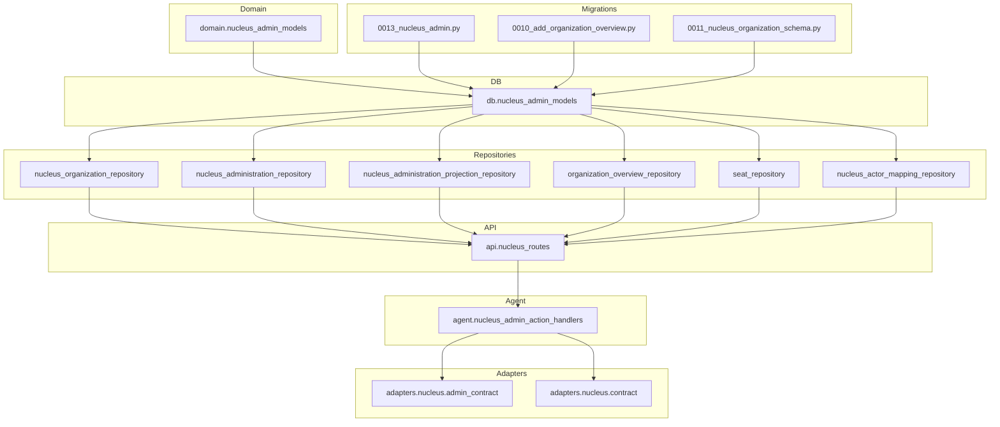

**Diagram sources**
- [nucleus_admin_models.py](file://app/domain/nucleus_admin_models.py)
- [nucleus_admin_models.py](file://app/db/nucleus_admin_models.py)
- [nucleus_organization_repository.py](file://app/repositories/nucleus_organization_repository.py)
- [nucleus_administration_repository.py](file://app/repositories/nucleus_administration_repository.py)
- [nucleus_administration_projection_repository.py](file://app/repositories/nucleus_administration_projection_repository.py)
- [organization_overview_repository.py](file://app/repositories/organization_overview_repository.py)
- [seat_repository.py](file://app/repositories/seat_repository.py)
- [nucleus_actor_mapping_repository.py](file://app/repositories/nucleus_actor_mapping_repository.py)
- [nucleus_routes.py](file://app/api/nucleus_routes.py)
- [nucleus_admin_action_handlers.py](file://app/agent/nucleus_admin_action_handlers.py)
- [admin_contract.py](file://app/adapters/nucleus/admin_contract.py)
- [contract.py](file://app/adapters/nucleus/contract.py)
- [0013_nucleus_admin.py](file://alembic/versions/0013_nucleus_admin.py)
- [0010_add_organization_overview.py](file://alembic/versions/0010_add_organization_overview.py)
- [0011_nucleus_organization_schema.py](file://alembic/versions/0011_nucleus_organization_schema.py)

**Section sources**
- [nucleus_admin_models.py](file://app/domain/nucleus_admin_models.py)
- [nucleus_admin_models.py](file://app/db/nucleus_admin_models.py)
- [nucleus_organization_repository.py](file://app/repositories/nucleus_organization_repository.py)
- [nucleus_administration_repository.py](file://app/repositories/nucleus_administration_repository.py)
- [nucleus_administration_projection_repository.py](file://app/repositories/nucleus_administration_projection_repository.py)
- [organization_overview_repository.py](file://app/repositories/organization_overview_repository.py)
- [seat_repository.py](file://app/repositories/seat_repository.py)
- [nucleus_actor_mapping_repository.py](file://app/repositories/nucleus_actor_mapping_repository.py)
- [nucleus_routes.py](file://app/api/nucleus_routes.py)
- [nucleus_admin_action_handlers.py](file://app/agent/nucleus_admin_action_handlers.py)
- [admin_contract.py](file://app/adapters/nucleus/admin_contract.py)
- [contract.py](file://app/adapters/nucleus/contract.py)
- [0013_nucleus_admin.py](file://alembic/versions/0013_nucleus_admin.py)
- [0010_add_organization_overview.py](file://alembic/versions/0010_add_organization_overview.py)
- [0011_nucleus_organization_schema.py](file://alembic/versions/0011_nucleus_organization_schema.py)

## Core Components
- Organization entity and hierarchy: Represents tenants and their hierarchical relationships.
- Seat entity: Tracks licensed capacity per organization and effective periods.
- User mapping: Links external identities to internal actors within an organization context.
- Admin projections: Read-optimized views for administrative dashboards and reports.
- Overview aggregation: Summarizes counts and metrics across organizations.
- Audit trail: Records administrative actions and changes for compliance.

These components are implemented via domain models, database models, repositories, and API routes.

**Section sources**
- [nucleus_admin_models.py](file://app/domain/nucleus_admin_models.py)
- [nucleus_admin_models.py](file://app/db/nucleus_admin_models.py)
- [nucleus_organization_repository.py](file://app/repositories/nucleus_organization_repository.py)
- [nucleus_administration_repository.py](file://app/repositories/nucleus_administration_repository.py)
- [nucleus_administration_projection_repository.py](file://app/repositories/nucleus_administration_projection_repository.py)
- [organization_overview_repository.py](file://app/repositories/organization_overview_repository.py)
- [seat_repository.py](file://app/repositories/seat_repository.py)
- [nucleus_actor_mapping_repository.py](file://app/repositories/nucleus_actor_mapping_repository.py)
- [nucleus_routes.py](file://app/api/nucleus_routes.py)

## Architecture Overview
Administrative operations flow from API routes through repositories to database models, with optional agent-driven actions and adapter contracts for integration points. Projections and overview aggregations provide efficient reads for admin UIs and reporting tools.

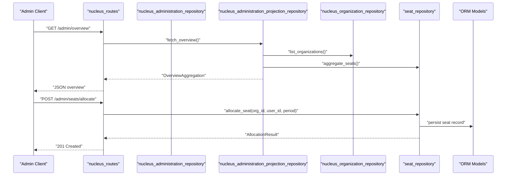

**Diagram sources**
- [nucleus_routes.py](file://app/api/nucleus_routes.py)
- [nucleus_administration_repository.py](file://app/repositories/nucleus_administration_repository.py)
- [nucleus_administration_projection_repository.py](file://app/repositories/nucleus_administration_projection_repository.py)
- [nucleus_organization_repository.py](file://app/repositories/nucleus_organization_repository.py)
- [seat_repository.py](file://app/repositories/seat_repository.py)
- [nucleus_admin_models.py](file://app/db/nucleus_admin_models.py)

## Detailed Component Analysis

### Organization Hierarchy and Boundaries
Organizations represent tenants with hierarchical relationships. The repository provides methods to list, traverse, and enforce boundaries between organizations.

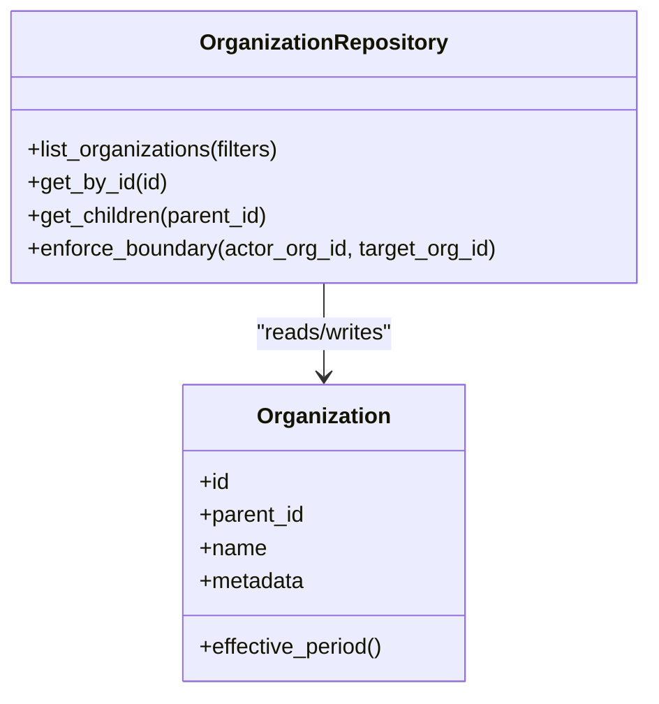

**Diagram sources**
- [nucleus_organization_repository.py](file://app/repositories/nucleus_organization_repository.py)
- [nucleus_admin_models.py](file://app/db/nucleus_admin_models.py)

**Section sources**
- [nucleus_organization_repository.py](file://app/repositories/nucleus_organization_repository.py)
- [nucleus_admin_models.py](file://app/db/nucleus_admin_models.py)
- [test_organization_boundaries.py](file://tests/test_organization_boundaries.py)

### Seat Management and License Control
Seats track licensed capacity per organization and effective periods. Allocation and revocation are handled by dedicated repositories with validation against available capacity.

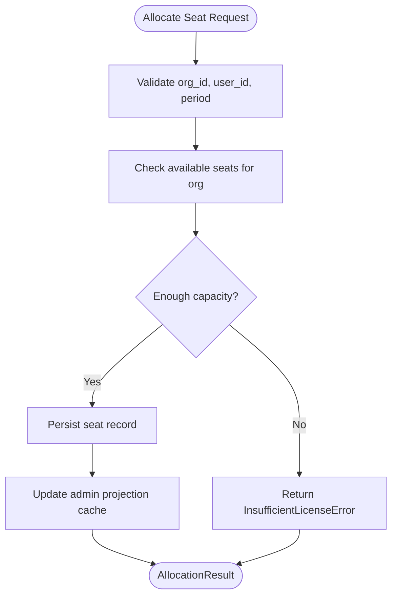

**Diagram sources**
- [seat_repository.py](file://app/repositories/seat_repository.py)
- [nucleus_admin_models.py](file://app/db/nucleus_admin_models.py)
- [nucleus_administration_projection_repository.py](file://app/repositories/nucleus_administration_projection_repository.py)

**Section sources**
- [seat_repository.py](file://app/repositories/seat_repository.py)
- [nucleus_admin_models.py](file://app/db/nucleus_admin_models.py)
- [test_users_seats.py](file://tests/test_users_seats.py)

### User Mapping Across Organizations
User mapping links external identities to internal actors within an organization context. This ensures that cross-organization access is explicitly controlled and audited.

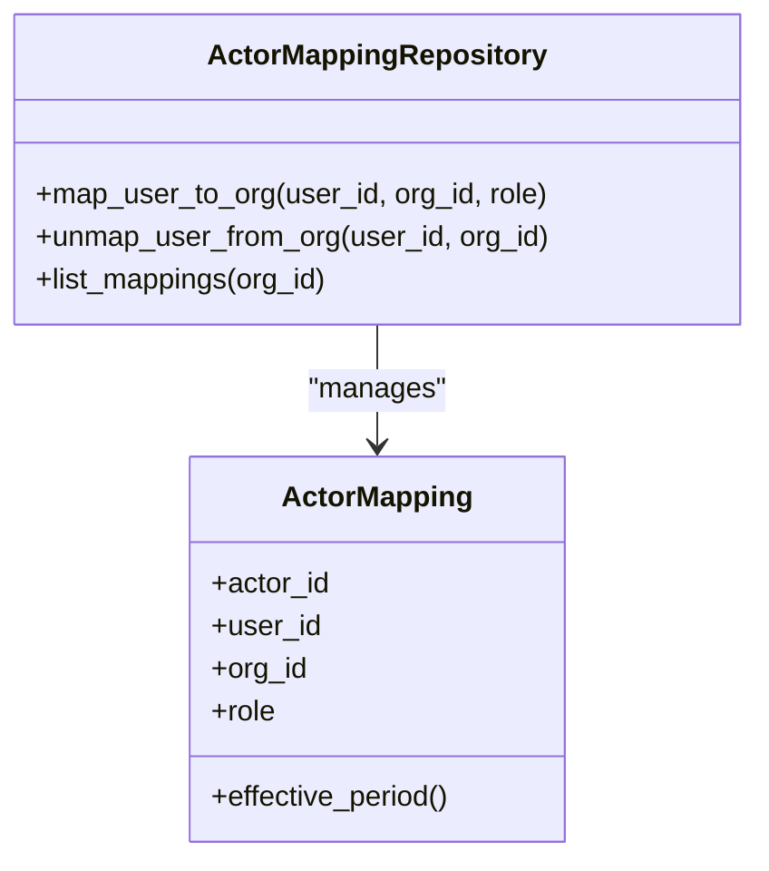

**Diagram sources**
- [nucleus_actor_mapping_repository.py](file://app/repositories/nucleus_actor_mapping_repository.py)
- [nucleus_admin_models.py](file://app/db/nucleus_admin_models.py)

**Section sources**
- [nucleus_actor_mapping_repository.py](file://app/repositories/nucleus_actor_mapping_repository.py)
- [nucleus_admin_models.py](file://app/db/nucleus_admin_models.py)

### Admin Projection Models and Overview Aggregations
Projections provide read-optimized views for administrative dashboards. Overview aggregations summarize counts and metrics across organizations.

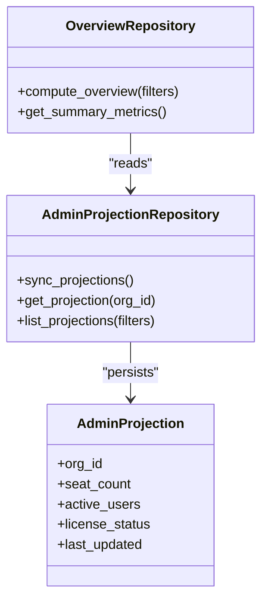

**Diagram sources**
- [nucleus_administration_projection_repository.py](file://app/repositories/nucleus_administration_projection_repository.py)
- [organization_overview_repository.py](file://app/repositories/organization_overview_repository.py)
- [nucleus_admin_models.py](file://app/db/nucleus_admin_models.py)

**Section sources**
- [nucleus_administration_projection_repository.py](file://app/repositories/nucleus_administration_projection_repository.py)
- [organization_overview_repository.py](file://app/repositories/organization_overview_repository.py)
- [test_organization_overview.py](file://tests/test_organization_overview.py)
- [test_nucleus_projection_synchronization.py](file://tests/test_nucleus_projection_synchronization.py)

### Administrative Query Patterns and Reporting
Administrative queries leverage repositories to filter, aggregate, and report on organizations, seats, and mappings. These patterns support both real-time and batch reporting needs.

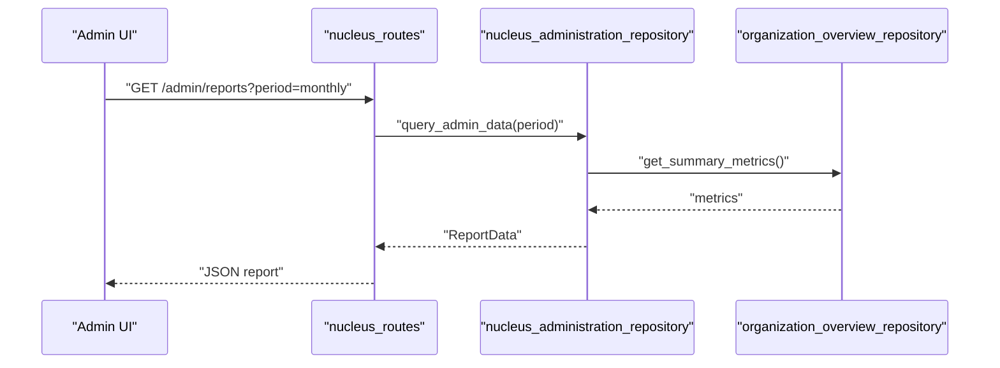

**Diagram sources**
- [nucleus_routes.py](file://app/api/nucleus_routes.py)
- [nucleus_administration_repository.py](file://app/repositories/nucleus_administration_repository.py)
- [organization_overview_repository.py](file://app/repositories/organization_overview_repository.py)

**Section sources**
- [nucleus_routes.py](file://app/api/nucleus_routes.py)
- [nucleus_administration_repository.py](file://app/repositories/nucleus_administration_repository.py)
- [organization_overview_repository.py](file://app/repositories/organization_overview_repository.py)

### Tenant Isolation Mechanisms
Tenant isolation is enforced at the repository layer using organization IDs and boundary checks. Cross-organization access requires explicit mapping and authorization.

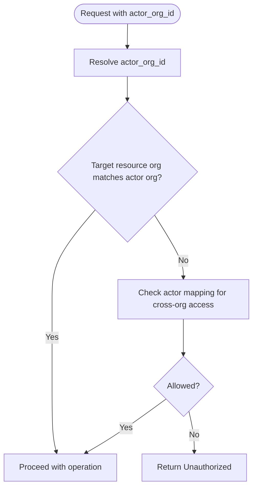

**Diagram sources**
- [nucleus_organization_repository.py](file://app/repositories/nucleus_organization_repository.py)
- [nucleus_actor_mapping_repository.py](file://app/repositories/nucleus_actor_mapping_repository.py)

**Section sources**
- [nucleus_organization_repository.py](file://app/repositories/nucleus_organization_repository.py)
- [nucleus_actor_mapping_repository.py](file://app/repositories/nucleus_actor_mapping_repository.py)
- [test_organization_boundaries.py](file://tests/test_organization_boundaries.py)

### License Management
License management integrates seat allocation with effective periods and capacity checks. Administrators can allocate, revoke, and monitor licenses per organization.

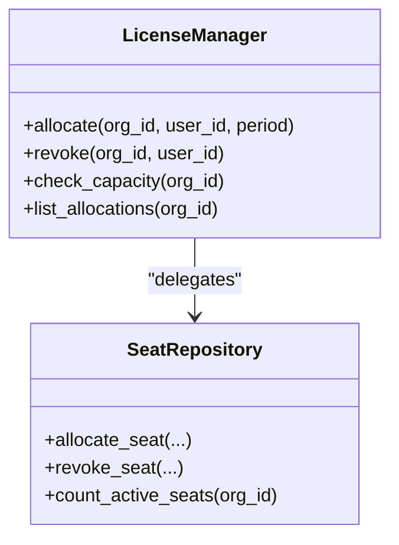

**Diagram sources**
- [seat_repository.py](file://app/repositories/seat_repository.py)
- [nucleus_admin_models.py](file://app/db/nucleus_admin_models.py)

**Section sources**
- [seat_repository.py](file://app/repositories/seat_repository.py)
- [nucleus_admin_models.py](file://app/db/nucleus_admin_models.py)
- [test_users_seats.py](file://tests/test_users_seats.py)

### Administrative Audit Trails
Audit trails record administrative actions and changes for compliance and debugging. They capture who did what, when, and why.

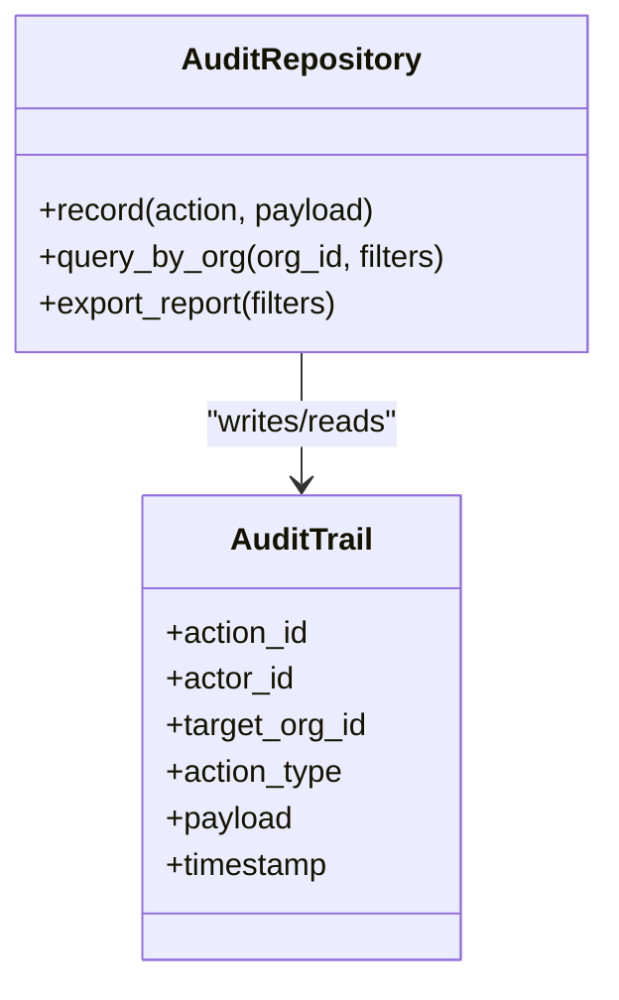

**Diagram sources**
- [nucleus_administration_repository.py](file://app/repositories/nucleus_administration_repository.py)
- [nucleus_admin_models.py](file://app/db/nucleus_admin_models.py)

**Section sources**
- [nucleus_administration_repository.py](file://app/repositories/nucleus_administration_repository.py)
- [nucleus_admin_models.py](file://app/db/nucleus_admin_models.py)

### Examples: Organization Queries, Seat Allocation, and Reporting
- Organization queries: Use organization repository methods to list, filter, and traverse hierarchies.
- Seat allocation: Allocate seats with effective periods and validate capacity before persisting.
- Reporting: Leverage overview repository to compute summary metrics and generate reports.

**Section sources**
- [nucleus_organization_repository.py](file://app/repositories/nucleus_organization_repository.py)
- [seat_repository.py](file://app/repositories/seat_repository.py)
- [organization_overview_repository.py](file://app/repositories/organization_overview_repository.py)
- [test_nucleus_organization_actions.py](file://tests/test_nucleus_organization_actions.py)
- [test_nucleus_admin_control.py](file://tests/test_nucleus_admin_control.py)

## Dependency Analysis
The following diagram shows key dependencies among core components involved in nucleus administration.

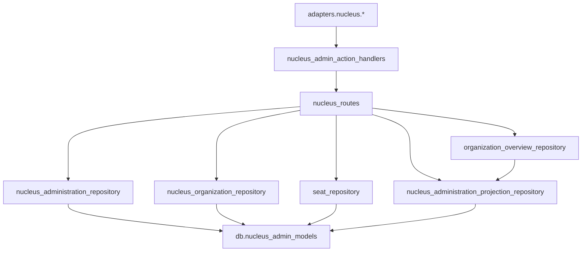

**Diagram sources**
- [nucleus_routes.py](file://app/api/nucleus_routes.py)
- [nucleus_administration_repository.py](file://app/repositories/nucleus_administration_repository.py)
- [nucleus_organization_repository.py](file://app/repositories/nucleus_organization_repository.py)
- [seat_repository.py](file://app/repositories/seat_repository.py)
- [nucleus_administration_projection_repository.py](file://app/repositories/nucleus_administration_projection_repository.py)
- [organization_overview_repository.py](file://app/repositories/organization_overview_repository.py)
- [nucleus_admin_models.py](file://app/db/nucleus_admin_models.py)
- [nucleus_admin_action_handlers.py](file://app/agent/nucleus_admin_action_handlers.py)
- [admin_contract.py](file://app/adapters/nucleus/admin_contract.py)
- [contract.py](file://app/adapters/nucleus/contract.py)

**Section sources**
- [nucleus_routes.py](file://app/api/nucleus_routes.py)
- [nucleus_administration_repository.py](file://app/repositories/nucleus_administration_repository.py)
- [nucleus_organization_repository.py](file://app/repositories/nucleus_organization_repository.py)
- [seat_repository.py](file://app/repositories/seat_repository.py)
- [nucleus_administration_projection_repository.py](file://app/repositories/nucleus_administration_projection_repository.py)
- [organization_overview_repository.py](file://app/repositories/organization_overview_repository.py)
- [nucleus_admin_models.py](file://app/db/nucleus_admin_models.py)
- [nucleus_admin_action_handlers.py](file://app/agent/nucleus_admin_action_handlers.py)
- [admin_contract.py](file://app/adapters/nucleus/admin_contract.py)
- [contract.py](file://app/adapters/nucleus/contract.py)

## Performance Considerations
- Prefer projections for heavy read workloads to avoid expensive joins.
- Cache overview aggregations and invalidate on seat or mapping changes.
- Batch seat allocations where possible to reduce transaction overhead.
- Index frequently filtered fields (org_id, user_id, effective_period).
- Use pagination for large lists of organizations and mappings.

[No sources needed since this section provides general guidance]

## Troubleshooting Guide
Common issues and resolutions:
- Insufficient license errors during seat allocation: Verify capacity and effective periods.
- Cross-organization access denied: Ensure proper actor mapping and authorization.
- Stale projections: Trigger projection synchronization after bulk updates.
- Audit gaps: Confirm audit recording is enabled and persisted.

**Section sources**
- [test_nucleus_admin_control.py](file://tests/test_nucleus_admin_control.py)
- [test_nucleus_admin_registry.py](file://tests/test_nucleus_admin_registry.py)
- [test_nucleus_projection_synchronization.py](file://tests/test_nucleus_projection_synchronization.py)
- [test_organization_boundaries.py](file://tests/test_organization_boundaries.py)

## Conclusion
Nucleus administration provides robust multi-organization support with clear tenant isolation, seat-based licensing, and comprehensive audit trails. Projections and overview aggregations enable efficient administrative reporting, while repositories enforce consistent query patterns and business rules.

[No sources needed since this section summarizes without analyzing specific files]

## Appendices

### Schema Evolution References
- Initial nucleus admin schema additions.
- Organization overview enhancements.
- Nucleus organization schema definitions.

**Section sources**
- [0013_nucleus_admin.py](file://alembic/versions/0013_nucleus_admin.py)
- [0010_add_organization_overview.py](file://alembic/versions/0010_add_organization_overview.py)
- [0011_nucleus_organization_schema.py](file://alembic/versions/0011_nucleus_organization_schema.py)