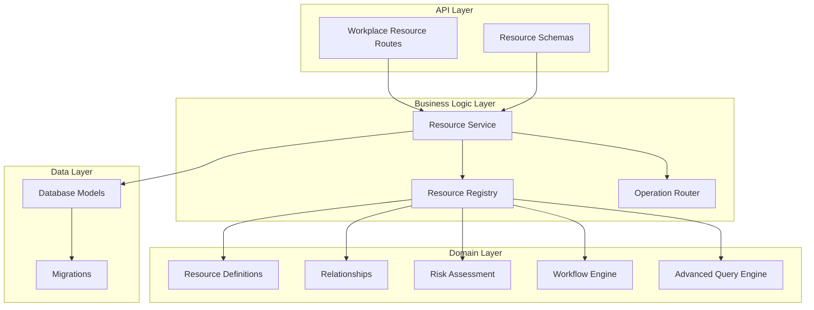
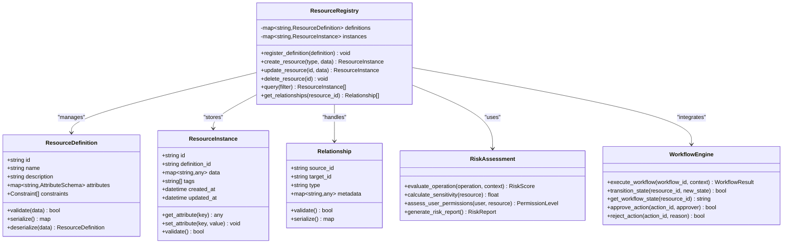
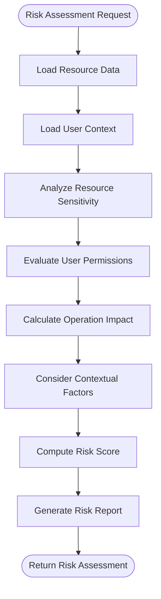
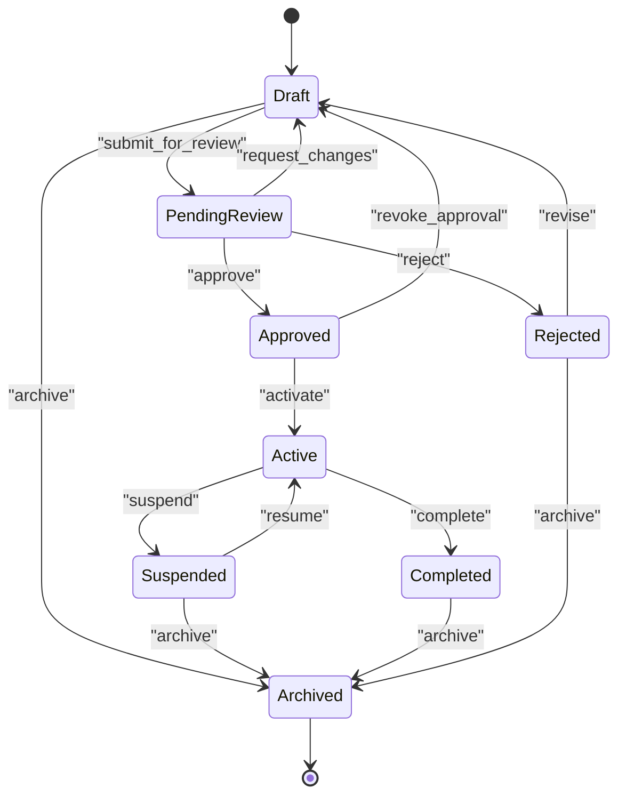
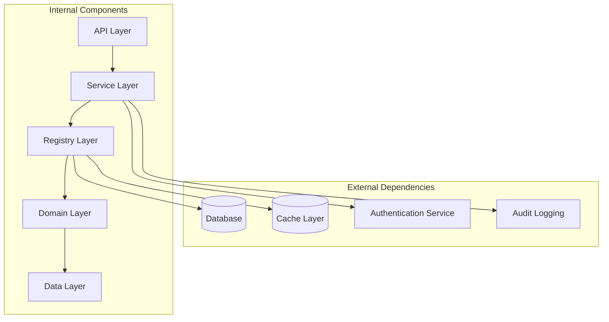

# Workplace Resource Models

<cite>
**Referenced Files in This Document**
- [workplace_resource_models.py](file://app/db/workplace_resource_models.py)
- [definitions.py](file://app/workplace_resources/definitions.py)
- [registry.py](file://app/workplace_resources/registry.py)
- [risk.py](file://app/workplace_resources/risk.py)
- [workflows.py](file://app/workplace_resources/workflows.py)
- [advanced_query.py](file://app/workplace_resources/advanced_query.py)
- [relationships.py](file://app/workplace_resources/relationships.py)
- [service.py](file://app/workplace_resources/service.py)
- [operation_router.py](file://app/workplace_resources/operation_router.py)
- [workplace_resources.py](file://app/schemas/workplace_resources.py)
- [workplace_resource_routes.py](file://app/api/workplace_resource_routes.py)
- [0014_workplace_resources.py](file://alembic/versions/0014_workplace_resources.py)
- [0015_workplace_workflows.py](file://alembic/versions/0015_workplace_workflows.py)
</cite>

## Table of Contents
1. [Introduction](#introduction)
2. [Project Structure](#project-structure)
3. [Core Components](#core-components)
4. [Architecture Overview](#architecture-overview)
5. [Detailed Component Analysis](#detailed-component-analysis)
6. [Dependency Analysis](#dependency-analysis)
7. [Performance Considerations](#performance-considerations)
8. [Troubleshooting Guide](#troubleshooting-guide)
9. [Conclusion](#conclusion)
10. [Appendices](#appendices)

## Introduction

This document provides comprehensive data model documentation for the workplace resource management system. The system implements a sophisticated resource registry with advanced querying capabilities, risk assessment models, workflow state management, and integration with an execution engine. The architecture supports complex resource relationships, permission models, audit trails, and performance optimization strategies.

The workplace resource management system is designed to handle diverse resource types including operational resources, agent actions, and workflow components, providing a unified interface for resource discovery, manipulation, and lifecycle management.

## Project Structure

The workplace resource management system follows a layered architecture with clear separation of concerns:



**Diagram sources**
- [workplace_resource_routes.py](file://app/api/workplace_resource_routes.py)
- [service.py](file://app/workplace_resources/service.py)
- [registry.py](file://app/workplace_resources/registry.py)
- [workplace_resource_models.py](file://app/db/workplace_resource_models.py)

**Section sources**
- [workplace_resource_routes.py](file://app/api/workplace_resource_routes.py)
- [service.py](file://app/workplace_resources/service.py)
- [registry.py](file://app/workplace_resources/registry.py)

## Core Components

### Resource Definition System

The resource definition system provides a flexible schema for defining different types of workplace resources. It supports dynamic attribute configuration, validation rules, and type constraints.

#### Key Features:
- **Dynamic Schema Definition**: Resources can define custom attributes with validation rules
- **Type Safety**: Strong typing support for resource attributes
- **Validation Framework**: Built-in validation for resource integrity
- **Extensibility**: Plugin architecture for custom resource types

### Resource Registry

The resource registry serves as the central coordination point for all resource operations, managing resource lifecycle, relationships, and access control.

#### Core Responsibilities:
- **Resource Registration**: Centralized registration of resource definitions
- **Lifecycle Management**: Creation, update, deletion, and archival of resources
- **Relationship Management**: Handling complex resource relationships
- **Access Control**: Integration with permission systems
- **Audit Trail**: Comprehensive logging of all resource operations

### Risk Assessment Model

The risk assessment system evaluates potential risks associated with resource operations and provides risk scoring mechanisms.

#### Risk Evaluation Factors:
- **Resource Sensitivity**: Classification of resource sensitivity levels
- **Operation Impact**: Assessment of operation impact on system stability
- **User Permissions**: Evaluation of user authorization levels
- **Contextual Factors**: Time-based and contextual risk considerations

### Workflow Integration

The workflow engine integrates with resource management to provide stateful operations and approval processes.

#### Workflow Capabilities:
- **State Machine**: Well-defined state transitions for resource lifecycle
- **Approval Chains**: Multi-level approval workflows
- **Conditional Execution**: Context-aware workflow execution
- **Rollback Support**: Transactional workflow operations

**Section sources**
- [definitions.py](file://app/workplace_resources/definitions.py)
- [registry.py](file://app/workplace_resources/registry.py)
- [risk.py](file://app/workplace_resources/risk.py)
- [workflows.py](file://app/workplace_resources/workflows.py)

## Architecture Overview

The workplace resource management system implements a comprehensive architecture that separates concerns across multiple layers while maintaining strong cohesion within each component.



**Diagram sources**
- [definitions.py](file://app/workplace_resources/definitions.py)
- [registry.py](file://app/workplace_resources/registry.py)
- [relationships.py](file://app/workplace_resources/relationships.py)
- [risk.py](file://app/workplace_resources/risk.py)
- [workflows.py](file://app/workplace_resources/workflows.py)

## Detailed Component Analysis

### Resource Definition Schema

The resource definition system provides a flexible framework for defining resource schemas with validation rules and constraints.

#### Schema Structure:
- **Base Attributes**: Common fields like ID, timestamps, and metadata
- **Custom Attributes**: Dynamic attribute definitions with type constraints
- **Validation Rules**: Built-in and custom validation logic
- **Relationship Definitions**: Declarative relationship specifications

#### Attribute Types Supported:
- **Primitive Types**: String, integer, boolean, datetime
- **Complex Types**: Arrays, objects, nested structures
- **Reference Types**: Links to other resources
- **Computed Fields**: Derived values based on other attributes

**Section sources**
- [definitions.py](file://app/workplace_resources/definitions.py)

### Resource Registry Implementation

The resource registry serves as the central coordination point for all resource operations, implementing the core business logic for resource management.

#### Core Operations:
- **CRUD Operations**: Create, read, update, delete resources
- **Batch Operations**: Bulk processing of multiple resources
- **Search and Filter**: Advanced querying capabilities
- **Versioning**: Resource version tracking and rollback support

#### Performance Optimizations:
- **Caching Layer**: In-memory caching for frequently accessed resources
- **Lazy Loading**: Deferred loading of related resources
- **Connection Pooling**: Efficient database connection management
- **Query Optimization**: Indexed queries and optimized joins

**Section sources**
- [registry.py](file://app/workplace_resources/registry.py)

### Risk Assessment Framework

The risk assessment system provides comprehensive evaluation of potential risks associated with resource operations.

#### Risk Evaluation Algorithm:


**Diagram sources**
- [risk.py](file://app/workplace_resources/risk.py)

#### Risk Categories:
- **Security Risks**: Unauthorized access and data exposure
- **Operational Risks**: System stability and performance impact
- **Compliance Risks**: Regulatory and policy violations
- **Business Risks**: Financial and reputational impact

**Section sources**
- [risk.py](file://app/workplace_resources/risk.py)

### Workflow State Management

The workflow engine manages complex resource lifecycles through well-defined state machines and approval processes.

#### State Transition Model:


**Diagram sources**
- [workflows.py](file://app/workplace_resources/workflows.py)

#### Approval Chain Configuration:
- **Sequential Approvals**: Linear approval process
- **Parallel Approvals**: Concurrent approval requirements
- **Conditional Approvals**: Context-dependent approval chains
- **Delegation Support**: Approval delegation and substitution

**Section sources**
- [workflows.py](file://app/workplace_resources/workflows.py)

### Advanced Query Engine

The advanced query engine provides powerful filtering and search capabilities for complex resource queries.

#### Query Language Features:
- **Field Filtering**: Exact match, range queries, pattern matching
- **Logical Operators**: AND, OR, NOT combinations
- **Nested Queries**: Complex conditional logic
- **Aggregation Support**: Grouping and statistical operations

#### Performance Optimization:
- **Index Utilization**: Automatic index selection and optimization
- **Query Caching**: Result caching for repeated queries
- **Pagination Support**: Efficient handling of large result sets
- **Lazy Evaluation**: Deferred computation of expensive operations

**Section sources**
- [advanced_query.py](file://app/workplace_resources/advanced_query.py)

### Relationship Management

The relationship system handles complex associations between resources with support for hierarchical and networked structures.

#### Relationship Types:
- **Ownership**: Parent-child relationships
- **Association**: Many-to-many connections
- **Dependency**: Reference relationships
- **Composition**: Strong ownership relationships

#### Query Optimization:
- **Eager Loading**: Pre-loading of related resources
- **Lazy Loading**: On-demand relationship resolution
- **Circular Reference Detection**: Prevention of infinite loops
- **Graph Traversal**: Efficient navigation of complex relationships

**Section sources**
- [relationships.py](file://app/workplace_resources/relationships.py)

## Dependency Analysis

The workplace resource management system exhibits careful dependency management with clear separation of concerns and minimal coupling between components.



**Diagram sources**
- [service.py](file://app/workplace_resources/service.py)
- [registry.py](file://app/workplace_resources/registry.py)
- [workplace_resource_models.py](file://app/db/workplace_resource_models.py)

### Dependency Characteristics:
- **Low Coupling**: Components interact through well-defined interfaces
- **High Cohesion**: Related functionality grouped within modules
- **Inversion of Control**: Dependencies injected rather than hardcoded
- **Interface Segregation**: Focused interfaces for specific responsibilities

**Section sources**
- [service.py](file://app/workplace_resources/service.py)
- [registry.py](file://app/workplace_resources/registry.py)

## Performance Considerations

### Database Optimization Strategies

The system implements several database optimization techniques to ensure efficient resource operations:

#### Indexing Strategy:
- **Primary Keys**: Optimized primary key indexing
- **Foreign Keys**: Efficient relationship queries
- **Composite Indexes**: Multi-column query optimization
- **Partial Indexes**: Conditional indexing for common queries

#### Query Optimization:
- **Connection Pooling**: Reuse database connections
- **Statement Caching**: Cache frequently executed queries
- **Batch Operations**: Minimize round-trips for bulk operations
- **Read Replicas**: Distribute read-heavy workloads

### Memory Management

#### Caching Layers:
- **L1 Cache**: In-process cache for hot data
- **L2 Cache**: Distributed cache for shared data
- **Query Result Cache**: Cache expensive query results
- **Metadata Cache**: Cache schema and definition metadata

#### Garbage Collection:
- **Object Pooling**: Reuse expensive objects
- **Memory Limits**: Enforce memory usage boundaries
- **Leak Detection**: Monitor for memory leaks
- **Cleanup Policies**: Automated cleanup of stale data

### Scalability Considerations

#### Horizontal Scaling:
- **Stateless Services**: Enable horizontal scaling
- **Distributed Caching**: Shared cache across instances
- **Database Sharding**: Partition data across databases
- **Load Balancing**: Distribute requests across instances

#### Concurrency Control:
- **Optimistic Locking**: Prevent concurrent modification conflicts
- **Transaction Isolation**: Ensure data consistency
- **Deadlock Prevention**: Avoid circular dependencies
- **Timeout Management**: Handle long-running operations

## Troubleshooting Guide

### Common Issues and Solutions

#### Resource Registration Failures
- **Symptom**: New resource definitions fail to register
- **Causes**: Invalid schema definitions, missing required fields, type mismatches
- **Resolution**: Validate schema definitions, check field types, review error logs

#### Query Performance Degradation
- **Symptom**: Slow resource queries under load
- **Causes**: Missing indexes, inefficient query patterns, connection pool exhaustion
- **Resolution**: Add appropriate indexes, optimize query patterns, increase connection pool size

#### Relationship Resolution Errors
- **Symptom**: Circular reference detection or missing relationships
- **Causes**: Circular dependencies, orphaned references, inconsistent state
- **Resolution**: Break circular dependencies, clean up orphaned references, validate referential integrity

#### Workflow State Conflicts
- **Symptom**: Invalid state transitions or approval conflicts
- **Causes**: Concurrent modifications, invalid transition attempts, missing approvals
- **Resolution**: Implement proper locking, validate transitions, enforce approval policies

### Debugging Techniques

#### Logging and Monitoring:
- **Structured Logging**: Consistent log format with correlation IDs
- **Performance Metrics**: Track query times and resource usage
- **Error Tracking**: Centralized error collection and analysis
- **Health Checks**: Monitor system health and dependencies

#### Diagnostic Tools:
- **Query Profiler**: Analyze slow queries and suggest optimizations
- **Dependency Graph**: Visualize component relationships
- **State Inspector**: Examine current system state
- **Audit Trail Viewer**: Review historical changes and operations

**Section sources**
- [errors.py](file://app/workplace_resources/errors.py)
- [service.py](file://app/workplace_resources/service.py)

## Conclusion

The workplace resource management system provides a comprehensive foundation for managing complex workplace resources with advanced querying, risk assessment, and workflow capabilities. The architecture emphasizes scalability, performance, and maintainability while providing rich functionality for resource lifecycle management.

Key strengths include:
- **Flexible Resource Modeling**: Support for diverse resource types and relationships
- **Advanced Query Capabilities**: Powerful filtering and search functionality
- **Robust Risk Assessment**: Comprehensive evaluation of operational risks
- **Workflow Integration**: Seamless integration with approval and state management
- **Performance Optimization**: Multiple layers of optimization for high-performance operations

The system is designed to scale horizontally and handle complex enterprise scenarios while maintaining simplicity and usability for developers and administrators.

## Appendices

### API Reference

#### Resource Management Endpoints

| Endpoint | Method | Description | Parameters | Response |
|----------|--------|-------------|------------|----------|
| `/api/resources` | POST | Create new resource | ResourceDefinition | CreatedResource |
| `/api/resources/{id}` | GET | Get resource by ID | Resource ID | ResourceInstance |
| `/api/resources/{id}` | PUT | Update resource | Resource ID, Updates | UpdatedResource |
| `/api/resources/{id}` | DELETE | Delete resource | Resource ID | Success/Failure |
| `/api/resources/search` | POST | Search resources | QueryFilter | SearchResult |
| `/api/resources/{id}/relationships` | GET | Get resource relationships | Resource ID | RelationshipList |
| `/api/resources/{id}/risk` | GET | Get risk assessment | Resource ID | RiskReport |

#### Query Filter Examples

```json
{
  "filters": [
    {
      "field": "type",
      "operator": "eq",
      "value": "operational_resource"
    },
    {
      "field": "status",
      "operator": "in",
      "value": ["active", "pending"]
    },
    {
      "field": "created_at",
      "operator": "gte",
      "value": "2024-01-01T00:00:00Z"
    }
  ],
  "sort": [{"field": "created_at", "order": "desc"}],
  "pagination": {"page": 1, "size": 50}
}
```

### Migration History

#### Database Schema Evolution

| Version | Description | Key Changes |
|---------|-------------|-------------|
| 0014 | Initial Resource Schema | Base resource tables, relationships, indexes |
| 0015 | Workflow Integration | State machine tables, approval workflows |
| 0016 | Performance Enhancements | Additional indexes, partitioning strategy |
| 0017 | Audit Trail | Comprehensive audit logging tables |
| 0018 | Security Enhancements | Permission matrices, access controls |

**Section sources**
- [0014_workplace_resources.py](file://alembic/versions/0014_workplace_resources.py)
- [0015_workplace_workflows.py](file://alembic/versions/0015_workplace_workflows.py)