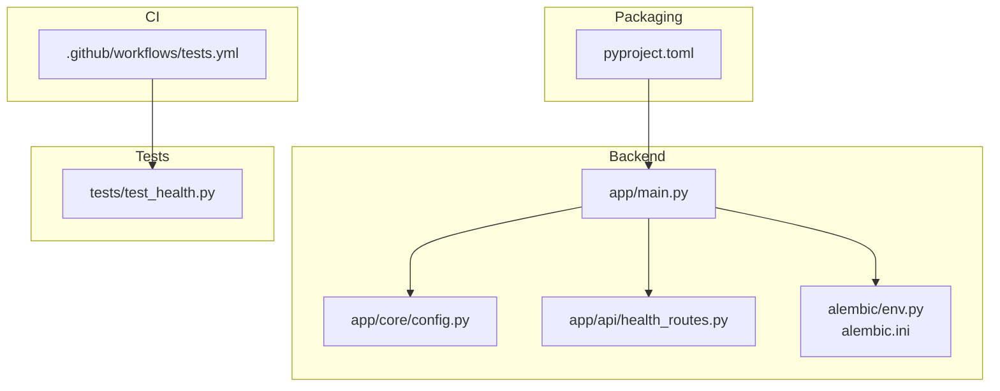
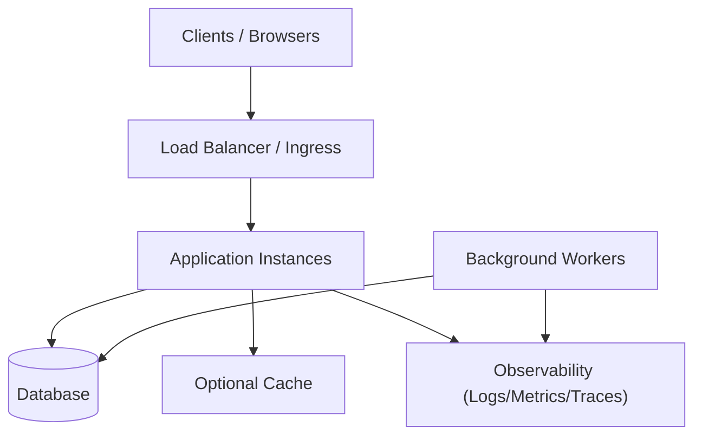
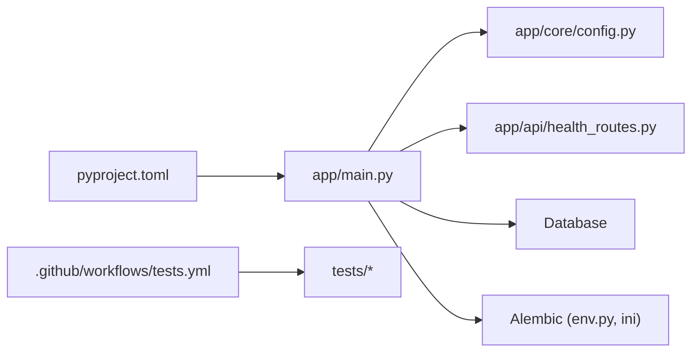

# Deployment & Operations

<cite>
**Referenced Files in This Document**
- [README.md](file://README.md)
- [pyproject.toml](file://pyproject.toml)
- [app/main.py](file://app/main.py)
- [app/core/config.py](file://app/core/config.py)
- [app/api/health_routes.py](file://app/api/health_routes.py)
- [alembic.ini](file://alembic.ini)
- [alembic/env.py](file://alembic/env.py)
- [.github/workflows/tests.yml](file://.github/workflows/tests.yml)
- [tests/test_health.py](file://tests/test_health.py)
</cite>

## Table of Contents
1. [Introduction](#introduction)
2. [Project Structure](#project-structure)
3. [Core Components](#core-components)
4. [Architecture Overview](#architecture-overview)
5. [Detailed Component Analysis](#detailed-component-analysis)
6. [Dependency Analysis](#dependency-analysis)
7. [Performance Considerations](#performance-considerations)
8. [Troubleshooting Guide](#troubleshooting-guide)
9. [Conclusion](#conclusion)
10. [Appendices](#appendices)

## Introduction
This document provides comprehensive deployment and operations guidance for the application, focusing on production readiness. It covers containerization strategies, environment configuration management across environments, CI/CD pipeline setup, scaling considerations (horizontal scaling, load balancing, database clustering), monitoring and logging, health checks, alerting, backup and disaster recovery, security hardening, compliance, and operational procedures for maintenance, upgrades, and troubleshooting.

The project is a Python backend with an Angular frontend. The backend exposes HTTP APIs, integrates with a relational database via SQLAlchemy and Alembic migrations, and includes health endpoints suitable for orchestration probes. A GitHub Actions workflow exists for running tests.

## Project Structure
At a high level:
- Backend application code resides under app/, including API routes, core configuration, database models, services, and workers.
- Database migrations are managed by Alembic under alembic/.
- Tests live under tests/.
- Frontend code lives under frontend/.
- CI configuration is under .github/workflows/.
- Packaging and dependencies are defined in pyproject.toml.
- Root-level documentation and scripts support validation and migration tooling.

**Diagram sources**
- [app/main.py](file://app/main.py)
- [app/core/config.py](file://app/core/config.py)
- [app/api/health_routes.py](file://app/api/health_routes.py)
- [alembic/env.py](file://alembic/env.py)
- [alembic.ini](file://alembic.ini)
- [.github/workflows/tests.yml](file://.github/workflows/tests.yml)
- [tests/test_health.py](file://tests/test_health.py)
- [pyproject.toml](file://pyproject.toml)

**Section sources**
- [README.md](file://README.md)
- [pyproject.toml](file://pyproject.toml)

## Core Components
- Application entrypoint and server configuration: The main module initializes the web server and wires up routes and middleware.
- Configuration management: Centralized configuration loader reads environment variables and provides typed access to settings used across the app.
- Health endpoints: Dedicated routes expose liveness/readiness signals for orchestrators and load balancers.
- Database migrations: Alembic manages schema evolution; env.py configures connection and migration execution.
- CI pipeline: GitHub Actions workflow runs tests to validate changes before merging or deploying.
- Packaging: pyproject.toml defines dependencies and build metadata for reproducible builds.

Operational implications:
- Use environment variables to control runtime behavior per environment.
- Expose health endpoints for Kubernetes or other orchestrators to probe service health.
- Run migrations as part of deployment or pre-deploy steps.
- Ensure CI validates tests and any contract checks before promotion.

**Section sources**
- [app/main.py](file://app/main.py)
- [app/core/config.py](file://app/core/config.py)
- [app/api/health_routes.py](file://app/api/health_routes.py)
- [alembic/env.py](file://alembic/env.py)
- [alembic.ini](file://alembic.ini)
- [.github/workflows/tests.yml](file://.github/workflows/tests.yml)
- [tests/test_health.py](file://tests/test_health.py)
- [pyproject.toml](file://pyproject.toml)

## Architecture Overview
The production architecture typically consists of:
- Stateless application instances behind a load balancer.
- A relational database (single primary or clustered).
- Optional background workers for long-running tasks.
- Observability stack for logs, metrics, and traces.
- CI/CD pipeline that builds artifacts and deploys them to target environments.

[No sources needed since this diagram shows conceptual architecture, not specific code structure]

## Detailed Component Analysis

### Containerization Strategy
Recommended approach:
- Use multi-stage Docker builds to separate build-time and runtime layers.
- Build the Python dependency cache in a builder stage using the same base image and lockfiles to ensure reproducibility.
- Copy only necessary artifacts into a minimal runtime image.
- For the frontend, build static assets in a builder stage and serve them via a lightweight HTTP server or integrate with the backend if appropriate.

Key practices:
- Pin base images and Python versions.
- Use non-root users in runtime images.
- Minimize installed packages and remove build tools from final images.
- Set explicit CMD/ENTRYPOINT and expose only required ports.

Environment injection:
- Provide configuration via environment variables at container runtime rather than baking secrets into images.
- Validate required variables at startup and fail fast if missing.

Security:
- Scan images for vulnerabilities.
- Sign images and enforce policies in CI/CD.

[No sources needed since this section provides general guidance]

### Environment Configuration Management
Configuration should be externalized and environment-specific:
- Define all configuration keys centrally and read them from environment variables.
- Provide defaults for development and require explicit values for staging and production.
- Separate sensitive values (secrets) from non-sensitive configuration.

Operational tips:
- Use secret managers or platform-native secret stores for production.
- Validate configuration at startup and surface clear errors when invalid.
- Avoid reloading configuration at runtime unless explicitly supported and safe.

**Section sources**
- [app/core/config.py](file://app/core/config.py)

### Health Checks and Readiness Probes
Expose dedicated endpoints for:
- Liveness: indicates whether the process is alive.
- Readiness: indicates whether the service is ready to accept traffic (e.g., database connectivity, migrations applied).

Implementation guidance:
- Keep health checks lightweight and idempotent.
- Return standard HTTP status codes and concise payloads.
- Integrate with orchestrator probes (Kubernetes liveness/readiness).

Testing:
- Include unit/integration tests for health endpoints to ensure they behave correctly under various conditions.

**Section sources**
- [app/api/health_routes.py](file://app/api/health_routes.py)
- [tests/test_health.py](file://tests/test_health.py)

### Database Migrations and Schema Evolution
Use Alembic to manage schema changes:
- Generate and review migration scripts before applying them.
- Apply migrations during deployment or as a pre-deploy step.
- Ensure backward compatibility where possible to avoid downtime.

Operational notes:
- Back up the database before major migrations.
- Rollback strategy: keep previous version available until validated.
- Monitor migration duration and failures.

**Section sources**
- [alembic/env.py](file://alembic/env.py)
- [alembic.ini](file://alembic.ini)

### CI/CD Pipeline Setup
Automate testing, building, and deployment:
- On push or pull request, run tests and linting.
- Build container images and push to a registry upon merge to protected branches.
- Deploy to staging automatically after successful CI, then promote to production with manual approval gates.

Pipeline stages:
- Install dependencies and cache build artifacts.
- Run unit and integration tests.
- Build and tag images.
- Push images to registry.
- Trigger deployments via environment-specific jobs.

**Section sources**
- [.github/workflows/tests.yml](file://.github/workflows/tests.yml)

### Scaling Considerations
Horizontal scaling:
- Run multiple stateless application instances behind a load balancer.
- Scale out based on CPU/memory utilization or queue depth for workers.

Load balancing:
- Use TCP/HTTP load balancing with health checks.
- Configure sticky sessions only if absolutely necessary; prefer stateless design.

Database clustering:
- Prefer managed databases with built-in HA and replication.
- Use read replicas for read-heavy workloads.
- Plan for failover and test recovery procedures.

Workers:
- Decouple long-running tasks into background workers.
- Use a message broker or durable queues to coordinate work.

[No sources needed since this section provides general guidance]

### Monitoring, Logging, and Alerting
Logging:
- Emit structured logs with correlation IDs and context.
- Ship logs to a centralized system.

Metrics:
- Expose key metrics (request rate, latency, error rates, queue lengths).
- Instrument database queries and external calls.

Alerting:
- Define SLOs and set alerts for breaches.
- Alert on error spikes, latency degradation, and resource exhaustion.

Health endpoints:
- Use liveness/readiness endpoints for orchestration and synthetic checks.

[No sources needed since this section provides general guidance]

### Backup and Disaster Recovery
Backups:
- Schedule regular backups of the database and any object storage.
- Retain backups according to policy and test restore procedures.

Disaster recovery:
- Document RTO/RPO targets.
- Maintain runbooks for failover and data restoration.
- Periodically drill recovery scenarios.

[No sources needed since this section provides general guidance]

### Security Hardening and Compliance
Hardening:
- Enforce least privilege for service accounts and database users.
- Rotate secrets regularly and use secure secret management.
- Enable TLS everywhere and enforce strong cipher suites.
- Harden container images and scan for vulnerabilities.

Compliance:
- Audit access and actions.
- Maintain change logs and provenance for artifacts.
- Follow organizational policies for data handling and retention.

[No sources needed since this section provides general guidance]

### Operational Procedures
Maintenance:
- Perform rolling updates to minimize downtime.
- Drain connections gracefully before stopping instances.

Upgrades:
- Upgrade dependencies in isolation first, then promote through environments.
- Validate migrations and rollback plans before production rollout.

Troubleshooting:
- Use correlation IDs to trace requests across components.
- Inspect logs, metrics, and health endpoints to diagnose issues.
- Reproduce problems in staging with sanitized data.

**Section sources**
- [app/main.py](file://app/main.py)
- [app/api/health_routes.py](file://app/api/health_routes.py)

## Dependency Analysis
High-level relationships relevant to operations:
- The application depends on configuration, database, and optional external services.
- CI depends on tests and packaging definitions.
- Migrations depend on database connectivity and Alembic configuration.

**Diagram sources**
- [app/main.py](file://app/main.py)
- [app/core/config.py](file://app/core/config.py)
- [app/api/health_routes.py](file://app/api/health_routes.py)
- [alembic/env.py](file://alembic/env.py)
- [alembic.ini](file://alembic.ini)
- [.github/workflows/tests.yml](file://.github/workflows/tests.yml)
- [pyproject.toml](file://pyproject.toml)

**Section sources**
- [pyproject.toml](file://pyproject.toml)
- [.github/workflows/tests.yml](file://.github/workflows/tests.yml)

## Performance Considerations
- Tune worker concurrency and database connection pools based on workload characteristics.
- Use caching strategically for hot paths while ensuring consistency.
- Profile critical endpoints and optimize slow queries.
- Right-size containers and clusters based on observed usage patterns.

[No sources needed since this section provides general guidance]

## Troubleshooting Guide
Common issues and resolutions:
- Missing environment variables: Validate configuration at startup and provide clear error messages.
- Database connectivity failures: Check credentials, network policies, and endpoint reachability.
- Migration failures: Review migration logs, verify schema state, and follow rollback procedures.
- Health check failures: Inspect liveness/readiness logic and underlying dependencies.

Diagnostic steps:
- Collect logs around the time of failure.
- Check metrics dashboards for anomalies.
- Reproduce in lower environments with similar configurations.

**Section sources**
- [app/core/config.py](file://app/core/config.py)
- [app/api/health_routes.py](file://app/api/health_routes.py)
- [alembic/env.py](file://alembic/env.py)

## Conclusion
By adopting robust containerization, strict environment configuration, automated CI/CD, scalable architecture patterns, comprehensive observability, and disciplined operational procedures, the application can be reliably deployed and operated in production. Continuous improvement through monitoring, alerting, and post-incident reviews will further strengthen resilience and performance.

[No sources needed since this section summarizes without analyzing specific files]

## Appendices

### Appendix A: Example Deployment Checklist
- Verify environment variables and secrets are configured.
- Confirm database migrations are applied successfully.
- Ensure health endpoints respond appropriately.
- Validate CI passes and artifacts are signed.
- Confirm autoscaling policies and load balancer health checks are active.
- Review logs and metrics for baseline behavior.

[No sources needed since this section provides general guidance]