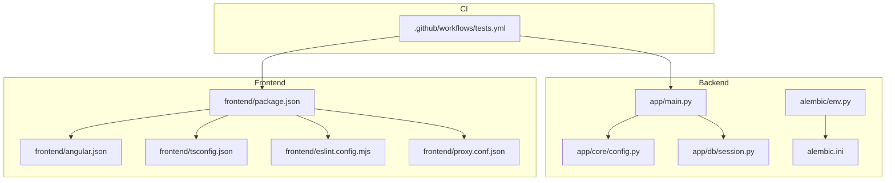
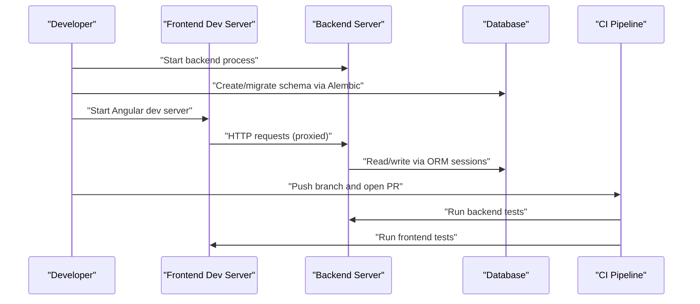
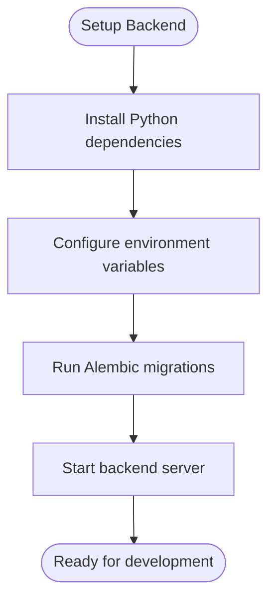
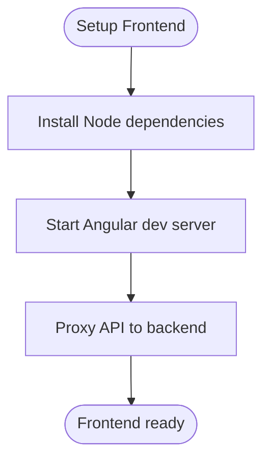
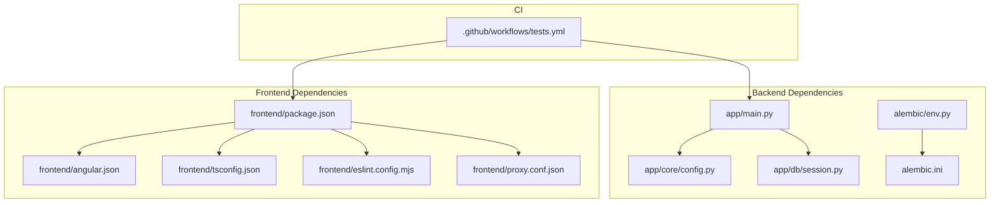

# Developer Guide

<cite>
**Referenced Files in This Document**
- [README.md](file://README.md)
- [pyproject.toml](file://pyproject.toml)
- [alembic.ini](file://alembic.ini)
- [app/main.py](file://app/main.py)
- [app/core/config.py](file://app/core/config.py)
- [app/db/session.py](file://app/db/session.py)
- [alembic/env.py](file://alembic/env.py)
- [frontend/package.json](file://frontend/package.json)
- [frontend/angular.json](file://frontend/angular.json)
- [frontend/tsconfig.json](file://frontend/tsconfig.json)
- [frontend/eslint.config.mjs](file://frontend/eslint.config.mjs)
- [frontend/proxy.conf.json](file://frontend/proxy.conf.json)
- [.github/workflows/tests.yml](file://.github/workflows/tests.yml)
- [tests/conftest.py](file://tests/conftest.py)
- [scripts/validate_frontend_contracts.py](file://scripts/validate_frontend_contracts.py)
</cite>

## Table of Contents
1. [Introduction](#introduction)
2. [Project Structure](#project-structure)
3. [Core Components](#core-components)
4. [Architecture Overview](#architecture-overview)
5. [Detailed Component Analysis](#detailed-component-analysis)
6. [Dependency Analysis](#dependency-analysis)
7. [Performance Considerations](#performance-considerations)
8. [Troubleshooting Guide](#troubleshooting-guide)
9. [Conclusion](#conclusion)
10. [Appendices](#appendices)

## Introduction
This guide explains how to set up a local development environment, run and debug the AI Agent Platform, follow code style and linting standards for Python and TypeScript, and contribute via Git workflows and pull requests. It also covers documentation practices, testing expectations, backward compatibility considerations, and common development tasks such as adding features, modifying functionality, and optimizing performance.

## Project Structure
The repository is a full-stack application with:
- Backend (Python): FastAPI-based API, domain services, repositories, database models, Alembic migrations, and tests.
- Frontend (TypeScript/Angular): UI components, services, schemas, E2E tests, and build configuration.
- Shared contracts and validation scripts under frontend/contracts and scripts/.

**Diagram sources**
- [app/main.py](file://app/main.py)
- [app/core/config.py](file://app/core/config.py)
- [app/db/session.py](file://app/db/session.py)
- [alembic/env.py](file://alembic/env.py)
- [alembic.ini](file://alembic.ini)
- [frontend/package.json](file://frontend/package.json)
- [frontend/angular.json](file://frontend/angular.json)
- [frontend/tsconfig.json](file://frontend/tsconfig.json)
- [frontend/eslint.config.mjs](file://frontend/eslint.config.mjs)
- [frontend/proxy.conf.json](file://frontend/proxy.conf.json)
- [.github/workflows/tests.yml](file://.github/workflows/tests.yml)

**Section sources**
- [README.md](file://README.md)
- [pyproject.toml](file://pyproject.toml)
- [alembic.ini](file://alembic.ini)
- [app/main.py](file://app/main.py)
- [app/core/config.py](file://app/core/config.py)
- [app/db/session.py](file://app/db/session.py)
- [alembic/env.py](file://alembic/env.py)
- [frontend/package.json](file://frontend/package.json)
- [frontend/angular.json](file://frontend/angular.json)
- [frontend/tsconfig.json](file://frontend/tsconfig.json)
- [frontend/eslint.config.mjs](file://frontend/eslint.config.mjs)
- [frontend/proxy.conf.json](file://frontend/proxy.conf.json)
- [.github/workflows/tests.yml](file://.github/workflows/tests.yml)

## Core Components
- Application entrypoint and startup orchestration are defined in the backend main module.
- Configuration is centralized and consumed by the app and database layer.
- Database session management is encapsulated for reuse across services and tests.
- Alembic is configured for schema migrations and version control of the database.
- Frontend build, linting, and proxy settings are managed through Angular and ESLint configurations.
- CI pipeline runs tests for both backend and frontend.

Key responsibilities:
- Backend: HTTP routes, dependency injection, service orchestration, DB access, migrations.
- Frontend: UI runtime, API client integration, schema validation, E2E flows.
- Shared: Contract definitions and validation scripts ensuring consistency between layers.

**Section sources**
- [app/main.py](file://app/main.py)
- [app/core/config.py](file://app/core/config.py)
- [app/db/session.py](file://app/db/session.py)
- [alembic/env.py](file://alembic/env.py)
- [alembic.ini](file://alembic.ini)
- [frontend/package.json](file://frontend/package.json)
- [frontend/angular.json](file://frontend/angular.json)
- [frontend/tsconfig.json](file://frontend/tsconfig.json)
- [frontend/eslint.config.mjs](file://frontend/eslint.config.mjs)
- [frontend/proxy.conf.json](file://frontend/proxy.conf.json)
- [.github/workflows/tests.yml](file://.github/workflows/tests.yml)

## Architecture Overview
High-level flow from developer machine to running services:
- Start the backend server using the project’s entrypoint.
- Initialize or migrate the database using Alembic.
- Run the frontend dev server; it proxies API calls to the backend.
- Execute tests locally and rely on CI to validate changes.

**Diagram sources**
- [app/main.py](file://app/main.py)
- [alembic/env.py](file://alembic/env.py)
- [alembic.ini](file://alembic.ini)
- [frontend/proxy.conf.json](file://frontend/proxy.conf.json)
- [.github/workflows/tests.yml](file://.github/workflows/tests.yml)

## Detailed Component Analysis

### Development Environment Setup

#### Prerequisites
- Python environment compatible with the project’s dependencies.
- Node.js and npm for the frontend.
- A relational database accessible by the backend.

#### Backend Setup
- Install dependencies using the project’s Python tooling configuration.
- Configure environment variables for database connectivity and other runtime settings.
- Initialize or migrate the database schema using Alembic.

**Diagram sources**
- [pyproject.toml](file://pyproject.toml)
- [app/core/config.py](file://app/core/config.py)
- [alembic/env.py](file://alembic/env.py)
- [alembic.ini](file://alembic.ini)
- [app/main.py](file://app/main.py)

**Section sources**
- [pyproject.toml](file://pyproject.toml)
- [app/core/config.py](file://app/core/config.py)
- [alembic/env.py](file://alembic/env.py)
- [alembic.ini](file://alembic.ini)
- [app/main.py](file://app/main.py)

#### Frontend Setup
- Install Node dependencies.
- Use the Angular CLI to start the development server.
- The dev server proxies API calls to the backend per proxy configuration.

**Diagram sources**
- [frontend/package.json](file://frontend/package.json)
- [frontend/angular.json](file://frontend/angular.json)
- [frontend/proxy.conf.json](file://frontend/proxy.conf.json)

**Section sources**
- [frontend/package.json](file://frontend/package.json)
- [frontend/angular.json](file://frontend/angular.json)
- [frontend/proxy.conf.json](file://frontend/proxy.conf.json)

#### Hot Reload and Debugging
- Backend hot reload: use the project’s recommended server runner to enable auto-reload during development.
- Frontend hot reload: Angular dev server provides live reloading out of the box.
- Debugging:
  - Backend: attach a debugger to the running process and set breakpoints in modules like the main entrypoint, core config, and database session.
  - Frontend: use browser developer tools and IDE debugging for TypeScript.

**Section sources**
- [app/main.py](file://app/main.py)
- [app/core/config.py](file://app/core/config.py)
- [app/db/session.py](file://app/db/session.py)
- [frontend/angular.json](file://frontend/angular.json)

### Code Style Guidelines

#### Python
- Follow the project’s linting and formatting rules defined in the Python configuration file.
- Ensure imports are organized and types are annotated where applicable.
- Keep functions focused and modular; prefer small, testable units.

**Section sources**
- [pyproject.toml](file://pyproject.toml)

#### TypeScript/Angular
- Linting is configured via ESLint; adhere to its rules.
- Maintain consistent component structure and naming conventions.
- Prefer strongly typed interfaces and avoid any casts when possible.

**Section sources**
- [frontend/eslint.config.mjs](file://frontend/eslint.config.mjs)
- [frontend/tsconfig.json](file://frontend/tsconfig.json)

### Linting and Formatting Standards
- Backend:
  - Use the configured linter/formatter to check and fix issues before committing.
- Frontend:
  - Run ESLint and format files according to project settings.
  - Validate contracts and schemas if applicable.

**Section sources**
- [pyproject.toml](file://pyproject.toml)
- [frontend/eslint.config.mjs](file://frontend/eslint.config.mjs)
- [scripts/validate_frontend_contracts.py](file://scripts/validate_frontend_contracts.py)

### Git Workflow

#### Branch Naming Conventions
- Use descriptive branch names that reflect feature, bugfix, or chore work.
- Include issue identifiers when available.

#### Commit Message Standards
- Use concise subject lines and detailed body text when necessary.
- Reference related issues or tickets.

#### Pull Request Procedures
- Open a PR against the default branch.
- Ensure all checks pass in CI.
- Request reviews from maintainers.
- Address review feedback promptly.

[No sources needed since this section doesn't analyze specific source files]

### Contribution Process
- Identify an issue or requirement.
- Create a feature branch and implement changes following style guidelines.
- Add or update tests to cover new behavior.
- Update documentation as needed.
- Submit a PR with clear description and acceptance criteria.
- Participate in code review and iterate until approved.

[No sources needed since this section doesn't analyze specific source files]

### Writing Documentation
- Place user-facing docs under docs/ and keep them updated alongside code changes.
- For API changes, update relevant contract files and validation scripts.
- Ensure diagrams and examples remain accurate.

**Section sources**
- [scripts/validate_frontend_contracts.py](file://scripts/validate_frontend_contracts.py)

### Adding Tests
- Backend tests reside under tests/ and leverage shared fixtures.
- Frontend unit tests co-locate with components/services; E2E tests under frontend/e2e/.
- Use pytest for backend and Angular testing utilities for frontend.

**Section sources**
- [tests/conftest.py](file://tests/conftest.py)
- [.github/workflows/tests.yml](file://.github/workflows/tests.yml)

### Maintaining Backward Compatibility
- Avoid breaking API changes without deprecation strategy.
- Use migrations carefully and ensure they are reversible or forward-compatible.
- Validate frontend-backend contracts after changes.

**Section sources**
- [alembic/env.py](file://alembic/env.py)
- [alembic.ini](file://alembic.ini)
- [scripts/validate_frontend_contracts.py](file://scripts/validate_frontend_contracts.py)

### Common Development Tasks

#### Adding New Features
- Define data models and migrations if needed.
- Implement services and repositories.
- Expose endpoints via routes and schemas.
- Add tests and update documentation.

**Section sources**
- [app/main.py](file://app/main.py)
- [app/db/session.py](file://app/db/session.py)
- [alembic/env.py](file://alembic/env.py)

#### Modifying Existing Functionality
- Review existing tests to understand expected behavior.
- Make minimal, focused changes.
- Update tests and verify no regressions.

**Section sources**
- [tests/conftest.py](file://tests/conftest.py)
- [.github/workflows/tests.yml](file://.github/workflows/tests.yml)

#### Performance Optimization Techniques
- Profile critical paths in backend services and database queries.
- Optimize ORM usage and reduce N+1 queries.
- Leverage caching where appropriate.
- Monitor frontend bundle size and lazy-load heavy modules.

[No sources needed since this section provides general guidance]

## Dependency Analysis
The backend depends on configuration and database session management. The frontend depends on Angular CLI and ESLint. CI orchestrates running tests for both layers.

**Diagram sources**
- [app/main.py](file://app/main.py)
- [app/core/config.py](file://app/core/config.py)
- [app/db/session.py](file://app/db/session.py)
- [alembic/env.py](file://alembic/env.py)
- [alembic.ini](file://alembic.ini)
- [frontend/package.json](file://frontend/package.json)
- [frontend/angular.json](file://frontend/angular.json)
- [frontend/tsconfig.json](file://frontend/tsconfig.json)
- [frontend/eslint.config.mjs](file://frontend/eslint.config.mjs)
- [frontend/proxy.conf.json](file://frontend/proxy.conf.json)
- [.github/workflows/tests.yml](file://.github/workflows/tests.yml)

**Section sources**
- [app/main.py](file://app/main.py)
- [app/core/config.py](file://app/core/config.py)
- [app/db/session.py](file://app/db/session.py)
- [alembic/env.py](file://alembic/env.py)
- [alembic.ini](file://alembic.ini)
- [frontend/package.json](file://frontend/package.json)
- [frontend/angular.json](file://frontend/angular.json)
- [frontend/tsconfig.json](file://frontend/tsconfig.json)
- [frontend/eslint.config.mjs](file://frontend/eslint.config.mjs)
- [frontend/proxy.conf.json](file://frontend/proxy.conf.json)
- [.github/workflows/tests.yml](file://.github/workflows/tests.yml)

## Performance Considerations
- Use connection pooling and tune database parameters for your workload.
- Batch operations and minimize round trips to external services.
- Enable compression and efficient serialization formats.
- On the frontend, prefer lazy loading and tree-shaking; monitor network payloads.

[No sources needed since this section provides general guidance]

## Troubleshooting Guide
- Database connectivity issues:
  - Verify environment variables and connection strings.
  - Confirm migrations have been applied successfully.
- API errors:
  - Check logs from the backend server and inspect request/response payloads.
- Frontend proxy problems:
  - Ensure the backend is running and reachable at the proxied host/port.
- CI failures:
  - Reproduce locally by running the same commands invoked by the workflow.

**Section sources**
- [app/core/config.py](file://app/core/config.py)
- [app/db/session.py](file://app/db/session.py)
- [alembic/env.py](file://alembic/env.py)
- [frontend/proxy.conf.json](file://frontend/proxy.conf.json)
- [.github/workflows/tests.yml](file://.github/workflows/tests.yml)

## Conclusion
By following this guide, contributors can efficiently set up the development environment, write and test code consistently, and collaborate effectively through Git workflows and code reviews. Adhering to style guidelines, maintaining backward compatibility, and keeping documentation current will help sustain a healthy and productive project.

## Appendices

### Quick Commands
- Backend:
  - Install dependencies and run migrations.
  - Start the server with hot reload enabled.
- Frontend:
  - Install dependencies and start the dev server.
  - Run linters and tests.

[No sources needed since this section provides general guidance]