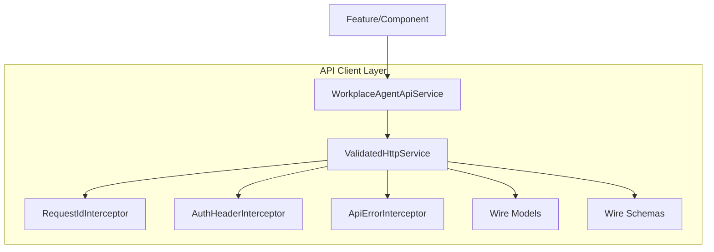
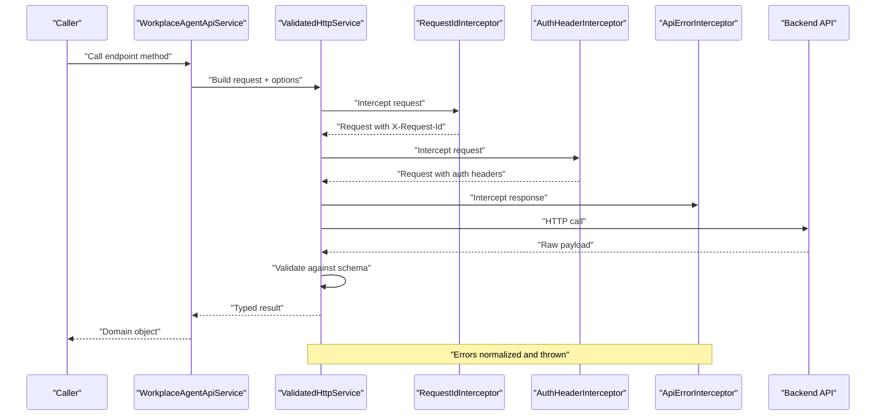
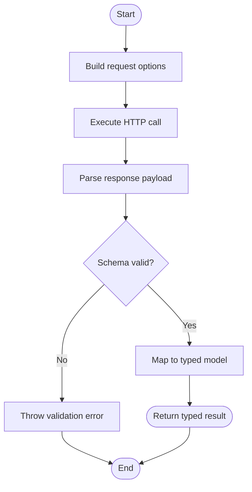
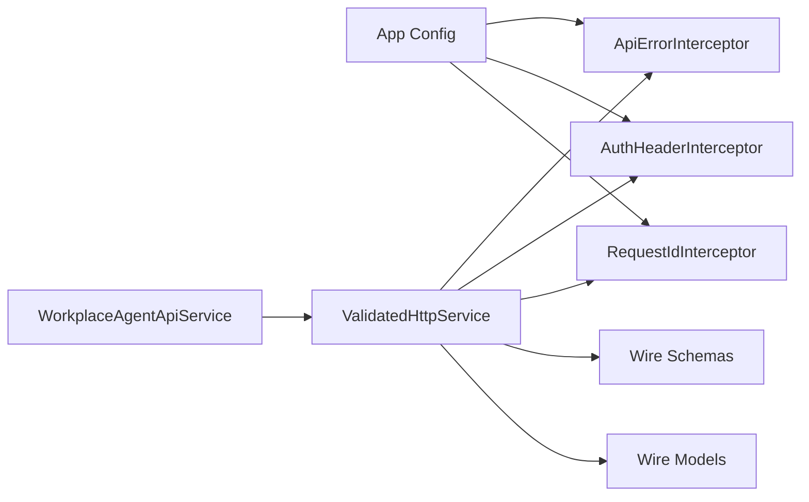

# API Client Layer

<cite>
**Referenced Files in This Document**
- [workplace-agent-api.service.ts](file://frontend/src/app/core/api/workplace-agent-api.service.ts)
- [validated-http.service.ts](file://frontend/src/app/core/api/validated-http.service.ts)
- [request-id.interceptor.ts](file://frontend/src/app/core/api/request-id.interceptor.ts)
- [api-error.interceptor.ts](file://frontend/src/app/core/api/api-error.interceptor.ts)
- [auth-header.interceptor.ts](file://frontend/src/app/core/auth/auth-header.interceptor.ts)
- [wire.models.ts](file://frontend/src/app/core/api/wire.models.ts)
- [wire.schemas.ts](file://frontend/src/app/core/api/wire.schemas.ts)
- [app.config.ts](file://frontend/src/app/app.config.ts)
- [workplace-agent-api.service.spec.ts](file://frontend/src/app/core/api/workplace-agent-api.service.spec.ts)
</cite>

## Table of Contents
1. [Introduction](#introduction)
2. [Project Structure](#project-structure)
3. [Core Components](#core-components)
4. [Architecture Overview](#architecture-overview)
5. [Detailed Component Analysis](#detailed-component-analysis)
6. [Dependency Analysis](#dependency-analysis)
7. [Performance Considerations](#performance-considerations)
8. [Troubleshooting Guide](#troubleshooting-guide)
9. [Conclusion](#conclusion)
10. [Appendices](#appendices)

## Introduction
This document describes the frontend API client layer for the workplace agent application. It focuses on:
- The Workplace Agent API service implementation and how it exposes typed methods to callers
- HTTP client configuration and the interceptor chain (request ID generation, authentication headers, error interception)
- Request/response handling patterns with schema validation and type safety
- Wire models and schemas used for transformation between backend payloads and strongly-typed domain types
- Practical examples of making API calls, handling errors, and implementing custom interceptors

The goal is to provide a clear mental model of how requests are constructed, intercepted, validated, and returned as strongly-typed responses.

## Project Structure
The API client layer resides under the Angular app core module and is organized around a small set of focused components:
- A high-level API service that encapsulates endpoints and returns strongly-typed results
- A validated HTTP service that centralizes request construction, response parsing, and schema validation
- Interceptors for cross-cutting concerns such as request IDs, authentication headers, and error normalization
- Wire models and JSON Schema definitions that ensure runtime correctness of payloads

**Diagram sources**
- [workplace-agent-api.service.ts](file://frontend/src/app/core/api/workplace-agent-api.service.ts)
- [validated-http.service.ts](file://frontend/src/app/core/api/validated-http.service.ts)
- [request-id.interceptor.ts](file://frontend/src/app/core/api/request-id.interceptor.ts)
- [auth-header.interceptor.ts](file://frontend/src/app/core/auth/auth-header.interceptor.ts)
- [api-error.interceptor.ts](file://frontend/src/app/core/api/api-error.interceptor.ts)
- [wire.models.ts](file://frontend/src/app/core/api/wire.models.ts)
- [wire.schemas.ts](file://frontend/src/app/core/api/wire.schemas.ts)

**Section sources**
- [workplace-agent-api.service.ts](file://frontend/src/app/core/api/workplace-agent-api.service.ts)
- [validated-http.service.ts](file://frontend/src/app/core/api/validated-http.service.ts)
- [request-id.interceptor.ts](file://frontend/src/app/core/api/request-id.interceptor.ts)
- [auth-header.interceptor.ts](file://frontend/src/app/core/auth/auth-header.interceptor.ts)
- [api-error.interceptor.ts](file://frontend/src/app/core/api/api-error.interceptor.ts)
- [wire.models.ts](file://frontend/src/app/core/api/wire.models.ts)
- [wire.schemas.ts](file://frontend/src/app/core/api/wire.schemas.ts)

## Core Components
- WorkplaceAgentApiService: Provides domain-oriented methods for calling workplace agent endpoints. It composes ValidatedHttpService to build requests, parse responses, and enforce schema validation.
- ValidatedHttpService: Centralizes HTTP operations with built-in request/response validation against wire schemas. It ensures type safety by transforming raw payloads into strongly-typed models.
- RequestIdInterceptor: Injects a unique request identifier header for tracing and observability across the stack.
- AuthHeaderInterceptor: Attaches authentication tokens or headers required by the backend.
- ApiErrorInterceptor: Normalizes backend errors into a consistent shape and throws typed exceptions for callers to handle.
- Wire Models and Schemas: Define the contract between frontend and backend, including request/response shapes and validation rules.

Key responsibilities:
- Construction of typed requests with query parameters, path variables, and bodies
- Response parsing and validation using JSON Schema
- Error normalization and propagation
- Consistent header injection (IDs, auth)

**Section sources**
- [workplace-agent-api.service.ts](file://frontend/src/app/core/api/workplace-agent-api.service.ts)
- [validated-http.service.ts](file://frontend/src/app/core/api/validated-http.service.ts)
- [request-id.interceptor.ts](file://frontend/src/app/core/api/request-id.interceptor.ts)
- [auth-header.interceptor.ts](file://frontend/src/app/core/auth/auth-header.interceptor.ts)
- [api-error.interceptor.ts](file://frontend/src/app/core/api/api-error.interceptor.ts)
- [wire.models.ts](file://frontend/src/app/core/api/wire.models.ts)
- [wire.schemas.ts](file://frontend/src/app/core/api/wire.schemas.ts)

## Architecture Overview
The API client follows a layered approach:
- Feature code calls the high-level API service
- The API service delegates to the validated HTTP service
- The HTTP service executes requests through an interceptor chain
- Responses are validated against schemas and mapped to strongly-typed models

**Diagram sources**
- [workplace-agent-api.service.ts](file://frontend/src/app/core/api/workplace-agent-api.service.ts)
- [validated-http.service.ts](file://frontend/src/app/core/api/validated-http.service.ts)
- [request-id.interceptor.ts](file://frontend/src/app/core/api/request-id.interceptor.ts)
- [auth-header.interceptor.ts](file://frontend/src/app/core/auth/auth-header.interceptor.ts)
- [api-error.interceptor.ts](file://frontend/src/app/core/api/api-error.interceptor.ts)

## Detailed Component Analysis

### WorkplaceAgentApiService
Responsibilities:
- Expose domain-friendly methods for workplace agent endpoints
- Compose request options (headers, params, body)
- Delegate to ValidatedHttpService for execution and validation
- Return strongly-typed results to callers

Typical usage pattern:
- Call a method like getWorkplaceInfo() or createAction()
- Receive a typed response object conforming to wire models
- Handle errors thrown by the underlying HTTP layer

Example references:
- [workplace-agent-api.service.ts](file://frontend/src/app/core/api/workplace-agent-api.service.ts)
- [workplace-agent-api.service.spec.ts](file://frontend/src/app/core/api/workplace-agent-api.service.spec.ts)

**Section sources**
- [workplace-agent-api.service.ts](file://frontend/src/app/core/api/workplace-agent-api.service.ts)
- [workplace-agent-api.service.spec.ts](file://frontend/src/app/core/api/workplace-agent-api.service.spec.ts)

### ValidatedHttpService
Responsibilities:
- Build HTTP requests with base URL, path, method, headers, query params, and body
- Execute requests via Angular’s HttpClient
- Validate responses against JSON Schemas before returning
- Map raw payloads to strongly-typed models
- Provide helpers for common operations (GET, POST, etc.)

Validation flow:

**Diagram sources**
- [validated-http.service.ts](file://frontend/src/app/core/api/validated-http.service.ts)
- [wire.schemas.ts](file://frontend/src/app/core/api/wire.schemas.ts)
- [wire.models.ts](file://frontend/src/app/core/api/wire.models.ts)

**Section sources**
- [validated-http.service.ts](file://frontend/src/app/core/api/validated-http.service.ts)
- [wire.schemas.ts](file://frontend/src/app/core/api/wire.schemas.ts)
- [wire.models.ts](file://frontend/src/app/core/api/wire.models.ts)

### Interceptor Chain

#### RequestIdInterceptor
- Generates a unique request ID per outgoing request
- Adds a standardized header (e.g., X-Request-Id) for tracing
- Ensures correlation across services and logs

Usage:
- Registered globally so all HTTP calls include the header automatically

**Section sources**
- [request-id.interceptor.ts](file://frontend/src/app/core/api/request-id.interceptor.ts)

#### AuthHeaderInterceptor
- Reads current authentication state and attaches required headers (e.g., Authorization)
- Skips public endpoints if configured
- Handles token refresh scenarios if implemented

**Section sources**
- [auth-header.interceptor.ts](file://frontend/src/app/core/auth/auth-header.interceptor.ts)

#### ApiErrorInterceptor
- Catches HTTP errors and normalizes them into a consistent structure
- Maps status codes to user-friendly messages
- Throws typed exceptions for callers to handle uniformly

**Section sources**
- [api-error.interceptor.ts](file://frontend/src/app/core/api/api-error.interceptor.ts)

### Wire Models and Schemas
- Wire models define TypeScript interfaces for request and response payloads
- Wire schemas define JSON Schema constraints used at runtime for validation
- Transformation occurs in ValidatedHttpService to convert raw payloads into typed models

Best practices:
- Keep wire models aligned with backend contracts
- Update schemas when backend changes occur
- Use schema validation to catch mismatches early

**Section sources**
- [wire.models.ts](file://frontend/src/app/core/api/wire.models.ts)
- [wire.schemas.ts](file://frontend/src/app/core/api/wire.schemas.ts)

### Configuration and Registration
- Interceptors are registered in the application configuration
- Base URL and default options can be centralized
- Environment-specific settings (e.g., staging vs production) are supported

**Section sources**
- [app.config.ts](file://frontend/src/app/app.config.ts)

## Dependency Analysis
The API client layer has clear boundaries and low coupling:
- WorkplaceAgentApiService depends on ValidatedHttpService
- ValidatedHttpService depends on Angular HttpClient and wire schemas/models
- Interceptors depend on shared utilities (e.g., UUID generation, auth store)
- No circular dependencies among these modules

**Diagram sources**
- [app.config.ts](file://frontend/src/app/app.config.ts)
- [workplace-agent-api.service.ts](file://frontend/src/app/core/api/workplace-agent-api.service.ts)
- [validated-http.service.ts](file://frontend/src/app/core/api/validated-http.service.ts)
- [request-id.interceptor.ts](file://frontend/src/app/core/api/request-id.interceptor.ts)
- [auth-header.interceptor.ts](file://frontend/src/app/core/auth/auth-header.interceptor.ts)
- [api-error.interceptor.ts](file://frontend/src/app/core/api/api-error.interceptor.ts)
- [wire.models.ts](file://frontend/src/app/core/api/wire.models.ts)
- [wire.schemas.ts](file://frontend/src/app/core/api/wire.schemas.ts)

**Section sources**
- [app.config.ts](file://frontend/src/app/app.config.ts)
- [workplace-agent-api.service.ts](file://frontend/src/app/core/api/workplace-agent-api.service.ts)
- [validated-http.service.ts](file://frontend/src/app/core/api/validated-http.service.ts)
- [request-id.interceptor.ts](file://frontend/src/app/core/api/request-id.interceptor.ts)
- [auth-header.interceptor.ts](file://frontend/src/app/core/auth/auth-header.interceptor.ts)
- [api-error.interceptor.ts](file://frontend/src/app/core/api/api-error.interceptor.ts)
- [wire.models.ts](file://frontend/src/app/core/api/wire.models.ts)
- [wire.schemas.ts](file://frontend/src/app/core/api/wire.schemas.ts)

## Performance Considerations
- Minimize redundant network calls by caching responses where appropriate
- Avoid heavy transformations in interceptors; keep them lightweight
- Prefer streaming or pagination for large datasets
- Validate only necessary fields to reduce overhead
- Reuse HTTP clients and avoid recreating instances frequently

[No sources needed since this section provides general guidance]

## Troubleshooting Guide
Common issues and resolutions:
- Missing request ID: Ensure RequestIdInterceptor is registered and not short-circuited
- Authentication failures: Verify AuthHeaderInterceptor reads the correct token source and skips public endpoints
- Validation errors: Check wire schemas for mismatches with backend responses; update schemas accordingly
- Error normalization: Inspect ApiErrorInterceptor mapping for new status codes or error shapes

Diagnostic tips:
- Log request IDs from X-Request-Id to correlate server-side logs
- Enable verbose logging in development for HTTP calls
- Add unit tests around interceptors and validation paths

**Section sources**
- [request-id.interceptor.ts](file://frontend/src/app/core/api/request-id.interceptor.ts)
- [auth-header.interceptor.ts](file://frontend/src/app/core/auth/auth-header.interceptor.ts)
- [api-error.interceptor.ts](file://frontend/src/app/core/api/api-error.interceptor.ts)
- [wire.schemas.ts](file://frontend/src/app/core/api/wire.schemas.ts)

## Conclusion
The API client layer provides a robust, type-safe foundation for communicating with the workplace agent backend. By combining a high-level API service, a validated HTTP service, and a well-defined interceptor chain, it ensures consistent request construction, strong response validation, and uniform error handling. Wire models and schemas maintain alignment with backend contracts, reducing integration risks and improving developer experience.

[No sources needed since this section summarizes without analyzing specific files]

## Appendices

### Making API Calls
- Import the API service in your feature component or service
- Call a method corresponding to the desired endpoint
- Handle the typed response and any thrown errors

References:
- [workplace-agent-api.service.ts](file://frontend/src/app/core/api/workplace-agent-api.service.ts)
- [workplace-agent-api.service.spec.ts](file://frontend/src/app/core/api/workplace-agent-api.service.spec.ts)

### Handling Errors
- Catch errors thrown by API methods
- Use normalized error structures provided by ApiErrorInterceptor
- Display user-friendly messages based on error types

References:
- [api-error.interceptor.ts](file://frontend/src/app/core/api/api-error.interceptor.ts)

### Implementing Custom Interceptors
- Create a new interceptor class implementing the Angular interceptor interface
- Register it in the application configuration alongside existing interceptors
- Ensure order matters: place interceptors appropriately in the chain

References:
- [app.config.ts](file://frontend/src/app/app.config.ts)
- [request-id.interceptor.ts](file://frontend/src/app/core/api/request-id.interceptor.ts)
- [auth-header.interceptor.ts](file://frontend/src/app/core/auth/auth-header.interceptor.ts)
- [api-error.interceptor.ts](file://frontend/src/app/core/api/api-error.interceptor.ts)