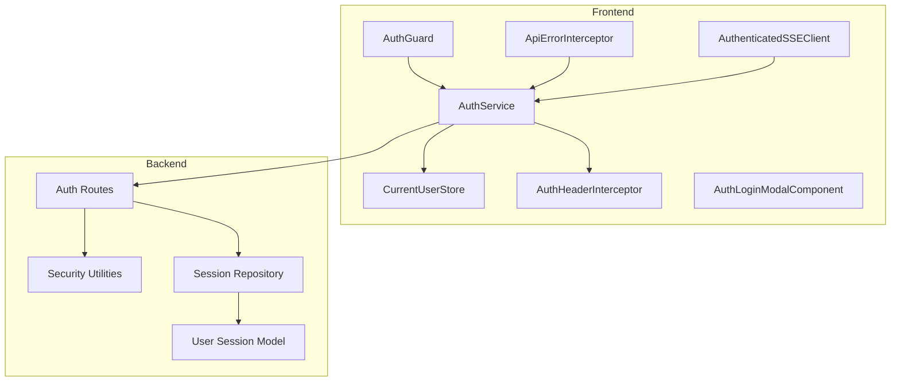
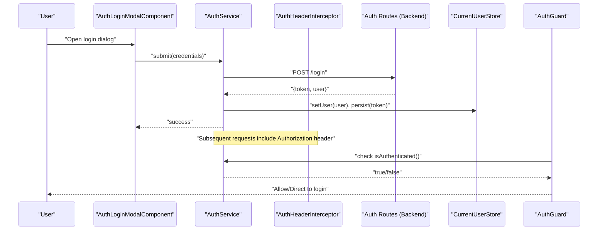
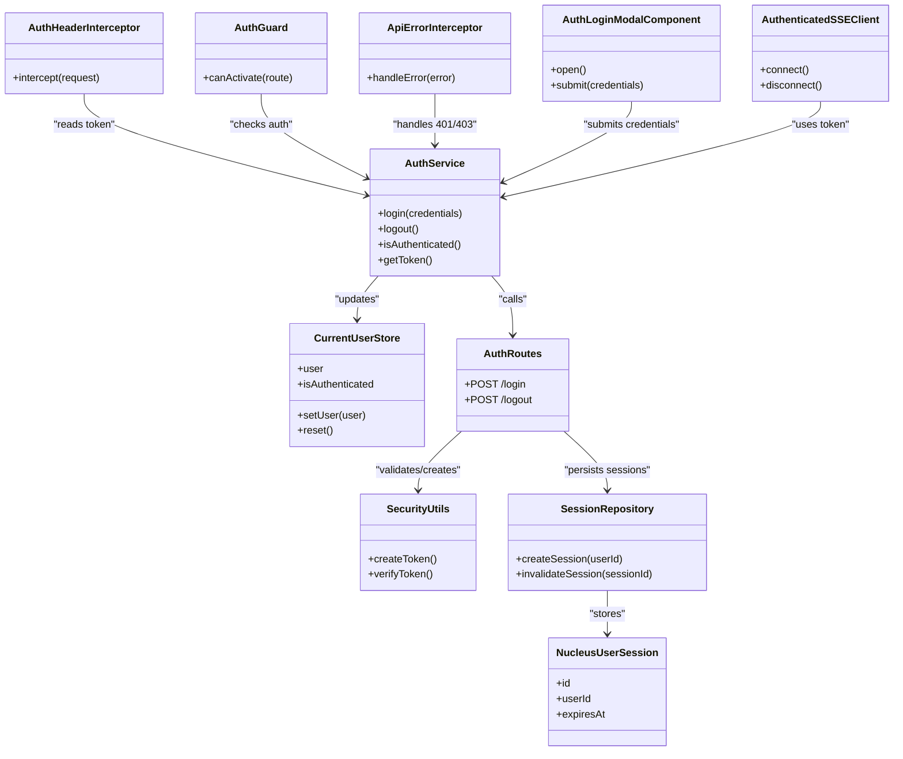

# Authentication Service

<cite>
**Referenced Files in This Document**
- [auth.service.ts](file://frontend/src/app/core/auth/auth.service.ts)
- [current-user.store.ts](file://frontend/src/app/core/auth/current-user.store.ts)
- [auth-header.interceptor.ts](file://frontend/src/app/core/auth/auth-header.interceptor.ts)
- [auth-login-modal.component.ts](file://frontend/src/app/core/auth/auth-login-modal.component.ts)
- [auth.guard.ts](file://frontend/src/app/core/routing/auth.guard.ts)
- [api-error.interceptor.ts](file://frontend/src/app/core/api/api-error.interceptor.ts)
- [authenticated-sse-client.service.ts](file://frontend/src/app/core/sse/authenticated-sse-client.service.ts)
- [app.routes.ts](file://frontend/src/app/app.routes.ts)
- [auth_routes.py](file://app/api/auth_routes.py)
- [core/security.py](file://app/core/security.py)
- [db/nucleus_user_session.py](file://app/db/nucleus_user_session.py)
- [repositories/session_repository.py](file://app/repositories/session_repository.py)
</cite>

## Table of Contents
1. [Introduction](#introduction)
2. [Project Structure](#project-structure)
3. [Core Components](#core-components)
4. [Architecture Overview](#architecture-overview)
5. [Detailed Component Analysis](#detailed-component-analysis)
6. [Dependency Analysis](#dependency-analysis)
7. [Performance Considerations](#performance-considerations)
8. [Troubleshooting Guide](#troubleshooting-guide)
9. [Conclusion](#conclusion)
10. [Appendices](#appendices)

## Introduction
This document explains the authentication service and its integration across the frontend and backend. It covers login/logout flows, token management, session handling, automatic header attachment via an interceptor, reactive current user state, the login modal UI, protected routes, error handling, and how to extend the flow with additional providers.

## Project Structure
The authentication feature spans both frontend and backend:
- Frontend core auth module provides services, stores, interceptors, guards, and a login modal.
- Backend exposes auth endpoints, security utilities, session storage, and repository access.

**Diagram sources**
- [auth.service.ts](file://frontend/src/app/core/auth/auth.service.ts)
- [current-user.store.ts](file://frontend/src/app/core/auth/current-user.store.ts)
- [auth-header.interceptor.ts](file://frontend/src/app/core/auth/auth-header.interceptor.ts)
- [auth-login-modal.component.ts](file://frontend/src/app/core/auth/auth-login-modal.component.ts)
- [auth.guard.ts](file://frontend/src/app/core/routing/auth.guard.ts)
- [api-error.interceptor.ts](file://frontend/src/app/core/api/api-error.interceptor.ts)
- [authenticated-sse-client.service.ts](file://frontend/src/app/core/sse/authenticated-sse-client.service.ts)
- [auth_routes.py](file://app/api/auth_routes.py)
- [core/security.py](file://app/core/security.py)
- [repositories/session_repository.py](file://app/repositories/session_repository.py)
- [db/nucleus_user_session.py](file://app/db/nucleus_user_session.py)

**Section sources**
- [auth.service.ts](file://frontend/src/app/core/auth/auth.service.ts)
- [auth_routes.py](file://app/api/auth_routes.py)

## Core Components
- AuthService: Orchestrates login/logout, token persistence, and user state updates.
- CurrentUserStore: Reactive store for the authenticated user and related flags.
- AuthHeaderInterceptor: Automatically attaches tokens to outgoing HTTP requests.
- AuthGuard: Protects routes by checking authentication state.
- ApiErrorInterceptor: Centralized error handling, including auth-related errors.
- AuthLoginModalComponent: Modal UI for credential entry and provider selection.
- AuthenticatedSSEClient: Ensures SSE connections are authenticated.
- Backend Auth Routes: Endpoints for login/logout and token validation.
- Security Utilities: Token creation/validation helpers.
- Session Repository and Model: Persist and manage server-side sessions.

**Section sources**
- [auth.service.ts](file://frontend/src/app/core/auth/auth.service.ts)
- [current-user.store.ts](file://frontend/src/app/core/auth/current-user.store.ts)
- [auth-header.interceptor.ts](file://frontend/src/app/core/auth/auth-header.interceptor.ts)
- [auth.guard.ts](file://frontend/src/app/core/routing/auth.guard.ts)
- [api-error.interceptor.ts](file://frontend/src/app/core/api/api-error.interceptor.ts)
- [auth-login-modal.component.ts](file://frontend/src/app/core/auth/auth-login-modal.component.ts)
- [authenticated-sse-client.service.ts](file://frontend/src/app/core/sse/authenticated-sse-client.service.ts)
- [auth_routes.py](file://app/api/auth_routes.py)
- [core/security.py](file://app/core/security.py)
- [repositories/session_repository.py](file://app/repositories/session_repository.py)
- [db/nucleus_user_session.py](file://app/db/nucleus_user_session.py)

## Architecture Overview
The authentication architecture follows a clear separation between client and server responsibilities:
- Client side manages tokens, reactive user state, request interception, route protection, and UI prompts.
- Server side validates credentials, issues tokens, maintains sessions, and enforces authorization.

**Diagram sources**
- [auth-login-modal.component.ts](file://frontend/src/app/core/auth/auth-login-modal.component.ts)
- [auth.service.ts](file://frontend/src/app/core/auth/auth.service.ts)
- [auth-header.interceptor.ts](file://frontend/src/app/core/auth/auth-header.interceptor.ts)
- [auth.guard.ts](file://frontend/src/app/core/routing/auth.guard.ts)
- [auth_routes.py](file://app/api/auth_routes.py)
- [current-user.store.ts](file://frontend/src/app/core/auth/current-user.store.ts)

## Detailed Component Analysis

### AuthService
Responsibilities:
- Login: Validates credentials via backend, persists token, updates reactive user state.
- Logout: Clears persisted token and resets user state.
- Token management: Reads/writes token from secure storage; ensures it is attached to requests.
- Integration points: Used by guard, interceptors, SSE client, and components.

Key behaviors:
- On successful login, sets current user in store and persists token.
- On logout, removes token and clears user state.
- Provides methods to check authentication status and refresh user info if needed.

**Section sources**
- [auth.service.ts](file://frontend/src/app/core/auth/auth.service.ts)

### CurrentUserStore
Responsibilities:
- Holds reactive user object and flags such as isAuthenticated.
- Emits changes to subscribers (components/services).
- Supports reset on logout and update on login.

Design notes:
- Use signals or observables for reactivity depending on framework conventions.
- Ensure thread-safe updates when triggered from multiple places (e.g., interceptors, guards).

**Section sources**
- [current-user.store.ts](file://frontend/src/app/core/auth/current-user.store.ts)

### AuthHeaderInterceptor
Responsibilities:
- Automatically attaches Authorization header to outgoing HTTP requests.
- Skips public endpoints where necessary.
- Handles missing or expired tokens gracefully.

Behavior:
- Reads token from storage before each request.
- Adds header only if token exists.
- Can be configured to exclude specific paths.

**Section sources**
- [auth-header.interceptor.ts](file://frontend/src/app/core/auth/auth-header.interceptor.ts)

### AuthGuard
Responsibilities:
- Prevents navigation to protected routes unless authenticated.
- Redirects unauthenticated users to login modal or route.

Flow:
- Checks current user state.
- If not authenticated, triggers login modal or redirects.
- Allows navigation if authenticated.

**Section sources**
- [auth.guard.ts](file://frontend/src/app/core/routing/auth.guard.ts)
- [app.routes.ts](file://frontend/src/app/app.routes.ts)

### ApiErrorInterceptor
Responsibilities:
- Centralizes error handling for HTTP responses.
- Detects 401/403 and triggers logout or redirects to login.
- Normalizes error messages for UI display.

Integration:
- Works alongside AuthHeaderInterceptor to ensure consistent behavior on auth failures.

**Section sources**
- [api-error.interceptor.ts](file://frontend/src/app/core/api/api-error.interceptor.ts)

### AuthLoginModalComponent
Responsibilities:
- Presents login form and provider options.
- Submits credentials to AuthService.
- Displays feedback and errors.

Patterns:
- Controlled inputs bound to component state.
- Loading indicators during async operations.
- Error messages mapped from backend responses.

**Section sources**
- [auth-login-modal.component.ts](file://frontend/src/app/core/auth/auth-login-modal.component.ts)

### AuthenticatedSSEClient
Responsibilities:
- Establishes Server-Sent Events connection using current token.
- Reconnects on token refresh or after logout.

Behavior:
- Attaches token to SSE headers or query parameters as required by backend.
- Handles connection lifecycle events.

**Section sources**
- [authenticated-sse-client.service.ts](file://frontend/src/app/core/sse/authenticated-sse-client.service.ts)

### Backend Auth Routes and Security
Endpoints:
- Login: Accepts credentials, validates against user store, returns token and user data.
- Logout: Invalidates session/token.
- Optional: Refresh token endpoint if applicable.

Security utilities:
- Token generation and verification.
- Password hashing and comparison.
- Session creation and validation.

Session handling:
- SessionRepository persists sessions and maps them to users.
- NucleusUserSession model defines schema and constraints.

**Section sources**
- [auth_routes.py](file://app/api/auth_routes.py)
- [core/security.py](file://app/core/security.py)
- [repositories/session_repository.py](file://app/repositories/session_repository.py)
- [db/nucleus_user_session.py](file://app/db/nucleus_user_session.py)

## Dependency Analysis
The following diagram shows key dependencies among authentication components:

**Diagram sources**
- [auth.service.ts](file://frontend/src/app/core/auth/auth.service.ts)
- [current-user.store.ts](file://frontend/src/app/core/auth/current-user.store.ts)
- [auth-header.interceptor.ts](file://frontend/src/app/core/auth/auth-header.interceptor.ts)
- [auth.guard.ts](file://frontend/src/app/core/routing/auth.guard.ts)
- [api-error.interceptor.ts](file://frontend/src/app/core/api/api-error.interceptor.ts)
- [auth-login-modal.component.ts](file://frontend/src/app/core/auth/auth-login-modal.component.ts)
- [authenticated-sse-client.service.ts](file://frontend/src/app/core/sse/authenticated-sse-client.service.ts)
- [auth_routes.py](file://app/api/auth_routes.py)
- [core/security.py](file://app/core/security.py)
- [repositories/session_repository.py](file://app/repositories/session_repository.py)
- [db/nucleus_user_session.py](file://app/db/nucleus_user_session.py)

**Section sources**
- [auth.service.ts](file://frontend/src/app/core/auth/auth.service.ts)
- [auth_routes.py](file://app/api/auth_routes.py)

## Performance Considerations
- Minimize token reads/writes: Cache token in memory during runtime to avoid repeated storage calls.
- Debounce login attempts: Prevent rapid retries that could lock accounts or flood servers.
- Efficient SSE reconnection: Implement exponential backoff and jitter to reduce load on reconnect storms.
- Avoid unnecessary user fetches: Update user state only when needed; rely on reactive store to prevent redundant renders.
- Backend session cleanup: Periodically purge expired sessions to keep storage lean.

[No sources needed since this section provides general guidance]

## Troubleshooting Guide
Common issues and resolutions:
- 401 Unauthorized:
  - Ensure token is present and valid.
  - Check AuthHeaderInterceptor configuration to include Authorization header.
  - Verify ApiErrorInterceptor triggers logout and redirect on 401.
- 403 Forbidden:
  - Confirm user roles/permissions are correctly assigned.
  - Review backend authorization logic in routes and policies.
- Login modal not appearing:
  - Validate AuthGuard redirection logic.
  - Ensure modal component is properly registered and can be opened programmatically.
- SSE disconnections:
  - Inspect AuthenticatedSSEClient reconnection logic.
  - Check token refresh flow and whether SSE client uses updated token.

Operational checks:
- Verify backend auth endpoints respond with expected payloads.
- Confirm session repository writes and invalidations succeed.
- Validate security utilities produce verifiable tokens.

**Section sources**
- [api-error.interceptor.ts](file://frontend/src/app/core/api/api-error.interceptor.ts)
- [auth-header.interceptor.ts](file://frontend/src/app/core/auth/auth-header.interceptor.ts)
- [auth.guard.ts](file://frontend/src/app/core/routing/auth.guard.ts)
- [auth-login-modal.component.ts](file://frontend/src/app/core/auth/auth-login-modal.component.ts)
- [authenticated-sse-client.service.ts](file://frontend/src/app/core/sse/authenticated-sse-client.service.ts)
- [auth_routes.py](file://app/api/auth_routes.py)
- [repositories/session_repository.py](file://app/repositories/session_repository.py)

## Conclusion
The authentication service integrates tightly across frontend and backend to provide secure, reactive, and user-friendly authentication. The design emphasizes clear separation of concerns: AuthService orchestrates flows, CurrentUserStore manages reactive state, interceptors handle cross-cutting concerns like headers and errors, guards protect routes, and the backend secures endpoints with robust token and session management. Extensibility is supported through modular components and well-defined contracts.

[No sources needed since this section summarizes without analyzing specific files]

## Appendices

### Protected Routes Example
- Define protected routes in app routes configuration.
- Apply AuthGuard to restrict access.
- Redirect unauthenticated users to login modal or dedicated login route.

**Section sources**
- [app.routes.ts](file://frontend/src/app/app.routes.ts)
- [auth.guard.ts](file://frontend/src/app/core/routing/auth.guard.ts)

### Handling Authentication Errors
- Normalize backend errors into user-friendly messages.
- Trigger logout on persistent 401/403.
- Provide retry mechanisms for transient failures.

**Section sources**
- [api-error.interceptor.ts](file://frontend/src/app/core/api/api-error.interceptor.ts)

### Extending With Additional Providers
- Add new provider buttons in the login modal.
- Implement provider-specific login flows in AuthService.
- Map provider responses to unified user and token structures.
- Update backend to accept and validate provider tokens if applicable.

**Section sources**
- [auth-login-modal.component.ts](file://frontend/src/app/core/auth/auth-login-modal.component.ts)
- [auth.service.ts](file://frontend/src/app/core/auth/auth.service.ts)
- [auth_routes.py](file://app/api/auth_routes.py)