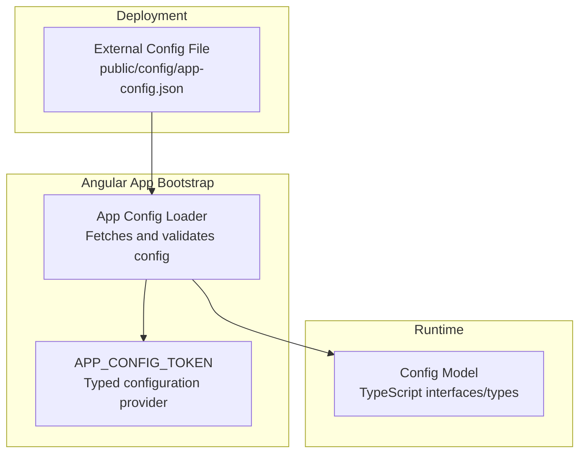
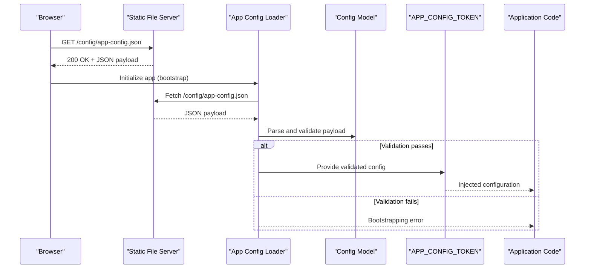
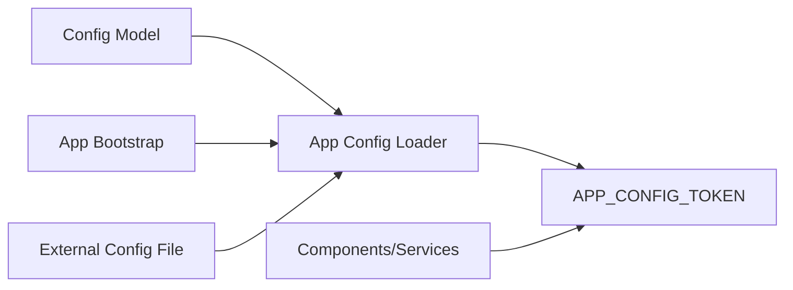

# Configuration Management

<cite>
**Referenced Files in This Document**
- [app-config.loader.ts](file://frontend/src/app/core/config/app-config.loader.ts)
- [app-config.model.ts](file://frontend/src/app/core/config/app-config.model.ts)
- [app-config.token.ts](file://frontend/src/app/core/config/app-config.token.ts)
- [app.config.ts](file://frontend/src/app/app.config.ts)
- [app-config.json](file://frontend/public/config/app-config.json)
</cite>

## Table of Contents
1. [Introduction](#introduction)
2. [Project Structure](#project-structure)
3. [Core Components](#core-components)
4. [Architecture Overview](#architecture-overview)
5. [Detailed Component Analysis](#detailed-component-analysis)
6. [Dependency Analysis](#dependency-analysis)
7. [Performance Considerations](#performance-considerations)
8. [Troubleshooting Guide](#troubleshooting-guide)
9. [Conclusion](#conclusion)
10. [Appendices](#appendices)

## Introduction
This document explains the frontend configuration management system used to load and consume runtime settings in the Angular application. It covers:
- The app config loader that fetches external configuration at startup
- The configuration model definitions and how they provide type safety
- The Angular token injection mechanism for accessing configuration across the app
- The external configuration file structure and deployment-time overrides
- Examples for adding new configuration options and handling validation

## Project Structure
The configuration subsystem is implemented under the core feature area and consists of:
- A typed configuration model
- An Angular app config loader (used by the application bootstrap)
- An Angular injection token for configuration access
- An external JSON configuration file served from the public directory

**Diagram sources**
- [app-config.loader.ts](file://frontend/src/app/core/config/app-config.loader.ts)
- [app-config.model.ts](file://frontend/src/app/core/config/app-config.model.ts)
- [app-config.token.ts](file://frontend/src/app/core/config/app-config.token.ts)
- [app.config.ts](file://frontend/src/app/app.config.ts)
- [app-config.json](file://frontend/public/config/app-config.json)

**Section sources**
- [app-config.loader.ts](file://frontend/src/app/core/config/app-config.loader.ts)
- [app-config.model.ts](file://frontend/src/app/core/config/app-config.model.ts)
- [app-config.token.ts](file://frontend/src/app/core/config/app-config.token.ts)
- [app.config.ts](file://frontend/src/app/app.config.ts)
- [app-config.json](file://frontend/public/config/app-config.json)

## Core Components
- Configuration model: Defines the shape of the configuration object with TypeScript types, ensuring compile-time safety and IDE support.
- App config loader: Loads the external configuration file during application bootstrap, parses it into the typed model, and performs validation before making it available.
- Configuration token: Provides a strongly-typed Angular injection token so components and services can request configuration via dependency injection.
- External configuration file: A JSON file served statically that contains environment-specific or deployment-specific values.

Key responsibilities:
- Type safety: All configuration fields are defined as TypeScript types/interfaces.
- Validation: The loader validates required fields and constraints before exposing the configuration.
- Injection: The token exposes the validated configuration to the rest of the application.

**Section sources**
- [app-config.model.ts](file://frontend/src/app/core/config/app-config.model.ts)
- [app-config.loader.ts](file://frontend/src/app/core/config/app-config.loader.ts)
- [app-config.token.ts](file://frontend/src/app/core/config/app-config.token.ts)
- [app.config.ts](file://frontend/src/app/app.config.ts)
- [app-config.json](file://frontend/public/config/app-config.json)

## Architecture Overview
The configuration lifecycle spans from static file serving through Angular’s bootstrap process to runtime consumption via DI.

**Diagram sources**
- [app-config.loader.ts](file://frontend/src/app/core/config/app-config.loader.ts)
- [app-config.model.ts](file://frontend/src/app/core/config/app-config.model.ts)
- [app-config.token.ts](file://frontend/src/app/core/config/app-config.token.ts)
- [app.config.ts](file://frontend/src/app/app.config.ts)
- [app-config.json](file://frontend/public/config/app-config.json)

## Detailed Component Analysis

### Configuration Model
- Purpose: Define the schema of the configuration object using TypeScript interfaces/types.
- Benefits: Compile-time checks, auto-completion, and clear documentation of expected fields.
- Typical contents: API endpoints, feature flags, UI behavior toggles, timeouts, and other runtime parameters.

Best practices:
- Keep the model minimal and focused on runtime needs.
- Use union types or enums where applicable to constrain values.
- Add comments to clarify allowed values and defaults.

**Section sources**
- [app-config.model.ts](file://frontend/src/app/core/config/app-config.model.ts)

### App Config Loader
- Purpose: Load the external configuration file during application initialization, parse it into the typed model, and validate its contents.
- Responsibilities:
  - Fetch the JSON file from the configured path.
  - Parse and map the response to the configuration model.
  - Validate presence and correctness of required fields.
  - Fail fast if invalid, preventing the app from running with bad configuration.
- Integration: Registered as an Angular app initializer so it runs before routes and features are activated.

Validation strategy:
- Check required keys exist.
- Enforce value constraints (e.g., non-empty strings, numeric ranges).
- Provide meaningful errors when validation fails.

**Section sources**
- [app-config.loader.ts](file://frontend/src/app/core/config/app-config.loader.ts)
- [app.config.ts](file://frontend/src/app/app.config.ts)

### Configuration Token
- Purpose: Expose the validated configuration object via Angular’s dependency injection.
- Usage: Components and services inject the token to read configuration without hardcoding values.
- Characteristics: Strongly typed to match the configuration model.

Injection example pattern:
- In a component/service constructor, inject the token and use the returned configuration object.

**Section sources**
- [app-config.token.ts](file://frontend/src/app/core/config/app-config.token.ts)

### External Configuration File
- Location: Served statically from the public directory.
- Format: JSON object matching the configuration model.
- Environment-specific overrides: Replace or mount a different file per environment during build or deployment.

Typical fields:
- API base URLs
- Feature flags
- UI preferences
- Timeouts and retry policies

**Section sources**
- [app-config.json](file://frontend/public/config/app-config.json)

### Application Bootstrap Integration
- The app config loader is registered as an Angular app initializer.
- During bootstrap, Angular executes the initializer to ensure configuration is loaded and validated before any route or feature code runs.

**Section sources**
- [app.config.ts](file://frontend/src/app/app.config.ts)

## Dependency Analysis
The following diagram shows how the configuration subsystem depends on and interacts with the Angular bootstrap and runtime.

**Diagram sources**
- [app-config.model.ts](file://frontend/src/app/core/config/app-config.model.ts)
- [app-config.loader.ts](file://frontend/src/app/core/config/app-config.loader.ts)
- [app-config.token.ts](file://frontend/src/app/core/config/app-config.token.ts)
- [app.config.ts](file://frontend/src/app/app.config.ts)
- [app-config.json](file://frontend/public/config/app-config.json)

**Section sources**
- [app-config.model.ts](file://frontend/src/app/core/config/app-config.model.ts)
- [app-config.loader.ts](file://frontend/src/app/core/config/app-config.loader.ts)
- [app-config.token.ts](file://frontend/src/app/core/config/app-config.token.ts)
- [app.config.ts](file://frontend/src/app/app.config.ts)
- [app-config.json](file://frontend/public/config/app-config.json)

## Performance Considerations
- Single network call: The loader makes one HTTP request for the configuration file; keep the file small and flat.
- Early validation: Fail fast during bootstrapping to avoid wasted work.
- Avoid heavy computation: Perform only necessary parsing and validation in the loader.
- Cache-friendly: Serve the configuration file with appropriate caching headers for production builds.

[No sources needed since this section provides general guidance]

## Troubleshooting Guide
Common issues and resolutions:
- Missing configuration file: Ensure the file exists at the expected path and is served by the static server.
- Invalid JSON: Validate the file syntax and ensure all required keys are present.
- Type mismatches: Align the JSON keys and values with the configuration model.
- CORS or path issues: Confirm the relative path resolves correctly in development and production environments.
- Bootstrapping failure: If validation fails, inspect the loader’s error output and correct the configuration.

Operational tips:
- Log the raw payload during development to aid debugging.
- Provide clear error messages indicating which field failed validation.
- Use separate configuration files per environment and verify them in CI.

**Section sources**
- [app-config.loader.ts](file://frontend/src/app/core/config/app-config.loader.ts)
- [app-config.model.ts](file://frontend/src/app/core/config/app-config.model.ts)

## Conclusion
The configuration management system provides a robust, type-safe approach to loading and consuming runtime settings in the Angular application. By centralizing the configuration model, enforcing validation at startup, and exposing configuration via a typed injection token, the system ensures consistency, reliability, and ease of maintenance across environments.

[No sources needed since this section summarizes without analyzing specific files]

## Appendices

### Adding a New Configuration Option
Steps:
1. Extend the configuration model with the new field and type.
2. Update the external configuration file to include the new key with a valid value.
3. If needed, update the loader’s validation logic to enforce constraints for the new field.
4. Consume the new option via the configuration token in components/services.

**Section sources**
- [app-config.model.ts](file://frontend/src/app/core/config/app-config.model.ts)
- [app-config.loader.ts](file://frontend/src/app/core/config/app-config.loader.ts)
- [app-config.token.ts](file://frontend/src/app/core/config/app-config.token.ts)
- [app-config.json](file://frontend/public/config/app-config.json)

### Handling Configuration Validation
Guidelines:
- Validate required fields and value constraints in the loader.
- Fail fast with descriptive errors if validation fails.
- Keep validation rules close to the model to maintain a single source of truth.

**Section sources**
- [app-config.loader.ts](file://frontend/src/app/core/config/app-config.loader.ts)
- [app-config.model.ts](file://frontend/src/app/core/config/app-config.model.ts)

### Deployment-Time Overrides
Approaches:
- Build-time replacement: Generate a different app-config.json per environment during the build pipeline.
- Runtime mounting: Mount an environment-specific file at the same path in the container or hosting environment.
- CDN/static server override: Serve a different file based on host or path prefix.

Ensure the deployed file matches the configuration model and passes validation.

**Section sources**
- [app-config.json](file://frontend/public/config/app-config.json)