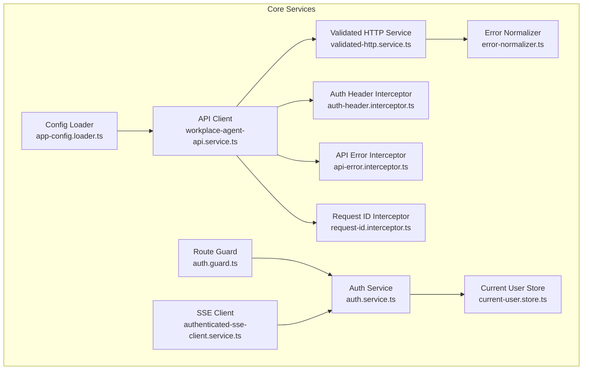
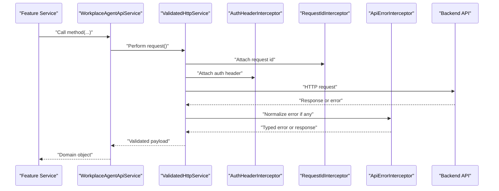
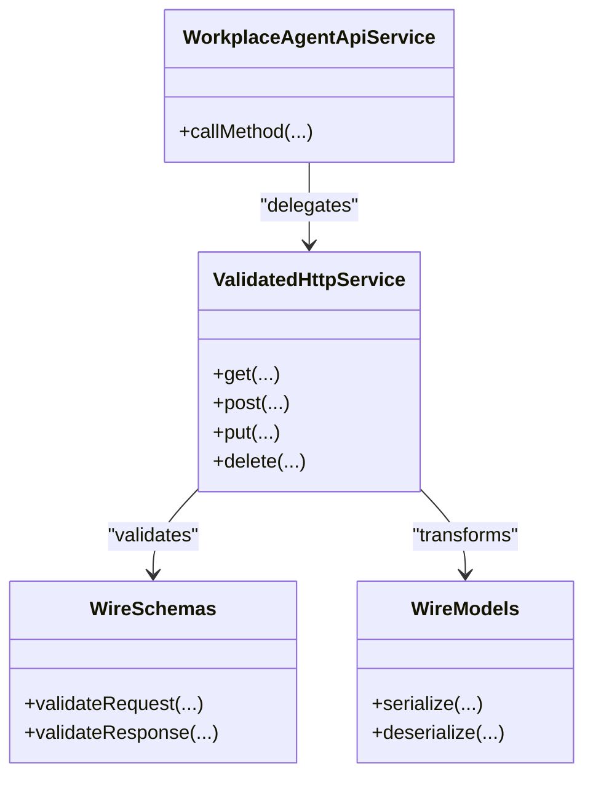
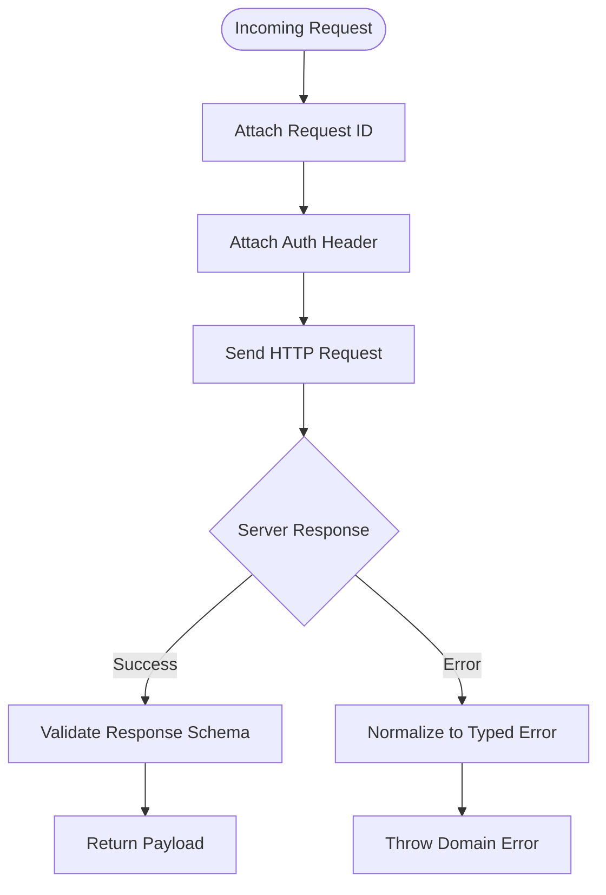
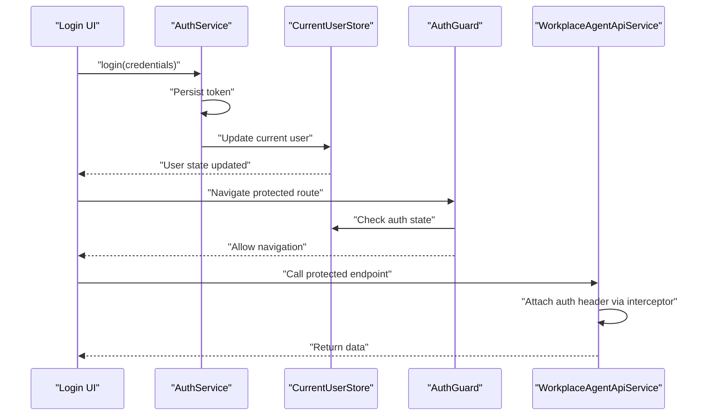
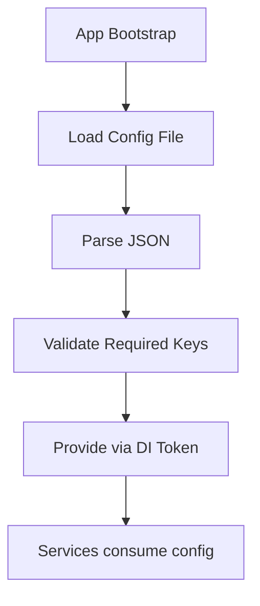
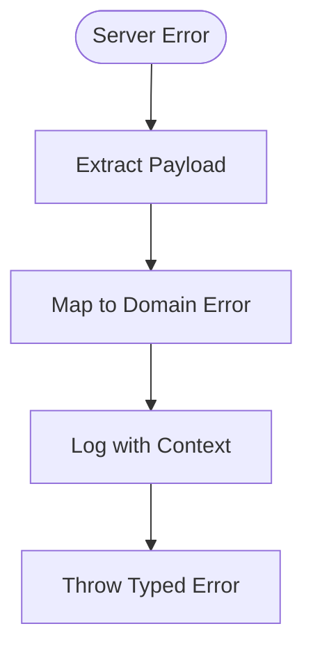
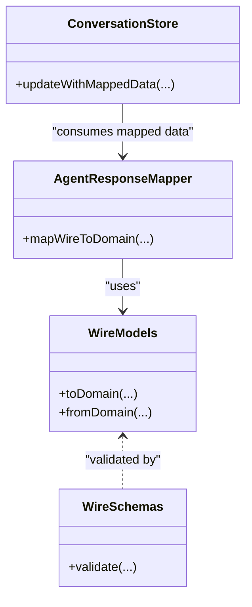
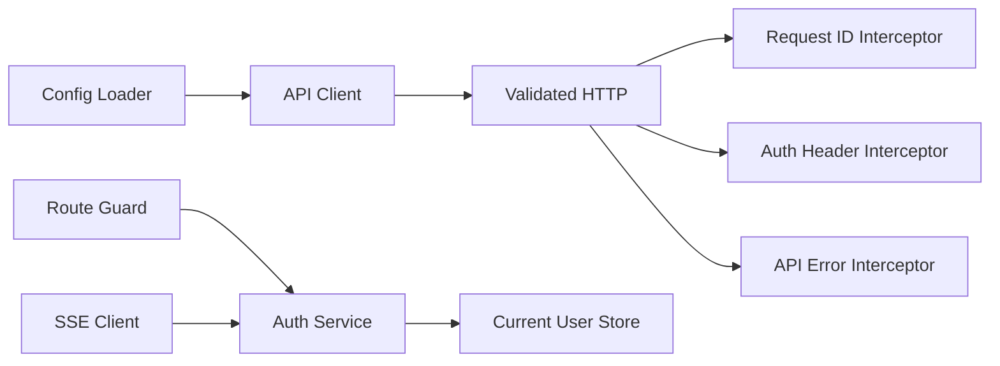

# Core Services

<cite>
**Referenced Files in This Document**
- [frontend/src/app/core/api/workplace-agent-api.service.ts](file://frontend/src/app/core/api/workplace-agent-api.service.ts)
- [frontend/src/app/core/api/validated-http.service.ts](file://frontend/src/app/core/api/validated-http.service.ts)
- [frontend/src/app/core/api/wire.schemas.ts](file://frontend/src/app/core/api/wire.schemas.ts)
- [frontend/src/app/core/api/wire.models.ts](file://frontend/src/app/core/api/wire.models.ts)
- [frontend/src/app/core/api/request-id.interceptor.ts](file://frontend/src/app/core/api/request-id.interceptor.ts)
- [frontend/src/app/core/api/api-error.interceptor.ts](file://frontend/src/app/core/api/api-error.interceptor.ts)
- [frontend/src/app/core/auth/auth-header.interceptor.ts](file://frontend/src/app/core/auth/auth-header.interceptor.ts)
- [frontend/src/app/core/auth/auth.service.ts](file://frontend/src/app/core/auth/auth.service.ts)
- [frontend/src/app/core/auth/current-user.store.ts](file://frontend/src/app/core/auth/current-user.store.ts)
- [frontend/src/app/core/config/app-config.loader.ts](file://frontend/src/app/core/config/app-config.loader.ts)
- [frontend/src/app/core/config/app-config.model.ts](file://frontend/src/app/core/config/app-config.model.ts)
- [frontend/src/app/core/config/app-config.token.ts](file://frontend/src/app/core/config/app-config.token.ts)
- [frontend/src/app/core/errors/error-normalizer.ts](file://frontend/src/app/core/errors/error-normalizer.ts)
- [frontend/src/app/core/errors/workplace-api.error.ts](file://frontend/src/app/core/errors/workplace-api.error.ts)
- [frontend/src/app/core/sse/authenticated-sse-client.service.ts](file://frontend/src/app/core/sse/authenticated-sse-client.service.ts)
- [frontend/src/app/core/routing/auth.guard.ts](file://frontend/src/app/core/routing/auth.guard.ts)
- [frontend/src/app/features/assistant-conversation/agent-response.mapper.ts](file://frontend/src/app/features/assistant-conversation/agent-response.mapper.ts)
- [frontend/src/app/features/assistant-conversation/agent-conversation.store.ts](file://frontend/src/app/features/assistant-conversation/agent-conversation.store.ts)
- [frontend/src/app/features/assistant-conversation/agent-activity.model.ts](file://frontend/src/app/features/assistant-conversation/agent-activity.model.ts)
</cite>

## Table of Contents
1. [Introduction](#introduction)
2. [Project Structure](#project-structure)
3. [Core Components](#core-components)
4. [Architecture Overview](#architecture-overview)
5. [Detailed Component Analysis](#detailed-component-analysis)
6. [Dependency Analysis](#dependency-analysis)
7. [Performance Considerations](#performance-considerations)
8. [Troubleshooting Guide](#troubleshooting-guide)
9. [Conclusion](#conclusion)
10. [Appendices](#appendices)

## Introduction
This document describes the core services layer responsible for HTTP communication, authentication, configuration loading, error handling, and request/response transformations. It focuses on:
- API client implementation with HTTP interceptors
- Authentication service and session management
- Configuration loader for runtime settings
- Error normalization and logging strategies
- Request/response transformation patterns
- Extensibility points for custom interceptors and API clients

The goal is to provide a clear mental model and practical guidance for extending and maintaining these services.

## Project Structure
The core services are implemented in the frontend Angular application under src/app/core. Key areas include:
- api: HTTP client, interceptors, schema validation, and wire models
- auth: Authentication service, header interceptor, and current user store
- config: Runtime configuration loader and tokens
- errors: Error normalization and typed API errors
- sse: Authenticated Server-Sent Events client
- routing: Route guards that enforce authentication

**Diagram sources**
- [frontend/src/app/core/api/workplace-agent-api.service.ts](file://frontend/src/app/core/api/workplace-agent-api.service.ts)
- [frontend/src/app/core/api/validated-http.service.ts](file://frontend/src/app/core/api/validated-http.service.ts)
- [frontend/src/app/core/api/api-error.interceptor.ts](file://frontend/src/app/core/api/api-error.interceptor.ts)
- [frontend/src/app/core/api/request-id.interceptor.ts](file://frontend/src/app/core/api/request-id.interceptor.ts)
- [frontend/src/app/core/auth/auth-header.interceptor.ts](file://frontend/src/app/core/auth/auth-header.interceptor.ts)
- [frontend/src/app/core/auth/auth.service.ts](file://frontend/src/app/core/auth/auth.service.ts)
- [frontend/src/app/core/auth/current-user.store.ts](file://frontend/src/app/core/auth/current-user.store.ts)
- [frontend/src/app/core/config/app-config.loader.ts](file://frontend/src/app/core/config/app-config.loader.ts)
- [frontend/src/app/core/errors/error-normalizer.ts](file://frontend/src/app/core/errors/error-normalizer.ts)
- [frontend/src/app/core/sse/authenticated-sse-client.service.ts](file://frontend/src/app/core/sse/authenticated-sse-client.service.ts)
- [frontend/src/app/core/routing/auth.guard.ts](file://frontend/src/app/core/routing/auth.guard.ts)

**Section sources**
- [frontend/src/app/core/api/workplace-agent-api.service.ts](file://frontend/src/app/core/api/workplace-agent-api.service.ts)
- [frontend/src/app/core/api/validated-http.service.ts](file://frontend/src/app/core/api/validated-http.service.ts)
- [frontend/src/app/core/api/api-error.interceptor.ts](file://frontend/src/app/core/api/api-error.interceptor.ts)
- [frontend/src/app/core/api/request-id.interceptor.ts](file://frontend/src/app/core/api/request-id.interceptor.ts)
- [frontend/src/app/core/auth/auth-header.interceptor.ts](file://frontend/src/app/core/auth/auth-header.interceptor.ts)
- [frontend/src/app/core/auth/auth.service.ts](file://frontend/src/app/core/auth/auth.service.ts)
- [frontend/src/app/core/auth/current-user.store.ts](file://frontend/src/app/core/auth/current-user.store.ts)
- [frontend/src/app/core/config/app-config.loader.ts](file://frontend/src/app/core/config/app-config.loader.ts)
- [frontend/src/app/core/errors/error-normalizer.ts](file://frontend/src/app/core/errors/error-normalizer.ts)
- [frontend/src/app/core/sse/authenticated-sse-client.service.ts](file://frontend/src/app/core/sse/authenticated-sse-client.service.ts)
- [frontend/src/app/core/routing/auth.guard.ts](file://frontend/src/app/core/routing/auth.guard.ts)

## Core Components
- API Client (Workplace Agent API): High-level methods for backend calls, delegating to a validated HTTP service and leveraging interceptors for headers, IDs, and error handling.
- Validated HTTP Service: Centralizes HTTP calls, applies schema validation, and normalizes responses into domain-friendly structures.
- Interceptors:
  - Auth Header Interceptor: Attaches bearer tokens from the current user store.
  - Request ID Interceptor: Adds unique identifiers per request for tracing.
  - API Error Interceptor: Normalizes server errors into typed exceptions and logs them.
- Authentication Service: Manages login/logout flows, token storage, and exposes current user state.
- Current User Store: Holds authenticated user context and token lifecycle.
- Configuration Loader: Loads runtime app configuration at startup and provides it via dependency injection.
- Error Normalizer: Converts heterogeneous server error payloads into consistent domain errors.
- SSE Client: Establishes authenticated streaming connections using the same auth mechanisms.
- Route Guard: Protects routes by checking authentication state.

**Section sources**
- [frontend/src/app/core/api/workplace-agent-api.service.ts](file://frontend/src/app/core/api/workplace-agent-api.service.ts)
- [frontend/src/app/core/api/validated-http.service.ts](file://frontend/src/app/core/api/validated-http.service.ts)
- [frontend/src/app/core/api/api-error.interceptor.ts](file://frontend/src/app/core/api/api-error.interceptor.ts)
- [frontend/src/app/core/api/request-id.interceptor.ts](file://frontend/src/app/core/api/request-id.interceptor.ts)
- [frontend/src/app/core/auth/auth-header.interceptor.ts](file://frontend/src/app/core/auth/auth-header.interceptor.ts)
- [frontend/src/app/core/auth/auth.service.ts](file://frontend/src/app/core/auth/auth.service.ts)
- [frontend/src/app/core/auth/current-user.store.ts](file://frontend/src/app/core/auth/current-user.store.ts)
- [frontend/src/app/core/config/app-config.loader.ts](file://frontend/src/app/core/config/app-config.loader.ts)
- [frontend/src/app/core/errors/error-normalizer.ts](file://frontend/src/app/core/errors/error-normalizer.ts)
- [frontend/src/app/core/sse/authenticated-sse-client.service.ts](file://frontend/src/app/core/sse/authenticated-sse-client.service.ts)
- [frontend/src/app/core/routing/auth.guard.ts](file://frontend/src/app/core/routing/auth.guard.ts)

## Architecture Overview
The core services form a layered architecture:
- Presentation features call high-level API services.
- API services use a validated HTTP client for transport and validation.
- Interceptors augment requests/responses globally (headers, IDs, errors).
- Authentication service and user store manage identity and tokens.
- Configuration loader injects runtime settings consumed by services.
- SSE client reuses authentication for long-lived streams.
- Route guard enforces access control based on auth state.

**Diagram sources**
- [frontend/src/app/core/api/workplace-agent-api.service.ts](file://frontend/src/app/core/api/workplace-agent-api.service.ts)
- [frontend/src/app/core/api/validated-http.service.ts](file://frontend/src/app/core/api/validated-http.service.ts)
- [frontend/src/app/core/api/request-id.interceptor.ts](file://frontend/src/app/core/api/request-id.interceptor.ts)
- [frontend/src/app/core/auth/auth-header.interceptor.ts](file://frontend/src/app/core/auth/auth-header.interceptor.ts)
- [frontend/src/app/core/api/api-error.interceptor.ts](file://frontend/src/app/core/api/api-error.interceptor.ts)

## Detailed Component Analysis

### API Client Implementation
Responsibilities:
- Expose typed methods for backend endpoints.
- Delegate to validated HTTP service for transport and validation.
- Compose interceptors for cross-cutting concerns.

Key behaviors:
- Uses request/response schemas to validate payloads.
- Maps backend wire models to domain-friendly types.
- Provides a stable surface for feature services.

Extensibility:
- Add new endpoint methods by following existing patterns.
- Use validated HTTP service to ensure type safety and schema checks.

**Section sources**
- [frontend/src/app/core/api/workplace-agent-api.service.ts](file://frontend/src/app/core/api/workplace-agent-api.service.ts)
- [frontend/src/app/core/api/validated-http.service.ts](file://frontend/src/app/core/api/validated-http.service.ts)
- [frontend/src/app/core/api/wire.schemas.ts](file://frontend/src/app/core/api/wire.schemas.ts)
- [frontend/src/app/core/api/wire.models.ts](file://frontend/src/app/core/api/wire.models.ts)

#### Class Diagram: API Client and Validation

**Diagram sources**
- [frontend/src/app/core/api/workplace-agent-api.service.ts](file://frontend/src/app/core/api/workplace-agent-api.service.ts)
- [frontend/src/app/core/api/validated-http.service.ts](file://frontend/src/app/core/api/validated-http.service.ts)
- [frontend/src/app/core/api/wire.schemas.ts](file://frontend/src/app/core/api/wire.schemas.ts)
- [frontend/src/app/core/api/wire.models.ts](file://frontend/src/app/core/api/wire.models.ts)

### HTTP Interceptors
Interceptors implement cross-cutting behavior around HTTP requests and responses:
- Auth Header Interceptor: Reads token from current user store and attaches Authorization header.
- Request ID Interceptor: Generates and attaches a unique identifier per request for observability.
- API Error Interceptor: Normalizes server errors into typed exceptions and centralizes logging.

**Diagram sources**
- [frontend/src/app/core/api/request-id.interceptor.ts](file://frontend/src/app/core/api/request-id.interceptor.ts)
- [frontend/src/app/core/auth/auth-header.interceptor.ts](file://frontend/src/app/core/auth/auth-header.interceptor.ts)
- [frontend/src/app/core/api/api-error.interceptor.ts](file://frontend/src/app/core/api/api-error.interceptor.ts)

**Section sources**
- [frontend/src/app/core/auth/auth-header.interceptor.ts](file://frontend/src/app/core/auth/auth-header.interceptor.ts)
- [frontend/src/app/core/api/request-id.interceptor.ts](file://frontend/src/app/core/api/request-id.interceptor.ts)
- [frontend/src/app/core/api/api-error.interceptor.ts](file://frontend/src/app/core/api/api-error.interceptor.ts)

### Authentication Service and Session Management
Responsibilities:
- Login/logout flows
- Token storage and retrieval
- Current user state exposure
- Integration with route guards and SSE client

Session flow:
- On login, obtain token and persist it.
- Update current user store with user context.
- Subsequent requests automatically attach headers via interceptor.
- On logout, clear token and user state; redirect accordingly.

**Diagram sources**
- [frontend/src/app/core/auth/auth.service.ts](file://frontend/src/app/core/auth/auth.service.ts)
- [frontend/src/app/core/auth/current-user.store.ts](file://frontend/src/app/core/auth/current-user.store.ts)
- [frontend/src/app/core/routing/auth.guard.ts](file://frontend/src/app/core/routing/auth.guard.ts)
- [frontend/src/app/core/auth/auth-header.interceptor.ts](file://frontend/src/app/core/auth/auth-header.interceptor.ts)
- [frontend/src/app/core/api/workplace-agent-api.service.ts](file://frontend/src/app/core/api/workplace-agent-api.service.ts)

**Section sources**
- [frontend/src/app/core/auth/auth.service.ts](file://frontend/src/app/core/auth/auth.service.ts)
- [frontend/src/app/core/auth/current-user.store.ts](file://frontend/src/app/core/auth/current-user.store.ts)
- [frontend/src/app/core/routing/auth.guard.ts](file://frontend/src/app/core/routing/auth.guard.ts)
- [frontend/src/app/core/auth/auth-header.interceptor.ts](file://frontend/src/app/core/auth/auth-header.interceptor.ts)

### Configuration Loader
Responsibilities:
- Load runtime app configuration at startup
- Provide configuration via DI token
- Support environment-specific overrides

Behavior:
- Fetches configuration file during app bootstrap.
- Validates required keys and defaults.
- Exposes configuration to services and components.

**Diagram sources**
- [frontend/src/app/core/config/app-config.loader.ts](file://frontend/src/app/core/config/app-config.loader.ts)
- [frontend/src/app/core/config/app-config.model.ts](file://frontend/src/app/core/config/app-config.model.ts)
- [frontend/src/app/core/config/app-config.token.ts](file://frontend/src/app/core/config/app-config.token.ts)

**Section sources**
- [frontend/src/app/core/config/app-config.loader.ts](file://frontend/src/app/core/config/app-config.loader.ts)
- [frontend/src/app/core/config/app-config.model.ts](file://frontend/src/app/core/config/app-config.model.ts)
- [frontend/src/app/core/config/app-config.token.ts](file://frontend/src/app/core/config/app-config.token.ts)

### Error Handling Strategies and Logging
Strategies:
- Centralized normalization converts varied server error formats into consistent domain errors.
- Typed API error classes enable precise catch blocks and user messaging.
- Interceptor-based logging captures request context (IDs, endpoints) and normalized errors.

Patterns:
- Normalize early in the HTTP pipeline to avoid scattered error handling.
- Preserve correlation IDs for debugging across layers.
- Surface actionable messages to users while retaining technical details for logs.

**Diagram sources**
- [frontend/src/app/core/errors/error-normalizer.ts](file://frontend/src/app/core/errors/error-normalizer.ts)
- [frontend/src/app/core/errors/workplace-api.error.ts](file://frontend/src/app/core/errors/workplace-api.error.ts)
- [frontend/src/app/core/api/api-error.interceptor.ts](file://frontend/src/app/core/api/api-error.interceptor.ts)

**Section sources**
- [frontend/src/app/core/errors/error-normalizer.ts](file://frontend/src/app/core/errors/error-normalizer.ts)
- [frontend/src/app/core/errors/workplace-api.error.ts](file://frontend/src/app/core/errors/workplace-api.error.ts)
- [frontend/src/app/core/api/api-error.interceptor.ts](file://frontend/src/app/core/api/api-error.interceptor.ts)

### Request/Response Transformation Patterns
Patterns:
- Wire models define serialization/deserialization rules between backend payloads and internal types.
- Schemas enforce structure and constraints before processing.
- Mappers transform wire shapes into domain objects consumed by features.

**Diagram sources**
- [frontend/src/app/core/api/wire.models.ts](file://frontend/src/app/core/api/wire.models.ts)
- [frontend/src/app/core/api/wire.schemas.ts](file://frontend/src/app/core/api/wire.schemas.ts)
- [frontend/src/app/features/assistant-conversation/agent-response.mapper.ts](file://frontend/src/app/features/assistant-conversation/agent-response.mapper.ts)
- [frontend/src/app/features/assistant-conversation/agent-conversation.store.ts](file://frontend/src/app/features/assistant-conversation/agent-conversation.store.ts)
- [frontend/src/app/features/assistant-conversation/agent-activity.model.ts](file://frontend/src/app/features/assistant-conversation/agent-activity.model.ts)

**Section sources**
- [frontend/src/app/core/api/wire.models.ts](file://frontend/src/app/core/api/wire.models.ts)
- [frontend/src/app/core/api/wire.schemas.ts](file://frontend/src/app/core/api/wire.schemas.ts)
- [frontend/src/app/features/assistant-conversation/agent-response.mapper.ts](file://frontend/src/app/features/assistant-conversation/agent-response.mapper.ts)
- [frontend/src/app/features/assistant-conversation/agent-conversation.store.ts](file://frontend/src/app/features/assistant-conversation/agent-conversation.store.ts)
- [frontend/src/app/features/assistant-conversation/agent-activity.model.ts](file://frontend/src/app/features/assistant-conversation/agent-activity.model.ts)

### Extending the API Client and Implementing Custom Interceptors
Guidance:
- To add a new API method:
  - Define request/response types and schemas.
  - Implement a method in the API service that delegates to the validated HTTP service.
  - Ensure mappers convert wire models to domain objects.
- To implement a custom interceptor:
  - Create an interceptor that reads/writes request/response context.
  - Register it in the HTTP provider configuration alongside existing interceptors.
  - Keep interceptors focused and small; prefer composition over monolithic logic.

Examples:
- Adding a retry interceptor for transient failures.
- Adding a telemetry interceptor to capture metrics.
- Adding a locale/timezone interceptor to set headers.

[No sources needed since this section provides general guidance]

## Dependency Analysis
The core services have clear boundaries and minimal coupling:
- API client depends on validated HTTP service and interceptors.
- Auth service depends on current user store and is consumed by guards and SSE client.
- Configuration loader is bootstrapped early and provided via DI.
- Error normalizer is used by the HTTP layer and typed error classes encapsulate error semantics.

**Diagram sources**
- [frontend/src/app/core/config/app-config.loader.ts](file://frontend/src/app/core/config/app-config.loader.ts)
- [frontend/src/app/core/api/workplace-agent-api.service.ts](file://frontend/src/app/core/api/workplace-agent-api.service.ts)
- [frontend/src/app/core/api/validated-http.service.ts](file://frontend/src/app/core/api/validated-http.service.ts)
- [frontend/src/app/core/api/request-id.interceptor.ts](file://frontend/src/app/core/api/request-id.interceptor.ts)
- [frontend/src/app/core/auth/auth-header.interceptor.ts](file://frontend/src/app/core/auth/auth-header.interceptor.ts)
- [frontend/src/app/core/api/api-error.interceptor.ts](file://frontend/src/app/core/api/api-error.interceptor.ts)
- [frontend/src/app/core/auth/auth.service.ts](file://frontend/src/app/core/auth/auth.service.ts)
- [frontend/src/app/core/auth/current-user.store.ts](file://frontend/src/app/core/auth/current-user.store.ts)
- [frontend/src/app/core/routing/auth.guard.ts](file://frontend/src/app/core/routing/auth.guard.ts)
- [frontend/src/app/core/sse/authenticated-sse-client.service.ts](file://frontend/src/app/core/sse/authenticated-sse-client.service.ts)

**Section sources**
- [frontend/src/app/core/config/app-config.loader.ts](file://frontend/src/app/core/config/app-config.loader.ts)
- [frontend/src/app/core/api/workplace-agent-api.service.ts](file://frontend/src/app/core/api/workplace-agent-api.service.ts)
- [frontend/src/app/core/api/validated-http.service.ts](file://frontend/src/app/core/api/validated-http.service.ts)
- [frontend/src/app/core/api/request-id.interceptor.ts](file://frontend/src/app/core/api/request-id.interceptor.ts)
- [frontend/src/app/core/auth/auth-header.interceptor.ts](file://frontend/src/app/core/auth/auth-header.interceptor.ts)
- [frontend/src/app/core/api/api-error.interceptor.ts](file://frontend/src/app/core/api/api-error.interceptor.ts)
- [frontend/src/app/core/auth/auth.service.ts](file://frontend/src/app/core/auth/auth.service.ts)
- [frontend/src/app/core/auth/current-user.store.ts](file://frontend/src/app/core/auth/current-user.store.ts)
- [frontend/src/app/core/routing/auth.guard.ts](file://frontend/src/app/core/routing/auth.guard.ts)
- [frontend/src/app/core/sse/authenticated-sse-client.service.ts](file://frontend/src/app/core/sse/authenticated-sse-client.service.ts)

## Performance Considerations
- Prefer schema validation close to the boundary to fail fast and reduce downstream work.
- Avoid heavy computations inside interceptors; keep them lightweight.
- Reuse validated HTTP service to prevent duplicated logic and caching opportunities.
- For SSE, reuse authenticated connections and handle reconnection efficiently.
- Batch updates in stores to minimize change detection overhead.

[No sources needed since this section provides general guidance]

## Troubleshooting Guide
Common issues and resolutions:
- Missing Authorization header:
  - Verify current user store has a valid token and auth header interceptor is registered.
- 401 Unauthorized:
  - Check token expiration handling in auth service and consider refresh flows.
- Schema validation errors:
  - Inspect wire schemas and request/response models for mismatches.
- Correlation not found:
  - Ensure request ID interceptor is active and logs include the ID.
- SSE disconnections:
  - Confirm authentication is applied to SSE client and reconnection logic is robust.

**Section sources**
- [frontend/src/app/core/auth/auth-header.interceptor.ts](file://frontend/src/app/core/auth/auth-header.interceptor.ts)
- [frontend/src/app/core/auth/auth.service.ts](file://frontend/src/app/core/auth/auth.service.ts)
- [frontend/src/app/core/api/wire.schemas.ts](file://frontend/src/app/core/api/wire.schemas.ts)
- [frontend/src/app/core/api/request-id.interceptor.ts](file://frontend/src/app/core/api/request-id.interceptor.ts)
- [frontend/src/app/core/sse/authenticated-sse-client.service.ts](file://frontend/src/app/core/sse/authenticated-sse-client.service.ts)

## Conclusion
The core services layer provides a cohesive foundation for secure, observable, and maintainable HTTP interactions. By centralizing authentication, configuration, validation, and error handling, it enables feature teams to focus on business logic while ensuring consistency and reliability across the application.

[No sources needed since this section summarizes without analyzing specific files]

## Appendices
- Example extension points:
  - Custom interceptor for telemetry or retries
  - Additional wire schemas for new endpoints
  - New API client methods following validated HTTP patterns
- Best practices:
  - Keep interceptors small and composable
  - Validate early and normalize consistently
  - Use typed errors for precise handling
  - Leverage DI for configuration and shared state

[No sources needed since this section provides general guidance]