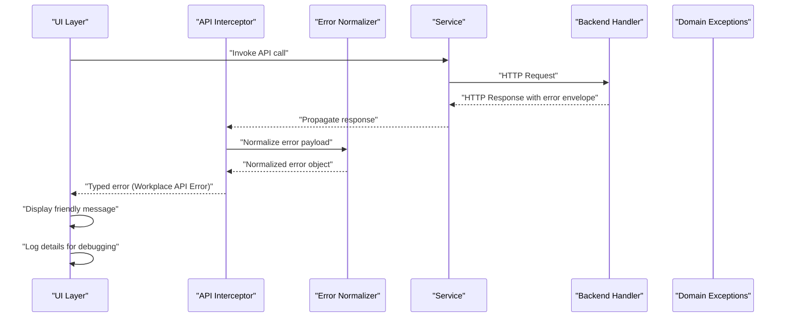
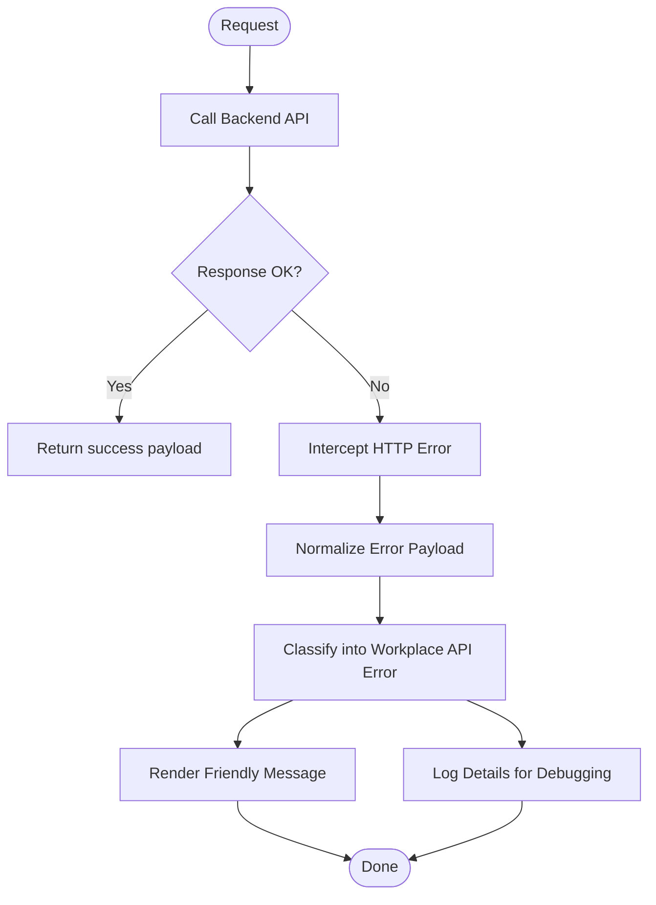
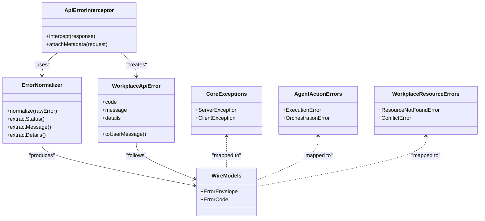

# Error Handling & Normalization

<cite>
**Referenced Files in This Document**
- [error-normalizer.ts](file://frontend/src/app/core/errors/error-normalizer.ts)
- [workplace-api.error.ts](file://frontend/src/app/core/errors/workplace-api.error.ts)
- [api-error.interceptor.ts](file://frontend/src/app/core/api/api-error.interceptor.ts)
- [wire.models.ts](file://frontend/src/app/core/api/wire.models.ts)
- [ERROR_CONTRACT.md](file://frontend/docs/ERROR_CONTRACT.md)
- [errors.py](file://app/core/errors.py)
- [action_errors.py](file://app/agent/action_errors.py)
- [workplace_resources/errors.py](file://app/workplace_resources/errors.py)
</cite>

## Table of Contents
1. [Introduction](#introduction)
2. [Project Structure](#project-structure)
3. [Core Components](#core-components)
4. [Architecture Overview](#architecture-overview)
5. [Detailed Component Analysis](#detailed-component-analysis)
6. [Dependency Analysis](#dependency-analysis)
7. [Performance Considerations](#performance-considerations)
8. [Troubleshooting Guide](#troubleshooting-guide)
9. [Conclusion](#conclusion)
10. [Appendices](#appendices)

## Introduction
This document explains the error handling system across the frontend and backend, focusing on consistent error formatting via an error normalizer, workplace API error types and custom classes, wire models for standardized communication between frontend and backend, and practical guidance for implementing custom error handlers, user-friendly messages, and logging for debugging.

The goal is to ensure that all API responses carry a predictable error shape so that UI components can display clear messages and developers can log actionable details without coupling to implementation-specific formats.

## Project Structure
Error handling spans both frontend and backend:

- Frontend
  - Core error utilities and interceptors normalize HTTP errors into a unified model.
  - Workplace-specific error classes encapsulate domain semantics.
  - Wire models define the canonical JSON structure used by APIs.
  - Documentation specifies the contract expected by clients.

- Backend
  - Domain-level exceptions represent business rule violations.
  - Resource-layer exceptions capture operational failures.
  - A central exception handler converts these into the wire format.

```mermaid
graph TB
subgraph "Frontend"
FE_API["API Interceptor<br/>api-error.interceptor.ts"]
FE_NORM["Error Normalizer<br/>error-normalizer.ts"]
FE_WIRE["Wire Models<br/>wire.models.ts"]
FE_WORKPLACE["Workplace API Errors<br/>workplace-api.error.ts"]
end
subgraph "Backend"
BE_CORE["Core Exceptions<br/>app/core/errors.py"]
BE_AGENT["Agent Action Errors<br/>app/agent/action_errors.py"]
BE_WORKPLACE["Workplace Errors<br/>app/workplace_resources/errors.py"]
end
FE_API --> FE_NORM
FE_NORM --> FE_WIRE
FE_API --> FE_WORKPLACE
FE_WIRE <- --> BE_CORE
FE_WIRE <- --> BE_AGENT
FE_WIRE <- --> BE_WORKPLACE
```

**Diagram sources**
- [api-error.interceptor.ts](file://frontend/src/app/core/api/api-error.interceptor.ts)
- [error-normalizer.ts](file://frontend/src/app/core/errors/error-normalizer.ts)
- [wire.models.ts](file://frontend/src/app/core/api/wire.models.ts)
- [workplace-api.error.ts](file://frontend/src/app/core/errors/workplace-api.error.ts)
- [errors.py](file://app/core/errors.py)
- [action_errors.py](file://app/agent/action_errors.py)
- [workplace_resources/errors.py](file://app/workplace_resources/errors.py)

**Section sources**
- [ERROR_CONTRACT.md](file://frontend/docs/ERROR_CONTRACT.md)
- [api-error.interceptor.ts](file://frontend/src/app/core/api/api-error.interceptor.ts)
- [error-normalizer.ts](file://frontend/src/app/core/errors/error-normalizer.ts)
- [wire.models.ts](file://frontend/src/app/core/api/wire.models.ts)
- [workplace-api.error.ts](file://frontend/src/app/core/errors/workplace-api.error.ts)
- [errors.py](file://app/core/errors.py)
- [action_errors.py](file://app/agent/action_errors.py)
- [workplace_resources/errors.py](file://app/workplace_resources/errors.py)

## Core Components
- Error Normalizer (frontend): Transforms heterogeneous HTTP error payloads into a stable, typed object consumed by services and UI. It extracts status codes, message strings, optional code identifiers, and structured detail fields when present.
- Workplace API Error Classes (frontend): Typed error subclasses that encode domain context (e.g., resource not found, validation failure, permission denied) and provide helpers for user-facing messaging.
- API Error Interceptor (frontend): Centralizes HTTP error interception, delegates normalization, and optionally attaches request metadata for tracing.
- Wire Models (frontend): Define the canonical error envelope shape used across the application and documented as the API contract.
- Backend Exception Types:
  - Core exceptions for general server-side issues.
  - Agent action errors for orchestration and execution failures.
  - Workplace resource errors for domain operations.
  - These are mapped to the wire envelope by the backend’s exception handler.

Key responsibilities:
- Consistency: All errors follow the same envelope shape.
- Traceability: Include correlation IDs or request identifiers where available.
- User-friendliness: Provide human-readable messages while preserving machine-readable codes.
- Observability: Log sufficient context for debugging without exposing sensitive data.

**Section sources**
- [error-normalizer.ts](file://frontend/src/app/core/errors/error-normalizer.ts)
- [workplace-api.error.ts](file://frontend/src/app/core/errors/workplace-api.error.ts)
- [api-error.interceptor.ts](file://frontend/src/app/core/api/api-error.interceptor.ts)
- [wire.models.ts](file://frontend/src/app/core/api/wire.models.ts)
- [errors.py](file://app/core/errors.py)
- [action_errors.py](file://app/agent/action_errors.py)
- [workplace_resources/errors.py](file://app/workplace_resources/errors.py)

## Architecture Overview
The error flow from client to server and back:



**Diagram sources**
- [api-error.interceptor.ts](file://frontend/src/app/core/api/api-error.interceptor.ts)
- [error-normalizer.ts](file://frontend/src/app/core/errors/error-normalizer.ts)
- [workplace-api.error.ts](file://frontend/src/app/core/errors/workplace-api.error.ts)
- [wire.models.ts](file://frontend/src/app/core/api/wire.models.ts)
- [errors.py](file://app/core/errors.py)
- [action_errors.py](file://app/agent/action_errors.py)
- [workplace_resources/errors.py](file://app/workplace_resources/errors.py)

## Detailed Component Analysis

### Error Normalizer (Frontend)
Purpose:
- Accepts raw HTTP error responses and produces a normalized error object with consistent fields.
- Extracts status, message, optional code, and nested details.
- Provides guards for unknown shapes to avoid runtime crashes.

Behavior highlights:
- Maps HTTP status to a semantic category (client/server/network).
- Preserves original payload under a safe field for diagnostics.
- Ensures required fields exist even if the server omits them.

Usage pattern:
- Called by the API interceptor before returning to services.
- Services receive a uniform error type suitable for logging and UI mapping.

**Section sources**
- [error-normalizer.ts](file://frontend/src/app/core/errors/error-normalizer.ts)

### Workplace API Error Classes (Frontend)
Purpose:
- Encapsulate domain-specific error contexts such as validation failures, authorization issues, and resource state problems.
- Provide helper methods to derive user-facing messages and machine-readable codes.

Common categories:
- Validation errors: missing or invalid input fields.
- Authorization errors: insufficient permissions or expired sessions.
- Resource errors: not found, conflict, or stale state.
- Network errors: timeouts, offline, or transport failures.

Integration:
- The normalizer constructs instances of these classes based on normalized fields.
- UI layers switch on error class/type to render appropriate feedback.

**Section sources**
- [workplace-api.error.ts](file://frontend/src/app/core/errors/workplace-api.error.ts)

### API Error Interceptor (Frontend)
Purpose:
- Catches HTTP errors globally.
- Delegates to the normalizer and rethrows typed errors.
- Optionally attaches request metadata (e.g., request ID) for tracing.

Flow:
- On error, read response body safely.
- Normalize using the error normalizer.
- Wrap into a workplace API error instance.
- Return to caller with enriched context.

**Section sources**
- [api-error.interceptor.ts](file://frontend/src/app/core/api/api-error.interceptor.ts)

### Wire Models (Frontend)
Purpose:
- Define the canonical error envelope shape used across the application and documented as the API contract.
- Ensure strict typing and schema validation at build time.

Envelope fields typically include:
- Status code
- Message string
- Optional code identifier
- Optional details map for structured information

Contract documentation:
- The frontend docs specify the expected error envelope and examples.

**Section sources**
- [wire.models.ts](file://frontend/src/app/core/api/wire.models.ts)
- [ERROR_CONTRACT.md](file://frontend/docs/ERROR_CONTRACT.md)

### Backend Error Types and Mapping
Core exceptions:
- Represent general server-side issues and unexpected conditions.

Agent action errors:
- Capture orchestration and execution failures during agent actions.

Workplace resource errors:
- Model domain operation failures for workplace resources.

Mapping strategy:
- Backend catches domain exceptions and translates them into the wire envelope.
- Includes status, message, optional code, and details.
- Avoids leaking internal stack traces; logs full details server-side.

**Section sources**
- [errors.py](file://app/core/errors.py)
- [action_errors.py](file://app/agent/action_errors.py)
- [workplace_resources/errors.py](file://app/workplace_resources/errors.py)

### Conceptual Overview
A conceptual view of how errors propagate and are handled:



[No sources needed since this diagram shows conceptual workflow, not actual code structure]

## Dependency Analysis
Relationships among key components:



**Diagram sources**
- [api-error.interceptor.ts](file://frontend/src/app/core/api/api-error.interceptor.ts)
- [error-normalizer.ts](file://frontend/src/app/core/errors/error-normalizer.ts)
- [workplace-api.error.ts](file://frontend/src/app/core/errors/workplace-api.error.ts)
- [wire.models.ts](file://frontend/src/app/core/api/wire.models.ts)
- [errors.py](file://app/core/errors.py)
- [action_errors.py](file://app/agent/action_errors.py)
- [workplace_resources/errors.py](file://app/workplace_resources/errors.py)

**Section sources**
- [api-error.interceptor.ts](file://frontend/src/app/core/api/api-error.interceptor.ts)
- [error-normalizer.ts](file://frontend/src/app/core/errors/error-normalizer.ts)
- [workplace-api.error.ts](file://frontend/src/app/core/errors/workplace-api.error.ts)
- [wire.models.ts](file://frontend/src/app/core/api/wire.models.ts)
- [errors.py](file://app/core/errors.py)
- [action_errors.py](file://app/agent/action_errors.py)
- [workplace_resources/errors.py](file://app/workplace_resources/errors.py)

## Performance Considerations
- Keep normalization lightweight: avoid heavy parsing or transformations inside hot paths.
- Cache static mappings (e.g., status-to-category) if applicable.
- Limit logged payload size; omit large bodies and sensitive fields.
- Use structured logging with correlation IDs to minimize overhead while enabling traceability.

[No sources needed since this section provides general guidance]

## Troubleshooting Guide
Common scenarios and resolutions:
- Missing fields in error envelope:
  - Ensure the backend maps all exceptions to the wire envelope.
  - Add defensive defaults in the normalizer for missing fields.
- Inconsistent messages across endpoints:
  - Standardize message generation in domain exceptions.
  - Validate against the documented error contract.
- Excessive logging volume:
  - Filter out noisy requests and limit detail depth.
  - Use sampling for high-frequency errors.
- User confusion due to technical messages:
  - Map error codes to friendly messages in the UI layer.
  - Provide actionable next steps where possible.

**Section sources**
- [ERROR_CONTRACT.md](file://frontend/docs/ERROR_CONTRACT.md)
- [error-normalizer.ts](file://frontend/src/app/core/errors/error-normalizer.ts)
- [api-error.interceptor.ts](file://frontend/src/app/core/api/api-error.interceptor.ts)
- [workplace-api.error.ts](file://frontend/src/app/core/errors/workplace-api.error.ts)
- [errors.py](file://app/core/errors.py)
- [action_errors.py](file://app/agent/action_errors.py)
- [workplace_resources/errors.py](file://app/workplace_resources/errors.py)

## Conclusion
By centralizing error normalization, defining clear wire models, and using typed workplace API errors, the system achieves consistent, user-friendly, and debuggable error handling across the frontend and backend. Following the patterns outlined here will help maintain reliability and clarity as the application evolves.

[No sources needed since this section summarizes without analyzing specific files]

## Appendices

### Implementing Custom Error Handlers (Frontend)
- Create a new subclass of the workplace API error class to represent a domain-specific scenario.
- Update the normalizer to recognize relevant status codes or codes and instantiate the new error type.
- Extend the UI layer to handle the new error class and show tailored messaging.

**Section sources**
- [workplace-api.error.ts](file://frontend/src/app/core/errors/workplace-api.error.ts)
- [error-normalizer.ts](file://frontend/src/app/core/errors/error-normalizer.ts)
- [api-error.interceptor.ts](file://frontend/src/app/core/api/api-error.interceptor.ts)

### Displaying User-Friendly Messages
- Map error codes to localized messages in the UI.
- Provide contextual hints and recovery actions based on error class.
- Preserve the original code and details for logging and support.

**Section sources**
- [workplace-api.error.ts](file://frontend/src/app/core/errors/workplace-api.error.ts)
- [ERROR_CONTRACT.md](file://frontend/docs/ERROR_CONTRACT.md)

### Logging Error Details for Debugging
- Attach request identifiers and timestamps at the interceptor level.
- Log normalized error objects with sanitized payloads.
- Correlate frontend logs with backend logs using shared identifiers.

**Section sources**
- [api-error.interceptor.ts](file://frontend/src/app/core/api/api-error.interceptor.ts)
- [error-normalizer.ts](file://frontend/src/app/core/errors/error-normalizer.ts)
- [wire.models.ts](file://frontend/src/app/core/api/wire.models.ts)