# Design System

<cite>
**Referenced Files in This Document**
- [frontend/src/styles/_tokens.scss](file://frontend/src/styles/_tokens.scss)
- [frontend/src/styles/_themes.scss](file://frontend/src/styles/_themes.scss)
- [frontend/src/app/shared/theme/ui-theme.service.ts](file://frontend/src/app/shared/theme/ui-theme.service.ts)
- [frontend/src/app/shared/theme/ui-theme.model.ts](file://frontend/src/app/shared/theme/ui-theme.model.ts)
- [frontend/src/app/shared/theme/ui-theme-toggle.component.ts](file://frontend/src/app/shared/theme/ui-theme-toggle.component.ts)
- [frontend/src/app/shared/theme/ui-theme-toggle.component.html](file://frontend/src/app/shared/theme/ui-theme-toggle.component.html)
- [frontend/src/app/shared/theme/ui-theme-toggle.component.scss](file://frontend/src/app/shared/theme/ui-theme-toggle.component.scss)
- [frontend/src/app/shared/ui/index.ts](file://frontend/src/app/shared/ui/index.ts)
- [frontend/src/app/shared/ui/ui-button/ui-button.component.ts](file://frontend/src/app/shared/ui/ui-button/ui-button.component.ts)
- [frontend/src/app/shared/ui/ui-button/ui-button.component.html](file://frontend/src/app/shared/ui/ui-button/ui-button.component.html)
- [frontend/src/app/shared/ui/ui-button/ui-button.component.scss](file://frontend/src/app/shared/ui/ui-button/ui-button.component.scss)
- [frontend/src/app/shared/ui/ui-input/ui-input.component.ts](file://frontend/src/app/shared/ui/ui-input/ui-input.component.ts)
- [frontend/src/app/shared/ui/ui-input/ui-input.component.html](file://frontend/src/app/shared/ui/ui-input/ui-input.component.scss)
- [frontend/src/app/shared/ui/ui-textarea/ui-textarea.component.ts](file://frontend/src/app/shared/ui/ui-textarea/ui-textarea.component.ts)
- [frontend/src/app/shared/ui/ui-textarea/ui-textarea.component.html](file://frontend/src/app/shared/ui/ui-textarea/ui-textarea.component.scss)
- [frontend/src/app/shared/ui/ui-surface/ui-surface.component.ts](file://frontend/src/app/shared/ui/ui-surface/ui-surface.component.ts)
- [frontend/src/app/shared/ui/ui-surface/ui-surface.component.scss](file://frontend/src/app/shared/ui/ui-surface/ui-surface.component.scss)
- [frontend/src/app/shared/ui/ui-badge/ui-badge.component.ts](file://frontend/src/app/shared/ui/ui-badge/ui-badge.component.ts)
- [frontend/src/app/shared/ui/ui-badge/ui-badge.component.scss](file://frontend/src/app/shared/ui/ui-badge/ui-badge.component.scss)
- [frontend/src/app/shared/ui/ui-status-indicator/ui-status-indicator.component.ts](file://frontend/src/app/shared/ui/ui-status-indicator/ui-status-indicator.component.ts)
- [frontend/src/app/shared/ui/ui-status-indicator/ui-status-indicator.component.scss](file://frontend/src/app/shared/ui/ui-status-indicator/ui-status-indicator.component.scss)
- [frontend/src/app/shared/ui/ui-callout/ui-callout.component.ts](file://frontend/src/app/shared/ui/ui-callout/ui-callout.component.ts)
- [frontend/src/app/shared/ui/ui-callout/ui-callout.component.html](file://frontend/src/app/shared/ui/ui-callout/ui-callout.component.scss)
- [frontend/src/app/shared/ui/ui-icon-button/ui-icon-button.component.ts](file://frontend/src/app/shared/ui/ui-icon-button/ui-icon-button.component.ts)
- [frontend/src/app/shared/ui/ui-icon-button/ui-icon-button.component.html](file://frontend/src/app/shared/ui/ui-icon-button/ui-icon-button.component.scss)
- [frontend/src/app/shared/ui/ui-spinner/ui-spinner.component.ts](file://frontend/src/app/shared/ui/ui-spinner/ui-spinner.component.ts)
- [frontend/src/app/shared/ui/ui-spinner/ui-spinner.component.scss](file://frontend/src/app/shared/ui/ui-spinner/ui-spinner.component.scss)
- [frontend/src/app/shared/ui/ui-skeleton/ui-skeleton.component.ts](file://frontend/src/app/shared/ui/ui-skeleton/ui-skeleton.component.ts)
- [frontend/src/app/shared/ui/ui-skeleton/ui-skeleton.component.scss](file://frontend/src/app/shared/ui/ui-skeleton/component.scss)
- [frontend/src/styles/_accessibility.scss](file://frontend/src/styles/_accessibility.scss)
- [frontend/src/styles/_patterns.scss](file://frontend/src/styles/_patterns.scss)
- [frontend/src/styles/_reset.scss](file://frontend/src/styles/_reset.scss)
- [frontend/src/styles.scss](file://frontend/src/styles.scss)
</cite>

## Table of Contents
1. [Introduction](#introduction)
2. [Project Structure](#project-structure)
3. [Core Components](#core-components)
4. [Architecture Overview](#architecture-overview)
5. [Detailed Component Analysis](#detailed-component-analysis)
6. [Dependency Analysis](#dependency-analysis)
7. [Performance Considerations](#performance-considerations)
8. [Troubleshooting Guide](#troubleshooting-guide)
9. [Conclusion](#conclusion)
10. [Appendices](#appendices)

## Introduction
This document describes the design system and shared UI components used across the application. It covers the reusable component library (buttons, inputs, surfaces, status indicators), theming with dynamic theme switching and CSS custom properties, accessibility compliance, responsive patterns, cross-browser considerations, and guidelines for creating and extending components while maintaining consistency.

## Project Structure
The design system is implemented as a set of Angular components under a shared folder, with global styles organized into tokens, themes, resets, patterns, and accessibility utilities. The theming service provides runtime theme switching using CSS custom properties.

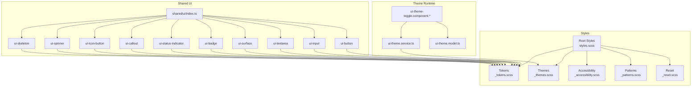

**Diagram sources**
- [frontend/src/styles/_tokens.scss](file://frontend/src/styles/_tokens.scss)
- [frontend/src/styles/_themes.scss](file://frontend/src/styles/_themes.scss)
- [frontend/src/styles/_accessibility.scss](file://frontend/src/styles/_accessibility.scss)
- [frontend/src/styles/_patterns.scss](file://frontend/src/styles/_patterns.scss)
- [frontend/src/styles/_reset.scss](file://frontend/src/styles/_reset.scss)
- [frontend/src/styles.scss](file://frontend/src/styles.scss)
- [frontend/src/app/shared/theme/ui-theme.service.ts](file://frontend/src/app/shared/theme/ui-theme.service.ts)
- [frontend/src/app/shared/theme/ui-theme.model.ts](file://frontend/src/app/shared/theme/ui-theme.model.ts)
- [frontend/src/app/shared/theme/ui-theme-toggle.component.ts](file://frontend/src/app/shared/theme/ui-theme-toggle.component.ts)
- [frontend/src/app/shared/ui/index.ts](file://frontend/src/app/shared/ui/index.ts)
- [frontend/src/app/shared/ui/ui-button/ui-button.component.ts](file://frontend/src/app/shared/ui/ui-button/ui-button.component.ts)
- [frontend/src/app/shared/ui/ui-input/ui-input.component.ts](file://frontend/src/app/shared/ui/ui-input/ui-input.component.ts)
- [frontend/src/app/shared/ui/ui-textarea/ui-textarea.component.ts](file://frontend/src/app/shared/ui/ui-textarea/ui-textarea.component.ts)
- [frontend/src/app/shared/ui/ui-surface/ui-surface.component.ts](file://frontend/src/app/shared/ui/ui-surface/ui-surface.component.ts)
- [frontend/src/app/shared/ui/ui-badge/ui-badge.component.ts](file://frontend/src/app/shared/ui/ui-badge/ui-badge.component.ts)
- [frontend/src/app/shared/ui/ui-status-indicator/ui-status-indicator.component.ts](file://frontend/src/app/shared/ui/ui-status-indicator/ui-status-indicator.component.ts)
- [frontend/src/app/shared/ui/ui-callout/ui-callout.component.ts](file://frontend/src/app/shared/ui/ui-callout/ui-callout.component.ts)
- [frontend/src/app/shared/ui/ui-icon-button/ui-icon-button.component.ts](file://frontend/src/app/shared/ui/ui-icon-button/ui-icon-button.component.ts)
- [frontend/src/app/shared/ui/ui-spinner/ui-spinner.component.ts](file://frontend/src/app/shared/ui/ui-spinner/ui-spinner.component.ts)
- [frontend/src/app/shared/ui/ui-skeleton/ui-skeleton.component.ts](file://frontend/src/app/shared/ui/ui-skeleton/ui-skeleton.component.ts)

**Section sources**
- [frontend/src/styles/_tokens.scss](file://frontend/src/styles/_tokens.scss)
- [frontend/src/styles/_themes.scss](file://frontend/src/styles/_themes.scss)
- [frontend/src/styles/_accessibility.scss](file://frontend/src/styles/_accessibility.scss)
- [frontend/src/styles/_patterns.scss](file://frontend/src/styles/_patterns.scss)
- [frontend/src/styles/_reset.scss](file://frontend/src/styles/_reset.scss)
- [frontend/src/styles.scss](file://frontend/src/styles.scss)
- [frontend/src/app/shared/theme/ui-theme.service.ts](file://frontend/src/app/shared/theme/ui-theme.service.ts)
- [frontend/src/app/shared/theme/ui-theme.model.ts](file://frontend/src/app/shared/theme/ui-theme.model.ts)
- [frontend/src/app/shared/theme/ui-theme-toggle.component.ts](file://frontend/src/app/shared/theme/ui-theme-toggle.component.ts)
- [frontend/src/app/shared/ui/index.ts](file://frontend/src/app/shared/ui/index.ts)

## Core Components
The shared UI library exposes a consistent set of primitives:

- Buttons and icon buttons: Primary actions, secondary actions, destructive variants, and compact icon-only controls.
- Inputs and text areas: Text entry fields with labels, placeholders, validation states, and helper text.
- Surfaces: Containers that provide elevation and background semantics.
- Status indicators and badges: Visual signals for state and counts.
- Callouts: Contextual messages for feedback or guidance.
- Feedback widgets: Spinners and skeleton loaders for loading states.

These components consume design tokens and theme variables to ensure visual consistency and support dark/light modes.

**Section sources**
- [frontend/src/app/shared/ui/ui-button/ui-button.component.ts](file://frontend/src/app/shared/ui/ui-button/ui-button.component.ts)
- [frontend/src/app/shared/ui/ui-button/ui-button.component.html](file://frontend/src/app/shared/ui/ui-button/ui-button.component.html)
- [frontend/src/app/shared/ui/ui-button/ui-button.component.scss](file://frontend/src/app/shared/ui/ui-button/ui-button.component.scss)
- [frontend/src/app/shared/ui/ui-icon-button/ui-icon-button.component.ts](file://frontend/src/app/shared/ui/ui-icon-button/ui-icon-button.component.ts)
- [frontend/src/app/shared/ui/ui-icon-button/ui-icon-button.component.html](file://frontend/src/app/shared/ui/ui-icon-button/ui-icon-button.component.html)
- [frontend/src/app/shared/ui/ui-icon-button/ui-icon-button.component.scss](file://frontend/src/app/shared/ui/ui-icon-button/ui-icon-button.component.scss)
- [frontend/src/app/shared/ui/ui-input/ui-input.component.ts](file://frontend/src/app/shared/ui/ui-input/ui-input.component.ts)
- [frontend/src/app/shared/ui/ui-input/ui-input.component.html](file://frontend/src/app/shared/ui/ui-input/ui-input.component.html)
- [frontend/src/app/shared/ui/ui-input/ui-input.component.scss](file://frontend/src/app/shared/ui/ui-input/ui-input.component.scss)
- [frontend/src/app/shared/ui/ui-textarea/ui-textarea.component.ts](file://frontend/src/app/shared/ui/ui-textarea/ui-textarea.component.ts)
- [frontend/src/app/shared/ui/ui-textarea/ui-textarea.component.html](file://frontend/src/app/shared/ui/ui-textarea/ui-textarea.component.html)
- [frontend/src/app/shared/ui/ui-textarea/ui-textarea.component.scss](file://frontend/src/app/shared/ui/ui-textarea/ui-textarea.component.scss)
- [frontend/src/app/shared/ui/ui-surface/ui-surface.component.ts](file://frontend/src/app/shared/ui/ui-surface/ui-surface.component.ts)
- [frontend/src/app/shared/ui/ui-surface/ui-surface.component.scss](file://frontend/src/app/shared/ui/ui-surface/ui-surface.component.scss)
- [frontend/src/app/shared/ui/ui-badge/ui-badge.component.ts](file://frontend/src/app/shared/ui/ui-badge/ui-badge.component.ts)
- [frontend/src/app/shared/ui/ui-badge/ui-badge.component.scss](file://frontend/src/app/shared/ui/ui-badge/ui-badge.component.scss)
- [frontend/src/app/shared/ui/ui-status-indicator/ui-status-indicator.component.ts](file://frontend/src/app/shared/ui/ui-status-indicator/ui-status-indicator.component.ts)
- [frontend/src/app/shared/ui/ui-status-indicator/ui-status-indicator.component.scss](file://frontend/src/app/shared/ui/ui-status-indicator/ui-status-indicator.component.scss)
- [frontend/src/app/shared/ui/ui-callout/ui-callout.component.ts](file://frontend/src/app/shared/ui/ui-callout/ui-callout.component.ts)
- [frontend/src/app/shared/ui/ui-callout/ui-callout.component.html](file://frontend/src/app/shared/ui/ui-callout/ui-callout.component.html)
- [frontend/src/app/shared/ui/ui-callout/ui-callout.component.scss](file://frontend/src/app/shared/ui/ui-callout/ui-callout.component.scss)
- [frontend/src/app/shared/ui/ui-spinner/ui-spinner.component.ts](file://frontend/src/app/shared/ui/ui-spinner/ui-spinner.component.ts)
- [frontend/src/app/shared/ui/ui-spinner/ui-spinner.component.scss](file://frontend/src/app/shared/ui/ui-spinner/ui-spinner.component.scss)
- [frontend/src/app/shared/ui/ui-skeleton/ui-skeleton.component.ts](file://frontend/src/app/shared/ui/ui-skeleton/ui-skeleton.component.ts)
- [frontend/src/app/shared/ui/ui-skeleton/ui-skeleton.component.scss](file://frontend/src/app/shared/ui/ui-skeleton/ui-skeleton.component.scss)

## Architecture Overview
The theming architecture uses CSS custom properties defined by tokens and themed per palette. A runtime service toggles themes by updating root-level variables, enabling instant light/dark mode without rebuilds.

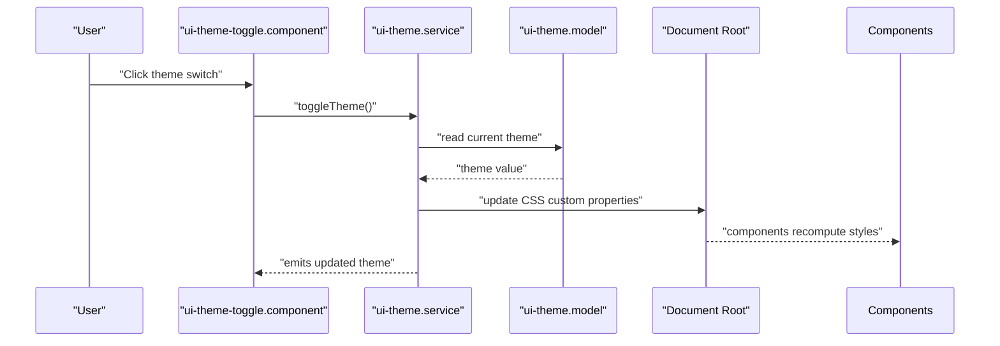

**Diagram sources**
- [frontend/src/app/shared/theme/ui-theme-toggle.component.ts](file://frontend/src/app/shared/theme/ui-theme-toggle.component.ts)
- [frontend/src/app/shared/theme/ui-theme.service.ts](file://frontend/src/app/shared/theme/ui-theme.service.ts)
- [frontend/src/app/shared/theme/ui-theme.model.ts](file://frontend/src/app/shared/theme/ui-theme.model.ts)
- [frontend/src/styles/_themes.scss](file://frontend/src/styles/_themes.scss)

**Section sources**
- [frontend/src/app/shared/theme/ui-theme.service.ts](file://frontend/src/app/shared/theme/ui-theme.service.ts)
- [frontend/src/app/shared/theme/ui-theme.model.ts](file://frontend/src/app/shared/theme/ui-theme.model.ts)
- [frontend/src/app/shared/theme/ui-theme-toggle.component.ts](file://frontend/src/app/shared/theme/ui-theme-toggle.component.ts)
- [frontend/src/app/shared/theme/ui-theme-toggle.component.html](file://frontend/src/app/shared/theme/ui-theme-toggle.component.html)
- [frontend/src/app/shared/theme/ui-theme-toggle.component.scss](file://frontend/src/app/shared/theme/ui-theme-toggle.component.scss)
- [frontend/src/styles/_themes.scss](file://frontend/src/styles/_themes.scss)

## Detailed Component Analysis

### Theming and Tokens
- Tokens define spacing, typography, colors, radii, shadows, and motion values.
- Themes map tokens to semantic variables for light and dark palettes.
- The theme service updates CSS custom properties on the document root to switch themes at runtime.
- Components reference semantic variables via tokens to remain theme-aware.

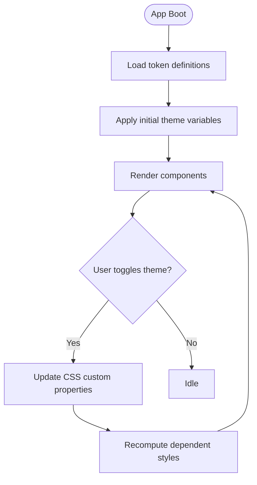

**Diagram sources**
- [frontend/src/styles/_tokens.scss](file://frontend/src/styles/_tokens.scss)
- [frontend/src/styles/_themes.scss](file://frontend/src/styles/_themes.scss)
- [frontend/src/app/shared/theme/ui-theme.service.ts](file://frontend/src/app/shared/theme/ui-theme.service.ts)

**Section sources**
- [frontend/src/styles/_tokens.scss](file://frontend/src/styles/_tokens.scss)
- [frontend/src/styles/_themes.scss](file://frontend/src/styles/_themes.scss)
- [frontend/src/app/shared/theme/ui-theme.service.ts](file://frontend/src/app/shared/theme/ui-theme.service.ts)
- [frontend/src/app/shared/theme/ui-theme.model.ts](file://frontend/src/app/shared/theme/ui-theme.model.ts)

### Button and Icon Button
- Purpose: Primary and secondary actions; icon-only actions for dense interfaces.
- Variants: Default, primary, secondary, destructive, ghost/outline where applicable.
- States: Hover, focus, active, disabled.
- Accessibility: Keyboard operable, visible focus ring, proper role and label.
- Theming: Uses semantic color tokens for backgrounds, borders, and text.

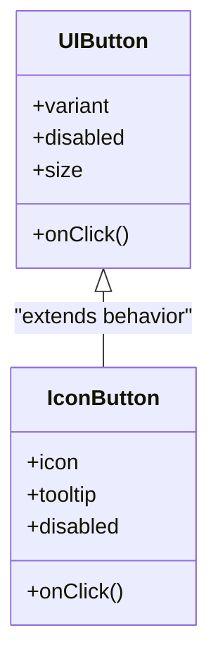

**Diagram sources**
- [frontend/src/app/shared/ui/ui-button/ui-button.component.ts](file://frontend/src/app/shared/ui/ui-button/ui-button.component.ts)
- [frontend/src/app/shared/ui/ui-button/ui-button.component.html](file://frontend/src/app/shared/ui/ui-button/ui-button.component.html)
- [frontend/src/app/shared/ui/ui-button/ui-button.component.scss](file://frontend/src/app/shared/ui/ui-button/ui-button.component.scss)
- [frontend/src/app/shared/ui/ui-icon-button/ui-icon-button.component.ts](file://frontend/src/app/shared/ui/ui-icon-button/ui-icon-button.component.ts)
- [frontend/src/app/shared/ui/ui-icon-button/ui-icon-button.component.html](file://frontend/src/app/shared/ui/ui-icon-button/ui-icon-button.component.html)
- [frontend/src/app/shared/ui/ui-icon-button/ui-icon-button.component.scss](file://frontend/src/app/shared/ui/ui-icon-button/ui-icon-button.component.scss)

**Section sources**
- [frontend/src/app/shared/ui/ui-button/ui-button.component.ts](file://frontend/src/app/shared/ui/ui-button/ui-button.component.ts)
- [frontend/src/app/shared/ui/ui-button/ui-button.component.html](file://frontend/src/app/shared/ui/ui-button/ui-button.component.html)
- [frontend/src/app/shared/ui/ui-button/ui-button.component.scss](file://frontend/src/app/shared/ui/ui-button/ui-button.component.scss)
- [frontend/src/app/shared/ui/ui-icon-button/ui-icon-button.component.ts](file://frontend/src/app/shared/ui/ui-icon-button/ui-icon-button.component.ts)
- [frontend/src/app/shared/ui/ui-icon-button/ui-icon-button.component.html](file://frontend/src/app/shared/ui/ui-icon-button/ui-icon-button.component.html)
- [frontend/src/app/shared/ui/ui-icon-button/ui-icon-button.component.scss](file://frontend/src/app/shared/ui/ui-icon-button/ui-icon-button.component.scss)

### Input and Textarea
- Purpose: Single-line and multi-line text input with labels, helpers, and validation states.
- Features: Placeholder, disabled, readonly, error/success states, character counters if needed.
- Accessibility: Associated labels, aria-describedby for helpers/errors, keyboard navigation.
- Theming: Focus rings, border colors, and text colors from tokens.

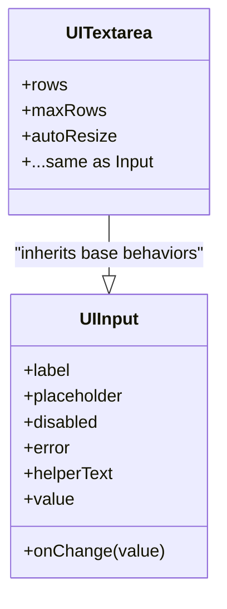

**Diagram sources**
- [frontend/src/app/shared/ui/ui-input/ui-input.component.ts](file://frontend/src/app/shared/ui/ui-input/ui-input.component.ts)
- [frontend/src/app/shared/ui/ui-input/ui-input.component.html](file://frontend/src/app/shared/ui/ui-input/ui-input.component.html)
- [frontend/src/app/shared/ui/ui-input/ui-input.component.scss](file://frontend/src/app/shared/ui/ui-input/ui-input.component.scss)
- [frontend/src/app/shared/ui/ui-textarea/ui-textarea.component.ts](file://frontend/src/app/shared/ui/ui-textarea/ui-textarea.component.ts)
- [frontend/src/app/shared/ui/ui-textarea/ui-textarea.component.html](file://frontend/src/app/shared/ui/ui-textarea/ui-textarea.component.html)
- [frontend/src/app/shared/ui/ui-textarea/ui-textarea.component.scss](file://frontend/src/app/shared/ui/ui-textarea/ui-textarea.component.scss)

**Section sources**
- [frontend/src/app/shared/ui/ui-input/ui-input.component.ts](file://frontend/src/app/shared/ui/ui-input/ui-input.component.ts)
- [frontend/src/app/shared/ui/ui-input/ui-input.component.html](file://frontend/src/app/shared/ui/ui-input/ui-input.component.html)
- [frontend/src/app/shared/ui/ui-input/ui-input.component.scss](file://frontend/src/app/shared/ui/ui-input/ui-input.component.scss)
- [frontend/src/app/shared/ui/ui-textarea/ui-textarea.component.ts](file://frontend/src/app/shared/ui/ui-textarea/ui-textarea.component.ts)
- [frontend/src/app/shared/ui/ui-textarea/ui-textarea.component.html](file://frontend/src/app/shared/ui/ui-textarea/ui-textarea.component.html)
- [frontend/src/app/shared/ui/ui-textarea/ui-textarea.component.scss](file://frontend/src/app/shared/ui/ui-textarea/ui-textarea.component.scss)

### Surface
- Purpose: Container with background, elevation, and padding semantics.
- Use cases: Cards, panels, modals, drawers.
- Theming: Background and shadow tokens adapt to theme.

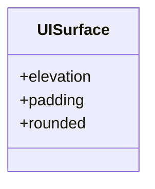

**Diagram sources**
- [frontend/src/app/shared/ui/ui-surface/ui-surface.component.ts](file://frontend/src/app/shared/ui/ui-surface/ui-surface.component.ts)
- [frontend/src/app/shared/ui/ui-surface/ui-surface.component.scss](file://frontend/src/app/shared/ui/ui-surface/ui-surface.component.scss)

**Section sources**
- [frontend/src/app/shared/ui/ui-surface/ui-surface.component.ts](file://frontend/src/app/shared/ui/ui-surface/ui-surface.component.ts)
- [frontend/src/app/shared/ui/ui-surface/ui-surface.component.scss](file://frontend/src/app/shared/ui/ui-surface/ui-surface.component.scss)

### Badge and Status Indicator
- Badge: Compact count or label; supports color variants and positioning.
- Status indicator: Dot or line indicating operational state (success, warning, error, info).
- Accessibility: Semantic roles and screen reader hints when meaningful.

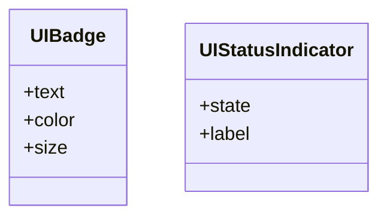

**Diagram sources**
- [frontend/src/app/shared/ui/ui-badge/ui-badge.component.ts](file://frontend/src/app/shared/ui/ui-badge/ui-badge.component.ts)
- [frontend/src/app/shared/ui/ui-badge/ui-badge.component.scss](file://frontend/src/app/shared/ui/ui-badge/ui-badge.component.scss)
- [frontend/src/app/shared/ui/ui-status-indicator/ui-status-indicator.component.ts](file://frontend/src/app/shared/ui/ui-status-indicator/ui-status-indicator.component.ts)
- [frontend/src/app/shared/ui/ui-status-indicator/ui-status-indicator.component.scss](file://frontend/src/app/shared/ui/ui-status-indicator/ui-status-indicator.component.scss)

**Section sources**
- [frontend/src/app/shared/ui/ui-badge/ui-badge.component.ts](file://frontend/src/app/shared/ui/ui-badge/ui-badge.component.ts)
- [frontend/src/app/shared/ui/ui-badge/ui-badge.component.scss](file://frontend/src/app/shared/ui/ui-badge/ui-badge.component.scss)
- [frontend/src/app/shared/ui/ui-status-indicator/ui-status-indicator.component.ts](file://frontend/src/app/shared/ui/ui-status-indicator/ui-status-indicator.component.ts)
- [frontend/src/app/shared/ui/ui-status-indicator/ui-status-indicator.component.scss](file://frontend/src/app/shared/ui/ui-status-indicator/ui-status-indicator.component.scss)

### Callout
- Purpose: Inline feedback or contextual information blocks.
- Variants: Info, success, warning, error.
- Accessibility: Appropriate role and aria attributes for live regions when needed.

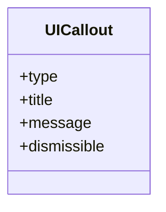

**Diagram sources**
- [frontend/src/app/shared/ui/ui-callout/ui-callout.component.ts](file://frontend/src/app/shared/ui/ui-callout/ui-callout.component.ts)
- [frontend/src/app/shared/ui/ui-callout/ui-callout.component.html](file://frontend/src/app/shared/ui/ui-callout/ui-callout.component.html)
- [frontend/src/app/shared/ui/ui-callout/ui-callout.component.scss](file://frontend/src/app/shared/ui/ui-callout/ui-callout.component.scss)

**Section sources**
- [frontend/src/app/shared/ui/ui-callout/ui-callout.component.ts](file://frontend/src/app/shared/ui/ui-callout/ui-callout.component.ts)
- [frontend/src/app/shared/ui/ui-callout/ui-callout.component.html](file://frontend/src/app/shared/ui/ui-callout/ui-callout.component.html)
- [frontend/src/app/shared/ui/ui-callout/ui-callout.component.scss](file://frontend/src/app/shared/ui/ui-callout/ui-callout.component.scss)

### Spinner and Skeleton
- Spinner: Indeterminate progress indicator.
- Skeleton: Placeholder shapes during content load.
- Accessibility: Role="progressbar" for spinners; aria-busy for skeletons.

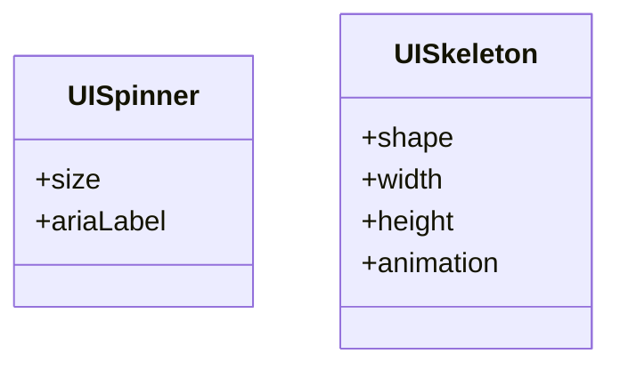

**Diagram sources**
- [frontend/src/app/shared/ui/ui-spinner/ui-spinner.component.ts](file://frontend/src/app/shared/ui/ui-spinner/ui-spinner.component.ts)
- [frontend/src/app/shared/ui/ui-spinner/ui-spinner.component.scss](file://frontend/src/app/shared/ui/ui-spinner/ui-spinner.component.scss)
- [frontend/src/app/shared/ui/ui-skeleton/ui-skeleton.component.ts](file://frontend/src/app/shared/ui/ui-skeleton/ui-skeleton.component.ts)
- [frontend/src/app/shared/ui/ui-skeleton/ui-skeleton.component.scss](file://frontend/src/app/shared/ui/ui-skeleton/ui-skeleton.component.scss)

**Section sources**
- [frontend/src/app/shared/ui/ui-spinner/ui-spinner.component.ts](file://frontend/src/app/shared/ui/ui-spinner/ui-spinner.component.ts)
- [frontend/src/app/shared/ui/ui-spinner/ui-spinner.component.scss](file://frontend/src/app/shared/ui/ui-spinner/ui-spinner.component.scss)
- [frontend/src/app/shared/ui/ui-skeleton/ui-skeleton.component.ts](file://frontend/src/app/shared/ui/ui-skeleton/ui-skeleton.component.ts)
- [frontend/src/app/shared/ui/ui-skeleton/ui-skeleton.component.scss](file://frontend/src/app/shared/ui/ui-skeleton/ui-skeleton.component.scss)

### Shared Index and Export Strategy
- Central barrel file exports all shared components for convenient imports.
- Encourages single source of truth for public API surface.

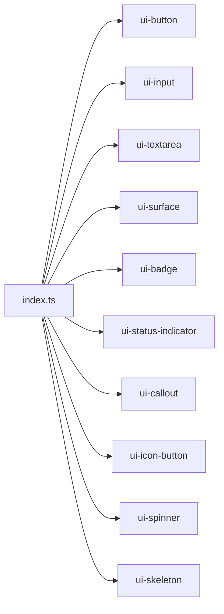

**Diagram sources**
- [frontend/src/app/shared/ui/index.ts](file://frontend/src/app/shared/ui/index.ts)

**Section sources**
- [frontend/src/app/shared/ui/index.ts](file://frontend/src/app/shared/ui/index.ts)

## Dependency Analysis
- Components depend on tokens and theme variables rather than hard-coded values.
- Theme service depends on model and updates DOM-level CSS variables.
- Global styles import tokens, themes, reset, patterns, and accessibility utilities.

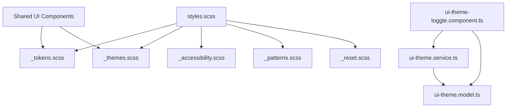

**Diagram sources**
- [frontend/src/styles.scss](file://frontend/src/styles.scss)
- [frontend/src/styles/_tokens.scss](file://frontend/src/styles/_tokens.scss)
- [frontend/src/styles/_themes.scss](file://frontend/src/styles/_themes.scss)
- [frontend/src/styles/_accessibility.scss](file://frontend/src/styles/_accessibility.scss)
- [frontend/src/styles/_patterns.scss](file://frontend/src/styles/_patterns.scss)
- [frontend/src/styles/_reset.scss](file://frontend/src/styles/_reset.scss)
- [frontend/src/app/shared/theme/ui-theme.service.ts](file://frontend/src/app/shared/theme/ui-theme.service.ts)
- [frontend/src/app/shared/theme/ui-theme.model.ts](file://frontend/src/app/shared/theme/ui-theme.model.ts)
- [frontend/src/app/shared/theme/ui-theme-toggle.component.ts](file://frontend/src/app/shared/theme/ui-theme-toggle.component.ts)

**Section sources**
- [frontend/src/styles.scss](file://frontend/src/styles.scss)
- [frontend/src/styles/_tokens.scss](file://frontend/src/styles/_tokens.scss)
- [frontend/src/styles/_themes.scss](file://frontend/src/styles/_themes.scss)
- [frontend/src/styles/_accessibility.scss](file://frontend/src/styles/_accessibility.scss)
- [frontend/src/styles/_patterns.scss](file://frontend/src/styles/_patterns.scss)
- [frontend/src/styles/_reset.scss](file://frontend/src/styles/_reset.scss)
- [frontend/src/app/shared/theme/ui-theme.service.ts](file://frontend/src/app/shared/theme/ui-theme.service.ts)
- [frontend/src/app/shared/theme/ui-theme.model.ts](file://frontend/src/app/shared/theme/ui-theme.model.ts)
- [frontend/src/app/shared/theme/ui-theme-toggle.component.ts](file://frontend/src/app/shared/theme/ui-theme-toggle.component.ts)

## Performance Considerations
- Prefer CSS custom properties for theme changes to avoid full style recalculations.
- Keep component SCSS scoped and minimal; leverage tokens to reduce duplication.
- Avoid heavy animations; use hardware-accelerated transforms where possible.
- Lazy-load feature-specific components when appropriate to reduce bundle size.
- Debounce frequent user interactions (e.g., resize handles) to prevent layout thrashing.

[No sources needed since this section provides general guidance]

## Troubleshooting Guide
- Theme not applying: Ensure the theme service updates root CSS variables and that components reference semantic tokens.
- Focus visibility missing: Verify focus styles are enabled and not overridden by global resets.
- Contrast issues: Confirm token mappings meet contrast requirements in both light and dark themes.
- Responsive misalignment: Check container widths and grid usage; rely on pattern utilities instead of ad-hoc media queries.
- Cross-browser quirks: Validate CSS variable support and fallbacks; test focus rings and transitions across browsers.

**Section sources**
- [frontend/src/styles/_accessibility.scss](file://frontend/src/styles/_accessibility.scss)
- [frontend/src/styles/_patterns.scss](file://frontend/src/styles/_patterns.scss)
- [frontend/src/styles/_reset.scss](file://frontend/src/styles/_reset.scss)
- [frontend/src/app/shared/theme/ui-theme.service.ts](file://frontend/src/app/shared/theme/ui-theme.service.ts)

## Conclusion
The design system centralizes visual language through tokens and themes, providing a robust foundation for consistent, accessible, and responsive UI components. The runtime theming approach enables seamless light/dark switching, while shared components enforce best practices for accessibility and usability. Following the guidelines below will help maintain consistency and scalability as the system grows.

[No sources needed since this section summarizes without analyzing specific files]

## Appendices

### Guidelines for Creating New UI Components
- Start with tokens: Define or reuse tokens for spacing, color, typography, and motion.
- Implement semantic HTML and ARIA attributes for accessibility.
- Provide clear variants and states; keep APIs minimal and composable.
- Scope styles with component SCSS; reference tokens via CSS variables.
- Add tests for rendering, keyboard interaction, and theme correctness.
- Export via the shared index barrel for discoverability.

### Extending Existing Components
- Prefer composition over inheritance; wrap components to add behavior.
- Expose configuration via inputs and events; avoid internal state leakage.
- Maintain backward compatibility; deprecate features gradually.
- Document new props and usage examples in component docs.

### Maintaining Design Consistency
- Review PRs against token usage and accessibility checks.
- Run automated contrast and linting rules.
- Keep a living catalog of components and their variants.
- Regularly audit themes for contrast and readability.

[No sources needed since this section provides general guidance]