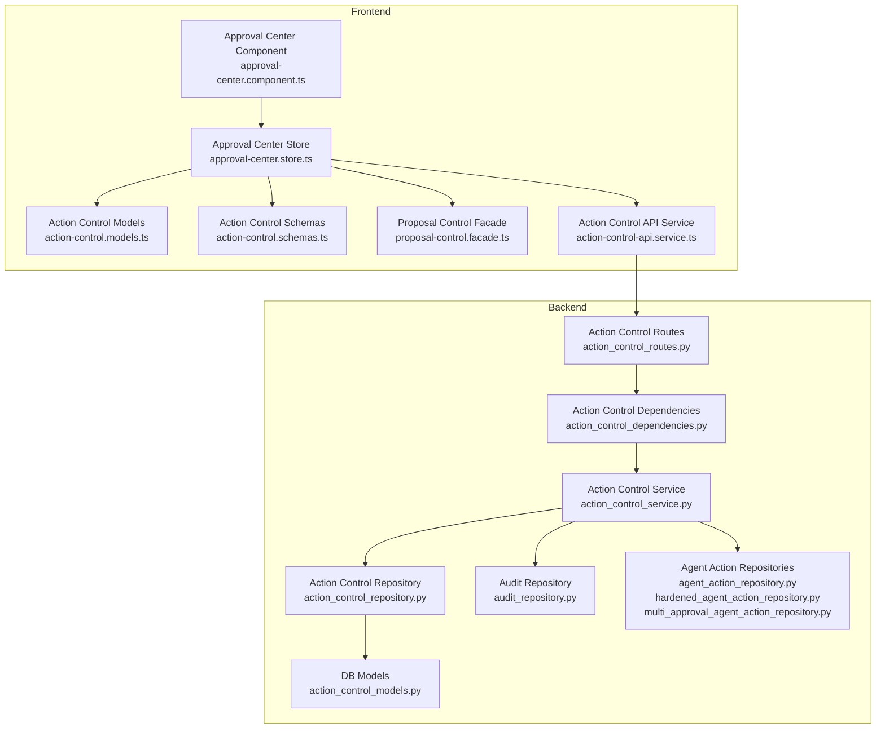
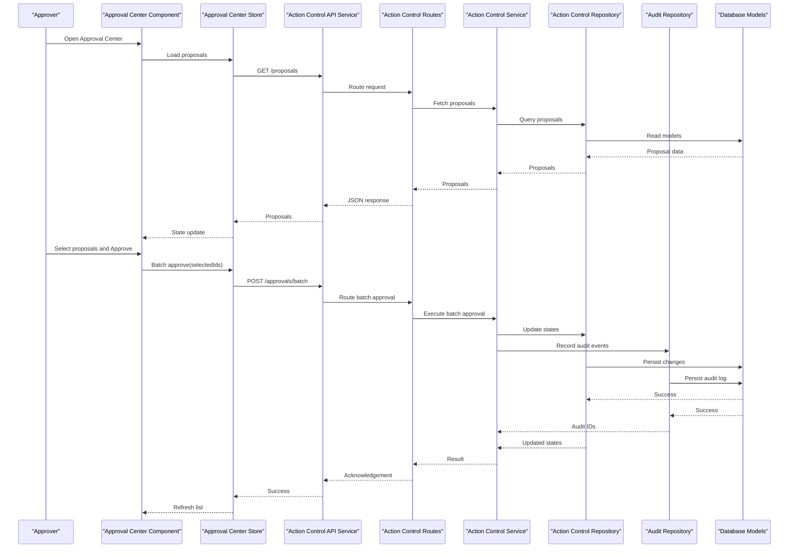
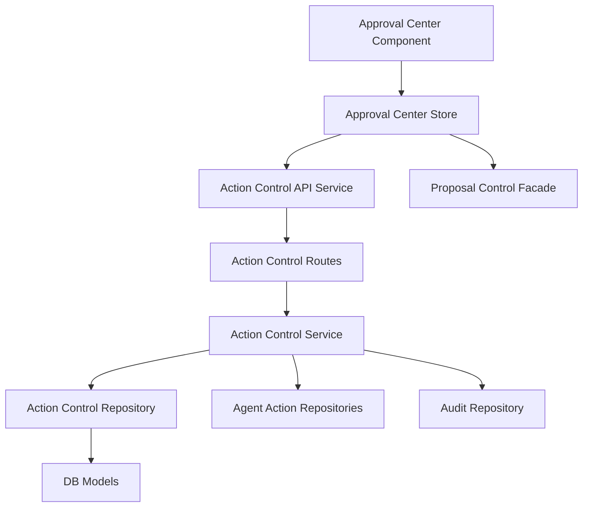

# Approval Center

<cite>
**Referenced Files in This Document**
- [approval-center.component.ts](file://frontend/src/app/features/approval-center/approval-center.component.ts)
- [approval-center.store.ts](file://frontend/src/app/features/approval-center/approval-center.store.ts)
- [approval-center.component.html](file://frontend/src/app/features/approval-center/approval-center.component.html)
- [approval-center.component.scss](file://frontend/src/app/features/approval-center/approval-center.component.scss)
- [action-control-api.service.ts](file://frontend/src/app/core/action-control/action-control-api.service.ts)
- [action-control.models.ts](file://frontend/src/app/core/action-control/action-control.models.ts)
- [action-control.schemas.ts](file://frontend/src/app/core/action-control/action-control.schemas.ts)
- [proposal-control.facade.ts](file://frontend/src/app/core/action-control/proposal-control.facade.ts)
- [action_control_routes.py](file://app/api/action_control_routes.py)
- [action_control_service.py](file://app/services/action_control_service.py)
- [action_control_repository.py](file://app/repositories/action_control_repository.py)
- [action_control_models.py](file://app/db/action_control_models.py)
- [audit_repository.py](file://app/repositories/audit_repository.py)
- [audit.py](file://app/schemas/audit.py)
- [agent_action_repository.py](file://app/repositories/agent_action_repository.py)
- [hardened_agent_action_repository.py](file://app/repositories/hardened_agent_action_repository.py)
- [multi_approval_agent_action_repository.py](file://app/repositories/multi_approval_agent_action_repository.py)
- [action_control_dependencies.py](file://app/api/action_control_dependencies.py)
- [phase6 docs](file://frontend/docs/PHASE_6_APPROVAL_CENTER.md)
</cite>

## Table of Contents
1. [Introduction](#introduction)
2. [Project Structure](#project-structure)
3. [Core Components](#core-components)
4. [Architecture Overview](#architecture-overview)
5. [Detailed Component Analysis](#detailed-component-analysis)
6. [Dependency Analysis](#dependency-analysis)
7. [Performance Considerations](#performance-considerations)
8. [Troubleshooting Guide](#troubleshooting-guide)
9. [Conclusion](#conclusion)
10. [Appendices](#appendices)

## Introduction
The Approval Center is a feature module that provides an interface for reviewing and deciding on AI action proposals. It enables approvers to inspect proposed actions, approve or reject them (including batch operations), view audit trails, and receive notifications about pending approvals. The module integrates with the backend governed action control plane to enforce approval policies, maintain state transitions, and record audit events.

Key capabilities:
- Review proposal details and context
- Approve or reject single or multiple proposals
- View historical audit trail entries
- Receive notifications for new or updated approvals
- Support role-based access control and approval hierarchy
- Integrate with external approval systems via extensible hooks

## Project Structure
The Approval Center spans both frontend and backend layers:
- Frontend: Angular component, store, API service integration, and UI assets
- Backend: Routes, services, repositories, and database models for controlled actions and audits

**Diagram sources**
- [approval-center.component.ts](file://frontend/src/app/features/approval-center/approval-center.component.ts)
- [approval-center.store.ts](file://frontend/src/app/features/approval-center/approval-center.store.ts)
- [action-control-api.service.ts](file://frontend/src/app/core/action-control/action-control-api.service.ts)
- [action-control.models.ts](file://frontend/src/app/core/action-control/action-control.models.ts)
- [action-control.schemas.ts](file://frontend/src/app/core/action-control/action-control.schemas.ts)
- [proposal-control.facade.ts](file://frontend/src/app/core/action-control/proposal-control.facade.ts)
- [action_control_routes.py](file://app/api/action_control_routes.py)
- [action_control_dependencies.py](file://app/api/action_control_dependencies.py)
- [action_control_service.py](file://app/services/action_control_service.py)
- [action_control_repository.py](file://app/repositories/action_control_repository.py)
- [action_control_models.py](file://app/db/action_control_models.py)
- [audit_repository.py](file://app/repositories/audit_repository.py)
- [agent_action_repository.py](file://app/repositories/agent_action_repository.py)
- [hardened_agent_action_repository.py](file://app/repositories/hardened_agent_action_repository.py)
- [multi_approval_agent_action_repository.py](file://app/repositories/multi_approval_agent_action_repository.py)

**Section sources**
- [approval-center.component.ts](file://frontend/src/app/features/approval-center/approval-center.component.ts)
- [approval-center.store.ts](file://frontend/src/app/features/approval-center/approval-center.store.ts)
- [action-control-api.service.ts](file://frontend/src/app/core/action-control/action-control-api.service.ts)
- [action-control.models.ts](file://frontend/src/app/core/action-control/action-control.models.ts)
- [action-control.schemas.ts](file://frontend/src/app/core/action-control/action-control.schemas.ts)
- [proposal-control.facade.ts](file://frontend/src/app/core/action-control/proposal-control.facade.ts)
- [action_control_routes.py](file://app/api/action_control_routes.py)
- [action_control_dependencies.py](file://app/api/action_control_dependencies.py)
- [action_control_service.py](file://app/services/action_control_service.py)
- [action_control_repository.py](file://app/repositories/action_control_repository.py)
- [action_control_models.py](file://app/db/action_control_models.py)
- [audit_repository.py](file://app/repositories/audit_repository.py)
- [agent_action_repository.py](file://app/repositories/agent_action_repository.py)
- [hardened_agent_action_repository.py](file://app/repositories/hardened_agent_action_repository.py)
- [multi_approval_agent_action_repository.py](file://app/repositories/multi_approval_agent_action_repository.py)

## Core Components
- Approval Center Component: Renders the approval list, selection controls, and decision actions. It subscribes to store state and dispatches user interactions.
- Approval Center Store: Manages local state for proposals, filters, selections, loading/error states, and orchestrates calls to the API facade.
- Action Control API Service: Encapsulates HTTP requests for listing proposals, approving/rejecting, and fetching audit logs.
- Proposal Control Facade: Provides higher-level operations such as batch decisions and workflow orchestration.
- Backend Routes and Dependencies: Define endpoints and inject services/repositories for controlled actions.
- Action Control Service: Implements business logic for approval workflows, validation, and side effects.
- Repositories and Models: Persist approval states, multi-approval rules, and audit records.

**Section sources**
- [approval-center.component.ts](file://frontend/src/app/features/approval-center/approval-center.component.ts)
- [approval-center.store.ts](file://frontend/src/app/features/approval-center/approval-center.store.ts)
- [action-control-api.service.ts](file://frontend/src/app/core/action-control/action-control-api.service.ts)
- [proposal-control.facade.ts](file://frontend/src/app/core/action-control/proposal-control.facade.ts)
- [action_control_routes.py](file://app/api/action_control_routes.py)
- [action_control_dependencies.py](file://app/api/action_control_dependencies.py)
- [action_control_service.py](file://app/services/action_control_service.py)
- [action_control_repository.py](file://app/repositories/action_control_repository.py)
- [action_control_models.py](file://app/db/action_control_models.py)
- [audit_repository.py](file://app/repositories/audit_repository.py)
- [agent_action_repository.py](file://app/repositories/agent_action_repository.py)
- [hardened_agent_action_repository.py](file://app/repositories/hardened_agent_action_repository.py)
- [multi_approval_agent_action_repository.py](file://app/repositories/multi_approval_agent_action_repository.py)

## Architecture Overview
The Approval Center follows a layered architecture:
- Presentation Layer: Angular component and store manage UI state and user interactions.
- Integration Layer: API service and facade translate UI actions into backend calls.
- Domain Layer: Service enforces approval policies, validates roles, and coordinates repositories.
- Data Layer: Repositories interact with ORM models and databases; audit repository persists audit events.

**Diagram sources**
- [approval-center.component.ts](file://frontend/src/app/features/approval-center/approval-center.component.ts)
- [approval-center.store.ts](file://frontend/src/app/features/approval-center/approval-center.store.ts)
- [action-control-api.service.ts](file://frontend/src/app/core/action-control/action-control-api.service.ts)
- [action_control_routes.py](file://app/api/action_control_routes.py)
- [action_control_service.py](file://app/services/action_control_service.py)
- [action_control_repository.py](file://app/repositories/action_control_repository.py)
- [audit_repository.py](file://app/repositories/audit_repository.py)
- [action_control_models.py](file://app/db/action_control_models.py)

## Detailed Component Analysis

### Approval Center Component
Responsibilities:
- Render proposal list and detail views
- Provide selection controls for batch operations
- Display status indicators and error messages
- Trigger store methods for load, approve, reject, and refresh

User interactions:
- Click to open proposal details
- Checkboxes to select multiple proposals
- Buttons to approve or reject selected items
- Filters to narrow down by status or date

State binding:
- Subscribes to store streams for proposals, loading flags, and errors
- Updates UI based on store state changes

**Section sources**
- [approval-center.component.ts](file://frontend/src/app/features/approval-center/approval-center.component.ts)
- [approval-center.component.html](file://frontend/src/app/features/approval-center/approval-center.component.html)
- [approval-center.component.scss](file://frontend/src/app/features/approval-center/approval-center.component.scss)

### Approval Center Store
Responsibilities:
- Maintain local state: proposals, selected IDs, filters, pagination, loading, errors
- Dispatch actions: load proposals, set filters, toggle selection, submit batch decisions
- Coordinate API calls through the Action Control API Service
- Emit updates to subscribers (component)

Data flow:
- On initialization, fetch proposals from backend
- On user selection, update selected IDs
- On decision submission, call batch approval endpoint and refresh list
- Handle errors and display user-friendly messages

**Section sources**
- [approval-center.store.ts](file://frontend/src/app/features/approval-center/approval-center.store.ts)
- [action-control-api.service.ts](file://frontend/src/app/core/action-control/action-control-api.service.ts)
- [action-control.models.ts](file://frontend/src/app/core/action-control/action-control.models.ts)
- [action-control.schemas.ts](file://frontend/src/app/core/action-control/action-control.schemas.ts)
- [proposal-control.facade.ts](file://frontend/src/app/core/action-control/proposal-control.facade.ts)

### Backend Action Control Plane
Responsibilities:
- Expose routes for listing proposals and submitting approvals/rejections
- Enforce role-based access control and approval hierarchy
- Validate inputs and ensure idempotency where applicable
- Record audit events for all approval decisions
- Support multi-approval workflows and rollbacks

Workflow highlights:
- Single approval: immediate state transition upon valid decision
- Multi-approval: track multiple approvers and thresholds before finalization
- Rollback: reverse approved actions when required by policy

**Section sources**
- [action_control_routes.py](file://app/api/action_control_routes.py)
- [action_control_dependencies.py](file://app/api/action_control_dependencies.py)
- [action_control_service.py](file://app/services/action_control_service.py)
- [action_control_repository.py](file://app/repositories/action_control_repository.py)
- [action_control_models.py](file://app/db/action_control_models.py)
- [audit_repository.py](file://app/repositories/audit_repository.py)
- [agent_action_repository.py](file://app/repositories/agent_action_repository.py)
- [hardened_agent_action_repository.py](file://app/repositories/hardened_agent_action_repository.py)
- [multi_approval_agent_action_repository.py](file://app/repositories/multi_approval_agent_action_repository.py)

### Audit Trail Viewing
Capabilities:
- Retrieve historical audit events for proposals and approvals
- Filter by proposal ID, approver, timestamp, and outcome
- Present chronological timeline for inspection and compliance

Integration points:
- Audit repository persists structured audit records
- API exposes endpoints to query audit history
- Frontend renders audit timeline within proposal details

**Section sources**
- [audit_repository.py](file://app/repositories/audit_repository.py)
- [audit.py](file://app/schemas/audit.py)
- [action_control_routes.py](file://app/api/action_control_routes.py)

### Notification System for Approval Requests
Conceptual overview:
- Notify eligible approvers when new proposals require attention
- Support channels such as in-app alerts, email, or webhook integrations
- Include proposal summary, urgency, and direct links to review

Implementation guidance:
- Extend notification service to publish events upon proposal creation
- Subscribe to approval lifecycle events to send reminders or escalations
- Ensure notifications respect role-based permissions and organizational boundaries

[No sources needed since this section provides general guidance]

### Role-Based Access Control and Approval Hierarchy
Role-based access control:
- Only users with approver roles can approve or reject proposals
- Hierarchical approvals require senior approver authorization for certain actions
- Policies determine who can initiate, review, and finalize decisions

Approval hierarchy management:
- Define chains of approvers based on resource sensitivity or organizational structure
- Enforce ordering and thresholds for multi-approval workflows
- Allow delegation and escalation per policy

**Section sources**
- [action_control_service.py](file://app/services/action_control_service.py)
- [multi_approval_agent_action_repository.py](file://app/repositories/multi_approval_agent_action_repository.py)
- [action_control_models.py](file://app/db/action_control_models.py)

### Extending Approval Criteria and Custom Workflows
Extensibility patterns:
- Implement custom criteria evaluators to gate approvals based on dynamic conditions
- Register additional approval stages or gates in the workflow engine
- Integrate with external approval systems via adapters or webhooks

Examples:
- Risk scoring threshold checks before allowing approval
- Compliance checks requiring legal sign-off for specific resources
- External system callbacks to confirm budget availability

**Section sources**
- [action_control_service.py](file://app/services/action_control_service.py)
- [action_control_repository.py](file://app/repositories/action_control_repository.py)
- [multi_approval_agent_action_repository.py](file://app/repositories/multi_approval_agent_action_repository.py)

### Integrating with External Approval Systems
Integration approach:
- Use adapters to communicate with third-party approval platforms
- Map internal proposal IDs to external ticket identifiers
- Sync state changes bidirectionally and handle reconciliation

Error handling:
- Retry failed syncs with exponential backoff
- Log discrepancies and alert administrators
- Provide rollback mechanisms if external confirmation fails

**Section sources**
- [action_control_service.py](file://app/services/action_control_service.py)
- [audit_repository.py](file://app/repositories/audit_repository.py)

## Dependency Analysis
The Approval Center depends on several modules across frontend and backend layers. The following diagram shows key relationships and coupling:

**Diagram sources**
- [approval-center.component.ts](file://frontend/src/app/features/approval-center/approval-center.component.ts)
- [approval-center.store.ts](file://frontend/src/app/features/approval-center/approval-center.store.ts)
- [action-control-api.service.ts](file://frontend/src/app/core/action-control/action-control-api.service.ts)
- [proposal-control.facade.ts](file://frontend/src/app/core/action-control/proposal-control.facade.ts)
- [action_control_routes.py](file://app/api/action_control_routes.py)
- [action_control_service.py](file://app/services/action_control_service.py)
- [action_control_repository.py](file://app/repositories/action_control_repository.py)
- [agent_action_repository.py](file://app/repositories/agent_action_repository.py)
- [hardened_agent_action_repository.py](file://app/repositories/hardened_agent_action_repository.py)
- [multi_approval_agent_action_repository.py](file://app/repositories/multi_approval_agent_action_repository.py)
- [audit_repository.py](file://app/repositories/audit_repository.py)
- [action_control_models.py](file://app/db/action_control_models.py)

**Section sources**
- [approval-center.component.ts](file://frontend/src/app/features/approval-center/approval-center.component.ts)
- [approval-center.store.ts](file://frontend/src/app/features/approval-center/approval-center.store.ts)
- [action-control-api.service.ts](file://frontend/src/app/core/action-control/action-control-api.service.ts)
- [proposal-control.facade.ts](file://frontend/src/app/core/action-control/proposal-control.facade.ts)
- [action_control_routes.py](file://app/api/action_control_routes.py)
- [action_control_service.py](file://app/services/action_control_service.py)
- [action_control_repository.py](file://app/repositories/action_control_repository.py)
- [agent_action_repository.py](file://app/repositories/agent_action_repository.py)
- [hardened_agent_action_repository.py](file://app/repositories/hardened_agent_action_repository.py)
- [multi_approval_agent_action_repository.py](file://app/repositories/multi_approval_agent_action_repository.py)
- [audit_repository.py](file://app/repositories/audit_repository.py)
- [action_control_models.py](file://app/db/action_control_models.py)

## Performance Considerations
- Pagination and filtering: Use server-side pagination and filters to reduce payload sizes for large proposal lists.
- Caching: Cache read-only proposal metadata where appropriate to minimize repeated queries.
- Idempotency: Ensure batch approval endpoints are idempotent to prevent duplicate processing under retries.
- Concurrency: Apply optimistic locking or versioned states to avoid race conditions during concurrent approvals.
- Audit logging: Stream audit events asynchronously to avoid blocking approval responses.

[No sources needed since this section provides general guidance]

## Troubleshooting Guide
Common issues and resolutions:
- Missing approvals: Verify user roles and approval hierarchy configuration; ensure approver has sufficient privileges.
- Stale proposals: Refresh the list and re-validate proposal state before acting; check for concurrent modifications.
- Batch failures: Inspect individual item statuses; retry failed items after addressing underlying constraints.
- Audit gaps: Confirm audit repository connectivity and persistence; reconcile missing entries using event logs.

Operational checks:
- Validate route definitions and dependency injection for action control endpoints.
- Review service-layer validations and policy enforcement logic.
- Monitor repository transactions and database constraints for integrity.

**Section sources**
- [action_control_routes.py](file://app/api/action_control_routes.py)
- [action_control_dependencies.py](file://app/api/action_control_dependencies.py)
- [action_control_service.py](file://app/services/action_control_service.py)
- [action_control_repository.py](file://app/repositories/action_control_repository.py)
- [audit_repository.py](file://app/repositories/audit_repository.py)

## Conclusion
The Approval Center provides a robust, extensible framework for governing AI-driven actions through human oversight. Its layered architecture separates concerns between presentation, integration, domain logic, and data persistence, enabling clear maintenance and evolution. With support for role-based access control, hierarchical approvals, multi-approval workflows, and comprehensive audit trails, it meets governance requirements while remaining adaptable to organizational policies and external integrations.

[No sources needed since this section summarizes without analyzing specific files]

## Appendices

### Phase 6 Documentation Reference
For detailed acceptance criteria and design specifications, refer to the Phase 6 documentation.

**Section sources**
- [phase6 docs](file://frontend/docs/PHASE_6_APPROVAL_CENTER.md)