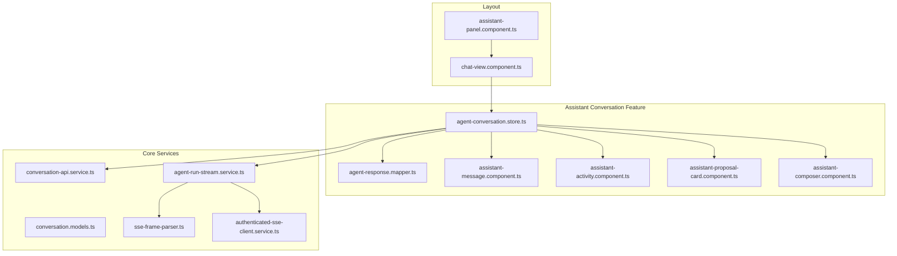
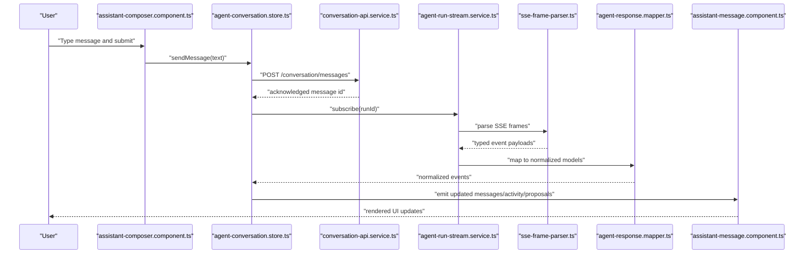
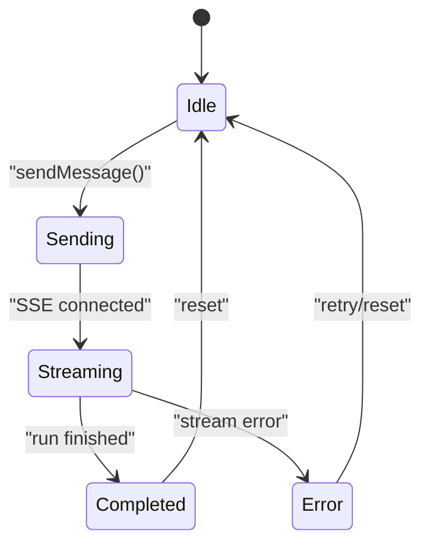
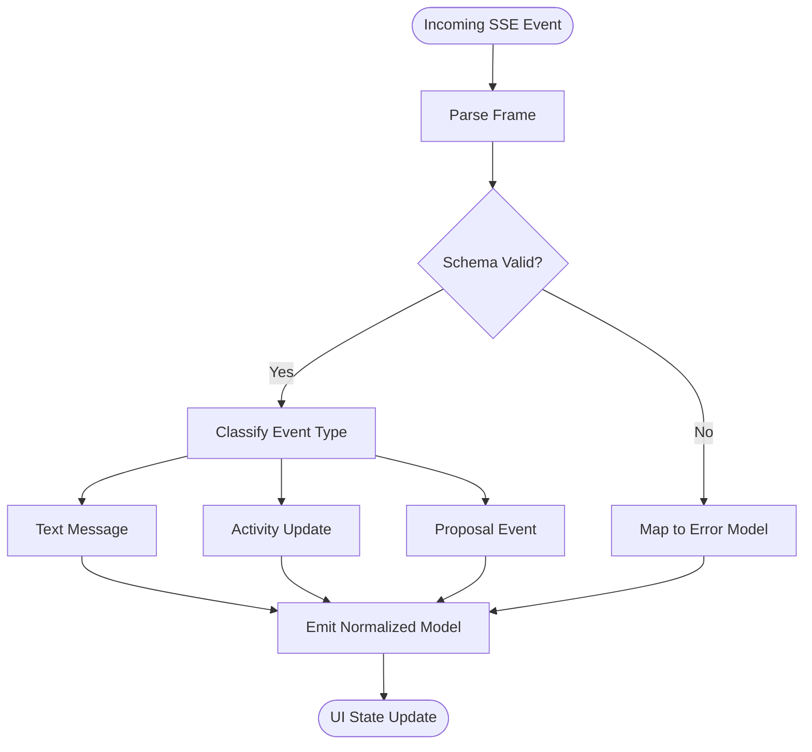
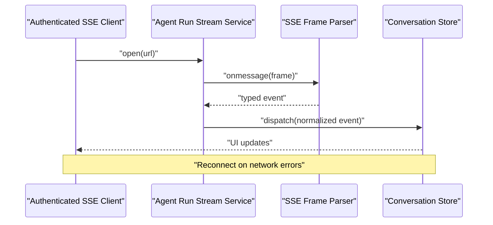
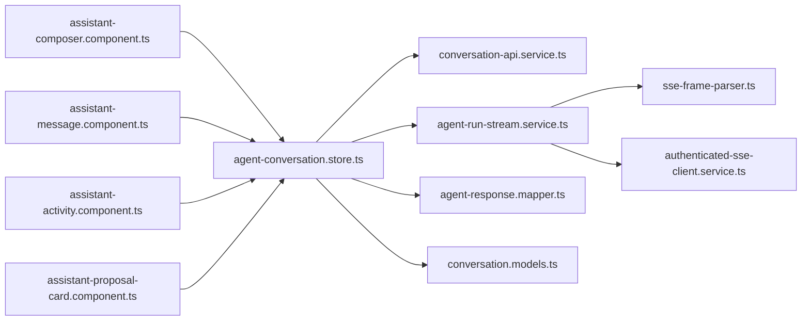

# Assistant Conversation

<cite>
**Referenced Files in This Document**
- [assistant-conversation.store.ts](file://frontend/src/app/features/assistant-conversation/agent-conversation.store.ts)
- [agent-response.mapper.ts](file://frontend/src/app/features/assistant-conversation/agent-response.mapper.ts)
- [assistant-message.component.ts](file://frontend/src/app/features/assistant-conversation/assistant-message/assistant-message.component.ts)
- [assistant-activity.component.ts](file://frontend/src/app/features/assistant-conversation/assistant-activity/assistant-activity.component.ts)
- [assistant-proposal-card.component.ts](file://frontend/src/app/features/assistant-conversation/assistant-proposal-card/assistant-proposal-card.component.ts)
- [assistant-composer.component.ts](file://frontend/src/app/features/assistant-conversation/assistant-composer/assistant-composer.component.ts)
- [conversation-api.service.ts](file://frontend/src/app/core/conversation/conversation-api.service.ts)
- [conversation.models.ts](file://frontend/src/app/core/conversation/conversation.models.ts)
- [agent-run-stream.service.ts](file://frontend/src/app/core/agent-run/agent-run-stream.service.ts)
- [sse-frame-parser.ts](file://frontend/src/app/core/agent-run/sse-frame-parser.ts)
- [authenticated-sse-client.service.ts](file://frontend/src/app/core/sse/authenticated-sse-client.service.ts)
- [agent-run-event.schema.json](file://frontend/contracts/agent-run-event.schema.json)
- [ui-event.schema.json](file://frontend/contracts/ui-event.schema.json)
- [agent-run-activity.json](file://frontend/contracts/examples/agent-run-activity.json)
- [ui-execution-update.json](file://frontend/contracts/examples/ui-execution-update.json)
- [ui-proposal.json](file://frontend/contracts/examples/ui-proposal.json)
- [assistant-panel.component.ts](file://frontend/src/app/layout/assistant-panel/assistant-panel.component.ts)
- [chat-view.component.ts](file://frontend/src/app/layout/workspace/chat-view.component.ts)
</cite>

## Table of Contents
1. [Introduction](#introduction)
2. [Project Structure](#project-structure)
3. [Core Components](#core-components)
4. [Architecture Overview](#architecture-overview)
5. [Detailed Component Analysis](#detailed-component-analysis)
6. [Dependency Analysis](#dependency-analysis)
7. [Performance Considerations](#performance-considerations)
8. [Troubleshooting Guide](#troubleshooting-guide)
9. [Conclusion](#conclusion)
10. [Appendices](#appendices)

## Introduction
This document describes the Assistant Conversation feature module, focusing on the real-time chat interface architecture and its key building blocks:
- Conversation store for state management
- Activity display components for agent actions and progress
- Proposal cards for AI action suggestions
- Composer component for user input handling
It also covers message rendering patterns, rich content display, formatting capabilities, custom message types, SSE-based real-time updates, conversation state transitions, accessibility considerations, responsive design patterns, and performance optimization for large conversations.

## Project Structure
The Assistant Conversation feature is implemented as a cohesive set of Angular components, services, and stores under the assistant-conversation feature directory, integrated with core conversation APIs and SSE streaming utilities. The layout shell hosts the assistant panel, which contains the conversation UI.

**Diagram sources**
- [assistant-panel.component.ts](file://frontend/src/app/layout/assistant-panel/assistant-panel.component.ts)
- [chat-view.component.ts](file://frontend/src/app/layout/workspace/chat-view.component.ts)
- [agent-conversation.store.ts](file://frontend/src/app/features/assistant-conversation/agent-conversation.store.ts)
- [agent-response.mapper.ts](file://frontend/src/app/features/assistant-conversation/agent-response.mapper.ts)
- [assistant-message.component.ts](file://frontend/src/app/features/assistant-conversation/assistant-message/assistant-message.component.ts)
- [assistant-activity.component.ts](file://frontend/src/app/features/assistant-conversation/assistant-activity/assistant-activity.component.ts)
- [assistant-proposal-card.component.ts](file://frontend/src/app/features/assistant-conversation/assistant-proposal-card/assistant-proposal-card.component.ts)
- [assistant-composer.component.ts](file://frontend/src/app/features/assistant-conversation/assistant-composer/assistant-composer.component.ts)
- [conversation-api.service.ts](file://frontend/src/app/core/conversation/conversation-api.service.ts)
- [conversation.models.ts](file://frontend/src/app/core/conversation/conversation.models.ts)
- [agent-run-stream.service.ts](file://frontend/src/app/core/agent-run/agent-run-stream.service.ts)
- [sse-frame-parser.ts](file://frontend/src/app/core/agent-run/sse-frame-parser.ts)
- [authenticated-sse-client.service.ts](file://frontend/src/app/core/sse/authenticated-sse-client.service.ts)

**Section sources**
- [assistant-panel.component.ts](file://frontend/src/app/layout/assistant-panel/assistant-panel.component.ts)
- [chat-view.component.ts](file://frontend/src/app/layout/workspace/chat-view.component.ts)
- [agent-conversation.store.ts](file://frontend/src/app/features/assistant-conversation/agent-conversation.store.ts)
- [conversation-api.service.ts](file://frontend/src/app/core/conversation/conversation-api.service.ts)
- [agent-run-stream.service.ts](file://frontend/src/app/core/agent-run/agent-run-stream.service.ts)
- [sse-frame-parser.ts](file://frontend/src/app/core/agent-run/sse-frame-parser.ts)
- [authenticated-sse-client.service.ts](file://frontend/src/app/core/sse/authenticated-sse-client.service.ts)

## Core Components
- Conversation store: Centralizes conversation state, orchestrates API calls, manages SSE subscriptions, and exposes reactive state to components. It maps incoming events to normalized messages and activities, and persists conversation context.
- Message renderer: Renders different message types (text, tool usage, results, errors) with support for rich content and formatting.
- Activity display: Visualizes agent execution steps, progress indicators, and status changes.
- Proposal card: Presents actionable AI proposals with accept/reject controls and contextual details.
- Composer: Handles user input, keyboard shortcuts, and submission flow to the conversation store.

Key responsibilities and interactions are detailed in the following sections.

**Section sources**
- [agent-conversation.store.ts](file://frontend/src/app/features/assistant-conversation/agent-conversation.store.ts)
- [assistant-message.component.ts](file://frontend/src/app/features/assistant-conversation/assistant-message/assistant-message.component.ts)
- [assistant-activity.component.ts](file://frontend/src/app/features/assistant-conversation/assistant-activity/assistant-activity.component.ts)
- [assistant-proposal-card.component.ts](file://frontend/src/app/features/assistant-conversation/assistant-proposal-card/assistant-proposal-card.component.ts)
- [assistant-composer.component.ts](file://frontend/src/app/features/assistant-conversation/assistant-composer/assistant-composer.component.ts)

## Architecture Overview
The Assistant Conversation follows a unidirectional data flow:
- User input flows from the composer into the conversation store.
- The store coordinates with the conversation API and SSE stream to send requests and receive real-time updates.
- Incoming events are parsed and mapped into normalized domain models.
- Reactive state updates drive the message list, activity feed, and proposal cards.
- Actions (accept/reject) propagate back through the store to control planes or APIs.

**Diagram sources**
- [assistant-composer.component.ts](file://frontend/src/app/features/assistant-conversation/assistant-composer/assistant-composer.component.ts)
- [agent-conversation.store.ts](file://frontend/src/app/features/assistant-conversation/agent-conversation.store.ts)
- [conversation-api.service.ts](file://frontend/src/app/core/conversation/conversation-api.service.ts)
- [agent-run-stream.service.ts](file://frontend/src/app/core/agent-run/agent-run-stream.service.ts)
- [sse-frame-parser.ts](file://frontend/src/app/core/agent-run/sse-frame-parser.ts)
- [agent-response.mapper.ts](file://frontend/src/app/features/assistant-conversation/agent-response.mapper.ts)
- [assistant-message.component.ts](file://frontend/src/app/features/assistant-conversation/assistant-message/assistant-message.component.ts)

## Detailed Component Analysis

### Conversation Store
Responsibilities:
- Maintain conversation state (messages, activities, proposals, loading flags).
- Manage SSE lifecycle (connect, reconnect, error handling).
- Normalize incoming events using the mapper.
- Expose reactive signals/observables for UI consumption.
- Handle user actions (send message, accept/reject proposals).

State transitions:
- Idle -> Sending -> Streaming -> Completed/Error
- Proposal states: Pending -> Accepted/Rejected

**Diagram sources**
- [agent-conversation.store.ts](file://frontend/src/app/features/assistant-conversation/agent-conversation.store.ts)

**Section sources**
- [agent-conversation.store.ts](file://frontend/src/app/features/assistant-conversation/agent-conversation.store.ts)

### Agent Response Mapper
Responsibilities:
- Transform raw SSE payloads into typed domain models.
- Enforce schema contracts for safety and consistency.
- Provide stable shapes for components to render.

**Diagram sources**
- [agent-response.mapper.ts](file://frontend/src/app/features/assistant-conversation/agent-response.mapper.ts)
- [agent-run-event.schema.json](file://frontend/contracts/agent-run-event.schema.json)
- [ui-event.schema.json](file://frontend/contracts/ui-event.schema.json)

**Section sources**
- [agent-response.mapper.ts](file://frontend/src/app/features/assistant-conversation/agent-response.mapper.ts)
- [agent-run-event.schema.json](file://frontend/contracts/agent-run-event.schema.json)
- [ui-event.schema.json](file://frontend/contracts/ui-event.schema.json)

### Message Renderer
Responsibilities:
- Render text, code blocks, tables, and other rich content.
- Apply consistent formatting and theming.
- Support accessibility attributes (roles, labels).
- Optimize rendering via virtualization or chunking for long messages.

Rendering patterns:
- Content-type dispatch based on normalized model fields.
- Safe HTML sanitization when applicable.
- Progressive disclosure for large outputs.

**Section sources**
- [assistant-message.component.ts](file://frontend/src/app/features/assistant-conversation/assistant-message/assistant-message.component.ts)

### Activity Display
Responsibilities:
- Show step-by-step agent actions, progress bars, and status badges.
- Collapse/expand detail views for complex runs.
- Keep scroll position stable during incremental updates.

**Section sources**
- [assistant-activity.component.ts](file://frontend/src/app/features/assistant-conversation/assistant-activity/assistant-activity.component.ts)

### Proposal Card
Responsibilities:
- Present actionable AI proposals with descriptions and metadata.
- Provide accept/reject controls with confirmation flows.
- Reflect proposal state changes in real time.

**Section sources**
- [assistant-proposal-card.component.ts](file://frontend/src/app/features/assistant-conversation/assistant-proposal-card/assistant-proposal-card.component.ts)

### Composer
Responsibilities:
- Capture user input, handle keyboard shortcuts (e.g., Enter to send).
- Debounce rapid submissions and prevent duplicate sends.
- Integrate with conversation store to initiate new runs.

**Section sources**
- [assistant-composer.component.ts](file://frontend/src/app/features/assistant-conversation/assistant-composer/assistant-composer.component.ts)

### Real-Time Updates via SSE
Responsibilities:
- Authenticate and maintain SSE connections.
- Parse frames and route events to the mapper/store.
- Implement reconnection logic and error boundaries.

**Diagram sources**
- [authenticated-sse-client.service.ts](file://frontend/src/app/core/sse/authenticated-sse-client.service.ts)
- [agent-run-stream.service.ts](file://frontend/src/app/core/agent-run/agent-run-stream.service.ts)
- [sse-frame-parser.ts](file://frontend/src/app/core/agent-run/sse-frame-parser.ts)
- [agent-conversation.store.ts](file://frontend/src/app/features/assistant-conversation/agent-conversation.store.ts)

**Section sources**
- [authenticated-sse-client.service.ts](file://frontend/src/app/core/sse/authenticated-sse-client.service.ts)
- [agent-run-stream.service.ts](file://frontend/src/app/core/agent-run/agent-run-stream.service.ts)
- [sse-frame-parser.ts](file://frontend/src/app/core/agent-run/sse-frame-parser.ts)

### Data Contracts and Examples
- Event schemas define the shape of run and UI events consumed by the mapper.
- Example payloads illustrate typical activity updates and proposals.

Examples referenced:
- Agent run activity payload
- UI execution update payload
- UI proposal payload

**Section sources**
- [agent-run-event.schema.json](file://frontend/contracts/agent-run-event.schema.json)
- [ui-event.schema.json](file://frontend/contracts/ui-event.schema.json)
- [agent-run-activity.json](file://frontend/contracts/examples/agent-run-activity.json)
- [ui-execution-update.json](file://frontend/contracts/examples/ui-execution-update.json)
- [ui-proposal.json](file://frontend/contracts/examples/ui-proposal.json)

## Dependency Analysis
High-level dependencies between feature components and core services:

**Diagram sources**
- [assistant-composer.component.ts](file://frontend/src/app/features/assistant-conversation/assistant-composer/assistant-composer.component.ts)
- [assistant-message.component.ts](file://frontend/src/app/features/assistant-conversation/assistant-message/assistant-message.component.ts)
- [assistant-activity.component.ts](file://frontend/src/app/features/assistant-conversation/assistant-activity/assistant-activity.component.ts)
- [assistant-proposal-card.component.ts](file://frontend/src/app/features/assistant-conversation/assistant-proposal-card/assistant-proposal-card.component.ts)
- [agent-conversation.store.ts](file://frontend/src/app/features/assistant-conversation/agent-conversation.store.ts)
- [conversation-api.service.ts](file://frontend/src/app/core/conversation/conversation-api.service.ts)
- [agent-run-stream.service.ts](file://frontend/src/app/core/agent-run/agent-run-stream.service.ts)
- [sse-frame-parser.ts](file://frontend/src/app/core/agent-run/sse-frame-parser.ts)
- [authenticated-sse-client.service.ts](file://frontend/src/app/core/sse/authenticated-sse-client.service.ts)
- [agent-response.mapper.ts](file://frontend/src/app/features/assistant-conversation/agent-response.mapper.ts)
- [conversation.models.ts](file://frontend/src/app/core/conversation/conversation.models.ts)

**Section sources**
- [agent-conversation.store.ts](file://frontend/src/app/features/assistant-conversation/agent-conversation.store.ts)
- [conversation-api.service.ts](file://frontend/src/app/core/conversation/conversation-api.service.ts)
- [agent-run-stream.service.ts](file://frontend/src/app/core/agent-run/agent-run-stream.service.ts)
- [sse-frame-parser.ts](file://frontend/src/app/core/agent-run/sse-frame-parser.ts)
- [authenticated-sse-client.service.ts](file://frontend/src/app/core/sse/authenticated-sse-client.service.ts)
- [agent-response.mapper.ts](file://frontend/src/app/features/assistant-conversation/agent-response.mapper.ts)
- [conversation.models.ts](file://frontend/src/app/core/conversation/conversation.models.ts)

## Performance Considerations
- Virtualize message lists for large conversations to reduce DOM size and improve scrolling performance.
- Use change detection strategies (OnPush) and immutable updates to minimize re-renders.
- Debounce and throttle SSE-driven updates; batch small fragments before applying to state.
- Lazy-load heavy content (code blocks, images) and provide skeleton placeholders.
- Limit history loaded initially; implement pagination or infinite scroll with cursor-based fetching.
- Sanitize and pre-process rich content server-side where possible to reduce client overhead.
- Avoid unnecessary allocations in the mapper; reuse objects and avoid deep clones.

[No sources needed since this section provides general guidance]

## Troubleshooting Guide
Common issues and resolutions:
- SSE connection drops: Ensure authenticated client handles reconnection with exponential backoff; verify token refresh flows.
- Schema mismatches: Validate incoming events against schemas; add defensive mapping for unknown fields.
- Duplicate messages: Guard against race conditions in send flows; deduplicate by message IDs.
- Memory growth: Monitor memory usage for long-running sessions; compact or archive older messages.
- Accessibility regressions: Verify ARIA roles, labels, and focus management across dynamic updates.

**Section sources**
- [authenticated-sse-client.service.ts](file://frontend/src/app/core/sse/authenticated-sse-client.service.ts)
- [agent-run-stream.service.ts](file://frontend/src/app/core/agent-run/agent-run-stream.service.ts)
- [agent-response.mapper.ts](file://frontend/src/app/features/assistant-conversation/agent-response.mapper.ts)

## Conclusion
The Assistant Conversation module combines a robust conversation store, typed SSE streaming, and modular UI components to deliver a responsive, accessible, and extensible real-time chat experience. By adhering to clear contracts, normalizing events, and optimizing rendering, the system scales well for large conversations while maintaining a smooth user experience.

[No sources needed since this section summarizes without analyzing specific files]

## Appendices

### Implementing Custom Message Types
Steps:
- Extend the normalized model to include a new type discriminator.
- Update the mapper to recognize and transform the new event shape.
- Add a renderer branch in the message component to handle the new type.
- Optionally introduce dedicated subcomponents for complex layouts.
- Wire acceptance tests and contract validations to ensure stability.

**Section sources**
- [agent-response.mapper.ts](file://frontend/src/app/features/assistant-conversation/agent-response.mapper.ts)
- [assistant-message.component.ts](file://frontend/src/app/features/assistant-conversation/assistant-message/assistant-message.component.ts)

### Managing Conversation State Transitions
Guidelines:
- Centralize transitions in the store to avoid scattered logic.
- Use explicit states for sending, streaming, completed, and error.
- Persist partial state to recover after reloads.
- Surface optimistic updates with rollback paths on failure.

**Section sources**
- [agent-conversation.store.ts](file://frontend/src/app/features/assistant-conversation/agent-conversation.store.ts)

### Accessibility Considerations
- Use semantic roles and landmarks for chat regions.
- Announce live updates via aria-live regions.
- Ensure keyboard navigation for composer and proposal controls.
- Provide sufficient color contrast and focus indicators.

[No sources needed since this section provides general guidance]

### Responsive Design Patterns
- Stack panels vertically on narrow screens.
- Collapse activity details by default; expand on demand.
- Adjust typography and spacing for readability on mobile.

[No sources needed since this section provides general guidance]