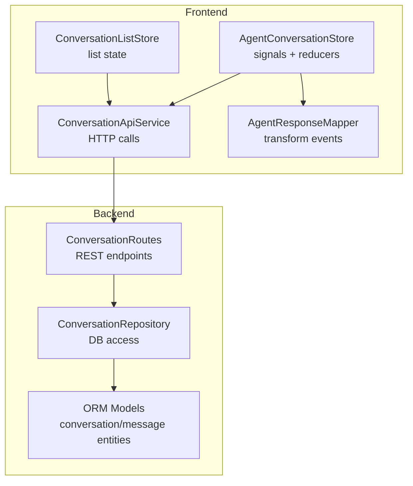
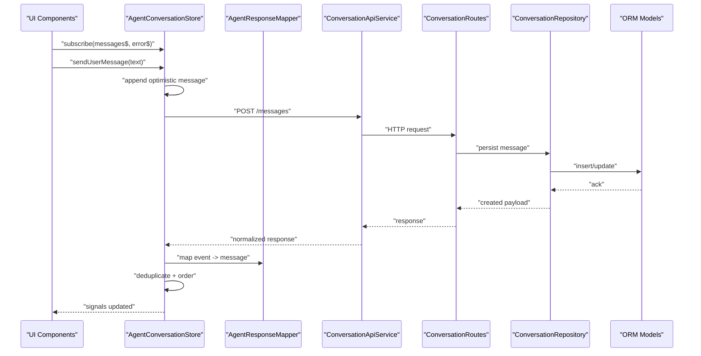
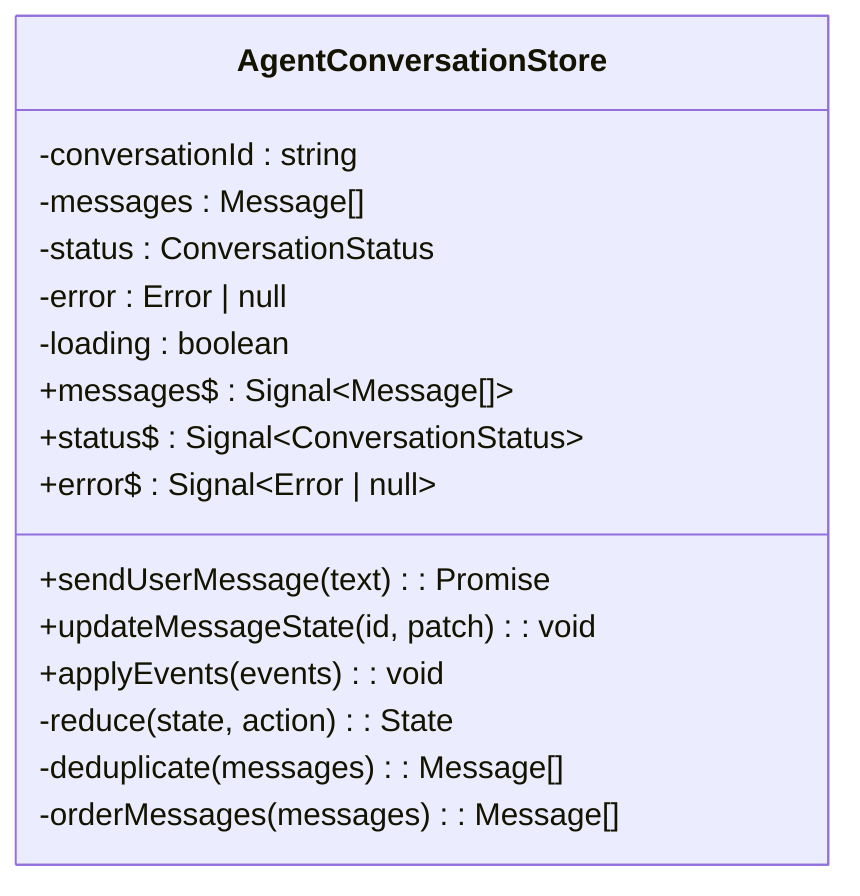
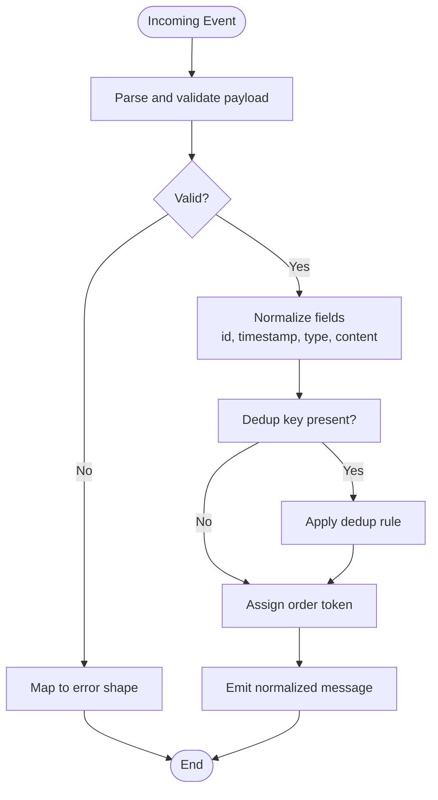
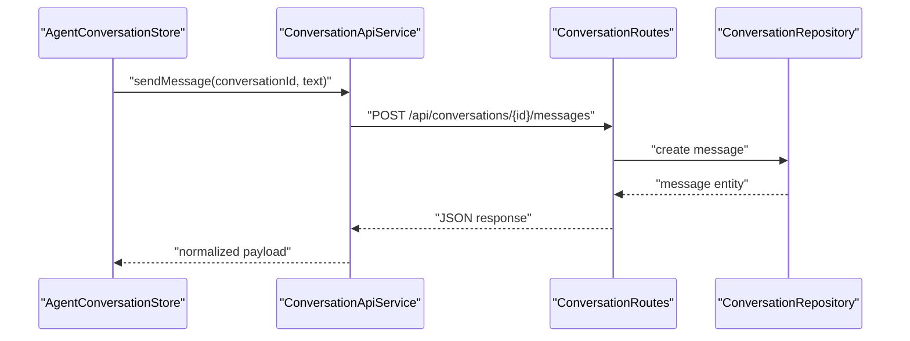
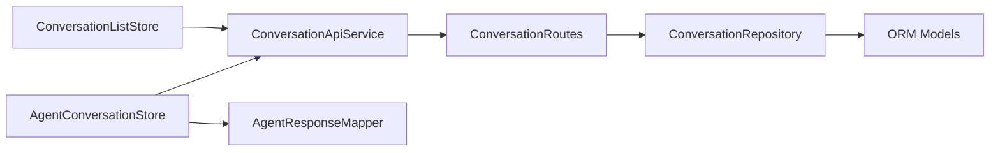

# Conversation Store & State Management

<cite>
**Referenced Files in This Document**
- [agent-conversation.store.ts](file://frontend/src/app/features/assistant-conversation/agent-conversation.store.ts)
- [agent-conversation.store.spec.ts](file://frontend/src/app/features/assistant-conversation/agent-conversation.store.spec.ts)
- [conversation-api.service.ts](file://frontend/src/app/core/conversation/conversation-api.service.ts)
- [conversation.models.ts](file://frontend/src/app/core/conversation/conversation.models.ts)
- [agent-response.mapper.ts](file://frontend/src/app/features/assistant-conversation/agent-response.mapper.ts)
- [agent-response.mapper.spec.ts](file://frontend/src/app/features/assistant-conversation/agent-response.mapper.spec.ts)
- [conversation-list.store.ts](file://frontend/src/app/features/conversation-list/conversation-list.store.ts)
- [conversation.routes.ts](file://app/api/conversation_routes.py)
- [conversation_repository.py](file://app/repositories/conversation_repository.py)
- [conversation_models.py](file://app/db/orm_models.py)
- [test_conversation_store.py](file://tests/test_conversation_store.py)
</cite>

## Table of Contents
1. [Introduction](#introduction)
2. [Project Structure](#project-structure)
3. [Core Components](#core-components)
4. [Architecture Overview](#architecture-overview)
5. [Detailed Component Analysis](#detailed-component-analysis)
6. [Dependency Analysis](#dependency-analysis)
7. [Performance Considerations](#performance-considerations)
8. [Troubleshooting Guide](#troubleshooting-guide)
9. [Conclusion](#conclusion)

## Introduction
This document explains the conversation store and state management system used by the assistant conversation feature. It focuses on:
- Reactive state architecture using signals for fine-grained reactivity
- Conversation lifecycle management from creation to completion
- Message ordering, deduplication, and conflict resolution
- Real-time synchronization with server-sent events (SSE)
- Error handling patterns and recovery strategies
- Concurrency control and data consistency across components
- Practical examples for subscribing to changes, updating message states, and implementing custom transformations

The goal is to provide both a conceptual overview and code-level insights so that developers can extend or debug the conversation store confidently.

## Project Structure
The conversation store spans frontend and backend layers:
- Frontend: Angular-based reactive store using signals, API service, mappers, and SSE integration
- Backend: REST endpoints, repositories, and ORM models for persistence and retrieval

**Diagram sources**
- [agent-conversation.store.ts](file://frontend/src/app/features/assistant-conversation/agent-conversation.store.ts)
- [conversation-api.service.ts](file://frontend/src/app/core/conversation/conversation-api.service.ts)
- [agent-response.mapper.ts](file://frontend/src/app/features/assistant-conversation/agent-response.mapper.ts)
- [conversation-list.store.ts](file://frontend/src/app/features/conversation-list/conversation-list.store.ts)
- [conversation_routes.py](file://app/api/conversation_routes.py)
- [conversation_repository.py](file://app/repositories/conversation_repository.py)
- [conversation_models.py](file://app/db/orm_models.py)

**Section sources**
- [agent-conversation.store.ts](file://frontend/src/app/features/assistant-conversation/agent-conversation.store.ts)
- [conversation-api.service.ts](file://frontend/src/app/core/conversation/conversation-api.service.ts)
- [conversation-list.store.ts](file://frontend/src/app/features/conversation-list/conversation-list.store.ts)
- [conversation_routes.py](file://app/api/conversation_routes.py)
- [conversation_repository.py](file://app/repositories/conversation_repository.py)
- [conversation_models.py](file://app/db/orm_models.py)

## Core Components
- AgentConversationStore: Centralized reactive store for a single conversation. Manages messages, metadata, loading/error flags, and derived views via signals. Provides methods to append, update, and transform messages while preserving order and uniqueness.
- ConversationApiService: Encapsulates HTTP interactions for fetching conversations, sending messages, and retrieving history. Normalizes responses and errors.
- AgentResponseMapper: Transforms incoming event payloads into normalized message shapes suitable for the store. Applies deduplication keys and stable ordering fields.
- ConversationListStore: Maintains list-level state such as active conversation id, pagination, and search filters. Bridges between routing and the conversation store.
- Backend Routes and Repository: Provide persistence and retrieval APIs for conversations and messages, ensuring consistent schema and constraints.

Key responsibilities:
- Maintain a single source of truth per conversation
- Expose read-only signals for UI binding
- Apply deterministic updates to avoid flicker and duplicates
- Handle partial failures gracefully and surface actionable errors

**Section sources**
- [agent-conversation.store.ts](file://frontend/src/app/features/assistant-conversation/agent-conversation.store.ts)
- [conversation-api.service.ts](file://frontend/src/app/core/conversation/conversation-api.service.ts)
- [agent-response.mapper.ts](file://frontend/src/app/features/assistant-conversation/agent-response.mapper.ts)
- [conversation-list.store.ts](file://frontend/src/app/features/conversation-list/conversation-list.store.ts)
- [conversation_routes.py](file://app/api/conversation_routes.py)
- [conversation_repository.py](file://app/repositories/conversation_repository.py)

## Architecture Overview
The store follows a unidirectional data flow with reactive signals:
- UI subscribes to store signals
- Actions trigger reducers that compute new state immutably
- Side effects (API calls, SSE) are isolated and merged back into the store
- Derived signals compute read-only projections for performance

**Diagram sources**
- [agent-conversation.store.ts](file://frontend/src/app/features/assistant-conversation/agent-conversation.store.ts)
- [agent-response.mapper.ts](file://frontend/src/app/features/assistant-conversation/agent-response.mapper.ts)
- [conversation-api.service.ts](file://frontend/src/app/core/conversation/conversation-api.service.ts)
- [conversation_routes.py](file://app/api/conversation_routes.py)
- [conversation_repository.py](file://app/repositories/conversation_repository.py)
- [conversation_models.py](file://app/db/orm_models.py)

## Detailed Component Analysis

### AgentConversationStore
Responsibilities:
- Manage conversation context (id, title, status)
- Maintain ordered, deduplicated message list
- Track loading, error, and retry states
- Expose derived signals for UI consumption
- Coordinate SSE-driven updates and HTTP-backed mutations

Reactive design:
- Internal state is encapsulated; only signals are exposed
- Reducers compute next state deterministically
- Derived signals memoize expensive computations

Concurrency and consistency:
- Optimistic updates followed by reconciliation
- Idempotent operations keyed by stable identifiers
- Conflict resolution rules for out-of-order events

Error handling:
- Normalize network and validation errors
- Surface transient vs permanent failures
- Provide retry hooks and safe fallbacks

Examples:
- Subscribe to messages signal
- Update message state (e.g., mark as delivered)
- Custom transformation pipeline for rendering

**Diagram sources**
- [agent-conversation.store.ts](file://frontend/src/app/features/assistant-conversation/agent-conversation.store.ts)

**Section sources**
- [agent-conversation.store.ts](file://frontend/src/app/features/assistant-conversation/agent-conversation.store.ts)
- [agent-conversation.store.spec.ts](file://frontend/src/app/features/assistant-conversation/agent-conversation.store.spec.ts)

### AgentResponseMapper
Responsibilities:
- Normalize heterogeneous event payloads into canonical message shape
- Assign stable IDs and timestamps for ordering and deduplication
- Map status transitions and metadata

Design principles:
- Pure functions for predictable transformations
- Defensive parsing with explicit error paths
- Extensible mapping registry for future event types

**Diagram sources**
- [agent-response.mapper.ts](file://frontend/src/app/features/assistant-conversation/agent-response.mapper.ts)

**Section sources**
- [agent-response.mapper.ts](file://frontend/src/app/features/assistant-conversation/agent-response.mapper.ts)
- [agent-response.mapper.spec.ts](file://frontend/src/app/features/assistant-conversation/agent-response.mapper.spec.ts)

### ConversationApiService
Responsibilities:
- Wrap HTTP requests for conversation CRUD and messaging
- Attach authentication headers and request IDs
- Normalize responses and map backend errors to domain errors

Integration points:
- Interceptors for auth and error handling
- Retry policies for transient failures
- SSE client integration for real-time updates

**Diagram sources**
- [conversation-api.service.ts](file://frontend/src/app/core/conversation/conversation-api.service.ts)
- [conversation_routes.py](file://app/api/conversation_routes.py)
- [conversation_repository.py](file://app/repositories/conversation_repository.py)

**Section sources**
- [conversation-api.service.ts](file://frontend/src/app/core/conversation/conversation-api.service.ts)
- [conversation_routes.py](file://app/api/conversation_routes.py)
- [conversation_repository.py](file://app/repositories/conversation_repository.py)

### ConversationListStore
Responsibilities:
- Track active conversation id and list pagination
- Bridge between route parameters and conversation store initialization
- Provide derived signals for list filtering and sorting

Interaction model:
- Initializes conversation store when route changes
- Syncs list selection with active conversation

**Section sources**
- [conversation-list.store.ts](file://frontend/src/app/features/conversation-list/conversation-list.store.ts)

### Backend Persistence Layer
Responsibilities:
- Define conversation and message schemas
- Enforce constraints and indexes for ordering and deduplication
- Provide repository methods for efficient queries

Data consistency:
- Unique constraints on message ids
- Timestamps and sequence numbers for ordering
- Transactional writes for atomicity

**Section sources**
- [conversation_routes.py](file://app/api/conversation_routes.py)
- [conversation_repository.py](file://app/repositories/conversation_repository.py)
- [conversation_models.py](file://app/db/orm_models.py)

## Dependency Analysis
The store depends on:
- API service for persistence and retrieval
- Mapper for transforming external events
- List store for coordination at the feature boundary
- Backend routes and repository for data integrity

**Diagram sources**
- [agent-conversation.store.ts](file://frontend/src/app/features/assistant-conversation/agent-conversation.store.ts)
- [conversation-api.service.ts](file://frontend/src/app/core/conversation/conversation-api.service.ts)
- [agent-response.mapper.ts](file://frontend/src/app/features/assistant-conversation/agent-response.mapper.ts)
- [conversation-list.store.ts](file://frontend/src/app/features/conversation-list/conversation-list.store.ts)
- [conversation_routes.py](file://app/api/conversation_routes.py)
- [conversation_repository.py](file://app/repositories/conversation_repository.py)
- [conversation_models.py](file://app/db/orm_models.py)

**Section sources**
- [agent-conversation.store.ts](file://frontend/src/app/features/assistant-conversation/agent-conversation.store.ts)
- [conversation-api.service.ts](file://frontend/src/app/core/conversation/conversation-api.service.ts)
- [agent-response.mapper.ts](file://frontend/src/app/features/assistant-conversation/agent-response.mapper.ts)
- [conversation-list.store.ts](file://frontend/src/app/features/conversation-list/conversation-list.store.ts)
- [conversation_routes.py](file://app/api/conversation_routes.py)
- [conversation_repository.py](file://app/repositories/conversation_repository.py)
- [conversation_models.py](file://app/db/orm_models.py)

## Performance Considerations
- Use derived signals to compute heavy projections once and reuse across components
- Prefer immutable updates to minimize change detection overhead
- Batch multiple small updates into a single reducer call where possible
- Leverage stable IDs and indices to optimize diffing
- Avoid unnecessary subscriptions; use computed signals instead

[No sources needed since this section provides general guidance]

## Troubleshooting Guide
Common issues and resolutions:
- Duplicate messages: Verify dedup key assignment and ensure unique constraints exist in the backend
- Out-of-order messages: Confirm stable ordering tokens and that reducers apply ordering after deduplication
- Stale UI state: Ensure SSE events are merged into the store and not bypassing reducers
- Network errors: Check error normalization and retry policies; distinguish transient vs permanent failures
- Memory leaks: Unsubscribe from signals or use onDestroy lifecycle hooks appropriately

Validation references:
- Unit tests for store behavior and mapper correctness
- Integration tests for conversation persistence and retrieval

**Section sources**
- [agent-conversation.store.spec.ts](file://frontend/src/app/features/assistant-conversation/agent-conversation.store.spec.ts)
- [agent-response.mapper.spec.ts](file://frontend/src/app/features/assistant-conversation/agent-response.mapper.spec.ts)
- [test_conversation_store.py](file://tests/test_conversation_store.py)

## Conclusion
The conversation store implements a robust, reactive architecture centered on signals, deterministic reducers, and clear separation of concerns. It ensures message ordering and deduplication, integrates real-time updates via SSE, and handles errors gracefully. By following the patterns outlined here—optimistic updates with reconciliation, pure transformations, and derived signals—you can maintain consistency and performance across components.

[No sources needed since this section summarizes without analyzing specific files]