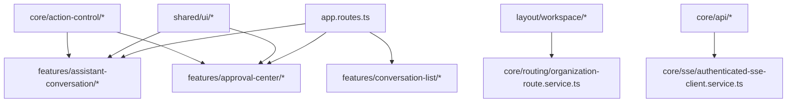
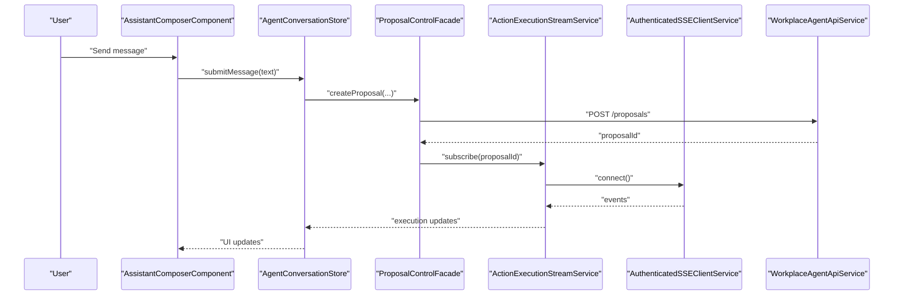
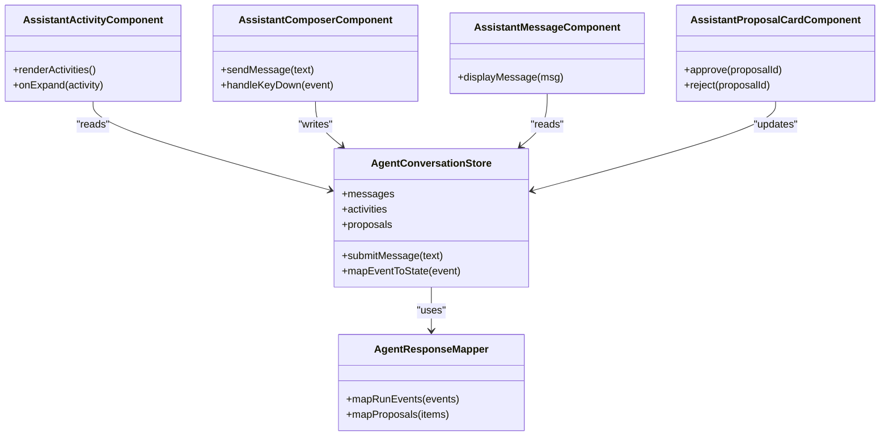
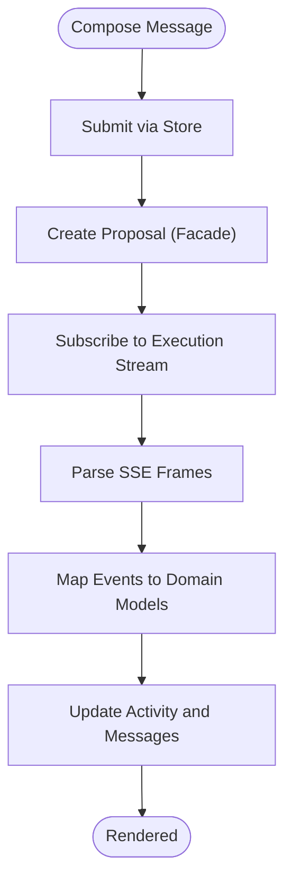
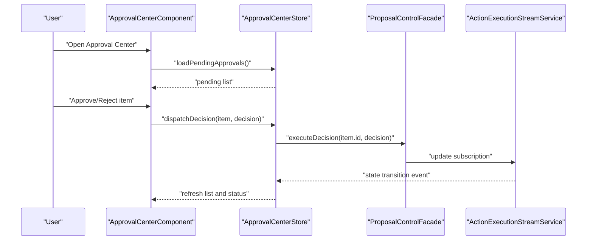
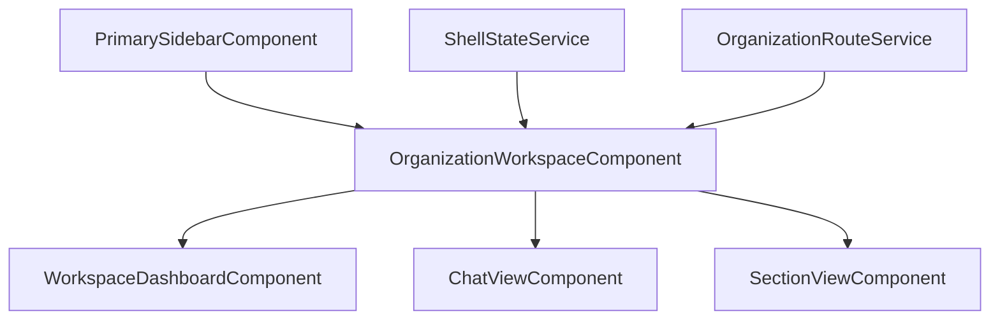
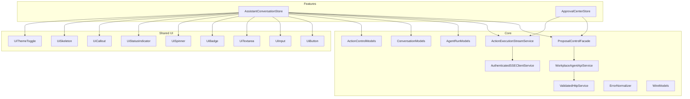

# Feature Modules

<cite>
**Referenced Files in This Document**
- [app.routes.ts](file://frontend/src/app/app.routes.ts)
- [app.config.ts](file://frontend/src/app/app.config.ts)
- [assistant-conversation.store.ts](file://frontend/src/app/features/assistant-conversation/agent-conversation.store.ts)
- [assistant-activity.component.ts](file://frontend/src/app/features/assistant-conversation/assistant-activity/assistant-activity.component.ts)
- [assistant-composer.component.ts](file://frontend/src/app/features/assistant-conversation/assistant-composer/assistant-composer.component.ts)
- [assistant-message.component.ts](file://frontend/src/app/features/assistant-conversation/assistant-message/assistant-message.component.ts)
- [assistant-proposal-card.component.ts](file://frontend/src/app/features/assistant-conversation/assistant-proposal-card/assistant-proposal-card.component.ts)
- [agent-response.mapper.ts](file://frontend/src/app/features/assistant-conversation/agent-response.mapper.ts)
- [conversation-list.store.ts](file://frontend/src/app/features/conversation-list/conversation-list.store.ts)
- [approval-center.component.ts](file://frontend/src/app/features/approval-center/approval-center.component.ts)
- [approval-center.store.ts](file://frontend/src/app/features/approval-center/approval-center.store.ts)
- [organization-workspace.component.ts](file://frontend/src/app/layout/workspace/organization-workspace.component.ts)
- [workspace-dashboard.component.ts](file://frontend/src/app/layout/workspace/workspace-dashboard.component.ts)
- [chat-view.component.ts](file://frontend/src/app/layout/workspace/chat-view.component.ts)
- [section-view.component.ts](file://frontend/src/app/layout/workspace/section-view.component.ts)
- [primary-sidebar.component.ts](file://frontend/src/app/layout/primary-sidebar/primary-sidebar.component.ts)
- [shell-state.service.ts](file://frontend/src/app/layout/shell/shell-state.service.ts)
- [action-control.facade.ts](file://frontend/src/app/core/action-control/proposal-control.facade.ts)
- [action-execution-stream.service.ts](file://frontend/src/app/core/action-control/action-execution-stream.service.ts)
- [agent-run-stream.service.ts](file://frontend/src/app/core/agent-run/agent-run-stream.service.ts)
- [authenticated-sse-client.service.ts](file://frontend/src/app/core/sse/authenticated-sse-client.service.ts)
- [workplace-agent-api.service.ts](file://frontend/src/app/core/api/workplace-agent-api.service.ts)
- [validated-http.service.ts](file://frontend/src/app/core/api/validated-http.service.ts)
- [api-error.interceptor.ts](file://frontend/src/app/core/api/api-error.interceptor.ts)
- [request-id.interceptor.ts](file://frontend/src/app/core/api/request-id.interceptor.ts)
- [auth-header.interceptor.ts](file://frontend/src/app/core/auth/auth-header.interceptor.ts)
- [current-user.store.ts](file://frontend/src/app/core/auth/current-user.store.ts)
- [organization-route.service.ts](file://frontend/src/app/core/routing/organization-route.service.ts)
- [auth.guard.ts](file://frontend/src/app/core/routing/auth.guard.ts)
- [ui-action-surface.component.ts](file://frontend/src/app/shared/ui/ui-action-surface/ui-action-surface.component.ts)
- [ui-button.component.ts](file://frontend/src/app/shared/ui/ui-button/ui-button.component.ts)
- [ui-input.component.ts](file://frontend/src/app/shared/ui/ui-input/ui-input.component.ts)
- [ui-textarea.component.ts](file://frontend/src/app/shared/ui/ui-textarea/ui-textarea.component.ts)
- [ui-badge.component.ts](file://frontend/src/app/shared/ui/ui-badge/ui-badge.component.ts)
- [ui-spinner.component.ts](file://frontend/src/app/shared/ui/ui-spinner/ui-spinner.component.ts)
- [ui-status-indicator.component.ts](file://frontend/src/app/shared/ui/ui-status-indicator/ui-status-indicator.component.ts)
- [ui-callout.component.ts](file://frontend/src/app/shared/ui/ui-callout/ui-callout.component.ts)
- [ui-skeleton.component.ts](file://frontend/src/app/shared/ui/ui-skeleton/ui-skeleton.component.ts)
- [ui-theme-toggle.component.ts](file://frontend/src/app/shared/theme/ui-theme-toggle.component.ts)
- [ui-theme.service.ts](file://frontend/src/app/shared/theme/ui-theme.service.ts)
- [agent-run.models.ts](file://frontend/src/app/core/agent-run/agent-run.models.ts)
- [conversation.models.ts](file://frontend/src/app/core/conversation/conversation.models.ts)
- [action-control.models.ts](file://frontend/src/app/core/action-control/action-control.models.ts)
- [wire.models.ts](file://frontend/src/app/core/api/wire.models.ts)
- [error-normalizer.ts](file://frontend/src/app/core/errors/error-normalizer.ts)
- [workplace-api.error.ts](file://frontend/src/app/core/errors/workplace-api.error.ts)
- [agent-run.schemas.ts](file://frontend/src/app/core/agent-run/agent-run.schemas.ts)
- [wire.schemas.ts](file://frontend/src/app/core/api/wire.schemas.ts)
- [action-control.schemas.ts](file://frontend/src/app/core/action-control/action-control.schemas.ts)
- [conversation-api.service.ts](file://frontend/src/app/core/conversation/conversation-api.service.ts)
- [agent-run-api.service.ts](file://frontend/src/app/core/agent-run/agent-run-api.service.ts)
- [action-control-api.service.ts](file://frontend/src/app/core/action-control/action-control-api.service.ts)
- [sse-frame-parser.ts](file://frontend/src/app/core/agent-run/sse-frame-parser.ts)
- [agent-run-stream.service.spec.ts](file://frontend/src/app/core/agent-run/agent-run-stream.service.spec.ts)
- [assistant-composer.component.spec.ts](file://frontend/src/app/features/assistant-conversation/assistant-composer/assistant-composer.component.spec.ts)
- [agent-conversation.store.spec.ts](file://frontend/src/app/features/assistant-conversation/agent-conversation.store.spec.ts)
- [assistant-proposal-control.spec.ts](file://frontend/e2e/assistant-proposal-control.spec.ts)
- [assistant-conversation.spec.ts](file://frontend/e2e/assistant-conversation.spec.ts)
- [approval-center.spec.ts](file://frontend/e2e/approval-center.spec.ts)
</cite>

## Table of Contents
1. [Introduction](#introduction)
2. [Project Structure](#project-structure)
3. [Core Components](#core-components)
4. [Architecture Overview](#architecture-overview)
5. [Detailed Component Analysis](#detailed-component-analysis)
6. [Dependency Analysis](#dependency-analysis)
7. [Performance Considerations](#performance-considerations)
8. [Troubleshooting Guide](#troubleshooting-guide)
9. [Conclusion](#conclusion)
10. [Appendices](#appendices)

## Introduction
This document explains the feature modules architecture with a focus on:
- Assistant conversation feature: real-time chat interface, activity display, and proposal cards
- Approval center workflow for action review and decision making
- Workspace management components for multi-organization navigation and resource browsing
- Patterns for creating new features, state management within features, and inter-feature communication
- Testing strategies specific to feature modules

The frontend is organized into core infrastructure, shared UI primitives, layout shell, and feature modules. Features communicate via stores, facades, and streams (SSE), while the workspace provides multi-organization context and routing.

## Project Structure
At a high level:
- app.routes.ts defines top-level routes that load feature modules
- app.config.ts configures providers, interceptors, guards, and global services
- features/ contains feature modules such as assistant-conversation, approval-center, conversation-list
- layout/ contains shell and workspace components for organization context and navigation
- core/ contains cross-cutting concerns: API clients, SSE streaming, auth, routing helpers, error normalization, schemas
- shared/ contains reusable UI components and theme utilities

**Diagram sources**
- [app.routes.ts](file://frontend/src/app/app.routes.ts)
- [organization-route.service.ts](file://frontend/src/app/core/routing/organization-route.service.ts)
- [authenticated-sse-client.service.ts](file://frontend/src/app/core/sse/authenticated-sse-client.service.ts)
- [assistant-conversation.store.ts](file://frontend/src/app/features/assistant-conversation/agent-conversation.store.ts)
- [approval-center.store.ts](file://frontend/src/app/features/approval-center/approval-center.store.ts)
- [action-control.facade.ts](file://frontend/src/app/core/action-control/proposal-control.facade.ts)

**Section sources**
- [app.routes.ts](file://frontend/src/app/app.routes.ts)
- [app.config.ts](file://frontend/src/app/app.config.ts)

## Core Components
- Assistant Conversation Store: orchestrates messages, activities, proposals, and SSE updates for a single conversation
- Approval Center Store: manages pending approvals, decisions, and related actions
- Action Control Facade: exposes a stable API for proposal lifecycle operations used by both conversation and approval center
- Workspace Shell: maintains current organization context and navigates between sections and views
- Shared UI Primitives: buttons, inputs, surfaces, badges, spinners, status indicators, callouts, skeletons, and theme toggle

Key responsibilities:
- State encapsulation per feature using stores
- Real-time updates via SSE streams
- Cross-feature coordination through facades and shared models
- Consistent error handling and validation via interceptors and schemas

**Section sources**
- [assistant-conversation.store.ts](file://frontend/src/app/features/assistant-conversation/agent-conversation.store.ts)
- [approval-center.store.ts](file://frontend/src/app/features/approval-center/approval-center.store.ts)
- [action-control.facade.ts](file://frontend/src/app/core/action-control/proposal-control.facade.ts)
- [organization-workspace.component.ts](file://frontend/src/app/layout/workspace/organization-workspace.component.ts)
- [ui-button.component.ts](file://frontend/src/app/shared/ui/ui-button/ui-button.component.ts)
- [ui-input.component.ts](file://frontend/src/app/shared/ui/ui-input/ui-input.component.ts)
- [ui-textarea.component.ts](file://frontend/src/app/shared/ui/ui-textarea/ui-textarea.component.ts)
- [ui-badge.component.ts](file://frontend/src/app/shared/ui/ui-badge/ui-badge.component.ts)
- [ui-spinner.component.ts](file://frontend/src/app/shared/ui/ui-spinner/ui-spinner.component.ts)
- [ui-status-indicator.component.ts](file://frontend/src/app/shared/ui/ui-status-indicator/ui-status-indicator.component.ts)
- [ui-callout.component.ts](file://frontend/src/app/shared/ui/ui-callout/ui-callout.component.ts)
- [ui-skeleton.component.ts](file://frontend/src/app/shared/ui/ui-skeleton/ui-skeleton.component.ts)
- [ui-theme-toggle.component.ts](file://frontend/src/app/shared/theme/ui-theme-toggle.component.ts)

## Architecture Overview
The feature modules follow a layered pattern:
- Presentation layer: Angular components for each feature
- State layer: feature stores and shared facades
- Integration layer: API services and SSE stream services
- Infrastructure: interceptors, auth, routing, error normalization, schema validation

**Diagram sources**
- [assistant-composer.component.ts](file://frontend/src/app/features/assistant-conversation/assistant-composer/assistant-composer.component.ts)
- [assistant-conversation.store.ts](file://frontend/src/app/features/assistant-conversation/agent-conversation.store.ts)
- [action-control.facade.ts](file://frontend/src/app/core/action-control/proposal-control.facade.ts)
- [action-execution-stream.service.ts](file://frontend/src/app/core/action-control/action-execution-stream.service.ts)
- [authenticated-sse-client.service.ts](file://frontend/src/app/core/sse/authenticated-sse-client.service.ts)
- [workplace-agent-api.service.ts](file://frontend/src/app/core/api/workplace-agent-api.service.ts)

## Detailed Component Analysis

### Assistant Conversation Feature
The assistant conversation feature provides a real-time chat interface with an activity feed and interactive proposal cards. It composes multiple components around a central store.

Key elements:
- AssistantActivity: renders agent activities and execution progress
- AssistantComposer: user input and send controls
- AssistantMessage: displays user and assistant messages
- AssistantProposalCard: shows actionable proposals with approve/reject flows
- AgentConversationStore: owns conversation state, maps events to UI state, and coordinates with facades and streams
- AgentResponseMapper: transforms backend responses into domain models for UI consumption

**Diagram sources**
- [assistant-activity.component.ts](file://frontend/src/app/features/assistant-conversation/assistant-activity/assistant-activity.component.ts)
- [assistant-composer.component.ts](file://frontend/src/app/features/assistant-conversation/assistant-composer/assistant-composer.component.ts)
- [assistant-message.component.ts](file://frontend/src/app/features/assistant-conversation/assistant-message/assistant-message.component.ts)
- [assistant-proposal-card.component.ts](file://frontend/src/app/features/assistant-conversation/assistant-proposal-card/assistant-proposal-card.component.ts)
- [assistant-conversation.store.ts](file://frontend/src/app/features/assistant-conversation/agent-conversation.store.ts)
- [agent-response.mapper.ts](file://frontend/src/app/features/assistant-conversation/agent-response.mapper.ts)

Real-time flow:
- The composer triggers a proposal creation via the action control facade
- The store subscribes to execution events via the action execution stream service
- SSE frames are parsed and mapped to UI state changes
- Proposal cards reflect pending/approved/rejected states based on events

**Diagram sources**
- [action-execution-stream.service.ts](file://frontend/src/app/core/action-control/action-execution-stream.service.ts)
- [sse-frame-parser.ts](file://frontend/src/app/core/agent-run/sse-frame-parser.ts)
- [agent-run.models.ts](file://frontend/src/app/core/agent-run/agent-run.models.ts)
- [agent-response.mapper.ts](file://frontend/src/app/features/assistant-conversation/agent-response.mapper.ts)

**Section sources**
- [assistant-activity.component.ts](file://frontend/src/app/features/assistant-conversation/assistant-activity/assistant-activity.component.ts)
- [assistant-composer.component.ts](file://frontend/src/app/features/assistant-conversation/assistant-composer/assistant-composer.component.ts)
- [assistant-message.component.ts](file://frontend/src/app/features/assistant-conversation/assistant-message/assistant-message.component.ts)
- [assistant-proposal-card.component.ts](file://frontend/src/app/features/assistant-conversation/assistant-proposal-card/assistant-proposal-card.component.ts)
- [assistant-conversation.store.ts](file://frontend/src/app/features/assistant-conversation/agent-conversation.store.ts)
- [agent-response.mapper.ts](file://frontend/src/app/features/assistant-conversation/agent-response.mapper.ts)
- [action-execution-stream.service.ts](file://frontend/src/app/core/action-control/action-execution-stream.service.ts)
- [sse-frame-parser.ts](file://frontend/src/app/core/agent-run/sse-frame-parser.ts)
- [agent-run.models.ts](file://frontend/src/app/core/agent-run/agent-run.models.ts)

### Approval Center Workflow
The approval center enables users to review proposed actions and make decisions. It integrates with the same action control plane used by the assistant conversation.

Key elements:
- ApprovalCenterComponent: lists pending approvals and decision actions
- ApprovalCenterStore: holds pending items, decision results, and filters
- ActionControlFacade: performs approve/reject operations
- ActionExecutionStreamService: reflects state transitions after decisions

**Diagram sources**
- [approval-center.component.ts](file://frontend/src/app/features/approval-center/approval-center.component.ts)
- [approval-center.store.ts](file://frontend/src/app/features/approval-center/approval-center.store.ts)
- [action-control.facade.ts](file://frontend/src/app/core/action-control/proposal-control.facade.ts)
- [action-execution-stream.service.ts](file://frontend/src/app/core/action-control/action-execution-stream.service.ts)

**Section sources**
- [approval-center.component.ts](file://frontend/src/app/features/approval-center/approval-center.component.ts)
- [approval-center.store.ts](file://frontend/src/app/features/approval-center/approval-center.store.ts)
- [action-control.facade.ts](file://frontend/src/app/core/action-control/proposal-control.facade.ts)
- [action-execution-stream.service.ts](file://frontend/src/app/core/action-control/action-execution-stream.service.ts)

### Workspace Management Components
Workspace components provide multi-organization navigation and resource browsing. They maintain the current organization context and route to appropriate views.

Key elements:
- OrganizationWorkspaceComponent: hosts workspace content and binds to organization context
- WorkspaceDashboardComponent: overview and entry points for resources
- ChatViewComponent: embeds assistant conversation view within workspace
- SectionViewComponent: generic section container for workspace pages
- PrimarySidebarComponent: navigation menu across sections
- ShellStateService: global shell state including active organization and section
- OrganizationRouteService: resolves organization-scoped routes

**Diagram sources**
- [organization-workspace.component.ts](file://frontend/src/app/layout/workspace/organization-workspace.component.ts)
- [workspace-dashboard.component.ts](file://frontend/src/app/layout/workspace/workspace-dashboard.component.ts)
- [chat-view.component.ts](file://frontend/src/app/layout/workspace/chat-view.component.ts)
- [section-view.component.ts](file://frontend/src/app/layout/workspace/section-view.component.ts)
- [primary-sidebar.component.ts](file://frontend/src/app/layout/primary-sidebar/primary-sidebar.component.ts)
- [shell-state.service.ts](file://frontend/src/app/layout/shell/shell-state.service.ts)
- [organization-route.service.ts](file://frontend/src/app/core/routing/organization-route.service.ts)

**Section sources**
- [organization-workspace.component.ts](file://frontend/src/app/layout/workspace/organization-workspace.component.ts)
- [workspace-dashboard.component.ts](file://frontend/src/app/layout/workspace/workspace-dashboard.component.ts)
- [chat-view.component.ts](file://frontend/src/app/layout/workspace/chat-view.component.ts)
- [section-view.component.ts](file://frontend/src/app/layout/workspace/section-view.component.ts)
- [primary-sidebar.component.ts](file://frontend/src/app/layout/primary-sidebar/primary-sidebar.component.ts)
- [shell-state.service.ts](file://frontend/src/app/layout/shell/shell-state.service.ts)
- [organization-route.service.ts](file://frontend/src/app/core/routing/organization-route.service.ts)

### Patterns for Creating New Features
Recommended structure:
- Feature folder under features/<feature-name>/
- Component(s) for presentation
- Store for local state and side effects
- Optional mapper or adapter if transforming wire models
- Use facades from core/action-control for cross-feature operations
- Register routes in app.routes.ts and configure providers in app.config.ts

State management within features:
- Keep feature-specific state in the feature store
- Expose only necessary methods to components
- Use immutable updates and derived state where possible
- Integrate with SSE streams for real-time updates

Inter-feature communication:
- Use shared facades (e.g., proposal control) for coordinated actions
- Share models and schemas from core to ensure consistency
- Avoid direct component-to-component coupling; prefer store/facade patterns

**Section sources**
- [app.routes.ts](file://frontend/src/app/app.routes.ts)
- [app.config.ts](file://frontend/src/app/app.config.ts)
- [action-control.facade.ts](file://frontend/src/app/core/action-control/proposal-control.facade.ts)
- [assistant-conversation.store.ts](file://frontend/src/app/features/assistant-conversation/agent-conversation.store.ts)
- [approval-center.store.ts](file://frontend/src/app/features/approval-center/approval-center.store.ts)

### Testing Strategies Specific to Feature Modules
Unit tests:
- Test stores for state transitions and event mapping
- Test mappers for correctness against schemas
- Test components with mocked services and stores

Integration tests:
- Validate SSE frame parsing and stream behavior
- Verify API interactions via validated HTTP service and interceptors

E2E tests:
- Cover end-to-end flows for assistant conversations and approval center decisions
- Assert UI state changes and user interactions

Examples of test files:
- [agent-run-stream.service.spec.ts](file://frontend/src/app/core/agent-run/agent-run-stream.service.spec.ts)
- [assistant-composer.component.spec.ts](file://frontend/src/app/features/assistant-conversation/assistant-composer/assistant-composer.component.spec.ts)
- [agent-conversation.store.spec.ts](file://frontend/src/app/features/assistant-conversation/agent-conversation.store.spec.ts)
- [assistant-proposal-control.spec.ts](file://frontend/e2e/assistant-proposal-control.spec.ts)
- [assistant-conversation.spec.ts](file://frontend/e2e/assistant-conversation.spec.ts)
- [approval-center.spec.ts](file://frontend/e2e/approval-center.spec.ts)

**Section sources**
- [agent-run-stream.service.spec.ts](file://frontend/src/app/core/agent-run/agent-run-stream.service.spec.ts)
- [assistant-composer.component.spec.ts](file://frontend/src/app/features/assistant-conversation/assistant-composer/assistant-composer.component.spec.ts)
- [agent-conversation.store.spec.ts](file://frontend/src/app/features/assistant-conversation/agent-conversation.store.spec.ts)
- [assistant-proposal-control.spec.ts](file://frontend/e2e/assistant-proposal-control.spec.ts)
- [assistant-conversation.spec.ts](file://frontend/e2e/assistant-conversation.spec.ts)
- [approval-center.spec.ts](file://frontend/e2e/approval-center.spec.ts)

## Dependency Analysis
Feature modules depend on core services and shared UI components. The following diagram highlights key dependencies:

**Diagram sources**
- [assistant-conversation.store.ts](file://frontend/src/app/features/assistant-conversation/agent-conversation.store.ts)
- [approval-center.store.ts](file://frontend/src/app/features/approval-center/approval-center.store.ts)
- [action-control.facade.ts](file://frontend/src/app/core/action-control/proposal-control.facade.ts)
- [action-execution-stream.service.ts](file://frontend/src/app/core/action-control/action-execution-stream.service.ts)
- [authenticated-sse-client.service.ts](file://frontend/src/app/core/sse/authenticated-sse-client.service.ts)
- [workplace-agent-api.service.ts](file://frontend/src/app/core/api/workplace-agent-api.service.ts)
- [validated-http.service.ts](file://frontend/src/app/core/api/validated-http.service.ts)
- [agent-run.models.ts](file://frontend/src/app/core/agent-run/agent-run.models.ts)
- [conversation.models.ts](file://frontend/src/app/core/conversation/conversation.models.ts)
- [action-control.models.ts](file://frontend/src/app/core/action-control/action-control.models.ts)
- [wire.models.ts](file://frontend/src/app/core/api/wire.models.ts)
- [ui-button.component.ts](file://frontend/src/app/shared/ui/ui-button/ui-button.component.ts)
- [ui-input.component.ts](file://frontend/src/app/shared/ui/ui-input/ui-input.component.ts)
- [ui-textarea.component.ts](file://frontend/src/app/shared/ui/ui-textarea/ui-textarea.component.ts)
- [ui-badge.component.ts](file://frontend/src/app/shared/ui/ui-badge/ui-badge.component.ts)
- [ui-spinner.component.ts](file://frontend/src/app/shared/ui/ui-spinner/ui-spinner.component.ts)
- [ui-status-indicator.component.ts](file://frontend/src/app/shared/ui/ui-status-indicator/ui-status-indicator.component.ts)
- [ui-callout.component.ts](file://frontend/src/app/shared/ui/ui-callout/ui-callout.component.ts)
- [ui-skeleton.component.ts](file://frontend/src/app/shared/ui/ui-skeleton/ui-skeleton.component.ts)
- [ui-theme-toggle.component.ts](file://frontend/src/app/shared/theme/ui-theme-toggle.component.ts)

**Section sources**
- [assistant-conversation.store.ts](file://frontend/src/app/features/assistant-conversation/agent-conversation.store.ts)
- [approval-center.store.ts](file://frontend/src/app/features/approval-center/approval-center.store.ts)
- [action-control.facade.ts](file://frontend/src/app/core/action-control/proposal-control.facade.ts)
- [action-execution-stream.service.ts](file://frontend/src/app/core/action-control/action-execution-stream.service.ts)
- [authenticated-sse-client.service.ts](file://frontend/src/app/core/sse/authenticated-sse-client.service.ts)
- [workplace-agent-api.service.ts](file://frontend/src/app/core/api/workplace-agent-api.service.ts)
- [validated-http.service.ts](file://frontend/src/app/core/api/validated-http.service.ts)
- [agent-run.models.ts](file://frontend/src/app/core/agent-run/agent-run.models.ts)
- [conversation.models.ts](file://frontend/src/app/core/conversation/conversation.models.ts)
- [action-control.models.ts](file://frontend/src/app/core/action-control/action-control.models.ts)
- [wire.models.ts](file://frontend/src/app/core/api/wire.models.ts)
- [ui-button.component.ts](file://frontend/src/app/shared/ui/ui-button/ui-button.component.ts)
- [ui-input.component.ts](file://frontend/src/app/shared/ui/ui-input/ui-input.component.ts)
- [ui-textarea.component.ts](file://frontend/src/app/shared/ui/ui-textarea/ui-textarea.component.ts)
- [ui-badge.component.ts](file://frontend/src/app/shared/ui/ui-badge/ui-badge.component.ts)
- [ui-spinner.component.ts](file://frontend/src/app/shared/ui/ui-spinner/ui-spinner.component.ts)
- [ui-status-indicator.component.ts](file://frontend/src/app/shared/ui/ui-status-indicator/ui-status-indicator.component.ts)
- [ui-callout.component.ts](file://frontend/src/app/shared/ui/ui-callout/ui-callout.component.ts)
- [ui-skeleton.component.ts](file://frontend/src/app/shared/ui/ui-skeleton/ui-skeleton.component.ts)
- [ui-theme-toggle.component.ts](file://frontend/src/app/shared/theme/ui-theme-toggle.component.ts)

## Performance Considerations
- Prefer observable-based streams for real-time updates to avoid unnecessary re-renders
- Debounce heavy computations in stores and mappers
- Use skeleton components during loading states to improve perceived performance
- Leverage schema validation at boundaries to fail fast and reduce downstream processing
- Minimize network calls by batching requests where feasible and caching read-only data

[No sources needed since this section provides general guidance]

## Troubleshooting Guide
Common issues and resolutions:
- Authentication failures: verify auth header interceptor and current user store
- Network errors: check API error interceptor and normalized error shapes
- SSE connection problems: inspect authenticated SSE client and frame parser logs
- Routing issues: confirm organization route service and guards are configured correctly
- Schema mismatches: validate wire models and run models against schemas

Relevant files:
- [api-error.interceptor.ts](file://frontend/src/app/core/api/api-error.interceptor.ts)
- [request-id.interceptor.ts](file://frontend/src/app/core/api/request-id.interceptor.ts)
- [auth-header.interceptor.ts](file://frontend/src/app/core/auth/auth-header.interceptor.ts)
- [current-user.store.ts](file://frontend/src/app/core/auth/current-user.store.ts)
- [organization-route.service.ts](file://frontend/src/app/core/routing/organization-route.service.ts)
- [auth.guard.ts](file://frontend/src/app/core/routing/auth.guard.ts)
- [error-normalizer.ts](file://frontend/src/app/core/errors/error-normalizer.ts)
- [workplace-api.error.ts](file://frontend/src/app/core/errors/workplace-api.error.ts)
- [agent-run.schemas.ts](file://frontend/src/app/core/agent-run/agent-run.schemas.ts)
- [wire.schemas.ts](file://frontend/src/app/core/api/wire.schemas.ts)
- [action-control.schemas.ts](file://frontend/src/app/core/action-control/action-control.schemas.ts)

**Section sources**
- [api-error.interceptor.ts](file://frontend/src/app/core/api/api-error.interceptor.ts)
- [request-id.interceptor.ts](file://frontend/src/app/core/api/request-id.interceptor.ts)
- [auth-header.interceptor.ts](file://frontend/src/app/core/auth/auth-header.interceptor.ts)
- [current-user.store.ts](file://frontend/src/app/core/auth/current-user.store.ts)
- [organization-route.service.ts](file://frontend/src/app/core/routing/organization-route.service.ts)
- [auth.guard.ts](file://frontend/src/app/core/routing/auth.guard.ts)
- [error-normalizer.ts](file://frontend/src/app/core/errors/error-normalizer.ts)
- [workplace-api.error.ts](file://frontend/src/app/core/errors/workplace-api.error.ts)
- [agent-run.schemas.ts](file://frontend/src/app/core/agent-run/agent-run.schemas.ts)
- [wire.schemas.ts](file://frontend/src/app/core/api/wire.schemas.ts)
- [action-control.schemas.ts](file://frontend/src/app/core/action-control/action-control.schemas.ts)

## Conclusion
The feature modules architecture emphasizes clear separation of concerns, robust state management, and real-time capabilities. Assistant conversation and approval center leverage shared facades and SSE streams for consistent behavior. Workspace components provide multi-organization context and navigation. Following the recommended patterns ensures scalability, testability, and maintainability across features.

[No sources needed since this section summarizes without analyzing specific files]

## Appendices

### API and Data Contracts
- Conversation API service and models:
  - [conversation-api.service.ts](file://frontend/src/app/core/conversation/conversation-api.service.ts)
  - [conversation.models.ts](file://frontend/src/app/core/conversation/conversation.models.ts)
- Agent Run API service and models:
  - [agent-run-api.service.ts](file://frontend/src/app/core/agent-run/agent-run-api.service.ts)
  - [agent-run.models.ts](file://frontend/src/app/core/agent-run/agent-run.models.ts)
- Action Control API service and models:
  - [action-control-api.service.ts](file://frontend/src/app/core/action-control/action-control-api.service.ts)
  - [action-control.models.ts](file://frontend/src/app/core/action-control/action-control.models.ts)
- Wire models and schemas:
  - [wire.models.ts](file://frontend/src/app/core/api/wire.models.ts)
  - [wire.schemas.ts](file://frontend/src/app/core/api/wire.schemas.ts)
  - [agent-run.schemas.ts](file://frontend/src/app/core/agent-run/agent-run.schemas.ts)
  - [action-control.schemas.ts](file://frontend/src/app/core/action-control/action-control.schemas.ts)

**Section sources**
- [conversation-api.service.ts](file://frontend/src/app/core/conversation/conversation-api.service.ts)
- [conversation.models.ts](file://frontend/src/app/core/conversation/conversation.models.ts)
- [agent-run-api.service.ts](file://frontend/src/app/core/agent-run/agent-run-api.service.ts)
- [agent-run.models.ts](file://frontend/src/app/core/agent-run/agent-run.models.ts)
- [action-control-api.service.ts](file://frontend/src/app/core/action-control/action-control-api.service.ts)
- [action-control.models.ts](file://frontend/src/app/core/action-control/action-control.models.ts)
- [wire.models.ts](file://frontend/src/app/core/api/wire.models.ts)
- [wire.schemas.ts](file://frontend/src/app/core/api/wire.schemas.ts)
- [agent-run.schemas.ts](file://frontend/src/app/core/agent-run/agent-run.schemas.ts)
- [action-control.schemas.ts](file://frontend/src/app/core/action-control/action-control.schemas.ts)