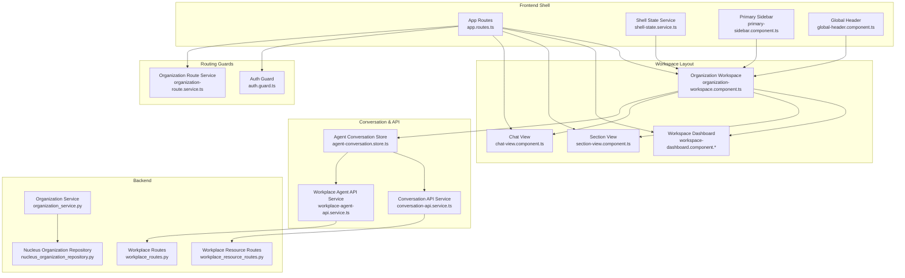
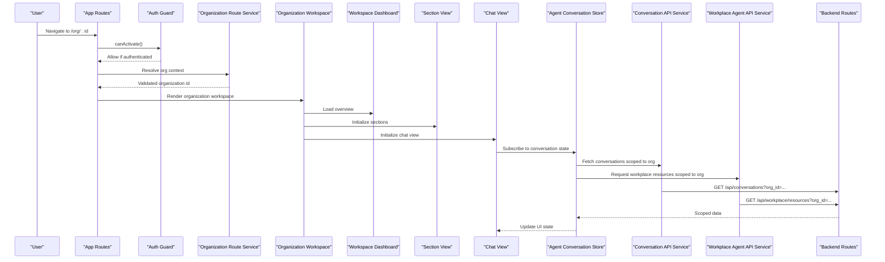
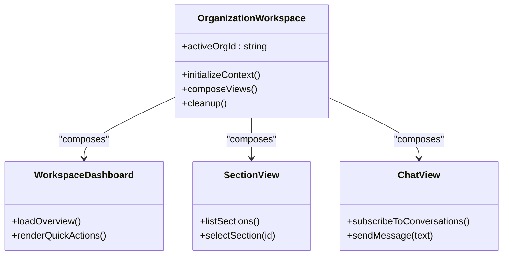
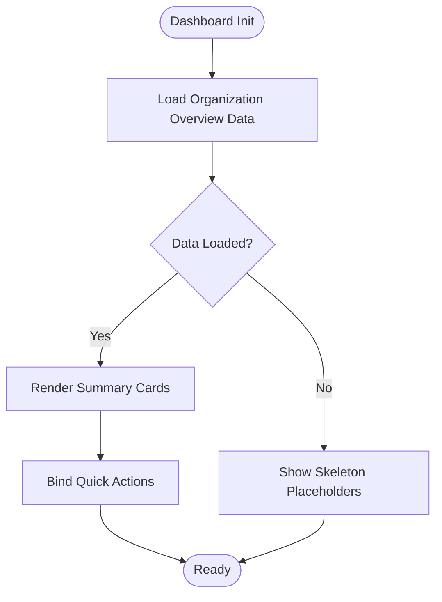
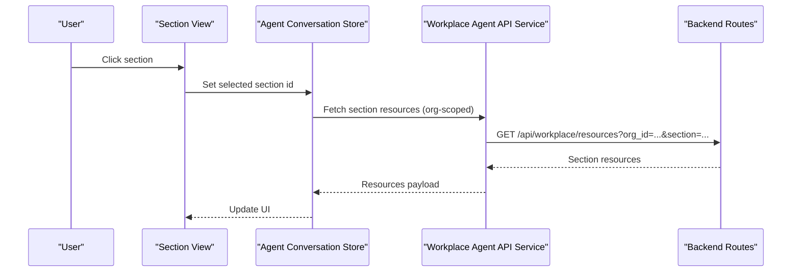
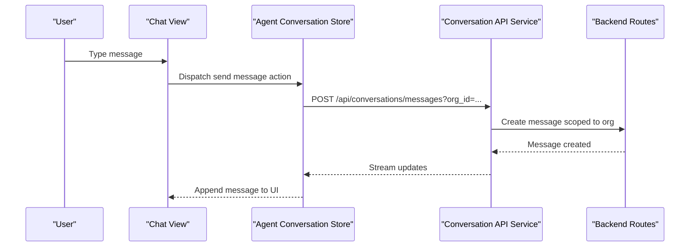
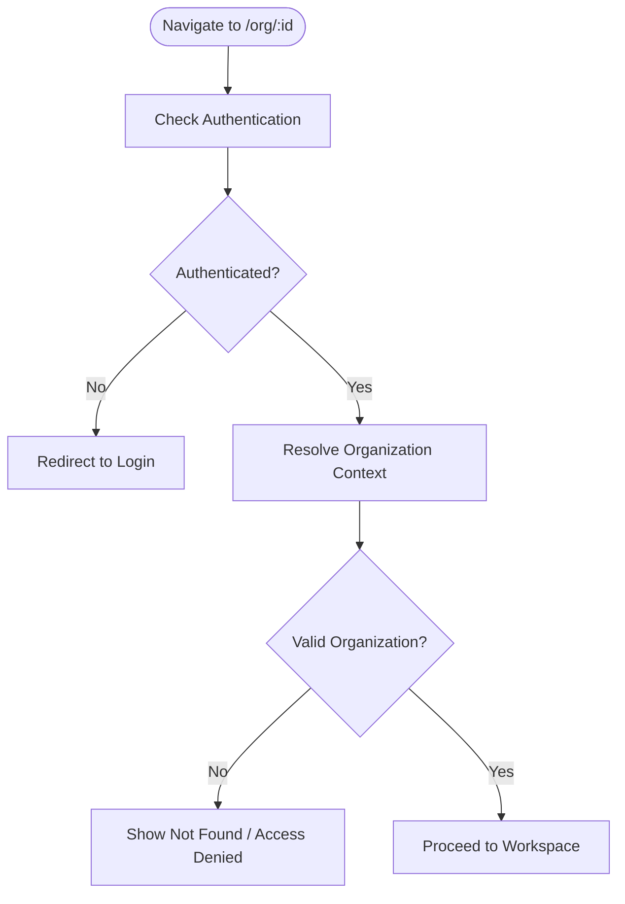
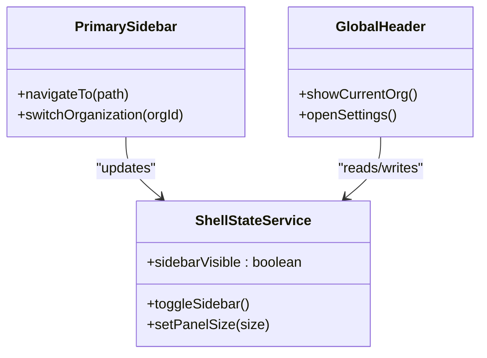
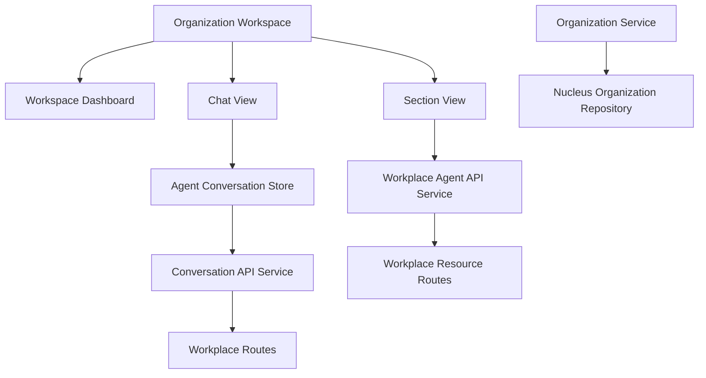

# Workspace Management

<cite>
**Referenced Files in This Document**
- [workspace-dashboard.component.ts](file://frontend/src/app/layout/workspace/workspace-dashboard.component.ts)
- [workspace-dashboard.component.html](file://frontend/src/app/layout/workspace/workspace-dashboard.component.html)
- [workspace-dashboard.component.scss](file://frontend/src/app/layout/workspace/workspace-dashboard.component.scss)
- [organization-workspace.component.ts](file://frontend/src/app/layout/workspace/organization-workspace.component.ts)
- [section-view.component.ts](file://frontend/src/app/layout/workspace/section-view.component.ts)
- [chat-view.component.ts](file://frontend/src/app/layout/workspace/chat-view.component.ts)
- [app.routes.ts](file://frontend/src/app/app.routes.ts)
- [shell-state.service.ts](file://frontend/src/app/layout/shell/shell-state.service.ts)
- [primary-sidebar.component.ts](file://frontend/src/app/layout/primary-sidebar/primary-sidebar.component.ts)
- [global-header.component.ts](file://frontend/src/app/layout/global-header/global-header.component.ts)
- [auth.guard.ts](file://frontend/src/app/core/routing/auth.guard.ts)
- [organization-route.service.ts](file://frontend/src/app/core/routing/organization-route.service.ts)
- [conversation-api.service.ts](file://frontend/src/app/core/conversation/conversation-api.service.ts)
- [workplace-agent-api.service.ts](file://frontend/src/app/core/api/workplace-agent-api.service.ts)
- [agent-conversation.store.ts](file://frontend/src/app/features/assistant-conversation/agent-conversation.store.ts)
- [conversation-list.component.ts](file://frontend/src/app/features/conversation-list/conversation-list.component.ts)
- [nucleus_organization_repository.py](file://app/repositories/nucleus_organization_repository.py)
- [organization_service.py](file://app/services/organization_service.py)
- [workplace_resource_routes.py](file://app/api/workplace_resource_routes.py)
- [workplace_routes.py](file://app/api/workplace_routes.py)
</cite>

## Table of Contents
1. [Introduction](#introduction)
2. [Project Structure](#project-structure)
3. [Core Components](#core-components)
4. [Architecture Overview](#architecture-overview)
5. [Detailed Component Analysis](#detailed-component-analysis)
6. [Dependency Analysis](#dependency-analysis)
7. [Performance Considerations](#performance-considerations)
8. [Troubleshooting Guide](#troubleshooting-guide)
9. [Conclusion](#conclusion)

## Introduction
This document explains the Workspace Management feature, focusing on multi-organization navigation and overview, workspace components for context switching between organizations, chat view integration within workspaces, and section view management for organizing workspace content. It also covers workspace state synchronization, organization boundary enforcement, resource isolation patterns, examples for extending workspace views, implementing organization-specific features, managing cross-workspace data access, and performance considerations including lazy loading strategies for large organizations.

## Project Structure
The Workspace Management feature spans frontend shell layout, routing guards, stores, and API services, as well as backend repositories and routes that enforce organization boundaries and provide scoped resources.

**Diagram sources**
- [app.routes.ts](file://frontend/src/app/app.routes.ts)
- [shell-state.service.ts](file://frontend/src/app/layout/shell/shell-state.service.ts)
- [primary-sidebar.component.ts](file://frontend/src/app/layout/primary-sidebar/primary-sidebar.component.ts)
- [global-header.component.ts](file://frontend/src/app/layout/global-header/global-header.component.ts)
- [organization-workspace.component.ts](file://frontend/src/app/layout/workspace/organization-workspace.component.ts)
- [workspace-dashboard.component.ts](file://frontend/src/app/layout/workspace/workspace-dashboard.component.ts)
- [section-view.component.ts](file://frontend/src/app/layout/workspace/section-view.component.ts)
- [chat-view.component.ts](file://frontend/src/app/layout/workspace/chat-view.component.ts)
- [agent-conversation.store.ts](file://frontend/src/app/features/assistant-conversation/agent-conversation.store.ts)
- [conversation-api.service.ts](file://frontend/src/app/core/conversation/conversation-api.service.ts)
- [workplace-agent-api.service.ts](file://frontend/src/app/core/api/workplace-agent-api.service.ts)
- [auth.guard.ts](file://frontend/src/app/core/routing/auth.guard.ts)
- [organization-route.service.ts](file://frontend/src/app/core/routing/organization-route.service.ts)
- [nucleus_organization_repository.py](file://app/repositories/nucleus_organization_repository.py)
- [organization_service.py](file://app/services/organization_service.py)
- [workplace_resource_routes.py](file://app/api/workplace_resource_routes.py)
- [workplace_routes.py](file://app/api/workplace_routes.py)

**Section sources**
- [app.routes.ts](file://frontend/src/app/app.routes.ts)
- [shell-state.service.ts](file://frontend/src/app/layout/shell/shell-state.service.ts)
- [primary-sidebar.component.ts](file://frontend/src/app/layout/primary-sidebar/primary-sidebar.component.ts)
- [global-header.component.ts](file://frontend/src/app/layout/global-header/global-header.component.ts)
- [organization-workspace.component.ts](file://frontend/src/app/layout/workspace/organization-workspace.component.ts)
- [workspace-dashboard.component.ts](file://frontend/src/app/layout/workspace/workspace-dashboard.component.ts)
- [section-view.component.ts](file://frontend/src/app/layout/workspace/section-view.component.ts)
- [chat-view.component.ts](file://frontend/src/app/layout/workspace/chat-view.component.ts)
- [agent-conversation.store.ts](file://frontend/src/app/features/assistant-conversation/agent-conversation.store.ts)
- [conversation-api.service.ts](file://frontend/src/app/core/conversation/conversation-api.service.ts)
- [workplace-agent-api.service.ts](file://frontend/src/app/core/api/workplace-agent-api.service.ts)
- [auth.guard.ts](file://frontend/src/app/core/routing/auth.guard.ts)
- [organization-route.service.ts](file://frontend/src/app/core/routing/organization-route.service.ts)
- [nucleus_organization_repository.py](file://app/repositories/nucleus_organization_repository.py)
- [organization_service.py](file://app/services/organization_service.py)
- [workplace_resource_routes.py](file://app/api/workplace_resource_routes.py)
- [workplace_routes.py](file://app/api/workplace_routes.py)

## Core Components
- Organization Workspace: Hosts the active organization context and composes dashboard, sections, and chat views. It ensures all child views operate under a single organization scope.
- Workspace Dashboard: Provides an overview of the current organization’s resources and quick actions. It is the default landing view when entering a workspace.
- Section View: Manages organized content areas (sections) within a workspace, enabling grouping and navigation of related items.
- Chat View: Integrates assistant conversations within the selected workspace, ensuring messages and proposals are scoped to the active organization.
- Routing Guards: Auth guard enforces authentication; organization route service validates and normalizes organization context before rendering workspace views.
- Shell State Service: Centralizes UI state such as sidebar visibility and panel sizes, shared across workspace views.
- Primary Sidebar and Global Header: Provide global navigation and organization selection controls that drive workspace context changes.

Key responsibilities:
- Maintain a consistent organization context across views.
- Isolate data access per organization via API calls with organization identifiers.
- Synchronize UI state and conversation state with the active workspace.

**Section sources**
- [organization-workspace.component.ts](file://frontend/src/app/layout/workspace/organization-workspace.component.ts)
- [workspace-dashboard.component.ts](file://frontend/src/app/layout/workspace/workspace-dashboard.component.ts)
- [workspace-dashboard.component.html](file://frontend/src/app/layout/workspace/workspace-dashboard.component.html)
- [workspace-dashboard.component.scss](file://frontend/src/app/layout/workspace/workspace-dashboard.component.scss)
- [section-view.component.ts](file://frontend/src/app/layout/workspace/section-view.component.ts)
- [chat-view.component.ts](file://frontend/src/app/layout/workspace/chat-view.component.ts)
- [auth.guard.ts](file://frontend/src/app/core/routing/auth.guard.ts)
- [organization-route.service.ts](file://frontend/src/app/core/routing/organization-route.service.ts)
- [shell-state.service.ts](file://frontend/src/app/layout/shell/shell-state.service.ts)
- [primary-sidebar.component.ts](file://frontend/src/app/layout/primary-sidebar/primary-sidebar.component.ts)
- [global-header.component.ts](file://frontend/src/app/layout/global-header/global-header.component.ts)

## Architecture Overview
The workspace architecture separates concerns into shell layout, workspace composition, conversation state, and API services, backed by backend repositories and routes that enforce organization boundaries.

**Diagram sources**
- [app.routes.ts](file://frontend/src/app/app.routes.ts)
- [auth.guard.ts](file://frontend/src/app/core/routing/auth.guard.ts)
- [organization-route.service.ts](file://frontend/src/app/core/routing/organization-route.service.ts)
- [organization-workspace.component.ts](file://frontend/src/app/layout/workspace/organization-workspace.component.ts)
- [workspace-dashboard.component.ts](file://frontend/src/app/layout/workspace/workspace-dashboard.component.ts)
- [section-view.component.ts](file://frontend/src/app/layout/workspace/section-view.component.ts)
- [chat-view.component.ts](file://frontend/src/app/layout/workspace/chat-view.component.ts)
- [agent-conversation.store.ts](file://frontend/src/app/features/assistant-conversation/agent-conversation.store.ts)
- [conversation-api.service.ts](file://frontend/src/app/core/conversation/conversation-api.service.ts)
- [workplace-agent-api.service.ts](file://frontend/src/app/core/api/workplace-agent-api.service.ts)
- [workplace_resource_routes.py](file://app/api/workplace_resource_routes.py)
- [workplace_routes.py](file://app/api/workplace_routes.py)

## Detailed Component Analysis

### Organization Workspace
- Purpose: Establishes and maintains the active organization context for nested views. Ensures all child components receive the correct organization identifier.
- Responsibilities:
  - Validate and normalize organization context from route parameters.
  - Compose dashboard, sections, and chat views within the same organization scope.
  - Coordinate lifecycle events (init, destroy) to clean up subscriptions and caches.
- Integration Points:
  - Uses routing guards to ensure user is authenticated and has valid organization access.
  - Shares shell state for UI consistency.

**Diagram sources**
- [organization-workspace.component.ts](file://frontend/src/app/layout/workspace/organization-workspace.component.ts)
- [workspace-dashboard.component.ts](file://frontend/src/app/layout/workspace/workspace-dashboard.component.ts)
- [section-view.component.ts](file://frontend/src/app/layout/workspace/section-view.component.ts)
- [chat-view.component.ts](file://frontend/src/app/layout/workspace/chat-view.component.ts)

**Section sources**
- [organization-workspace.component.ts](file://frontend/src/app/layout/workspace/organization-workspace.component.ts)

### Workspace Dashboard
- Purpose: Presents an overview of the current organization’s resources and provides quick actions.
- Responsibilities:
  - Load organization-scoped metrics and resources.
  - Render summary cards and navigation shortcuts.
  - Handle user interactions to navigate to specific sections or open chats.
- Styling and Templates:
  - Uses dedicated HTML template and SCSS styles for layout and theming.

**Diagram sources**
- [workspace-dashboard.component.ts](file://frontend/src/app/layout/workspace/workspace-dashboard.component.ts)
- [workspace-dashboard.component.html](file://frontend/src/app/layout/workspace/workspace-dashboard.component.html)
- [workspace-dashboard.component.scss](file://frontend/src/app/layout/workspace/workspace-dashboard.component.scss)

**Section sources**
- [workspace-dashboard.component.ts](file://frontend/src/app/layout/workspace/workspace-dashboard.component.ts)
- [workspace-dashboard.component.html](file://frontend/src/app/layout/workspace/workspace-dashboard.component.html)
- [workspace-dashboard.component.scss](file://frontend/src/app/layout/workspace/workspace-dashboard.component.scss)

### Section View
- Purpose: Organizes workspace content into logical sections, enabling users to browse and select content groups.
- Responsibilities:
  - List available sections for the active organization.
  - Manage selection state and trigger content updates in dependent views.
  - Support lazy loading of section details when expanded.

**Diagram sources**
- [section-view.component.ts](file://frontend/src/app/layout/workspace/section-view.component.ts)
- [agent-conversation.store.ts](file://frontend/src/app/features/assistant-conversation/agent-conversation.store.ts)
- [workplace-agent-api.service.ts](file://frontend/src/app/core/api/workplace-agent-api.service.ts)
- [workplace_resource_routes.py](file://app/api/workplace_resource_routes.py)

**Section sources**
- [section-view.component.ts](file://frontend/src/app/layout/workspace/section-view.component.ts)

### Chat View
- Purpose: Integrates assistant conversations within the selected workspace, ensuring messages and proposals are scoped to the active organization.
- Responsibilities:
  - Subscribe to conversation state and render messages.
  - Send new messages and handle responses.
  - Ensure all conversation operations include the active organization context.

**Diagram sources**
- [chat-view.component.ts](file://frontend/src/app/layout/workspace/chat-view.component.ts)
- [agent-conversation.store.ts](file://frontend/src/app/features/assistant-conversation/agent-conversation.store.ts)
- [conversation-api.service.ts](file://frontend/src/app/core/conversation/conversation-api.service.ts)
- [workplace_routes.py](file://app/api/workplace_routes.py)

**Section sources**
- [chat-view.component.ts](file://frontend/src/app/layout/workspace/chat-view.component.ts)
- [agent-conversation.store.ts](file://frontend/src/app/features/assistant-conversation/agent-conversation.store.ts)
- [conversation-api.service.ts](file://frontend/src/app/core/conversation/conversation-api.service.ts)
- [workplace_routes.py](file://app/api/workplace_routes.py)

### Routing Guards and Context Resolution
- Auth Guard: Ensures only authenticated users can access workspace routes.
- Organization Route Service: Resolves and validates organization context from route parameters, preventing invalid or unauthorized organization access.

**Diagram sources**
- [auth.guard.ts](file://frontend/src/app/core/routing/auth.guard.ts)
- [organization-route.service.ts](file://frontend/src/app/core/routing/organization-route.service.ts)

**Section sources**
- [auth.guard.ts](file://frontend/src/app/core/routing/auth.guard.ts)
- [organization-route.service.ts](file://frontend/src/app/core/routing/organization-route.service.ts)

### Shell State and Navigation
- Shell State Service: Centralizes UI state like sidebar visibility and panel sizes, ensuring consistent behavior across workspace views.
- Primary Sidebar: Provides navigation links and organization selection controls.
- Global Header: Displays current organization context and offers quick actions.

**Diagram sources**
- [shell-state.service.ts](file://frontend/src/app/layout/shell/shell-state.service.ts)
- [primary-sidebar.component.ts](file://frontend/src/app/layout/primary-sidebar/primary-sidebar.component.ts)
- [global-header.component.ts](file://frontend/src/app/layout/global-header/global-header.component.ts)

**Section sources**
- [shell-state.service.ts](file://frontend/src/app/layout/shell/shell-state.service.ts)
- [primary-sidebar.component.ts](file://frontend/src/app/layout/primary-sidebar/primary-sidebar.component.ts)
- [global-header.component.ts](file://frontend/src/app/layout/global-header/global-header.component.ts)

## Dependency Analysis
The workspace feature depends on routing guards, shell state, and API services, which in turn call backend endpoints enforcing organization scoping.

**Diagram sources**
- [organization-workspace.component.ts](file://frontend/src/app/layout/workspace/organization-workspace.component.ts)
- [workspace-dashboard.component.ts](file://frontend/src/app/layout/workspace/workspace-dashboard.component.ts)
- [section-view.component.ts](file://frontend/src/app/layout/workspace/section-view.component.ts)
- [chat-view.component.ts](file://frontend/src/app/layout/workspace/chat-view.component.ts)
- [agent-conversation.store.ts](file://frontend/src/app/features/assistant-conversation/agent-conversation.store.ts)
- [conversation-api.service.ts](file://frontend/src/app/core/conversation/conversation-api.service.ts)
- [workplace-agent-api.service.ts](file://frontend/src/app/core/api/workplace-agent-api.service.ts)
- [nucleus_organization_repository.py](file://app/repositories/nucleus_organization_repository.py)
- [organization_service.py](file://app/services/organization_service.py)
- [workplace_resource_routes.py](file://app/api/workplace_resource_routes.py)
- [workplace_routes.py](file://app/api/workplace_routes.py)

**Section sources**
- [organization-workspace.component.ts](file://frontend/src/app/layout/workspace/organization-workspace.component.ts)
- [workspace-dashboard.component.ts](file://frontend/src/app/layout/workspace/workspace-dashboard.component.ts)
- [section-view.component.ts](file://frontend/src/app/layout/workspace/section-view.component.ts)
- [chat-view.component.ts](file://frontend/src/app/layout/workspace/chat-view.component.ts)
- [agent-conversation.store.ts](file://frontend/src/app/features/assistant-conversation/agent-conversation.store.ts)
- [conversation-api.service.ts](file://frontend/src/app/core/conversation/conversation-api.service.ts)
- [workplace-agent-api.service.ts](file://frontend/src/app/core/api/workplace-agent-api.service.ts)
- [nucleus_organization_repository.py](file://app/repositories/nucleus_organization_repository.py)
- [organization_service.py](file://app/services/organization_service.py)
- [workplace_resource_routes.py](file://app/api/workplace_resource_routes.py)
- [workplace_routes.py](file://app/api/workplace_routes.py)

## Performance Considerations
- Lazy Loading Strategies:
  - Defer loading of heavy dashboard metrics until the workspace is fully initialized.
  - Use pagination and virtualization for large lists in section views.
  - Load chat history incrementally (e.g., last N messages) and fetch older messages on demand.
- Caching:
  - Cache organization overview data and frequently accessed resources to reduce repeated network calls.
  - Implement cache invalidation on relevant write operations (e.g., sending a message).
- Concurrency Control:
  - Debounce rapid UI interactions (e.g., typing in chat) to avoid excessive requests.
  - Cancel in-flight requests when navigating away from a workspace to prevent memory leaks.
- Large Organizations:
  - Prefer server-side filtering and sorting to minimize payload sizes.
  - Use progressive disclosure for detailed section content.
  - Monitor and optimize database queries behind organization-scoped endpoints.

[No sources needed since this section provides general guidance]

## Troubleshooting Guide
Common issues and resolutions:
- Unauthorized Access:
  - Symptom: Redirected to login or denied access when opening a workspace.
  - Action: Verify authentication token validity and organization membership.
- Invalid Organization Context:
  - Symptom: Not found or access denied after navigating to an organization URL.
  - Action: Confirm organization ID exists and user has permissions; check route resolution logic.
- Stale Data in Dashboard:
  - Symptom: Overview shows outdated metrics.
  - Action: Trigger refresh or implement cache invalidation on relevant mutations.
- Chat Messages Not Appearing:
  - Symptom: Sent messages do not show immediately.
  - Action: Ensure store subscription is active and SSE/websocket connections are established; verify org-scoped request headers.

**Section sources**
- [auth.guard.ts](file://frontend/src/app/core/routing/auth.guard.ts)
- [organization-route.service.ts](file://frontend/src/app/core/routing/organization-route.service.ts)
- [agent-conversation.store.ts](file://frontend/src/app/features/assistant-conversation/agent-conversation.store.ts)
- [conversation-api.service.ts](file://frontend/src/app/core/conversation/conversation-api.service.ts)

## Conclusion
The Workspace Management feature provides a robust foundation for multi-organization navigation, context-aware workspace views, integrated chat experiences, and organized content sections. By enforcing organization boundaries at both frontend routing and backend endpoints, it ensures resource isolation and secure access. The design supports extensibility through additional workspace views and organization-specific features, while performance optimizations and lazy loading strategies help maintain responsiveness for large organizations.

[No sources needed since this section summarizes without analyzing specific files]