# Frontend Architecture

<cite>
**Referenced Files in This Document**
- [main.ts](file://frontend/src/main.ts)
- [app.config.ts](file://frontend/src/app/app.config.ts)
- [app.routes.ts](file://frontend/src/app/app.routes.ts)
- [app.component.ts](file://frontend/src/app/app.component.ts)
- [app-shell.component.ts](file://frontend/src/app/layout/app-shell/app-shell.component.ts)
- [shell-state.service.ts](file://frontend/src/app/layout/shell/shell-state.service.ts)
- [auth.guard.ts](file://frontend/src/app/core/routing/auth.guard.ts)
- [organization-route.service.ts](file://frontend/src/app/core/routing/organization-route.service.ts)
- [current-user.store.ts](file://frontend/src/app/core/auth/current-user.store.ts)
- [auth.service.ts](file://frontend/src/app/core/auth/auth.service.ts)
- [auth-header.interceptor.ts](file://frontend/src/app/core/auth/auth-header.interceptor.ts)
- [api-error.interceptor.ts](file://frontend/src/app/core/api/api-error.interceptor.ts)
- [request-id.interceptor.ts](file://frontend/src/app/core/api/request-id.interceptor.ts)
- [validated-http.service.ts](file://frontend/src/app/core/api/validated-http.service.ts)
- [workplace-agent-api.service.ts](file://frontend/src/app/core/api/workplace-agent-api.service.ts)
- [wire.models.ts](file://frontend/src/app/core/api/wire.models.ts)
- [wire.schemas.ts](file://frontend/src/app/core/api/wire.schemas.ts)
- [app-config.loader.ts](file://frontend/src/app/core/config/app-config.loader.ts)
- [app-config.model.ts](file://frontend/src/app/core/config/app-config.model.ts)
- [app-config.token.ts](file://frontend/src/app/core/config/app-config.token.ts)
- [authenticated-sse-client.service.ts](file://frontend/src/app/core/sse/authenticated-sse-client.service.ts)
- [agent-run-stream.service.ts](file://frontend/src/app/core/agent-run/agent-run-stream.service.ts)
- [sse-frame-parser.ts](file://frontend/src/app/core/agent-run/sse-frame-parser.ts)
- [agent-run-api.service.ts](file://frontend/src/app/core/agent-run/agent-run-api.service.ts)
- [action-control-api.service.ts](file://frontend/src/app/core/action-control/action-control-api.service.ts)
- [action-execution-stream.service.ts](file://frontend/src/app/core/action-control/action-execution-stream.service.ts)
- [proposal-control.facade.ts](file://frontend/src/app/core/action-control/proposal-control.facade.ts)
- [conversation-api.service.ts](file://frontend/src/app/core/conversation/conversation-api.service.ts)
- [error-normalizer.ts](file://frontend/src/app/core/errors/error-normalizer.ts)
- [workplace-api.error.ts](file://frontend/src/app/core/errors/workplace-api.error.ts)
- [assistant-conversation.store.ts](file://frontend/src/app/features/assistant-conversation/agent-conversation.store.ts)
- [assistant-activity.component.ts](file://frontend/src/app/features/assistant-conversation/assistant-activity/assistant-activity.component.ts)
- [assistant-composer.component.ts](file://frontend/src/app/features/assistant-conversation/assistant-composer/assistant-composer.component.ts)
- [assistant-message.component.ts](file://frontend/src/app/features/assistant-conversation/assistant-message/assistant-message.component.ts)
- [assistant-proposal-card.component.ts](file://frontend/src/app/features/assistant-conversation/assistant-proposal-card/assistant-proposal-card.component.ts)
- [agent-response.mapper.ts](file://frontend/src/app/features/assistant-conversation/agent-response.mapper.ts)
- [conversation-list.component.ts](file://frontend/src/app/features/conversation-list/conversation-list.component.ts)
- [conversation-list.store.ts](file://frontend/src/app/features/conversation-list/conversation-list.store.ts)
- [approval-center.component.ts](file://frontend/src/app/features/approval-center/approval-center.component.ts)
- [approval-center.store.ts](file://frontend/src/app/features/approval-center/approval-center.store.ts)
- [landing.component.ts](file://frontend/src/app/features/landing/landing.component.ts)
- [primary-sidebar.component.ts](file://frontend/src/app/layout/primary-sidebar/primary-sidebar.component.ts)
- [global-header.component.ts](file://frontend/src/app/layout/global-header/global-header.component.ts)
- [assistant-panel.component.ts](file://frontend/src/app/layout/assistant-panel/assistant-panel.component.ts)
- [workspace-dashboard.component.ts](file://frontend/src/app/layout/workspace/workspace-dashboard.component.ts)
- [chat-view.component.ts](file://frontend/src/app/layout/workspace/chat-view.component.ts)
- [section-view.component.ts](file://frontend/src/app/layout/workspace/section-view.component.ts)
- [ui-theme.service.ts](file://frontend/src/app/shared/theme/ui-theme.service.ts)
- [ui-button.component.ts](file://frontend/src/app/shared/ui/ui-button/ui-button.component.ts)
- [ui-input.component.ts](file://frontend/src/app/shared/ui/ui-input/ui-input.component.ts)
- [ui-textarea.component.ts](file://frontend/src/app/shared/ui/ui-textarea/ui-textarea.component.ts)
- [ui-badge.component.ts](file://frontend/src/app/shared/ui/ui-badge/ui-badge.component.ts)
- [ui-spinner.component.ts](file://frontend/src/app/shared/ui/ui-spinner/ui-spinner.component.ts)
- [ui-callout.component.ts](file://frontend/src/app/shared/ui/ui-callout/ui-callout.component.ts)
- [ui-action-surface.component.ts](file://frontend/src/app/shared/ui/ui-action-surface/ui-action-surface.component.ts)
- [ui-status-indicator.component.ts](file://frontend/src/app/shared/ui/ui-status-indicator/ui-status-indicator.component.ts)
- [ui-skeleton.component.ts](file://frontend/src/app/shared/ui/ui-skeleton/ui-skeleton.component.ts)
</cite>

## Table of Contents
1. [Introduction](#introduction)
2. [Project Structure](#project-structure)
3. [Core Components](#core-components)
4. [Architecture Overview](#architecture-overview)
5. [Detailed Component Analysis](#detailed-component-analysis)
6. [Dependency Analysis](#dependency-analysis)
7. [Performance Considerations](#performance-considerations)
8. [Troubleshooting Guide](#troubleshooting-guide)
9. [Conclusion](#conclusion)
10. [Appendices](#appendices)

## Introduction
This document describes the frontend architecture for an Angular 17+ application organized by features, with a strong emphasis on reactive state management using stores and RxJS, robust routing with guards, centralized dependency injection via modern providers, configuration loading, and clear architectural boundaries. It explains how components interact with services and stores, how HTTP and Server-Sent Events (SSE) are handled, and how to extend the system safely with new features while preserving separation of concerns.

## Project Structure
The frontend is organized into:
- app: Application root containing core infrastructure, feature modules, layout, and shared UI primitives
- features: Feature-based modules encapsulating domain functionality (e.g., assistant conversation, approval center)
- core: Cross-cutting concerns (routing, auth, API clients, SSE, config, errors)
- layout: Shell and navigation components that compose the application frame
- shared: Reusable UI components and theme utilities

```mermaid
graph TB
subgraph "App Root"
main_ts["main.ts"]
app_config["app.config.ts"]
app_routes["app.routes.ts"]
app_component["app.component.ts"]
end
subgraph "Core"
auth_guard["auth.guard.ts"]
org_route["organization-route.service.ts"]
current_user_store["current-user.store.ts"]
auth_service["auth.service.ts"]
api_error_interceptor["api-error.interceptor.ts"]
request_id_interceptor["request-id.interceptor.ts"]
validated_http["validated-http.service.ts"]
workplace_api["workplace-agent-api.service.ts"]
wire_models["wire.models.ts"]
wire_schemas["wire.schemas.ts"]
config_loader["app-config.loader.ts"]
config_model["app-config.model.ts"]
config_token["app-config.token.ts"]
sse_client["authenticated-sse-client.service.ts"]
agent_run_stream["agent-run-stream.service.ts"]
sse_parser["sse-frame-parser.ts"]
agent_run_api["agent-run-api.service.ts"]
action_control_api["action-control-api.service.ts"]
action_exec_stream["action-execution-stream.service.ts"]
proposal_facade["proposal-control.facade.ts"]
conversation_api["conversation-api.service.ts"]
error_normalizer["error-normalizer.ts"]
workplace_api_error["workplace-api.error.ts"]
end
subgraph "Features"
conv_list_comp["conversation-list.component.ts"]
conv_list_store["conversation-list.store.ts"]
assistant_conv_store["assistant-conversation.store.ts"]
assistant_activity["assistant-activity.component.ts"]
assistant_composer["assistant-composer.component.ts"]
assistant_message["assistant-message.component.ts"]
assistant_proposal["assistant-proposal-card.component.ts"]
response_mapper["agent-response.mapper.ts"]
approval_center_comp["approval-center.component.ts"]
approval_center_store["approval-center.store.ts"]
landing_comp["landing.component.ts"]
end
subgraph "Layout"
shell_state["shell-state.service.ts"]
app_shell["app-shell.component.ts"]
primary_sidebar["primary-sidebar.component.ts"]
global_header["global-header.component.ts"]
assistant_panel["assistant-panel.component.ts"]
workspace_dashboard["workspace-dashboard.component.ts"]
chat_view["chat-view.component.ts"]
section_view["section-view.component.ts"]
end
subgraph "Shared UI"
ui_theme["ui-theme.service.ts"]
ui_button["ui-button.component.ts"]
ui_input["ui-input.component.ts"]
ui_textarea["ui-textarea.component.ts"]
ui_badge["ui-badge.component.ts"]
ui_spinner["ui-spinner.component.ts"]
ui_callout["ui-callout.component.ts"]
ui_action_surface["ui-action-surface.component.ts"]
ui_status_indicator["ui-status-indicator.component.ts"]
ui_skeleton["ui-skeleton.component.ts"]
end
main_ts --> app_config
app_config --> app_routes
app_routes --> app_component
app_component --> app_shell
app_shell --> shell_state
app_shell --> primary_sidebar
app_shell --> global_header
app_shell --> assistant_panel
assistant_panel --> workspace_dashboard
workspace_dashboard --> chat_view
workspace_dashboard --> section_view
app_routes --> auth_guard
app_routes --> org_route
auth_guard --> current_user_store
auth_guard --> auth_service
workplace_api --> validated_http
workplace_api --> wire_models
workplace_api --> wire_schemas
validated_http --> api_error_interceptor
validated_http --> request_id_interceptor
agent_run_stream --> sse_client
agent_run_stream --> sse_parser
agent_run_stream --> agent_run_api
action_control_api --> action_exec_stream
action_control_api --> proposal_facade
assistant_conv_store --> agent_run_stream
assistant_conv_store --> conversation_api
assistant_conv_store --> response_mapper
conv_list_store --> conversation_api
conv_list_comp --> conv_list_store
approval_center_comp --> approval_center_store
approval_center_store --> action_control_api
ui_theme --> app_shell
ui_theme --> global_header
```

**Diagram sources**
- [main.ts](file://frontend/src/main.ts)
- [app.config.ts](file://frontend/src/app/app.config.ts)
- [app.routes.ts](file://frontend/src/app/app.routes.ts)
- [app.component.ts](file://frontend/src/app/app.component.ts)
- [app-shell.component.ts](file://frontend/src/app/layout/app-shell/app-shell.component.ts)
- [shell-state.service.ts](file://frontend/src/app/layout/shell/shell-state.service.ts)
- [auth.guard.ts](file://frontend/src/app/core/routing/auth.guard.ts)
- [organization-route.service.ts](file://frontend/src/app/core/routing/organization-route.service.ts)
- [current-user.store.ts](file://frontend/src/app/core/auth/current-user.store.ts)
- [auth.service.ts](file://frontend/src/app/core/auth/auth.service.ts)
- [api-error.interceptor.ts](file://frontend/src/app/core/api/api-error.interceptor.ts)
- [request-id.interceptor.ts](file://frontend/src/app/core/api/request-id.interceptor.ts)
- [validated-http.service.ts](file://frontend/src/app/core/api/validated-http.service.ts)
- [workplace-agent-api.service.ts](file://frontend/src/app/core/api/workplace-agent-api.service.ts)
- [wire.models.ts](file://frontend/src/app/core/api/wire.models.ts)
- [wire.schemas.ts](file://frontend/src/app/core/api/wire.schemas.ts)
- [app-config.loader.ts](file://frontend/src/app/core/config/app-config.loader.ts)
- [app-config.model.ts](file://frontend/src/app/core/config/app-config.model.ts)
- [app-config.token.ts](file://frontend/src/app/core/config/app-config.token.ts)
- [authenticated-sse-client.service.ts](file://frontend/src/app/core/sse/authenticated-sse-client.service.ts)
- [agent-run-stream.service.ts](file://frontend/src/app/core/agent-run/agent-run-stream.service.ts)
- [sse-frame-parser.ts](file://frontend/src/app/core/agent-run/sse-frame-parser.ts)
- [agent-run-api.service.ts](file://frontend/src/app/core/agent-run/agent-run-api.service.ts)
- [action-control-api.service.ts](file://frontend/src/app/core/action-control/action-control-api.service.ts)
- [action-execution-stream.service.ts](file://frontend/src/app/core/action-control/action-execution-stream.service.ts)
- [proposal-control.facade.ts](file://frontend/src/app/core/action-control/proposal-control.facade.ts)
- [conversation-api.service.ts](file://frontend/src/app/core/conversation/conversation-api.service.ts)
- [error-normalizer.ts](file://frontend/src/app/core/errors/error-normalizer.ts)
- [workplace-api.error.ts](file://frontend/src/app/core/errors/workplace-api.error.ts)
- [assistant-conversation.store.ts](file://frontend/src/app/features/assistant-conversation/agent-conversation.store.ts)
- [assistant-activity.component.ts](file://frontend/src/app/features/assistant-conversation/assistant-activity/assistant-activity.component.ts)
- [assistant-composer.component.ts](file://frontend/src/app/features/assistant-conversation/assistant-composer/assistant-composer.component.ts)
- [assistant-message.component.ts](file://frontend/src/app/features/assistant-conversation/assistant-message/assistant-message.component.ts)
- [assistant-proposal-card.component.ts](file://frontend/src/app/features/assistant-conversation/assistant-proposal-card/assistant-proposal-card.component.ts)
- [agent-response.mapper.ts](file://frontend/src/app/features/assistant-conversation/agent-response.mapper.ts)
- [conversation-list.component.ts](file://frontend/src/app/features/conversation-list/conversation-list.component.ts)
- [conversation-list.store.ts](file://frontend/src/app/features/conversation-list/conversation-list.store.ts)
- [approval-center.component.ts](file://frontend/src/app/features/approval-center/approval-center.component.ts)
- [approval-center.store.ts](file://frontend/src/app/features/approval-center/approval-center.store.ts)
- [landing.component.ts](file://frontend/src/app/features/landing/landing.component.ts)
- [primary-sidebar.component.ts](file://frontend/src/app/layout/primary-sidebar/primary-sidebar.component.ts)
- [global-header.component.ts](file://frontend/src/app/layout/global-header/global-header.component.ts)
- [assistant-panel.component.ts](file://frontend/src/app/layout/assistant-panel/assistant-panel.component.ts)
- [workspace-dashboard.component.ts](file://frontend/src/app/layout/workspace/workspace-dashboard.component.ts)
- [chat-view.component.ts](file://frontend/src/app/layout/workspace/chat-view.component.ts)
- [section-view.component.ts](file://frontend/src/app/layout/workspace/section-view.component.ts)
- [ui-theme.service.ts](file://frontend/src/app/shared/theme/ui-theme.service.ts)
- [ui-button.component.ts](file://frontend/src/app/shared/ui/ui-button/ui-button.component.ts)
- [ui-input.component.ts](file://frontend/src/app/shared/ui/ui-input/ui-input.component.ts)
- [ui-textarea.component.ts](file://frontend/src/app/shared/ui/ui-textarea/ui-textarea.component.ts)
- [ui-badge.component.ts](file://frontend/src/app/shared/ui/ui-badge/ui-badge.component.ts)
- [ui-spinner.component.ts](file://frontend/src/app/shared/ui/ui-spinner/ui-spinner.component.ts)
- [ui-callout.component.ts](file://frontend/src/app/shared/ui/ui-callout/ui-callout.component.ts)
- [ui-action-surface.component.ts](file://frontend/src/app/shared/ui/ui-action-surface/ui-action-surface.component.ts)
- [ui-status-indicator.component.ts](file://frontend/src/app/shared/ui/ui-status-indicator/ui-status-indicator.component.ts)
- [ui-skeleton.component.ts](file://frontend/src/app/shared/ui/ui-skeleton/ui-skeleton.component.ts)

**Section sources**
- [main.ts](file://frontend/src/main.ts)
- [app.config.ts](file://frontend/src/app/app.config.ts)
- [app.routes.ts](file://frontend/src/app/app.routes.ts)
- [app.component.ts](file://frontend/src/app/app.component.ts)
- [app-shell.component.ts](file://frontend/src/app/layout/app-shell/app-shell.component.ts)
- [shell-state.service.ts](file://frontend/src/app/layout/shell/shell-state.service.ts)

## Core Components
- Application bootstrap and DI setup: The entry point initializes Angular with environment and providers, including route definitions and configuration loader.
- Configuration management: A dedicated loader fetches runtime configuration and exposes it via a token for consumption across the app.
- Routing and guards: Centralized routes define top-level paths; guards enforce authentication and organization context before rendering protected views.
- Authentication and user state: Auth service handles login flows; current user store exposes reactive user state consumed by guards and UI.
- HTTP layer and interceptors: Validated HTTP service wraps HttpClient with schema validation, error normalization, and request ID propagation. Interceptors attach auth headers and handle API errors consistently.
- SSE streaming: An authenticated SSE client provides secure streaming; stream services parse frames and expose typed observables for real-time updates.
- Feature stores: Stores encapsulate domain state and side effects, exposing RxJS streams to components. They coordinate API calls, SSE events, and local state transitions.
- Layout and shell: Shell composes header, sidebar, and content area; shell state manages panel visibility and responsive behavior.
- Shared UI primitives: Theme service and UI components provide consistent look-and-feel and reusable interactions.

**Section sources**
- [app.config.ts](file://frontend/src/app/app.config.ts)
- [app.routes.ts](file://frontend/src/app/app.routes.ts)
- [app-config.loader.ts](file://frontend/src/app/core/config/app-config.loader.ts)
- [app-config.model.ts](file://frontend/src/app/core/config/app-config.model.ts)
- [app-config.token.ts](file://frontend/src/app/core/config/app-config.token.ts)
- [auth.guard.ts](file://frontend/src/app/core/routing/auth.guard.ts)
- [organization-route.service.ts](file://frontend/src/app/core/routing/organization-route.service.ts)
- [auth.service.ts](file://frontend/src/app/core/auth/auth.service.ts)
- [current-user.store.ts](file://frontend/src/app/core/auth/current-user.store.ts)
- [validated-http.service.ts](file://frontend/src/app/core/api/validated-http.service.ts)
- [api-error.interceptor.ts](file://frontend/src/app/core/api/api-error.interceptor.ts)
- [request-id.interceptor.ts](file://frontend/src/app/core/api/request-id.interceptor.ts)
- [auth-header.interceptor.ts](file://frontend/src/app/core/auth/auth-header.interceptor.ts)
- [workplace-agent-api.service.ts](file://frontend/src/app/core/api/workplace-agent-api.service.ts)
- [wire.models.ts](file://frontend/src/app/core/api/wire.models.ts)
- [wire.schemas.ts](file://frontend/src/app/core/api/wire.schemas.ts)
- [authenticated-sse-client.service.ts](file://frontend/src/app/core/sse/authenticated-sse-client.service.ts)
- [agent-run-stream.service.ts](file://frontend/src/app/core/agent-run/agent-run-stream.service.ts)
- [sse-frame-parser.ts](file://frontend/src/app/core/agent-run/sse-frame-parser.ts)
- [agent-run-api.service.ts](file://frontend/src/app/core/agent-run/agent-run-api.service.ts)
- [action-control-api.service.ts](file://frontend/src/app/core/action-control/action-control-api.service.ts)
- [action-execution-stream.service.ts](file://frontend/src/app/core/action-control/action-execution-stream.service.ts)
- [proposal-control.facade.ts](file://frontend/src/app/core/action-control/proposal-control.facade.ts)
- [conversation-api.service.ts](file://frontend/src/app/core/conversation/conversation-api.service.ts)
- [error-normalizer.ts](file://frontend/src/app/core/errors/error-normalizer.ts)
- [workplace-api.error.ts](file://frontend/src/app/core/errors/workplace-api.error.ts)
- [assistant-conversation.store.ts](file://frontend/src/app/features/assistant-conversation/agent-conversation.store.ts)
- [conversation-list.store.ts](file://frontend/src/app/features/conversation-list/conversation-list.store.ts)
- [approval-center.store.ts](file://frontend/src/app/features/approval-center/approval-center.store.ts)
- [shell-state.service.ts](file://frontend/src/app/layout/shell/shell-state.service.ts)
- [ui-theme.service.ts](file://frontend/src/app/shared/theme/ui-theme.service.ts)

## Architecture Overview
The application follows a layered architecture:
- Presentation Layer: Components consume stores and services, remain stateless where possible, and delegate business logic to stores/services.
- Domain Layer: Stores encapsulate domain state and orchestrate side effects; facades simplify complex operations.
- Infrastructure Layer: Services abstract HTTP and SSE communication; interceptors centralize cross-cutting concerns like auth headers and error handling.
- Configuration and DI: Providers and tokens configure runtime behavior; loaders initialize app settings before bootstrapping.

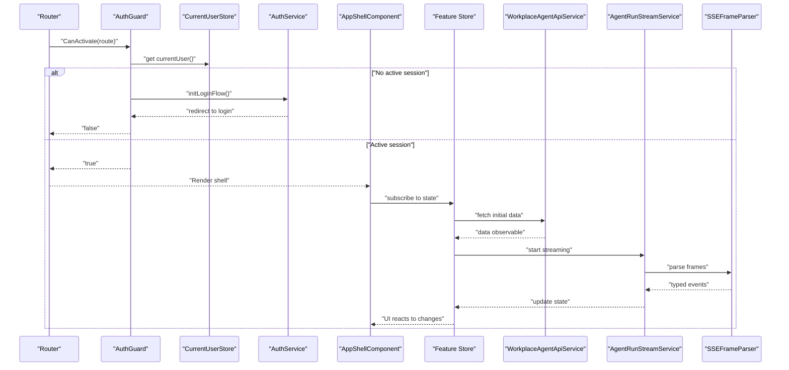

**Diagram sources**
- [app.routes.ts](file://frontend/src/app/app.routes.ts)
- [auth.guard.ts](file://frontend/src/app/core/routing/auth.guard.ts)
- [current-user.store.ts](file://frontend/src/app/core/auth/current-user.store.ts)
- [auth.service.ts](file://frontend/src/app/core/auth/auth.service.ts)
- [app-shell.component.ts](file://frontend/src/app/layout/app-shell/app-shell.component.ts)
- [assistant-conversation.store.ts](file://frontend/src/app/features/assistant-conversation/agent-conversation.store.ts)
- [workplace-agent-api.service.ts](file://frontend/src/app/core/api/workplace-agent-api.service.ts)
- [agent-run-stream.service.ts](file://frontend/src/app/core/agent-run/agent-run-stream.service.ts)
- [sse-frame-parser.ts](file://frontend/src/app/core/agent-run/sse-frame-parser.ts)

## Detailed Component Analysis

### Routing and Guards
- Route definitions organize top-level pages and lazy-loaded feature modules.
- Auth guard checks current user state and redirects unauthenticated users to login.
- Organization route service ensures the correct organization context is present before navigating to workspace views.

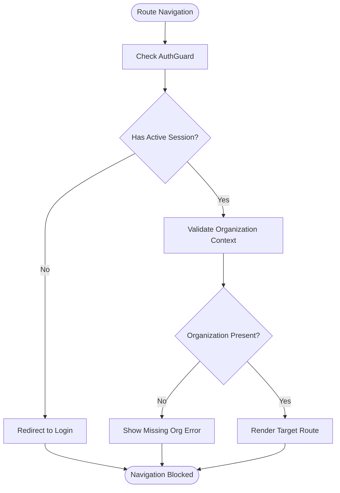

**Diagram sources**
- [app.routes.ts](file://frontend/src/app/app.routes.ts)
- [auth.guard.ts](file://frontend/src/app/core/routing/auth.guard.ts)
- [organization-route.service.ts](file://frontend/src/app/core/routing/organization-route.service.ts)

**Section sources**
- [app.routes.ts](file://frontend/src/app/app.routes.ts)
- [auth.guard.ts](file://frontend/src/app/core/routing/auth.guard.ts)
- [organization-route.service.ts](file://frontend/src/app/core/routing/organization-route.service.ts)

### Authentication and Current User State
- Auth service orchestrates login flows and token management.
- Current user store exposes reactive user state consumed by guards and UI elements.
- Auth header interceptor attaches credentials to outgoing requests.

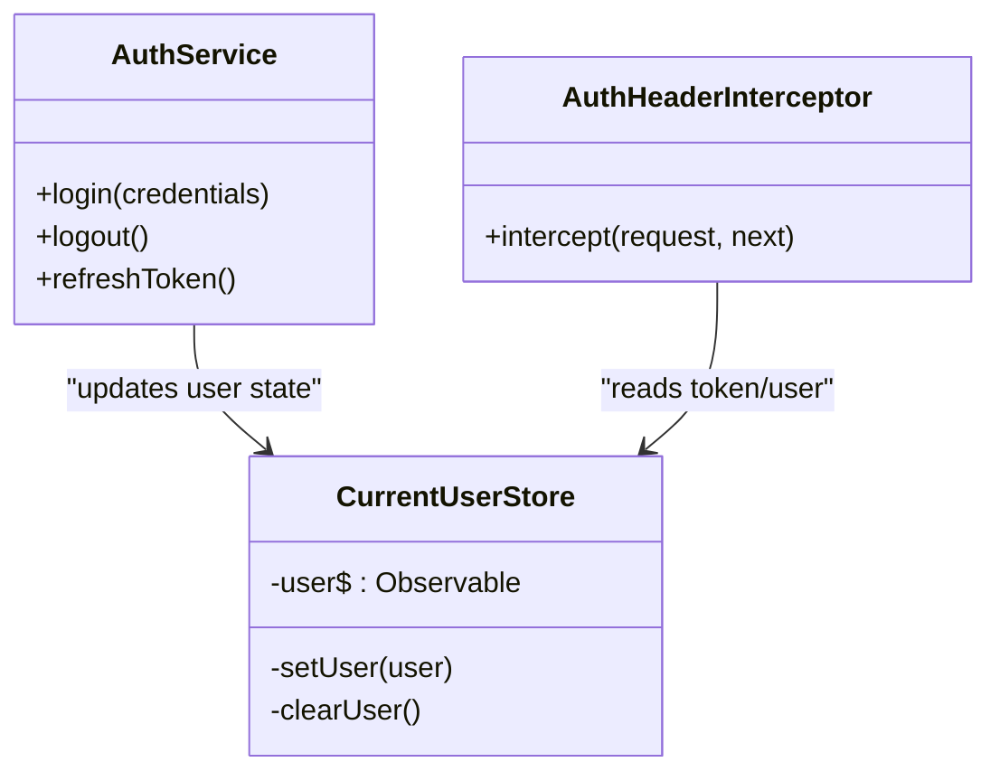

**Diagram sources**
- [auth.service.ts](file://frontend/src/app/core/auth/auth.service.ts)
- [current-user.store.ts](file://frontend/src/app/core/auth/current-user.store.ts)
- [auth-header.interceptor.ts](file://frontend/src/app/core/auth/auth-header.interceptor.ts)

**Section sources**
- [auth.service.ts](file://frontend/src/app/core/auth/auth.service.ts)
- [current-user.store.ts](file://frontend/src/app/core/auth/current-user.store.ts)
- [auth-header.interceptor.ts](file://frontend/src/app/core/auth/auth-header.interceptor.ts)

### HTTP Layer and Validation
- Validated HTTP service wraps HTTP calls with schema validation against wire models and schemas.
- API error interceptor normalizes backend errors into a consistent shape.
- Request ID interceptor injects correlation IDs for tracing.

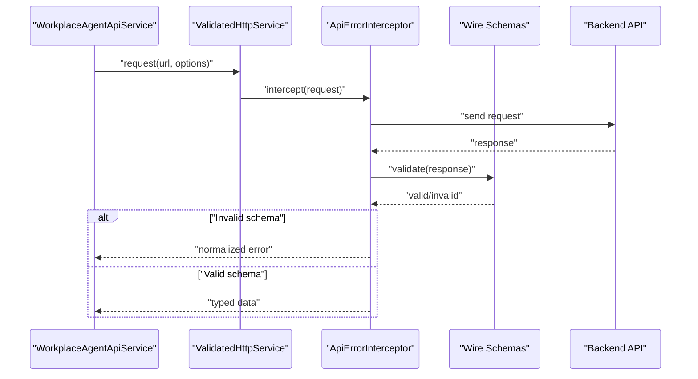

**Diagram sources**
- [workplace-agent-api.service.ts](file://frontend/src/app/core/api/workplace-agent-api.service.ts)
- [validated-http.service.ts](file://frontend/src/app/core/api/validated-http.service.ts)
- [api-error.interceptor.ts](file://frontend/src/app/core/api/api-error.interceptor.ts)
- [wire.models.ts](file://frontend/src/app/core/api/wire.models.ts)
- [wire.schemas.ts](file://frontend/src/app/core/api/wire.schemas.ts)

**Section sources**
- [workplace-agent-api.service.ts](file://frontend/src/app/core/api/workplace-agent-api.service.ts)
- [validated-http.service.ts](file://frontend/src/app/core/api/validated-http.service.ts)
- [api-error.interceptor.ts](file://frontend/src/app/core/api/api-error.interceptor.ts)
- [request-id.interceptor.ts](file://frontend/src/app/core/api/request-id.interceptor.ts)
- [wire.models.ts](file://frontend/src/app/core/api/wire.models.ts)
- [wire.schemas.ts](file://frontend/src/app/core/api/wire.schemas.ts)

### SSE Streaming and Real-Time Updates
- Authenticated SSE client secures streaming connections.
- Agent run stream service parses SSE frames and exposes typed event streams.
- Frame parser transforms raw frames into structured domain events.

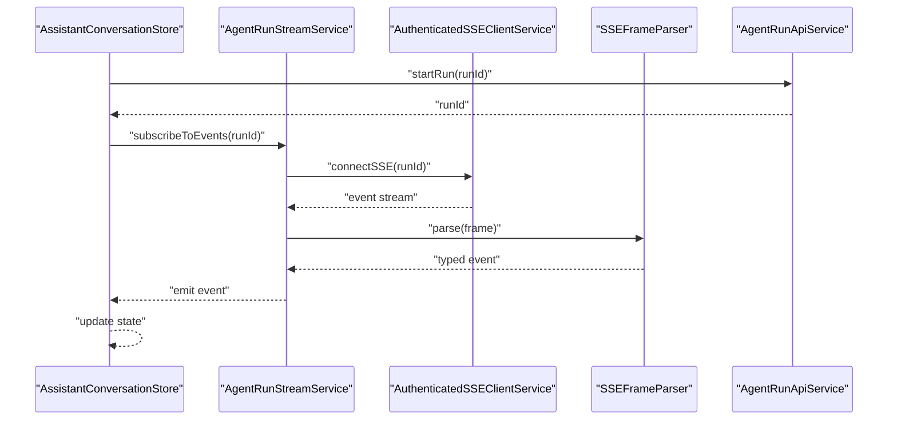

**Diagram sources**
- [assistant-conversation.store.ts](file://frontend/src/app/features/assistant-conversation/agent-conversation.store.ts)
- [agent-run-stream.service.ts](file://frontend/src/app/core/agent-run/agent-run-stream.service.ts)
- [authenticated-sse-client.service.ts](file://frontend/src/app/core/sse/authenticated-sse-client.service.ts)
- [sse-frame-parser.ts](file://frontend/src/app/core/agent-run/sse-frame-parser.ts)
- [agent-run-api.service.ts](file://frontend/src/app/core/agent-run/agent-run-api.service.ts)

**Section sources**
- [authenticated-sse-client.service.ts](file://frontend/src/app/core/sse/authenticated-sse-client.service.ts)
- [agent-run-stream.service.ts](file://frontend/src/app/core/agent-run/agent-run-stream.service.ts)
- [sse-frame-parser.ts](file://frontend/src/app/core/agent-run/sse-frame-parser.ts)
- [agent-run-api.service.ts](file://frontend/src/app/core/agent-run/agent-run-api.service.ts)

### Action Control and Proposals
- Action control API coordinates proposals and execution lifecycle.
- Execution stream service subscribes to action execution events.
- Proposal facade simplifies proposal workflows for components.

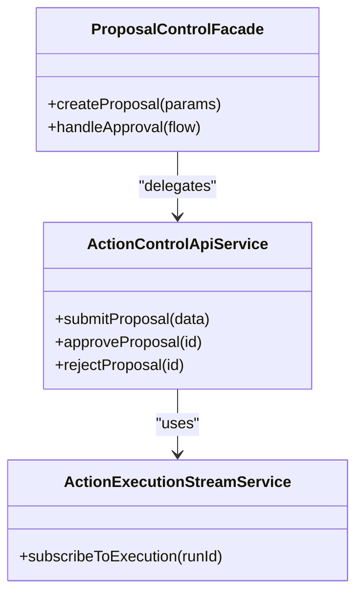

**Diagram sources**
- [action-control-api.service.ts](file://frontend/src/app/core/action-control/action-control-api.service.ts)
- [action-execution-stream.service.ts](file://frontend/src/app/core/action-control/action-execution-stream.service.ts)
- [proposal-control.facade.ts](file://frontend/src/app/core/action-control/proposal-control.facade.ts)

**Section sources**
- [action-control-api.service.ts](file://frontend/src/app/core/action-control/action-control-api.service.ts)
- [action-execution-stream.service.ts](file://frontend/src/app/core/action-control/action-execution-stream.service.ts)
- [proposal-control.facade.ts](file://frontend/src/app/core/action-control/proposal-control.facade.ts)

### Conversation Features
- Assistant conversation store manages message history, activity, and proposals; maps backend responses to UI-friendly structures.
- Conversation list store maintains list state and selection.
- Approval center store coordinates approvals and rollbacks.

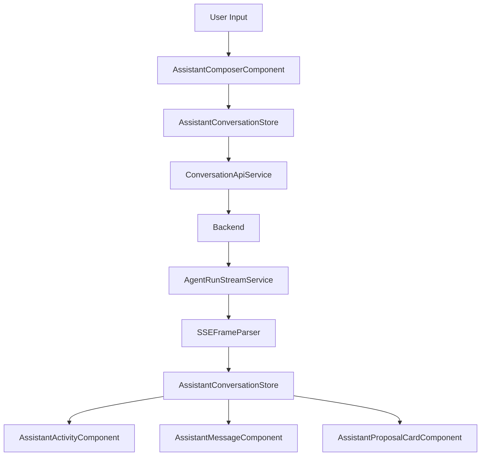

**Diagram sources**
- [assistant-composer.component.ts](file://frontend/src/app/features/assistant-conversation/assistant-composer/assistant-composer.component.ts)
- [assistant-conversation.store.ts](file://frontend/src/app/features/assistant-conversation/agent-conversation.store.ts)
- [conversation-api.service.ts](file://frontend/src/app/core/conversation/conversation-api.service.ts)
- [agent-run-stream.service.ts](file://frontend/src/app/core/agent-run/agent-run-stream.service.ts)
- [sse-frame-parser.ts](file://frontend/src/app/core/agent-run/sse-frame-parser.ts)
- [assistant-activity.component.ts](file://frontend/src/app/features/assistant-conversation/assistant-activity/assistant-activity.component.ts)
- [assistant-message.component.ts](file://frontend/src/app/features/assistant-conversation/assistant-message/assistant-message.component.ts)
- [assistant-proposal-card.component.ts](file://frontend/src/app/features/assistant-conversation/assistant-proposal-card/assistant-proposal-card.component.ts)
- [agent-response.mapper.ts](file://frontend/src/app/features/assistant-conversation/agent-response.mapper.ts)

**Section sources**
- [assistant-conversation.store.ts](file://frontend/src/app/features/assistant-conversation/agent-conversation.store.ts)
- [assistant-activity.component.ts](file://frontend/src/app/features/assistant-conversation/assistant-activity/assistant-activity.component.ts)
- [assistant-composer.component.ts](file://frontend/src/app/features/assistant-conversation/assistant-composer/assistant-composer.component.ts)
- [assistant-message.component.ts](file://frontend/src/app/features/assistant-conversation/assistant-message/assistant-message.component.ts)
- [assistant-proposal-card.component.ts](file://frontend/src/app/features/assistant-conversation/assistant-proposal-card/assistant-proposal-card.component.ts)
- [agent-response.mapper.ts](file://frontend/src/app/features/assistant-conversation/agent-response.mapper.ts)
- [conversation-list.component.ts](file://frontend/src/app/features/conversation-list/conversation-list.component.ts)
- [conversation-list.store.ts](file://frontend/src/app/features/conversation-list/conversation-list.store.ts)
- [approval-center.component.ts](file://frontend/src/app/features/approval-center/approval-center.component.ts)
- [approval-center.store.ts](file://frontend/src/app/features/approval-center/approval-center.store.ts)

### Layout and Shell
- App shell composes header, sidebar, and content areas; integrates theme service for dynamic styling.
- Shell state manages panel visibility and responsive behaviors.
- Workspace dashboard hosts chat view and section view.

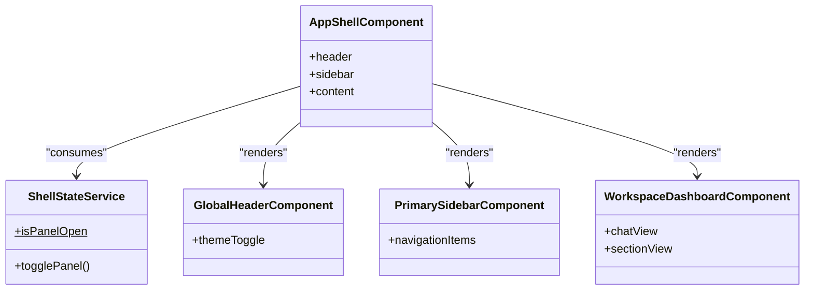

**Diagram sources**
- [app-shell.component.ts](file://frontend/src/app/layout/app-shell/app-shell.component.ts)
- [shell-state.service.ts](file://frontend/src/app/layout/shell/shell-state.service.ts)
- [global-header.component.ts](file://frontend/src/app/layout/global-header/global-header.component.ts)
- [primary-sidebar.component.ts](file://frontend/src/app/layout/primary-sidebar/primary-sidebar.component.ts)
- [workspace-dashboard.component.ts](file://frontend/src/app/layout/workspace/workspace-dashboard.component.ts)
- [chat-view.component.ts](file://frontend/src/app/layout/workspace/chat-view.component.ts)
- [section-view.component.ts](file://frontend/src/app/layout/workspace/section-view.component.ts)

**Section sources**
- [app-shell.component.ts](file://frontend/src/app/layout/app-shell/app-shell.component.ts)
- [shell-state.service.ts](file://frontend/src/app/layout/shell/shell-state.service.ts)
- [global-header.component.ts](file://frontend/src/app/layout/global-header/global-header.component.ts)
- [primary-sidebar.component.ts](file://frontend/src/app/layout/primary-sidebar/primary-sidebar.component.ts)
- [workspace-dashboard.component.ts](file://frontend/src/app/layout/workspace/workspace-dashboard.component.ts)
- [chat-view.component.ts](file://frontend/src/app/layout/workspace/chat-view.component.ts)
- [section-view.component.ts](file://frontend/src/app/layout/workspace/section-view.component.ts)

### Shared UI and Theme
- Theme service toggles themes and exposes reactive theme state.
- UI components provide consistent interaction patterns and visual tokens.

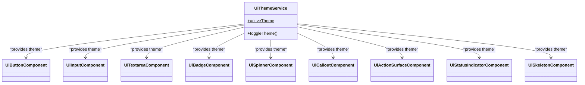

**Diagram sources**
- [ui-theme.service.ts](file://frontend/src/app/shared/theme/ui-theme.service.ts)
- [ui-button.component.ts](file://frontend/src/app/shared/ui/ui-button/ui-button.component.ts)
- [ui-input.component.ts](file://frontend/src/app/shared/ui/ui-input/ui-input.component.ts)
- [ui-textarea.component.ts](file://frontend/src/app/shared/ui/ui-textarea/ui-textarea.component.ts)
- [ui-badge.component.ts](file://frontend/src/app/shared/ui/ui-badge/ui-badge.component.ts)
- [ui-spinner.component.ts](file://frontend/src/app/shared/ui/ui-spinner/ui-spinner.component.ts)
- [ui-callout.component.ts](file://frontend/src/app/shared/ui/ui-callout/ui-callout.component.ts)
- [ui-action-surface.component.ts](file://frontend/src/app/shared/ui/ui-action-surface/ui-action-surface.component.ts)
- [ui-status-indicator.component.ts](file://frontend/src/app/shared/ui/ui-status-indicator/ui-status-indicator.component.ts)
- [ui-skeleton.component.ts](file://frontend/src/app/shared/ui/ui-skeleton/ui-skeleton.component.ts)

**Section sources**
- [ui-theme.service.ts](file://frontend/src/app/shared/theme/ui-theme.service.ts)
- [ui-button.component.ts](file://frontend/src/app/shared/ui/ui-button/ui-button.component.ts)
- [ui-input.component.ts](file://frontend/src/app/shared/ui/ui-input/ui-input.component.ts)
- [ui-textarea.component.ts](file://frontend/src/app/shared/ui/ui-textarea/ui-textarea.component.ts)
- [ui-badge.component.ts](file://frontend/src/app/shared/ui/ui-badge/ui-badge.component.ts)
- [ui-spinner.component.ts](file://frontend/src/app/shared/ui/ui-spinner/ui-spinner.component.ts)
- [ui-callout.component.ts](file://frontend/src/app/shared/ui/ui-callout/ui-callout.component.ts)
- [ui-action-surface.component.ts](file://frontend/src/app/shared/ui/ui-action-surface/ui-action-surface.component.ts)
- [ui-status-indicator.component.ts](file://frontend/src/app/shared/ui/ui-status-indicator/ui-status-indicator.component.ts)
- [ui-skeleton.component.ts](file://frontend/src/app/shared/ui/ui-skeleton/ui-skeleton.component.ts)

## Dependency Analysis
- DI and providers: Application config registers global providers, interceptors, and route guards.
- Feature isolation: Stores depend only on core services; components depend only on stores and shared UI.
- External integrations: HTTP and SSE clients abstract external dependencies behind typed interfaces.

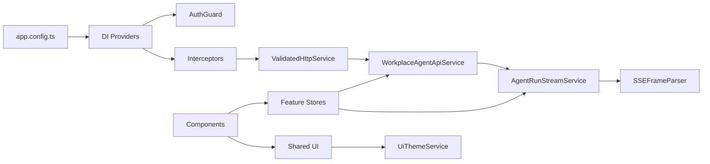

**Diagram sources**
- [app.config.ts](file://frontend/src/app/app.config.ts)
- [auth.guard.ts](file://frontend/src/app/core/routing/auth.guard.ts)
- [api-error.interceptor.ts](file://frontend/src/app/core/api/api-error.interceptor.ts)
- [validated-http.service.ts](file://frontend/src/app/core/api/validated-http.service.ts)
- [workplace-agent-api.service.ts](file://frontend/src/app/core/api/workplace-agent-api.service.ts)
- [agent-run-stream.service.ts](file://frontend/src/app/core/agent-run/agent-run-stream.service.ts)
- [sse-frame-parser.ts](file://frontend/src/app/core/agent-run/sse-frame-parser.ts)
- [assistant-conversation.store.ts](file://frontend/src/app/features/assistant-conversation/agent-conversation.store.ts)
- [ui-theme.service.ts](file://frontend/src/app/shared/theme/ui-theme.service.ts)

**Section sources**
- [app.config.ts](file://frontend/src/app/app.config.ts)
- [auth.guard.ts](file://frontend/src/app/core/routing/auth.guard.ts)
- [api-error.interceptor.ts](file://frontend/src/app/core/api/api-error.interceptor.ts)
- [validated-http.service.ts](file://frontend/src/app/core/api/validated-http.service.ts)
- [workplace-agent-api.service.ts](file://frontend/src/app/core/api/workplace-agent-api.service.ts)
- [agent-run-stream.service.ts](file://frontend/src/app/core/agent-run/agent-run-stream.service.ts)
- [sse-frame-parser.ts](file://frontend/src/app/core/agent-run/sse-frame-parser.ts)
- [assistant-conversation.store.ts](file://frontend/src/app/features/assistant-conversation/agent-conversation.store.ts)
- [ui-theme.service.ts](file://frontend/src/app/shared/theme/ui-theme.service.ts)

## Performance Considerations
- Prefer async pipes in templates to avoid manual subscriptions and memory leaks.
- Use OnPush change detection in components that consume immutable store states.
- Debounce heavy computations in stores; leverage RxJS operators for efficient transformations.
- Lazy-load feature modules to reduce initial bundle size.
- Cache frequently accessed data in stores or in-memory caches when appropriate.
- Minimize re-renders by keeping component state minimal and delegating to stores.

[No sources needed since this section provides general guidance]

## Troubleshooting Guide
- Authentication failures: Verify auth header interceptor is attaching tokens; check current user store state and redirect flows in auth guard.
- API errors: Inspect normalized error shapes from the API error interceptor; ensure wire schemas match backend contracts.
- SSE issues: Confirm authenticated SSE client connects successfully; validate frame parsing logic and event emission.
- Configuration problems: Ensure app config loader completes before route activation; verify token availability in services.

**Section sources**
- [auth-header.interceptor.ts](file://frontend/src/app/core/auth/auth-header.interceptor.ts)
- [auth.guard.ts](file://frontend/src/app/core/routing/auth.guard.ts)
- [current-user.store.ts](file://frontend/src/app/core/auth/current-user.store.ts)
- [api-error.interceptor.ts](file://frontend/src/app/core/api/api-error.interceptor.ts)
- [wire.schemas.ts](file://frontend/src/app/core/api/wire.schemas.ts)
- [authenticated-sse-client.service.ts](file://frontend/src/app/core/sse/authenticated-sse-client.service.ts)
- [sse-frame-parser.ts](file://frontend/src/app/core/agent-run/sse-frame-parser.ts)
- [app-config.loader.ts](file://frontend/src/app/core/config/app-config.loader.ts)
- [app-config.token.ts](file://frontend/src/app/core/config/app-config.token.ts)

## Conclusion
The frontend architecture emphasizes clear separation of concerns, reactive state management, and robust integration with backend APIs and real-time streams. By organizing code into features, isolating cross-cutting concerns in core, and providing shared UI primitives, the application remains maintainable and extensible. New features should follow established patterns: create stores for state and side effects, use services for HTTP/SSE, and keep components focused on presentation.

[No sources needed since this section summarizes without analyzing specific files]

## Appendices
- Extension points:
  - Add new routes in app routes and protect them with guards.
  - Introduce new stores under features, consuming core services.
  - Extend shared UI by adding components and integrating theme service.
  - Configure additional interceptors or providers in app config.

[No sources needed since this section provides general guidance]