# Frontend Development

<cite>
**Referenced Files in This Document**
- [angular.json](file://frontend/angular.json)
- [package.json](file://frontend/package.json)
- [tsconfig.app.json](file://frontend/tsconfig.app.json)
- [app.config.ts](file://frontend/src/app/app.config.ts)
- [app.routes.ts](file://frontend/src/app/app.routes.ts)
- [main.ts](file://frontend/src/main.ts)
- [index.html](file://frontend/src/index.html)
- [styles.scss](file://frontend/src/styles.scss)
- [_themes.scss](file://frontend/src/styles/_themes.scss)
- [_tokens.scss](file://frontend/src/styles/_tokens.scss)
- [_accessibility.scss](file://frontend/src/styles/_accessibility.scss)
- [api-client.md](file://frontend/docs/API_CLIENT.md)
- [design-system.md](file://frontend/docs/DESIGN_SYSTEM.md)
- [testing.md](file://frontend/docs/TESTING.md)
- [agent-run-stream.service.ts](file://frontend/src/app/core/agent-run/agent-run-stream.service.ts)
- [sse-frame-parser.ts](file://frontend/src/app/core/agent-run/sse-frame-parser.ts)
- [authenticated-sse-client.service.ts](file://frontend/src/app/core/sse/authenticated-sse-client.service.ts)
- [workplace-agent-api.service.ts](file://frontend/src/app/core/api/workplace-agent-api.service.ts)
- [validated-http.service.ts](file://frontend/src/app/core/api/validated-http.service.ts)
- [api-error.interceptor.ts](file://frontend/src/app/core/api/api-error.interceptor.ts)
- [request-id.interceptor.ts](file://frontend/src/app/core/api/request-id.interceptor.ts)
- [auth-header.interceptor.ts](file://frontend/src/app/core/auth/auth-header.interceptor.ts)
- [auth.service.ts](file://frontend/src/app/core/auth/auth.service.ts)
- [current-user.store.ts](file://frontend/src/app/core/auth/current-user.store.ts)
- [auth.guard.ts](file://frontend/src/app/core/routing/auth.guard.ts)
- [organization-route.service.ts](file://frontend/src/app/core/routing/organization-route.service.ts)
- [app-config.loader.ts](file://frontend/src/app/core/config/app-config.loader.ts)
- [app-config.model.ts](file://frontend/src/app/core/config/app-config.model.ts)
- [app-config.token.ts](file://frontend/src/app/core/config/app-config.token.ts)
- [conversation-api.service.ts](file://frontend/src/app/core/conversation/conversation-api.service.ts)
- [error-normalizer.ts](file://frontend/src/app/core/errors/error-normalizer.ts)
- [workplace-api.error.ts](file://frontend/src/app/core/errors/workplace-api.error.ts)
- [approval-center.component.ts](file://frontend/src/app/features/approval-center/approval-center.component.ts)
- [approval-center.store.ts](file://frontend/src/app/features/approval-center/approval-center.store.ts)
- [assistant-conversation.store.ts](file://frontend/src/app/features/assistant-conversation/agent-conversation.store.ts)
- [agent-response.mapper.ts](file://frontend/src/app/features/assistant-conversation/agent-response.mapper.ts)
- [assistant-composer.component.ts](file://frontend/src/app/features/assistant-conversation/assistant-composer/assistant-composer.component.ts)
- [assistant-message.component.ts](file://frontend/src/app/features/assistant-conversation/assistant-message/assistant-message.component.ts)
- [assistant-activity.component.ts](file://frontend/src/app/features/assistant-conversation/assistant-activity/assistant-activity.component.ts)
- [assistant-proposal-card.component.ts](file://frontend/src/app/features/assistant-conversation/assistant-proposal-card/assistant-proposal-card.component.ts)
- [conversation-list.component.ts](file://frontend/src/app/features/conversation-list/conversation-list.component.ts)
- [landing.component.ts](file://frontend/src/app/features/landing/landing.component.ts)
- [app-shell.component.ts](file://frontend/src/app/layout/app-shell/app-shell.component.ts)
- [primary-sidebar.component.ts](file://frontend/src/app/layout/primary-sidebar/primary-sidebar.component.ts)
- [global-header.component.ts](file://frontend/src/app/layout/global-header/global-header.component.ts)
- [shell-state.service.ts](file://frontend/src/app/layout/shell/shell-state.service.ts)
- [chat-view.component.ts](file://frontend/src/app/layout/workspace/chat-view.component.ts)
- [workspace-dashboard.component.ts](file://frontend/src/app/layout/workspace/workspace-dashboard.component.ts)
- [ui-theme.service.ts](file://frontend/src/app/shared/theme/ui-theme.service.ts)
- [ui-theme-toggle.component.ts](file://frontend/src/app/shared/theme/ui-theme-toggle.component.ts)
- [ui-button.component.ts](file://frontend/src/app/shared/ui/ui-button/ui-button.component.ts)
- [ui-input.component.ts](file://frontend/src/app/shared/ui/ui-input/ui-input.component.ts)
- [ui-textarea.component.ts](file://frontend/src/app/shared/ui/ui-textarea/ui-textarea.component.ts)
- [ui-badge.component.ts](file://frontend/src/app/shared/ui/ui-badge/ui-badge.component.ts)
- [ui-spinner.component.ts](file://frontend/src/app/shared/ui/ui-spinner/ui-spinner.component.ts)
- [ui-callout.component.ts](file://frontend/src/app/shared/ui/ui-callout/ui-callout.component.ts)
- [ui-action-surface.component.ts](file://frontend/src/app/shared/ui/ui-action-surface/ui-action-surface.component.ts)
- [ui-status-indicator.component.ts](file://frontend/src/app/shared/ui/ui-status-indicator/ui-status-indicator.component.ts)
- [ui-icon-button.component.ts](file://frontend/src/app/shared/ui/ui-icon-button/ui-icon-button.component.ts)
- [playwright.config.ts](file://frontend/playwright.config.ts)
- [foundation.spec.ts](file://frontend/e2e/foundation.spec.ts)
- [assistant-conversation.spec.ts](file://frontend/e2e/assistant-conversation.spec.ts)
- [assistant-proposal-control.spec.ts](file://frontend/e2e/assistant-proposal-control.spec.ts)
- [approval-center.spec.ts](file://frontend/e2e/approval-center.spec.ts)
</cite>

## Table of Contents
1. [Introduction](#introduction)
2. [Project Structure](#project-structure)
3. [Core Components](#core-components)
4. [Architecture Overview](#architecture-overview)
5. [Detailed Component Analysis](#detailed-component-analysis)
6. [Dependency Analysis](#dependency-analysis)
7. [Performance Considerations](#performance-considerations)
8. [Troubleshooting Guide](#troubleshooting-guide)
9. [Conclusion](#conclusion)
10. [Appendices](#appendices)

## Introduction
This document provides comprehensive frontend development guidance for the Angular 17+ application. It explains the feature-based module organization, reactive state management with stores and RxJS, component hierarchy, service layer architecture, API client implementation, design system and theming, accessibility compliance, real-time updates via Server-Sent Events (SSE), authentication flows, testing strategies (unit and end-to-end), build pipeline, optimization techniques, and deployment considerations. The goal is to enable both new and experienced contributors to understand and extend the codebase effectively.

## Project Structure
The frontend follows a feature-based architecture layered over shared core capabilities and a reusable UI library:
- app/core: Cross-cutting concerns (API client, auth, routing guards, SSE client, config loader, error handling)
- app/features: Feature modules organized by business capability (approval center, assistant conversation, conversation list, landing)
- app/layout: Application shell and layout components (app shell, sidebar, header, workspace views)
- app/shared: Reusable UI components and theme utilities
- styles: Global SCSS tokens, themes, patterns, and accessibility helpers
- e2e: Playwright tests for critical user journeys
- docs: Architecture and contract documentation for the frontend

```mermaid
graph TB
subgraph "App"
Core["core/*"]
Features["features/*"]
Layout["layout/*"]
Shared["shared/*"]
end
subgraph "Styles"
Tokens["_tokens.scss"]
Themes["_themes.scss"]
Accessibility["_accessibility.scss"]
end
subgraph "E2E"
E2E["e2e/*.spec.ts"]
end
subgraph "Config"
Angular["angular.json"]
TS["tsconfig.app.json"]
Main["src/main.ts"]
Routes["src/app/app.routes.ts"]
ConfigLoader["src/app/core/config/app-config.loader.ts"]
end
Main --> Routes
Routes --> Features
Features --> Core
Layout --> Core
Layout --> Shared
Features --> Shared
Core --> Styles
Shared --> Tokens
Shared --> Themes
Shared --> Accessibility
E2E --> Angular
ConfigLoader --> Angular
```

**Diagram sources**
- [angular.json](file://frontend/angular.json)
- [tsconfig.app.json](file://frontend/tsconfig.app.json)
- [main.ts](file://frontend/src/main.ts)
- [app.routes.ts](file://frontend/src/app/app.routes.ts)
- [app-config.loader.ts](file://frontend/src/app/core/config/app-config.loader.ts)
- [_tokens.scss](file://frontend/src/styles/_tokens.scss)
- [_themes.scss](file://frontend/src/styles/_themes.scss)
- [_accessibility.scss](file://frontend/src/styles/_accessibility.scss)

**Section sources**
- [angular.json](file://frontend/angular.json)
- [package.json](file://frontend/package.json)
- [tsconfig.app.json](file://frontend/tsconfig.app.json)
- [main.ts](file://frontend/src/main.ts)
- [app.routes.ts](file://frontend/src/app/app.routes.ts)
- [index.html](file://frontend/src/index.html)
- [styles.scss](file://frontend/src/styles.scss)

## Core Components
This section outlines the foundational building blocks that power the application’s behavior and cross-cutting concerns.

- API Client Layer
  - HTTP wrapper with validation and typed responses
  - Interceptors for auth headers, request IDs, and error normalization
  - Dedicated services per domain (agent run, action control, conversation)
- Authentication
  - Auth service managing login flow and token lifecycle
  - Guard protecting routes based on current user state
  - Store exposing current user observable
- Real-Time Updates (SSE)
  - Authenticated SSE client
  - Agent run stream service parsing frames and emitting typed events
- Configuration
  - App config loader fetching runtime settings at bootstrap
- Error Handling
  - Normalized error model and interceptors for consistent UX

Key responsibilities and relationships are visualized below.

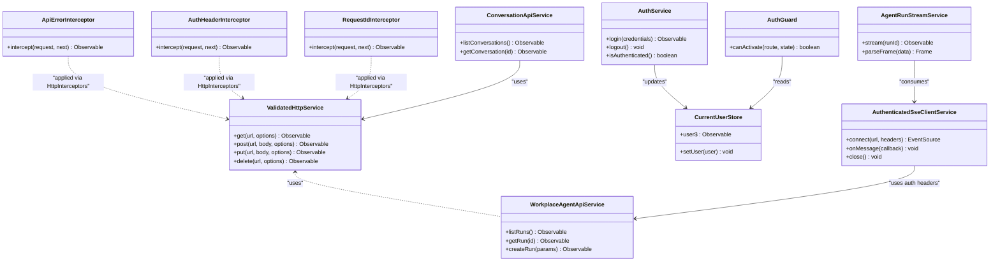

**Diagram sources**
- [validated-http.service.ts](file://frontend/src/app/core/api/validated-http.service.ts)
- [workplace-agent-api.service.ts](file://frontend/src/app/core/api/workplace-agent-api.service.ts)
- [api-error.interceptor.ts](file://frontend/src/app/core/api/api-error.interceptor.ts)
- [auth-header.interceptor.ts](file://frontend/src/app/core/auth/auth-header.interceptor.ts)
- [request-id.interceptor.ts](file://frontend/src/app/core/api/request-id.interceptor.ts)
- [auth.service.ts](file://frontend/src/app/core/auth/auth.service.ts)
- [current-user.store.ts](file://frontend/src/app/core/auth/current-user.store.ts)
- [auth.guard.ts](file://frontend/src/app/core/routing/auth.guard.ts)
- [authenticated-sse-client.service.ts](file://frontend/src/app/core/sse/authenticated-sse-client.service.ts)
- [agent-run-stream.service.ts](file://frontend/src/app/core/agent-run/agent-run-stream.service.ts)
- [conversation-api.service.ts](file://frontend/src/app/core/conversation/conversation-api.service.ts)

**Section sources**
- [validated-http.service.ts](file://frontend/src/app/core/api/validated-http.service.ts)
- [workplace-agent-api.service.ts](file://frontend/src/app/core/api/workplace-agent-api.service.ts)
- [api-error.interceptor.ts](file://frontend/src/app/core/api/api-error.interceptor.ts)
- [auth-header.interceptor.ts](file://frontend/src/app/core/auth/auth-header.interceptor.ts)
- [request-id.interceptor.ts](file://frontend/src/app/core/api/request-id.interceptor.ts)
- [auth.service.ts](file://frontend/src/app/core/auth/auth.service.ts)
- [current-user.store.ts](file://frontend/src/app/core/auth/current-user.store.ts)
- [auth.guard.ts](file://frontend/src/app/core/routing/auth.guard.ts)
- [authenticated-sse-client.service.ts](file://frontend/src/app/core/sse/authenticated-sse-client.service.ts)
- [agent-run-stream.service.ts](file://frontend/src/app/core/agent-run/agent-run-stream.service.ts)
- [conversation-api.service.ts](file://frontend/src/app/core/conversation/conversation-api.service.ts)

## Architecture Overview
The application bootstraps with Angular’s modern configuration and lazy-loaded feature routes. Core services provide HTTP, auth, SSE, and configuration. Features compose these services and expose stores for reactive state. Layout orchestrates navigation and global UI.

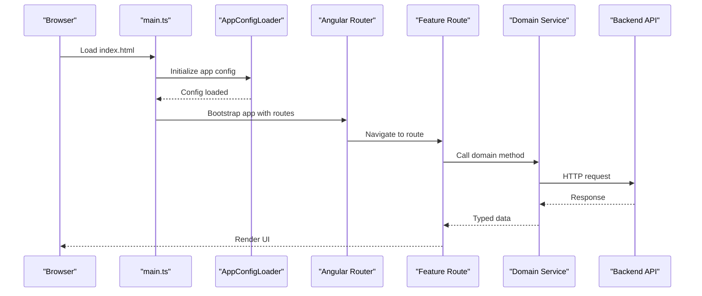

**Diagram sources**
- [main.ts](file://frontend/src/main.ts)
- [app.config.ts](file://frontend/src/app/app.config.ts)
- [app.routes.ts](file://frontend/src/app/app.routes.ts)
- [app-config.loader.ts](file://frontend/src/app/core/config/app-config.loader.ts)

## Detailed Component Analysis

### Feature-Based Module Organization
Features encapsulate end-to-end functionality with their own components, stores, and services. Examples include:
- Approval Center: Manages approval workflows and state
- Assistant Conversation: Orchestrates chat interactions, messages, proposals, and activity streams
- Conversation List: Lists and navigates conversations
- Landing: Entry point before authentication or context selection

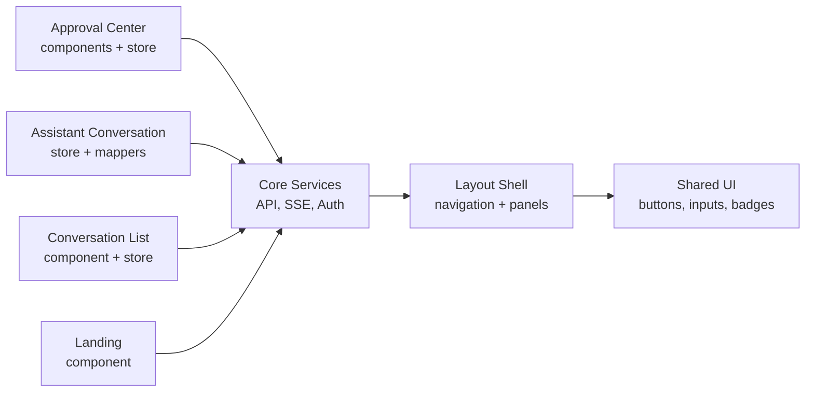

**Diagram sources**
- [approval-center.component.ts](file://frontend/src/app/features/approval-center/approval-center.component.ts)
- [approval-center.store.ts](file://frontend/src/app/features/approval-center/approval-center.store.ts)
- [assistant-conversation.store.ts](file://frontend/src/app/features/assistant-conversation/agent-conversation.store.ts)
- [agent-response.mapper.ts](file://frontend/src/app/features/assistant-conversation/agent-response.mapper.ts)
- [conversation-list.component.ts](file://frontend/src/app/features/conversation-list/conversation-list.component.ts)
- [landing.component.ts](file://frontend/src/app/features/landing/landing.component.ts)
- [app-shell.component.ts](file://frontend/src/app/layout/app-shell/app-shell.component.ts)
- [ui-button.component.ts](file://frontend/src/app/shared/ui/ui-button/ui-button.component.ts)

**Section sources**
- [approval-center.component.ts](file://frontend/src/app/features/approval-center/approval-center.component.ts)
- [approval-center.store.ts](file://frontend/src/app/features/approval-center/approval-center.store.ts)
- [assistant-conversation.store.ts](file://frontend/src/app/features/assistant-conversation/agent-conversation.store.ts)
- [agent-response.mapper.ts](file://frontend/src/app/features/assistant-conversation/agent-response.mapper.ts)
- [conversation-list.component.ts](file://frontend/src/app/features/conversation-list/conversation-list.component.ts)
- [landing.component.ts](file://frontend/src/app/features/landing/landing.component.ts)

### Reactive State Management with Stores and RxJS
Stores encapsulate feature state using RxJS observables. Components subscribe to state changes and dispatch actions to update state. Mappers transform backend payloads into UI-friendly models.

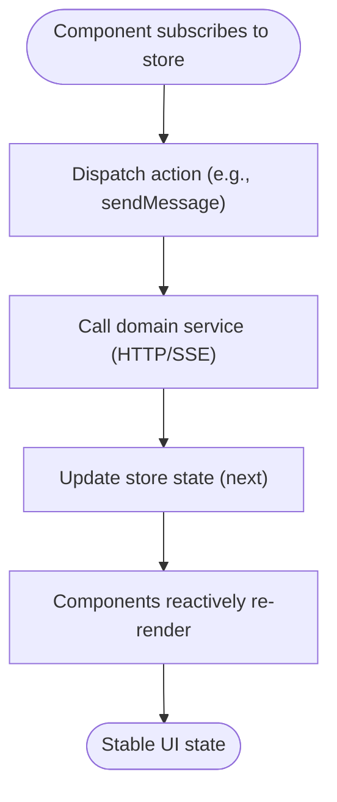

**Diagram sources**
- [assistant-conversation.store.ts](file://frontend/src/app/features/assistant-conversation/agent-conversation.store.ts)
- [agent-response.mapper.ts](file://frontend/src/app/features/assistant-conversation/agent-response.mapper.ts)
- [assistant-composer.component.ts](file://frontend/src/app/features/assistant-conversation/assistant-composer/assistant-composer.component.ts)
- [assistant-message.component.ts](file://frontend/src/app/features/assistant-conversation/assistant-message/assistant-message.component.ts)

**Section sources**
- [assistant-conversation.store.ts](file://frontend/src/app/features/assistant-conversation/agent-conversation.store.ts)
- [agent-response.mapper.ts](file://frontend/src/app/features/assistant-conversation/agent-response.mapper.ts)
- [assistant-composer.component.ts](file://frontend/src/app/features/assistant-conversation/assistant-composer/assistant-composer.component.ts)
- [assistant-message.component.ts](file://frontend/src/app/features/assistant-conversation/assistant-message/assistant-message.component.ts)

### Service Layer Architecture
Services abstract backend interactions and real-time streams:
- Domain APIs: Encapsulate REST endpoints with typed requests/responses
- SSE Streams: Manage authenticated connections and frame parsing
- Validation: Ensure wire contracts match expected schemas

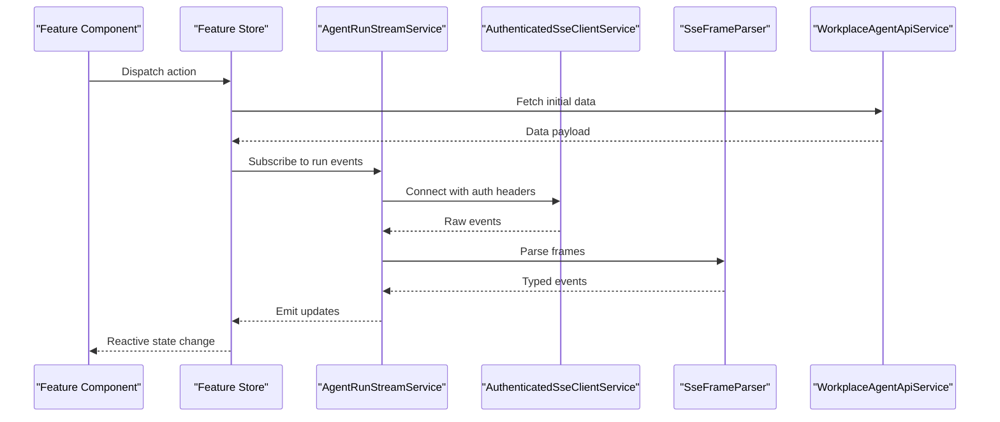

**Diagram sources**
- [agent-run-stream.service.ts](file://frontend/src/app/core/agent-run/agent-run-stream.service.ts)
- [sse-frame-parser.ts](file://frontend/src/app/core/agent-run/sse-frame-parser.ts)
- [authenticated-sse-client.service.ts](file://frontend/src/app/core/sse/authenticated-sse-client.service.ts)
- [workplace-agent-api.service.ts](file://frontend/src/app/core/api/workplace-agent-api.service.ts)

**Section sources**
- [agent-run-stream.service.ts](file://frontend/src/app/core/agent-run/agent-run-stream.service.ts)
- [sse-frame-parser.ts](file://frontend/src/app/core/agent-run/sse-frame-parser.ts)
- [authenticated-sse-client.service.ts](file://frontend/src/app/core/sse/authenticated-sse-client.service.ts)
- [workplace-agent-api.service.ts](file://frontend/src/app/core/api/workplace-agent-api.service.ts)

### API Client Implementation
The API client uses a validated HTTP service with interceptors for:
- Authentication headers injection
- Request ID propagation for tracing
- Centralized error normalization

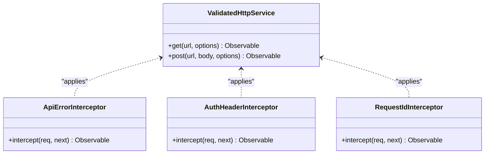

**Diagram sources**
- [validated-http.service.ts](file://frontend/src/app/core/api/validated-http.service.ts)
- [api-error.interceptor.ts](file://frontend/src/app/core/api/api-error.interceptor.ts)
- [auth-header.interceptor.ts](file://frontend/src/app/core/auth/auth-header.interceptor.ts)
- [request-id.interceptor.ts](file://frontend/src/app/core/api/request-id.interceptor.ts)

**Section sources**
- [validated-http.service.ts](file://frontend/src/app/core/api/validated-http.service.ts)
- [api-error.interceptor.ts](file://frontend/src/app/core/api/api-error.interceptor.ts)
- [auth-header.interceptor.ts](file://frontend/src/app/core/auth/auth-header.interceptor.ts)
- [request-id.interceptor.ts](file://frontend/src/app/core/api/request-id.interceptor.ts)

### Design System and Theming
Reusable UI components are provided under shared/ui with consistent theming and accessibility support:
- Buttons, inputs, textareas, badges, spinners, callouts, surfaces, status indicators, icon buttons
- Theme service and toggle component for dynamic theme switching
- Global SCSS tokens and theme definitions

```mermaid
graph TB
ThemeSvc["ui-theme.service.ts"] --> Toggle["ui-theme-toggle.component.ts"]
Tokens["_tokens.scss"] --> Theme["ui-theme.service.ts"]
Themes["_themes.scss"] --> Theme["ui-theme.service.ts"]
Access["_accessibility.scss"] --> UI["UI Components"]
Button["ui-button.component.ts"] --> UI
Input["ui-input.component.ts"] --> UI
Textarea["ui-textarea.component.ts"] --> UI
Badge["ui-badge.component.ts"] --> UI
Spinner["ui-spinner.component.ts"] --> UI
Callout["ui-callout.component.ts"] --> UI
Surface["ui-action-surface.component.ts"] --> UI
Status["ui-status-indicator.component.ts"] --> UI
IconBtn["ui-icon-button.component.ts"] --> UI
```

**Diagram sources**
- [ui-theme.service.ts](file://frontend/src/app/shared/theme/ui-theme.service.ts)
- [ui-theme-toggle.component.ts](file://frontend/src/app/shared/theme/ui-theme-toggle.component.ts)
- [_tokens.scss](file://frontend/src/styles/_tokens.scss)
- [_themes.scss](file://frontend/src/styles/_themes.scss)
- [_accessibility.scss](file://frontend/src/styles/_accessibility.scss)
- [ui-button.component.ts](file://frontend/src/app/shared/ui/ui-button/ui-button.component.ts)
- [ui-input.component.ts](file://frontend/src/app/shared/ui/ui-input/ui-input.component.ts)
- [ui-textarea.component.ts](file://frontend/src/app/shared/ui/ui-textarea/ui-textarea.component.ts)
- [ui-badge.component.ts](file://frontend/src/app/shared/ui/ui-badge/ui-badge.component.ts)
- [ui-spinner.component.ts](file://frontend/src/app/shared/ui/ui-spinner/ui-spinner.component.ts)
- [ui-callout.component.ts](file://frontend/src/app/shared/ui/ui-callout/ui-callout.component.ts)
- [ui-action-surface.component.ts](file://frontend/src/app/shared/ui/ui-action-surface/ui-action-surface.component.ts)
- [ui-status-indicator.component.ts](file://frontend/src/app/shared/ui/ui-status-indicator/ui-status-indicator.component.ts)
- [ui-icon-button.component.ts](file://frontend/src/app/shared/ui/ui-icon-button/ui-icon-button.component.ts)

**Section sources**
- [ui-theme.service.ts](file://frontend/src/app/shared/theme/ui-theme.service.ts)
- [ui-theme-toggle.component.ts](file://frontend/src/app/shared/theme/ui-theme-toggle.component.ts)
- [_tokens.scss](file://frontend/src/styles/_tokens.scss)
- [_themes.scss](file://frontend/src/styles/_themes.scss)
- [_accessibility.scss](file://frontend/src/styles/_accessibility.scss)
- [ui-button.component.ts](file://frontend/src/app/shared/ui/ui-button/ui-button.component.ts)
- [ui-input.component.ts](file://frontend/src/app/shared/ui/ui-input/ui-input.component.ts)
- [ui-textarea.component.ts](file://frontend/src/app/shared/ui/ui-textarea/ui-textarea.component.ts)
- [ui-badge.component.ts](file://frontend/src/app/shared/ui/ui-badge/ui-badge.component.ts)
- [ui-spinner.component.ts](file://frontend/src/app/shared/ui/ui-spinner/ui-spinner.component.ts)
- [ui-callout.component.ts](file://frontend/src/app/shared/ui/ui-callout/ui-callout.component.ts)
- [ui-action-surface.component.ts](file://frontend/src/app/shared/ui/ui-action-surface/ui-action-surface.component.ts)
- [ui-status-indicator.component.ts](file://frontend/src/app/shared/ui/ui-status-indicator/ui-status-indicator.component.ts)
- [ui-icon-button.component.ts](file://frontend/src/app/shared/ui/ui-icon-button/ui-icon-button.component.ts)

### Authentication Flows
Authentication is managed through an auth service, guard, and header interceptor:
- Login triggers auth service to obtain tokens and update current user store
- Guard protects routes by checking current user state
- Header interceptor injects auth headers into outgoing requests

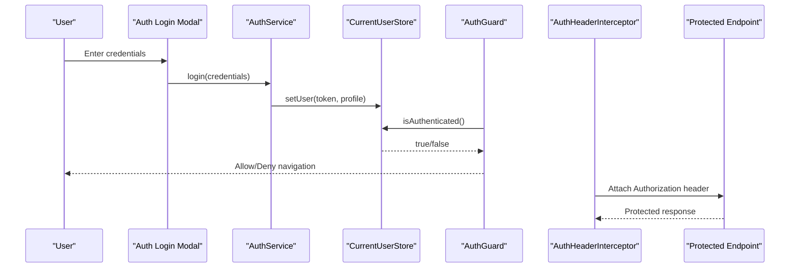

**Diagram sources**
- [auth.service.ts](file://frontend/src/app/core/auth/auth.service.ts)
- [current-user.store.ts](file://frontend/src/app/core/auth/current-user.store.ts)
- [auth.guard.ts](file://frontend/src/app/core/routing/auth.guard.ts)
- [auth-header.interceptor.ts](file://frontend/src/app/core/auth/auth-header.interceptor.ts)

**Section sources**
- [auth.service.ts](file://frontend/src/app/core/auth/auth.service.ts)
- [current-user.store.ts](file://frontend/src/app/core/auth/current-user.store.ts)
- [auth.guard.ts](file://frontend/src/app/core/routing/auth.guard.ts)
- [auth-header.interceptor.ts](file://frontend/src/app/core/auth/auth-header.interceptor.ts)

### Real-Time Updates with SSE
Real-time agent run updates are handled by an authenticated SSE client and a stream service that parses frames and emits typed events to features.

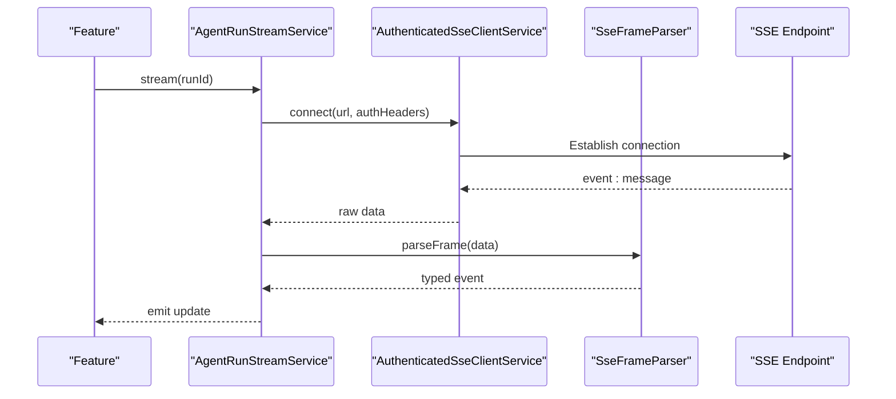

**Diagram sources**
- [agent-run-stream.service.ts](file://frontend/src/app/core/agent-run/agent-run-stream.service.ts)
- [authenticated-sse-client.service.ts](file://frontend/src/app/core/sse/authenticated-sse-client.service.ts)
- [sse-frame-parser.ts](file://frontend/src/app/core/agent-run/sse-frame-parser.ts)

**Section sources**
- [agent-run-stream.service.ts](file://frontend/src/app/core/agent-run/agent-run-stream.service.ts)
- [authenticated-sse-client.service.ts](file://frontend/src/app/core/sse/authenticated-sse-client.service.ts)
- [sse-frame-parser.ts](file://frontend/src/app/core/agent-run/sse-frame-parser.ts)

### Layout and Navigation
The layout composes the app shell, primary sidebar, global header, and workspace views. Shell state service coordinates panel visibility and resizing.

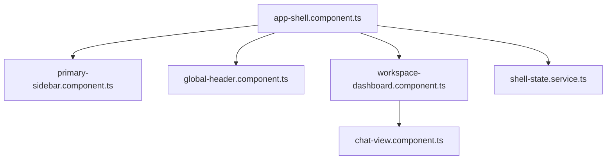

**Diagram sources**
- [app-shell.component.ts](file://frontend/src/app/layout/app-shell/app-shell.component.ts)
- [primary-sidebar.component.ts](file://frontend/src/app/layout/primary-sidebar/primary-sidebar.component.ts)
- [global-header.component.ts](file://frontend/src/app/layout/global-header/global-header.component.ts)
- [workspace-dashboard.component.ts](file://frontend/src/app/layout/workspace/workspace-dashboard.component.ts)
- [chat-view.component.ts](file://frontend/src/app/layout/workspace/chat-view.component.ts)
- [shell-state.service.ts](file://frontend/src/app/layout/shell/shell-state.service.ts)

**Section sources**
- [app-shell.component.ts](file://frontend/src/app/layout/app-shell/app-shell.component.ts)
- [primary-sidebar.component.ts](file://frontend/src/app/layout/primary-sidebar/primary-sidebar.component.ts)
- [global-header.component.ts](file://frontend/src/app/layout/global-header/global-header.component.ts)
- [workspace-dashboard.component.ts](file://frontend/src/app/layout/workspace/workspace-dashboard.component.ts)
- [chat-view.component.ts](file://frontend/src/app/layout/workspace/chat-view.component.ts)
- [shell-state.service.ts](file://frontend/src/app/layout/shell/shell-state.service.ts)

### Guidelines for Creating New Features
To add a new feature following the established patterns:
- Create a folder under app/features/<feature-name>
- Implement components, a store (RxJS-based), and any needed mappers
- Add routes in app.routes.ts and ensure lazy loading if appropriate
- Use core services for API calls and SSE integration
- Compose layout components from shared/ui and apply theme tokens
- Write unit tests for store logic and component interactions
- Add E2E scenarios for critical user flows

[No sources needed since this section provides general guidance]

## Dependency Analysis
The frontend depends on Angular CLI tooling, TypeScript configuration, and Playwright for E2E. Core services depend on each other through well-defined interfaces.

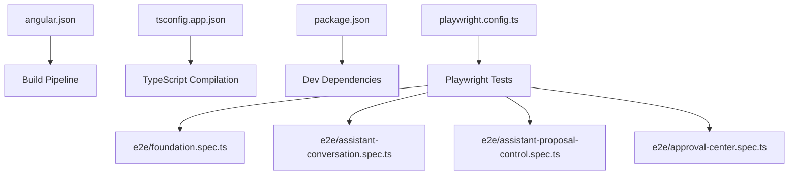

**Diagram sources**
- [angular.json](file://frontend/angular.json)
- [tsconfig.app.json](file://frontend/tsconfig.app.json)
- [package.json](file://frontend/package.json)
- [playwright.config.ts](file://frontend/playwright.config.ts)
- [foundation.spec.ts](file://frontend/e2e/foundation.spec.ts)
- [assistant-conversation.spec.ts](file://frontend/e2e/assistant-conversation.spec.ts)
- [assistant-proposal-control.spec.ts](file://frontend/e2e/assistant-proposal-control.spec.ts)
- [approval-center.spec.ts](file://frontend/e2e/approval-center.spec.ts)

**Section sources**
- [angular.json](file://frontend/angular.json)
- [tsconfig.app.json](file://frontend/tsconfig.app.json)
- [package.json](file://frontend/package.json)
- [playwright.config.ts](file://frontend/playwright.config.ts)

## Performance Considerations
- Prefer lazy-loading feature routes to reduce initial bundle size
- Use OnPush change detection strategy in components where possible
- Debounce heavy operations (e.g., search input) and avoid unnecessary subscriptions
- Leverage RxJS operators like shareReplay for expensive streams
- Minimize DOM manipulations; prefer structural directives and trackBy in lists
- Optimize images and assets; use Angular’s asset pipeline efficiently
- Monitor bundle sizes and tree-shake unused dependencies

[No sources needed since this section provides general guidance]

## Troubleshooting Guide
Common issues and resolutions:
- Authentication failures
  - Verify auth header interceptor attaches tokens correctly
  - Check current user store state and guard logic
- API errors
  - Inspect normalized error responses and interceptors
  - Validate request/response schemas against contracts
- SSE connectivity
  - Confirm authenticated SSE client includes proper headers
  - Review frame parser for malformed events
- Routing problems
  - Ensure guards return correct booleans and redirects
  - Validate route parameters and organization context

**Section sources**
- [api-error.interceptor.ts](file://frontend/src/app/core/api/api-error.interceptor.ts)
- [auth-header.interceptor.ts](file://frontend/src/app/core/auth/auth-header.interceptor.ts)
- [current-user.store.ts](file://frontend/src/app/core/auth/current-user.store.ts)
- [auth.guard.ts](file://frontend/src/app/core/routing/auth.guard.ts)
- [authenticated-sse-client.service.ts](file://frontend/src/app/core/sse/authenticated-sse-client.service.ts)
- [sse-frame-parser.ts](file://frontend/src/app/core/agent-run/sse-frame-parser.ts)
- [error-normalizer.ts](file://frontend/src/app/core/errors/error-normalizer.ts)
- [workplace-api.error.ts](file://frontend/src/app/core/errors/workplace-api.error.ts)

## Conclusion
This frontend adheres to a robust feature-based architecture with clear separation of concerns, reactive state management, and strong typing. The design system ensures consistency and accessibility, while SSE enables real-time updates. Following the guidelines here will help maintain code quality, performance, and testability across the application.

[No sources needed since this section summarizes without analyzing specific files]

## Appendices

### Build Pipeline and Optimization
- Angular CLI builds the app using angular.json and tsconfig.app.json
- Production builds optimize bundles, enable Ahead-of-Time compilation, and minify assets
- Environment-specific configurations can be injected via app config loader

**Section sources**
- [angular.json](file://frontend/angular.json)
- [tsconfig.app.json](file://frontend/tsconfig.app.json)
- [app-config.loader.ts](file://frontend/src/app/core/config/app-config.loader.ts)
- [app-config.model.ts](file://frontend/src/app/core/config/app-config.model.ts)
- [app-config.token.ts](file://frontend/src/app/core/config/app-config.token.ts)

### Deployment Considerations
- Serve static assets behind a CDN for improved performance
- Configure reverse proxy for API and SSE endpoints during development
- Set environment variables for base URL and feature flags
- Enable caching headers for immutable assets

**Section sources**
- [proxy.conf.json](file://frontend/proxy.conf.json)
- [app-config.loader.ts](file://frontend/src/app/core/config/app-config.loader.ts)

### Testing Strategies
- Unit tests: Focus on stores, mappers, and services; leverage Angular testing utilities
- Component tests: Validate interactions and reactive bindings
- E2E tests: Use Playwright to assert critical user journeys across features

**Section sources**
- [testing.md](file://frontend/docs/TESTING.md)
- [playwright.config.ts](file://frontend/playwright.config.ts)
- [foundation.spec.ts](file://frontend/e2e/foundation.spec.ts)
- [assistant-conversation.spec.ts](file://frontend/e2e/assistant-conversation.spec.ts)
- [assistant-proposal-control.spec.ts](file://frontend/e2e/assistant-proposal-control.spec.ts)
- [approval-center.spec.ts](file://frontend/e2e/approval-center.spec.ts)

### API Contracts and Documentation
- Refer to API client documentation for endpoint usage and response shapes
- Consult design system documentation for component usage and theming

**Section sources**
- [api-client.md](file://frontend/docs/API_CLIENT.md)
- [design-system.md](file://frontend/docs/DESIGN_SYSTEM.md)