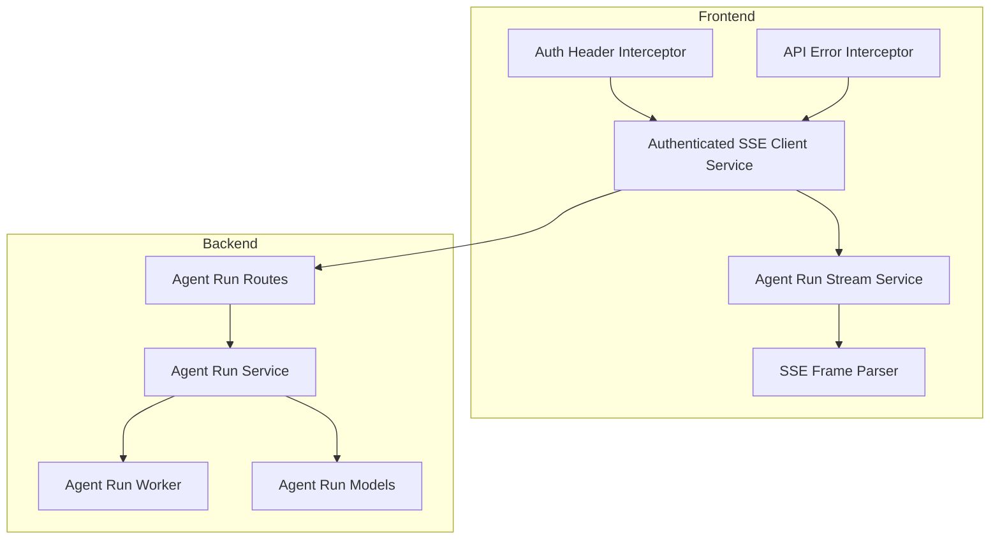
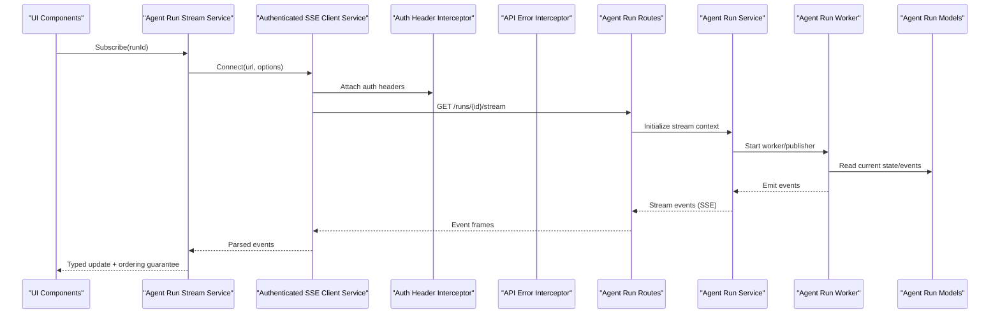
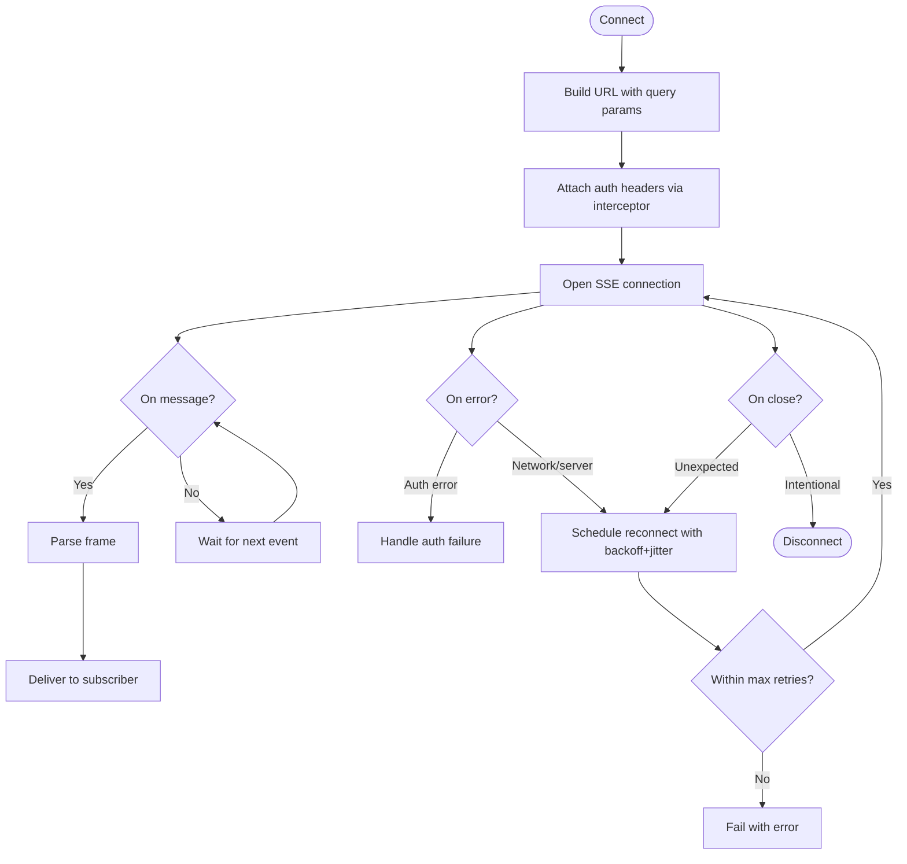
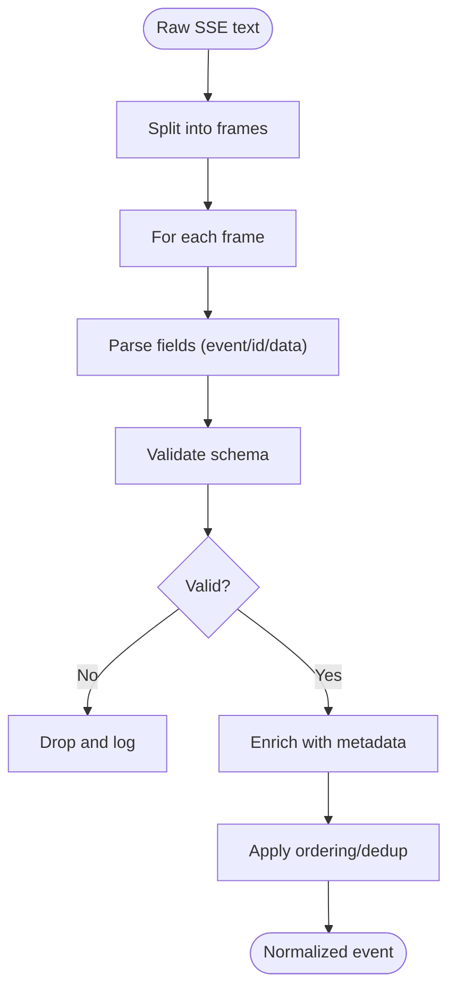
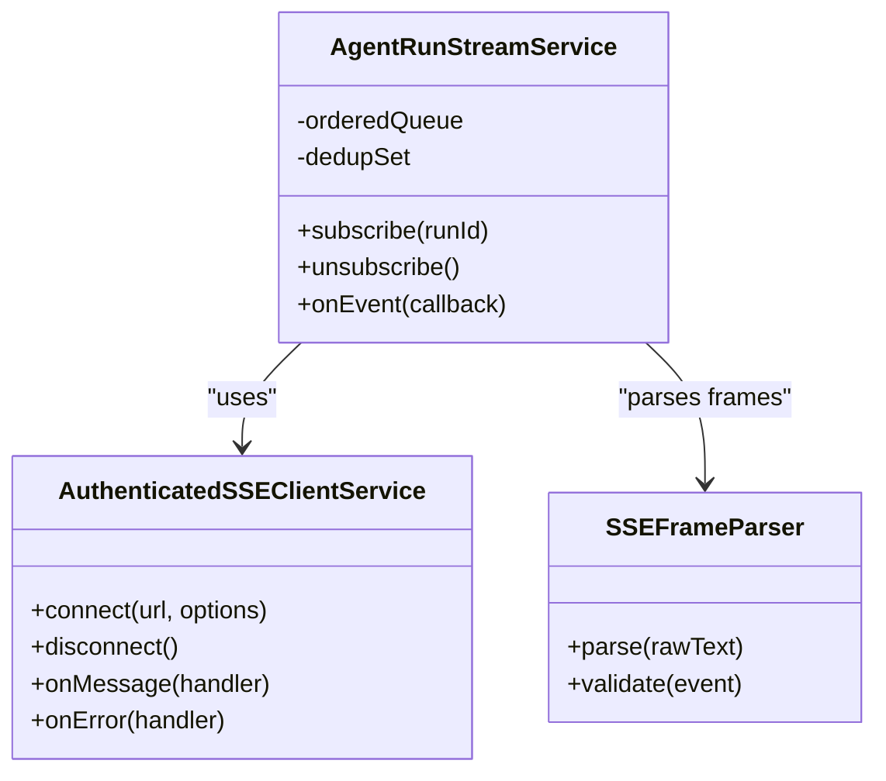
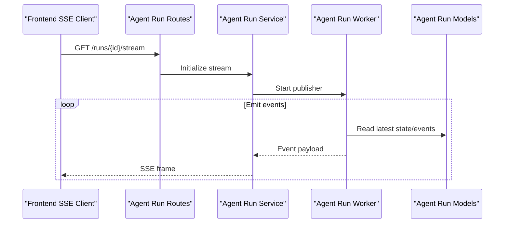
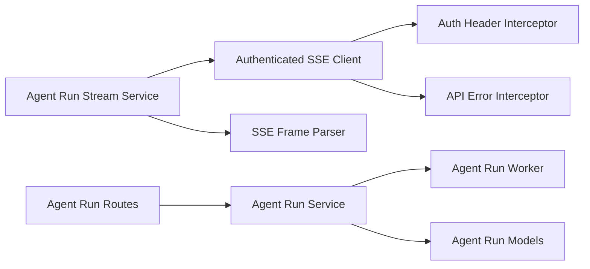

# Real-time Communication

<cite>
**Referenced Files in This Document**
- [authenticated-sse-client.service.ts](file://frontend/src/app/core/sse/authenticated-sse-client.service.ts)
- [agent-run-stream.service.ts](file://frontend/src/app/core/agent-run/agent-run-stream.service.ts)
- [sse-frame-parser.ts](file://frontend/src/app/core/agent-run/sse-frame-parser.ts)
- [agent-run-stream.service.spec.ts](file://frontend/src/app/core/agent-run/agent-run-stream.service.spec.ts)
- [sse-frame-parser.spec.ts](file://frontend/src/app/core/agent-run/sse-frame-parser.spec.ts)
- [auth-header.interceptor.ts](file://frontend/src/app/core/auth/auth-header.interceptor.ts)
- [api-error.interceptor.ts](file://frontend/src/app/core/api/api-error.interceptor.ts)
- [agent_run_routes.py](file://app/api/agent_run_routes.py)
- [agent_run_service.py](file://app/services/agent_run_service.py)
- [agent_run_worker.py](file://app/services/agent_run_worker.py)
- [agent_run_models.py](file://app/db/agent_run_models.py)
- [AGENT_RUNS_SSE.md](file://docs/AGENT_RUNS_SSE.md)
</cite>

## Table of Contents
1. [Introduction](#introduction)
2. [Project Structure](#project-structure)
3. [Core Components](#core-components)
4. [Architecture Overview](#architecture-overview)
5. [Detailed Component Analysis](#detailed-component-analysis)
6. [Dependency Analysis](#dependency-analysis)
7. [Performance Considerations](#performance-considerations)
8. [Troubleshooting Guide](#troubleshooting-guide)
9. [Conclusion](#conclusion)

## Introduction
This document explains the real-time communication implementation using Server-Sent Events (SSE). It focuses on:
- The SSE client service with automatic reconnection, authentication headers, and error handling
- The frame parser for processing event streams and message ordering guarantees
- The agent run streaming service that delivers real-time progress updates and activity visualization
- Connection management strategies, performance optimization techniques, and debugging approaches

The goal is to provide both a high-level understanding and code-level details so that developers can implement, extend, and troubleshoot real-time features confidently.

## Project Structure
Real-time communication spans frontend services and backend routes/services:
- Frontend:
  - Authenticated SSE client service
  - Agent run stream service
  - SSE frame parser
  - Interceptors for auth and API errors
- Backend:
  - Routes exposing SSE endpoints for agent runs
  - Services orchestrating run execution and emitting events
  - Worker components publishing run activities
  - Data models backing run state and events

**Diagram sources**
- [authenticated-sse-client.service.ts](file://frontend/src/app/core/sse/authenticated-sse-client.service.ts)
- [agent-run-stream.service.ts](file://frontend/src/app/core/agent-run/agent-run-stream.service.ts)
- [sse-frame-parser.ts](file://frontend/src/app/core/agent-run/sse-frame-parser.ts)
- [auth-header.interceptor.ts](file://frontend/src/app/core/auth/auth-header.interceptor.ts)
- [api-error.interceptor.ts](file://frontend/src/app/core/api/api-error.interceptor.ts)
- [agent_run_routes.py](file://app/api/agent_run_routes.py)
- [agent_run_service.py](file://app/services/agent_run_service.py)
- [agent_run_worker.py](file://app/services/agent_run_worker.py)
- [agent_run_models.py](file://app/db/agent_run_models.py)

**Section sources**
- [authenticated-sse-client.service.ts](file://frontend/src/app/core/sse/authenticated-sse-client.service.ts)
- [agent-run-stream.service.ts](file://frontend/src/app/core/agent-run/agent-run-stream.service.ts)
- [sse-frame-parser.ts](file://frontend/src/app/core/agent-run/sse-frame-parser.ts)
- [auth-header.interceptor.ts](file://frontend/src/app/core/auth/auth-header.interceptor.ts)
- [api-error.interceptor.ts](file://frontend/src/app/core/api/api-error.interceptor.ts)
- [agent_run_routes.py](file://app/api/agent_run_routes.py)
- [agent_run_service.py](file://app/services/agent_run_service.py)
- [agent_run_worker.py](file://app/services/agent_run_worker.py)
- [agent_run_models.py](file://app/db/agent_run_models.py)

## Core Components
- Authenticated SSE Client Service
  - Establishes and manages SSE connections
  - Attaches authentication headers via interceptor
  - Implements automatic reconnection with backoff and jitter
  - Normalizes connection lifecycle events and errors
- Agent Run Stream Service
  - Consumes the authenticated SSE stream for a specific run
  - Applies ordering guarantees and deduplication
  - Emits typed events to UI consumers
- SSE Frame Parser
  - Parses raw SSE frames into structured messages
  - Validates fields and handles malformed data gracefully
  - Preserves sequence numbers for ordering
- Interceptors
  - Auth header interceptor injects credentials per request
  - API error interceptor normalizes server errors and maps them to user-friendly outcomes

Key responsibilities and interactions are detailed in subsequent sections.

**Section sources**
- [authenticated-sse-client.service.ts](file://frontend/src/app/core/sse/authenticated-sse-client.service.ts)
- [agent-run-stream.service.ts](file://frontend/src/app/core/agent-run/agent-run-stream.service.ts)
- [sse-frame-parser.ts](file://frontend/src/app/core/agent-run/sse-frame-parser.ts)
- [auth-header.interceptor.ts](file://frontend/src/app/core/auth/auth-header.interceptor.ts)
- [api-error.interceptor.ts](file://frontend/src/app/core/api/api-error.interceptor.ts)

## Architecture Overview
End-to-end flow from browser to backend and back:

**Diagram sources**
- [agent-run-stream.service.ts](file://frontend/src/app/core/agent-run/agent-run-stream.service.ts)
- [authenticated-sse-client.service.ts](file://frontend/src/app/core/sse/authenticated-sse-client.service.ts)
- [auth-header.interceptor.ts](file://frontend/src/app/core/auth/auth-header.interceptor.ts)
- [api-error.interceptor.ts](file://frontend/src/app/core/api/api-error.interceptor.ts)
- [agent_run_routes.py](file://app/api/agent_run_routes.py)
- [agent_run_service.py](file://app/services/agent_run_service.py)
- [agent_run_worker.py](file://app/services/agent_run_worker.py)
- [agent_run_models.py](file://app/db/agent_run_models.py)

## Detailed Component Analysis

### Authenticated SSE Client Service
Responsibilities:
- Create and maintain an SSE connection
- Inject authentication headers through the HTTP layer
- Handle connection lifecycle: open, message, error, close
- Implement automatic reconnection with exponential backoff and jitter
- Normalize errors and expose stable interfaces to consumers

Reconnection strategy:
- On network or server errors, schedule reconnect with increasing delay
- Cap maximum retry delay and apply jitter to avoid thundering herds
- Respect application-level disconnect signals to stop retries

Error handling:
- Map transport errors to domain-specific errors
- Surface authentication failures distinctly for login flows
- Provide diagnostics for debugging (last error, attempt count)

**Diagram sources**
- [authenticated-sse-client.service.ts](file://frontend/src/app/core/sse/authenticated-sse-client.service.ts)
- [auth-header.interceptor.ts](file://frontend/src/app/core/auth/auth-header.interceptor.ts)
- [api-error.interceptor.ts](file://frontend/src/app/core/api/api-error.interceptor.ts)

**Section sources**
- [authenticated-sse-client.service.ts](file://frontend/src/app/core/sse/authenticated-sse-client.service.ts)
- [auth-header.interceptor.ts](file://frontend/src/app/core/auth/auth-header.interceptor.ts)
- [api-error.interceptor.ts](file://frontend/src/app/core/api/api-error.interceptor.ts)

### SSE Frame Parser
Responsibilities:
- Parse raw SSE frames into structured messages
- Validate required fields and types
- Preserve sequence numbers for ordering guarantees
- Handle partial or malformed frames robustly

Ordering guarantees:
- Use sequence numbers to reorder out-of-order arrivals
- Deduplicate events based on unique identifiers
- Ensure monotonic progression; drop older duplicates

Parsing logic:
- Split by blank lines to identify frames
- Extract field-value pairs (event, id, data, etc.)
- Aggregate multi-line data fields
- Emit normalized objects to subscribers

**Diagram sources**
- [sse-frame-parser.ts](file://frontend/src/app/core/agent-run/sse-frame-parser.ts)

**Section sources**
- [sse-frame-parser.ts](file://frontend/src/app/core/agent-run/sse-frame-parser.ts)
- [sse-frame-parser.spec.ts](file://frontend/src/app/core/agent-run/sse-frame-parser.spec.ts)

### Agent Run Stream Service
Responsibilities:
- Manage subscription to a specific agent run’s SSE stream
- Apply ordering and deduplication before emitting to UI
- Expose typed events for progress updates and activity visualization
- Coordinate lifecycle with the authenticated SSE client

Subscription model:
- One stream per run ID
- Auto-reconnect on transient failures
- Graceful cleanup when component unmounts

Event pipeline:
- Receive parsed frames from SSE client
- Apply ordering guarantees
- Transform into UI-friendly payloads
- Emit to stores/components

**Diagram sources**
- [agent-run-stream.service.ts](file://frontend/src/app/core/agent-run/agent-run-stream.service.ts)
- [authenticated-sse-client.service.ts](file://frontend/src/app/core/sse/authenticated-sse-client.service.ts)
- [sse-frame-parser.ts](file://frontend/src/app/core/agent-run/sse-frame-parser.ts)

**Section sources**
- [agent-run-stream.service.ts](file://frontend/src/app/core/agent-run/agent-run-stream.service.ts)
- [agent-run-stream.service.spec.ts](file://frontend/src/app/core/agent-run/agent-run-stream.service.spec.ts)
- [sse-frame-parser.ts](file://frontend/src/app/core/agent-run/sse-frame-parser.ts)

### Backend Integration Points
- Agent Run Routes
  - Expose SSE endpoint for a given run
  - Authenticate requests and authorize access
  - Stream events produced by the run service
- Agent Run Service
  - Coordinates run execution and event emission
  - Publishes progress updates and activity snapshots
- Agent Run Worker
  - Long-running process that emits events to the stream
  - Reads/writes run state and events
- Agent Run Models
  - Define schemas for runs, events, and related entities

**Diagram sources**
- [agent_run_routes.py](file://app/api/agent_run_routes.py)
- [agent_run_service.py](file://app/services/agent_run_service.py)
- [agent_run_worker.py](file://app/services/agent_run_worker.py)
- [agent_run_models.py](file://app/db/agent_run_models.py)

**Section sources**
- [agent_run_routes.py](file://app/api/agent_run_routes.py)
- [agent_run_service.py](file://app/services/agent_run_service.py)
- [agent_run_worker.py](file://app/services/agent_run_worker.py)
- [agent_run_models.py](file://app/db/agent_run_models.py)

## Dependency Analysis
Inter-component dependencies and contracts:
- Authenticated SSE Client depends on:
  - Auth header interceptor for credentials
  - API error interceptor for normalized errors
- Agent Run Stream Service depends on:
  - Authenticated SSE Client for connectivity
  - SSE Frame Parser for parsing and validation
- Backend routes depend on:
  - Agent Run Service for orchestration
  - Agent Run Worker for event production
  - Agent Run Models for persistence

**Diagram sources**
- [authenticated-sse-client.service.ts](file://frontend/src/app/core/sse/authenticated-sse-client.service.ts)
- [auth-header.interceptor.ts](file://frontend/src/app/core/auth/auth-header.interceptor.ts)
- [api-error.interceptor.ts](file://frontend/src/app/core/api/api-error.interceptor.ts)
- [agent-run-stream.service.ts](file://frontend/src/app/core/agent-run/agent-run-stream.service.ts)
- [sse-frame-parser.ts](file://frontend/src/app/core/agent-run/sse-frame-parser.ts)
- [agent_run_routes.py](file://app/api/agent_run_routes.py)
- [agent_run_service.py](file://app/services/agent_run_service.py)
- [agent_run_worker.py](file://app/services/agent_run_worker.py)
- [agent_run_models.py](file://app/db/agent_run_models.py)

**Section sources**
- [authenticated-sse-client.service.ts](file://frontend/src/app/core/sse/authenticated-sse-client.service.ts)
- [auth-header.interceptor.ts](file://frontend/src/app/core/auth/auth-header.interceptor.ts)
- [api-error.interceptor.ts](file://frontend/src/app/core/api/api-error.interceptor.ts)
- [agent-run-stream.service.ts](file://frontend/src/app/core/agent-run/agent-run-stream.service.ts)
- [sse-frame-parser.ts](file://frontend/src/app/core/agent-run/sse-frame-parser.ts)
- [agent_run_routes.py](file://app/api/agent_run_routes.py)
- [agent_run_service.py](file://app/services/agent_run_service.py)
- [agent_run_worker.py](file://app/services/agent_run_worker.py)
- [agent_run_models.py](file://app/db/agent_run_models.py)

## Performance Considerations
- Minimize payload size
  - Send only necessary fields
  - Batch small updates where appropriate
- Efficient ordering and deduplication
  - Use sequence numbers and sets for O(1) dedup checks
  - Avoid heavy transformations on hot path
- Backpressure handling
  - Buffer bounded queue for incoming events
  - Drop or throttle low-priority events under load
- Connection resilience
  - Exponential backoff with jitter reduces contention
  - Limit max retries to prevent resource leaks
- Rendering efficiency
  - Coalesce multiple updates into single UI refresh cycles
  - Use immutable updates to reduce change detection overhead

[No sources needed since this section provides general guidance]

## Troubleshooting Guide
Common issues and diagnostics:
- Authentication failures
  - Verify token presence and validity
  - Check auth header interceptor behavior
  - Inspect API error interceptor mappings
- Connection drops and reconnections
  - Monitor last error and attempt counts
  - Validate backoff parameters and jitter
- Message ordering anomalies
  - Confirm sequence numbers are monotonically increasing
  - Review dedup set size and eviction policy
- Parsing errors
  - Log malformed frames and skip safely
  - Validate schema compliance before delivery

Debugging tips:
- Enable verbose logging for SSE client and parser
- Capture sample frames for offline analysis
- Use unit tests to validate edge cases in parser and stream service

**Section sources**
- [auth-header.interceptor.ts](file://frontend/src/app/core/auth/auth-header.interceptor.ts)
- [api-error.interceptor.ts](file://frontend/src/app/core/api/api-error.interceptor.ts)
- [authenticated-sse-client.service.ts](file://frontend/src/app/core/sse/authenticated-sse-client.service.ts)
- [sse-frame-parser.ts](file://frontend/src/app/core/agent-run/sse-frame-parser.ts)
- [agent-run-stream.service.ts](file://frontend/src/app/core/agent-run/agent-run-stream.service.ts)

## Conclusion
The real-time communication system leverages SSE to deliver timely, ordered, and resilient updates for agent runs. The authenticated SSE client ensures secure and robust connectivity, while the frame parser and stream service enforce correctness and usability. Backend routes and services coordinate event production and persistence. With careful attention to performance and troubleshooting, this architecture supports scalable, interactive experiences.

[No sources needed since this section summarizes without analyzing specific files]