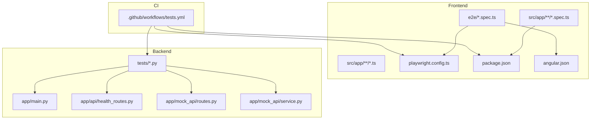
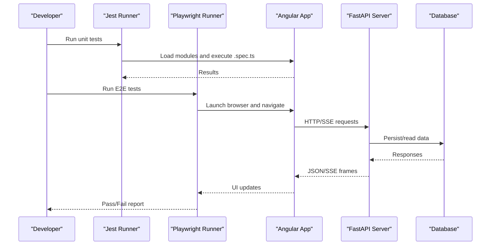
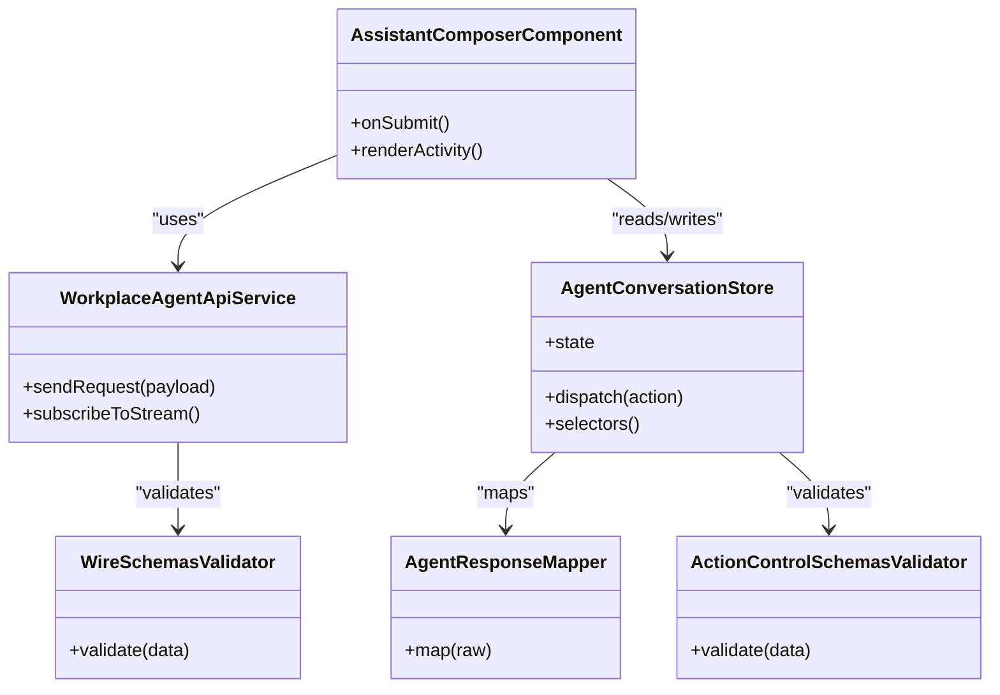
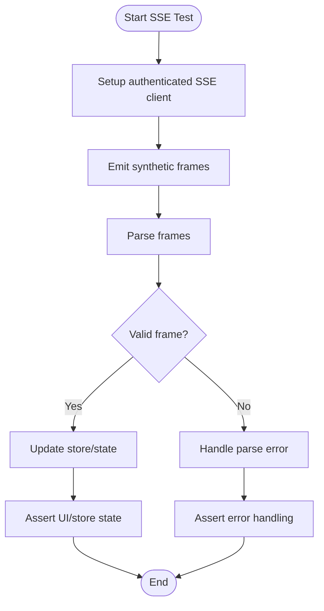
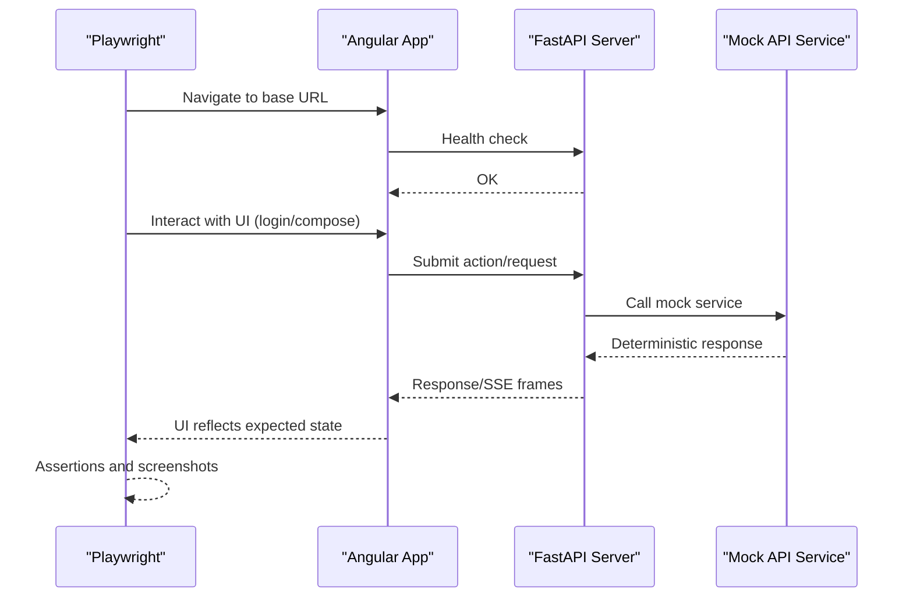
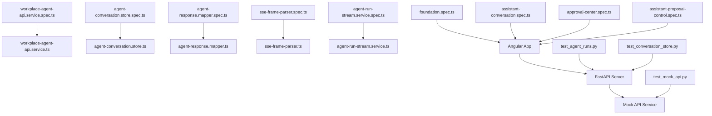
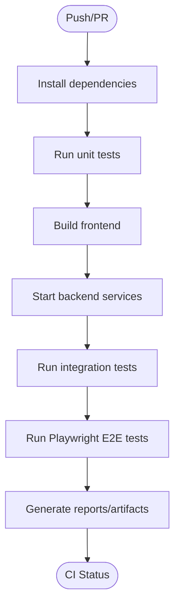

# Testing Strategy

<cite>
**Referenced Files in This Document**
- [frontend/package.json](file://frontend/package.json)
- [frontend/angular.json](file://frontend/angular.json)
- [frontend/playwright.config.ts](file://frontend/playwright.config.ts)
- [frontend/e2e/foundation.spec.ts](file://frontend/e2e/foundation.spec.ts)
- [frontend/e2e/assistant-conversation.spec.ts](file://frontend/e2e/assistant-conversation.spec.ts)
- [frontend/e2e/approval-center.spec.ts](file://frontend/e2e/approval-center.spec.ts)
- [frontend/e2e/assistant-proposal-control.spec.ts](file://frontend/e2e/assistant-proposal-control.spec.ts)
- [frontend/src/app/core/api/workplace-agent-api.service.spec.ts](file://frontend/src/app/core/api/workplace-agent-api.service.spec.ts)
- [frontend/src/app/features/assistant-conversation/agent-conversation.store.spec.ts](file://frontend/src/app/features/assistant-conversation/agent-conversation.store.spec.ts)
- [frontend/src/app/features/assistant-conversation/agent-response.mapper.spec.ts](file://frontend/src/app/features/assistant-conversation/agent-response.mapper.spec.ts)
- [frontend/src/app/features/assistant-conversation/assistant-composer/assistant-composer.component.spec.ts](file://frontend/src/app/features/assistant-conversation/assistant-composer/assistant-composer.component.spec.ts)
- [frontend/src/app/features/conversation-list/conversation-list.store.ts](file://frontend/src/app/features/conversation-list/conversation-list.store.ts)
- [frontend/src/app/core/auth/current-user.store.ts](file://frontend/src/app/core/auth/current-user.store.ts)
- [frontend/src/app/core/config/app-config.loader.spec.ts](file://frontend/src/app/core/config/app-config.loader.spec.ts)
- [frontend/src/app/core/errors/error-normalizer.spec.ts](file://frontend/src/app/core/errors/error-normalizer.spec.ts)
- [frontend/src/app/core/routing/auth.guard.ts](file://frontend/src/app/core/routing/auth.guard.ts)
- [frontend/src/app/core/sse/authenticated-sse-client.service.ts](file://frontend/src/app/core/sse/authenticated-sse-client.service.ts)
- [frontend/src/app/features/assistant-conversation/agent-run-stream.service.spec.ts](file://frontend/src/app/features/assistant-conversation/agent-run-stream.service.spec.ts)
- [frontend/src/app/features/assistant-conversation/agent-run-stream.service.ts](file://frontend/src/app/features/assistant-conversation/agent-run-stream.service.ts)
- [frontend/src/app/features/assistant-conversation/sse-frame-parser.spec.ts](file://frontend/src/app/features/assistant-conversation/sse-frame-parser.spec.ts)
- [frontend/src/app/features/assistant-conversation/sse-frame-parser.ts](file://frontend/src/app/features/assistant-conversation/sse-frame-parser.ts)
- [frontend/src/app/core/api/wire.schemas.spec.ts](file://frontend/src/app/core/api/wire.schemas.spec.ts)
- [frontend/src/app/core/action-control/action-control.schemas.spec.ts](file://frontend/src/app/core/action-control/action-control.schemas.spec.ts)
- [frontend/src/app/layout/shell/shell-state.service.spec.ts](file://frontend/src/app/layout/shell/shell-state.service.spec.ts)
- [frontend/src/app/shared/theme/ui-theme.service.spec.ts](file://frontend/src/app/shared/theme/ui-theme.service.spec.ts)
- [frontend/src/styles/_accessibility.scss](file://frontend/src/styles/_accessibility.scss)
- [frontend/public/config/app-config.json](file://frontend/public/config/app-config.json)
- [frontend/proxy.conf.json](file://frontend/proxy.conf.json)
- [tests/test_agent_runs.py](file://tests/test_agent_runs.py)
- [tests/test_conversation_store.py](file://tests/test_conversation_store.py)
- [tests/test_mock_api.py](file://tests/test_mock_api.py)
- [app/mock_api/routes.py](file://app/mock_api/routes.py)
- [app/mock_api/service.py](file://app/mock_api/service.py)
- [app/api/health_routes.py](file://app/api/health_routes.py)
- [app/main.py](file://app/main.py)
- [.github/workflows/tests.yml](file://.github/workflows/tests.yml)
</cite>

## Table of Contents
1. [Introduction](#introduction)
2. [Project Structure](#project-structure)
3. [Core Components](#core-components)
4. [Architecture Overview](#architecture-overview)
5. [Detailed Component Analysis](#detailed-component-analysis)
6. [Dependency Analysis](#dependency-analysis)
7. [Performance Considerations](#performance-considerations)
8. [Troubleshooting Guide](#troubleshooting-guide)
9. [Conclusion](#conclusion)
10. [Appendices](#appendices)

## Introduction
This document defines the testing strategy for the project, covering unit tests, integration tests, and end-to-end (E2E) tests. It explains how Jest is used for Angular unit tests, how Playwright is configured for E2E testing, and how to write maintainable tests for components, services, and stores. It also covers mocking strategies for external APIs and real-time events, test data management, CI setup, performance testing, and accessibility considerations.

## Project Structure
The repository includes:
- Frontend (Angular): Unit tests co-located with source files using .spec.ts suffix; E2E tests under frontend/e2e; Playwright configuration at frontend/playwright.config.ts.
- Backend (Python/FastAPI): Integration and contract tests under tests/; mock API routes and service under app/mock_api; health endpoints under app/api/health_routes.py; application entry point under app/main.py.
- CI: GitHub Actions workflow under .github/workflows/tests.yml.

**Diagram sources**
- [frontend/package.json](file://frontend/package.json)
- [frontend/angular.json](file://frontend/angular.json)
- [frontend/playwright.config.ts](file://frontend/playwright.config.ts)
- [frontend/e2e/foundation.spec.ts](file://frontend/e2e/foundation.spec.ts)
- [app/main.py](file://app/main.py)
- [app/api/health_routes.py](file://app/api/health_routes.py)
- [app/mock_api/routes.py](file://app/mock_api/routes.py)
- [app/mock_api/service.py](file://app/mock_api/service.py)
- [tests/test_agent_runs.py](file://tests/test_agent_runs.py)
- [.github/workflows/tests.yml](file://.github/workflows/tests.yml)

**Section sources**
- [frontend/package.json](file://frontend/package.json)
- [frontend/angular.json](file://frontend/angular.json)
- [frontend/playwright.config.ts](file://frontend/playwright.config.ts)
- [app/main.py](file://app/main.py)
- [app/api/health_routes.py](file://app/api/health_routes.py)
- [app/mock_api/routes.py](file://app/mock_api/routes.py)
- [app/mock_api/service.py](file://app/mock_api/service.py)
- [tests/test_agent_runs.py](file://tests/test_agent_runs.py)
- [.github/workflows/tests.yml](file://.github/workflows/tests.yml)

## Core Components
- Unit testing framework: Jest via Angular CLI. Tests are written as Jasmine specs executed by Jest.
- E2E testing framework: Playwright configured in frontend/playwright.config.ts with TypeScript support.
- Backend integration tests: Python tests under tests/ exercising FastAPI routes, repositories, and domain logic.
- Mocking utilities:
  - Frontend: Angular TestBed, fake async utilities, and service mocks for HTTP and SSE streams.
  - Backend: Dedicated mock API routes and service for deterministic responses.

Key patterns:
- Co-located .spec.ts files near implementation.
- Store and mapper tests validate state transitions and transformations.
- E2E scenarios cover critical user journeys across authentication, conversation flow, approvals, and proposals.

**Section sources**
- [frontend/src/app/core/api/workplace-agent-api.service.spec.ts](file://frontend/src/app/core/api/workplace-agent-api.service.spec.ts)
- [frontend/src/app/features/assistant-conversation/agent-conversation.store.spec.ts](file://frontend/src/app/features/assistant-conversation/agent-conversation.store.spec.ts)
- [frontend/src/app/features/assistant-conversation/agent-response.mapper.spec.ts](file://frontend/src/app/features/assistant-conversation/agent-response.mapper.spec.ts)
- [frontend/src/app/features/assistant-conversation/assistant-composer/assistant-composer.component.spec.ts](file://frontend/src/app/features/assistant-conversation/assistant-composer/assistant-composer.component.spec.ts)
- [frontend/src/app/core/config/app-config.loader.spec.ts](file://frontend/src/app/core/config/app-config.loader.spec.ts)
- [frontend/src/app/core/errors/error-normalizer.spec.ts](file://frontend/src/app/core/errors/error-normalizer.spec.ts)
- [frontend/src/app/features/assistant-conversation/agent-run-stream.service.spec.ts](file://frontend/src/app/features/assistant-conversation/agent-run-stream.service.spec.ts)
- [frontend/src/app/features/assistant-conversation/sse-frame-parser.spec.ts](file://frontend/src/app/features/assistant-conversation/sse-frame-parser.spec.ts)
- [frontend/src/app/core/api/wire.schemas.spec.ts](file://frontend/src/app/core/api/wire.schemas.spec.ts)
- [frontend/src/app/core/action-control/action-control.schemas.spec.ts](file://frontend/src/app/core/action-control/action-control.schemas.spec.ts)
- [frontend/src/app/layout/shell/shell-state.service.spec.ts](file://frontend/src/app/layout/shell/shell-state.service.spec.ts)
- [frontend/src/app/shared/theme/ui-theme.service.spec.ts](file://frontend/src/app/shared/theme/ui-theme.service.spec.ts)
- [app/mock_api/routes.py](file://app/mock_api/routes.py)
- [app/mock_api/service.py](file://app/mock_api/service.py)
- [tests/test_agent_runs.py](file://tests/test_agent_runs.py)

## Architecture Overview
The testing architecture spans three layers:
- Unit layer: Angular components, services, stores, mappers, and schema validators validated with Jest/Jasmine.
- Integration layer: Backend tests validating API contracts, domain rules, and repository interactions; optional use of a test database or in-memory store.
- E2E layer: Playwright-driven browser automation verifying complete user flows against a running backend instance.

**Diagram sources**
- [frontend/playwright.config.ts](file://frontend/playwright.config.ts)
- [frontend/e2e/foundation.spec.ts](file://frontend/e2e/foundation.spec.ts)
- [app/main.py](file://app/main.py)
- [app/api/health_routes.py](file://app/api/health_routes.py)

## Detailed Component Analysis

### Unit Testing Patterns for Angular
- Components: Use TestBed to configure dependencies, provide mocks for services, and assert DOM changes after actions.
- Services: Inject mocked HTTP clients and SSE clients; verify method calls and emitted events.
- Stores: Initialize store with initial state, dispatch actions, and assert resulting state shape and derived values.
- Mappers and Validators: Provide input fixtures and assert output structures; validate schemas against wire models.

Recommended practices:
- Keep tests focused on behavior, not implementation details.
- Use descriptive test names that reflect scenarios.
- Prefer small, isolated fixtures over large shared ones.
- Avoid flaky timing; use fakeAsync/tick or flush where necessary.

**Section sources**
- [frontend/src/app/features/assistant-conversation/assistant-composer/assistant-composer.component.spec.ts](file://frontend/src/app/features/assistant-conversation/assistant-composer/assistant-composer.component.spec.ts)
- [frontend/src/app/core/api/workplace-agent-api.service.spec.ts](file://frontend/src/app/core/api/workplace-agent-api.service.spec.ts)
- [frontend/src/app/features/assistant-conversation/agent-conversation.store.spec.ts](file://frontend/src/app/features/assistant-conversation/agent-conversation.store.spec.ts)
- [frontend/src/app/features/assistant-conversation/agent-response.mapper.spec.ts](file://frontend/src/app/features/assistant-conversation/agent-response.mapper.spec.ts)
- [frontend/src/app/core/config/app-config.loader.spec.ts](file://frontend/src/app/core/config/app-config.loader.spec.ts)
- [frontend/src/app/core/errors/error-normalizer.spec.ts](file://frontend/src/app/core/errors/error-normalizer.spec.ts)
- [frontend/src/app/core/api/wire.schemas.spec.ts](file://frontend/src/app/core/api/wire.schemas.spec.ts)
- [frontend/src/app/core/action-control/action-control.schemas.spec.ts](file://frontend/src/app/core/action-control/action-control.schemas.spec.ts)
- [frontend/src/app/layout/shell/shell-state.service.spec.ts](file://frontend/src/app/layout/shell/shell-state.service.spec.ts)
- [frontend/src/app/shared/theme/ui-theme.service.spec.ts](file://frontend/src/app/shared/theme/ui-theme.service.spec.ts)

#### Class Diagram: Key Testable Units

**Diagram sources**
- [frontend/src/app/features/assistant-conversation/assistant-composer/assistant-composer.component.spec.ts](file://frontend/src/app/features/assistant-conversation/assistant-composer/assistant-composer.component.spec.ts)
- [frontend/src/app/core/api/workplace-agent-api.service.spec.ts](file://frontend/src/app/core/api/workplace-agent-api.service.spec.ts)
- [frontend/src/app/features/assistant-conversation/agent-conversation.store.spec.ts](file://frontend/src/app/features/assistant-conversation/agent-conversation.store.spec.ts)
- [frontend/src/app/features/assistant-conversation/agent-response.mapper.spec.ts](file://frontend/src/app/features/assistant-conversation/agent-response.mapper.spec.ts)
- [frontend/src/app/core/api/wire.schemas.spec.ts](file://frontend/src/app/core/api/wire.schemas.spec.ts)
- [frontend/src/app/core/action-control/action-control.schemas.spec.ts](file://frontend/src/app/core/action-control/action-control.schemas.spec.ts)

### Real-Time Events (SSE) Testing
- Stream service: Subscribe to server-sent events, parse frames, and update store/state.
- Frame parser: Validate frame boundaries and payload shapes.
- Authenticated client: Ensure headers and token refresh are handled.

Testing approach:
- Emit synthetic SSE frames in tests and assert downstream effects.
- Verify error handling for malformed frames and connection drops.
- Confirm authentication propagation to SSE connections.

**Diagram sources**
- [frontend/src/app/features/assistant-conversation/agent-run-stream.service.spec.ts](file://frontend/src/app/features/assistant-conversation/agent-run-stream.service.spec.ts)
- [frontend/src/app/features/assistant-conversation/agent-run-stream.service.ts](file://frontend/src/app/features/assistant-conversation/agent-run-stream.service.ts)
- [frontend/src/app/features/assistant-conversation/sse-frame-parser.spec.ts](file://frontend/src/app/features/assistant-conversation/sse-frame-parser.spec.ts)
- [frontend/src/app/features/assistant-conversation/sse-frame-parser.ts](file://frontend/src/app/features/assistant-conversation/sse-frame-parser.ts)
- [frontend/src/app/core/sse/authenticated-sse-client.service.ts](file://frontend/src/app/core/sse/authenticated-sse-client.service.ts)

**Section sources**
- [frontend/src/app/features/assistant-conversation/agent-run-stream.service.spec.ts](file://frontend/src/app/features/assistant-conversation/agent-run-stream.service.spec.ts)
- [frontend/src/app/features/assistant-conversation/agent-run-stream.service.ts](file://frontend/src/app/features/assistant-conversation/agent-run-stream.service.ts)
- [frontend/src/app/features/assistant-conversation/sse-frame-parser.spec.ts](file://frontend/src/app/features/assistant-conversation/sse-frame-parser.spec.ts)
- [frontend/src/app/features/assistant-conversation/sse-frame-parser.ts](file://frontend/src/app/features/assistant-conversation/sse-frame-parser.ts)
- [frontend/src/app/core/sse/authenticated-sse-client.service.ts](file://frontend/src/app/core/sse/authenticated-sse-client.service.ts)

### Mocking Strategies
- External APIs:
  - Frontend: Provide HttpClient mocks or interceptors returning controlled responses; validate request payloads and response handling.
  - Backend: Use dedicated mock API routes and service for deterministic outcomes without external dependencies.
- Real-time events:
  - Emit synthetic SSE frames in tests; assert parsing and state updates.
- Configuration and environment:
  - Load app config from public/config/app-config.json; override via proxy or environment variables in E2E runs.

Best practices:
- Keep mocks minimal and close to production behavior.
- Centralize fixtures and seed data for reuse.
- Separate concerns: unit tests should not depend on network or filesystem unless explicitly intended.

**Section sources**
- [frontend/src/app/core/api/workplace-agent-api.service.spec.ts](file://frontend/src/app/core/api/workplace-agent-api.service.spec.ts)
- [app/mock_api/routes.py](file://app/mock_api/routes.py)
- [app/mock_api/service.py](file://app/mock_api/service.py)
- [frontend/public/config/app-config.json](file://frontend/public/config/app-config.json)
- [frontend/proxy.conf.json](file://frontend/proxy.conf.json)

### End-to-End Testing with Playwright
- Scenarios:
  - Foundation: Application bootstrap, navigation, and basic assertions.
  - Assistant Conversation: Message composition, streaming updates, and conversation persistence.
  - Approval Center: Approve/reject workflows and status transitions.
  - Proposal Control: Create, review, and control agent proposals.
- Configuration:
  - Browser selection, timeouts, and base URL defined in playwright.config.ts.
  - Proxy configuration for local development and CI environments.

**Diagram sources**
- [frontend/playwright.config.ts](file://frontend/playwright.config.ts)
- [frontend/e2e/foundation.spec.ts](file://frontend/e2e/foundation.spec.ts)
- [frontend/e2e/assistant-conversation.spec.ts](file://frontend/e2e/assistant-conversation.spec.ts)
- [frontend/e2e/approval-center.spec.ts](file://frontend/e2e/approval-center.spec.ts)
- [frontend/e2e/assistant-proposal-control.spec.ts](file://frontend/e2e/assistant-proposal-control.spec.ts)
- [app/mock_api/routes.py](file://app/mock_api/routes.py)
- [app/mock_api/service.py](file://app/mock_api/service.py)

**Section sources**
- [frontend/playwright.config.ts](file://frontend/playwright.config.ts)
- [frontend/e2e/foundation.spec.ts](file://frontend/e2e/foundation.spec.ts)
- [frontend/e2e/assistant-conversation.spec.ts](file://frontend/e2e/assistant-conversation.spec.ts)
- [frontend/e2e/approval-center.spec.ts](file://frontend/e2e/approval-center.spec.ts)
- [frontend/e2e/assistant-proposal-control.spec.ts](file://frontend/e2e/assistant-proposal-control.spec.ts)
- [app/mock_api/routes.py](file://app/mock_api/routes.py)
- [app/mock_api/service.py](file://app/mock_api/service.py)

### Backend Integration Tests
- Scope:
  - API route contracts, domain logic, repository interactions, and multi-step workflows.
- Examples:
  - Agent runs lifecycle and event emission.
  - Conversation store operations.
  - Mock API behavior validation.

Guidelines:
- Use transactional rollback or in-memory databases where appropriate.
- Seed deterministic data before each test.
- Isolate slow I/O operations behind mocks or fakes.

**Section sources**
- [tests/test_agent_runs.py](file://tests/test_agent_runs.py)
- [tests/test_conversation_store.py](file://tests/test_conversation_store.py)
- [tests/test_mock_api.py](file://tests/test_mock_api.py)
- [app/mock_api/routes.py](file://app/mock_api/routes.py)
- [app/mock_api/service.py](file://app/mock_api/service.py)

### Authentication Guard and Current User Store
- Guards protect routes based on current user state.
- Current user store manages session state and exposes reactive signals/observables.
- Tests should cover:
  - Redirects when unauthenticated.
  - Successful navigation when authenticated.
  - State updates on login/logout.

**Section sources**
- [frontend/src/app/core/routing/auth.guard.ts](file://frontend/src/app/core/routing/auth.guard.ts)
- [frontend/src/app/core/auth/current-user.store.ts](file://frontend/src/app/core/auth/current-user.store.ts)

## Dependency Analysis
Unit tests depend on Angular core and TestBed; E2E tests depend on Playwright and a running backend; backend tests depend on FastAPI test client and database/session setup.

**Diagram sources**
- [frontend/src/app/core/api/workplace-agent-api.service.spec.ts](file://frontend/src/app/core/api/workplace-agent-api.service.spec.ts)
- [frontend/src/app/features/assistant-conversation/agent-conversation.store.spec.ts](file://frontend/src/app/features/assistant-conversation/agent-conversation.store.spec.ts)
- [frontend/src/app/features/assistant-conversation/agent-response.mapper.spec.ts](file://frontend/src/app/features/assistant-conversation/agent-response.mapper.spec.ts)
- [frontend/src/app/features/assistant-conversation/sse-frame-parser.spec.ts](file://frontend/src/app/features/assistant-conversation/sse-frame-parser.spec.ts)
- [frontend/src/app/features/assistant-conversation/agent-run-stream.service.spec.ts](file://frontend/src/app/features/assistant-conversation/agent-run-stream.service.spec.ts)
- [frontend/e2e/foundation.spec.ts](file://frontend/e2e/foundation.spec.ts)
- [frontend/e2e/assistant-conversation.spec.ts](file://frontend/e2e/assistant-conversation.spec.ts)
- [frontend/e2e/approval-center.spec.ts](file://frontend/e2e/approval-center.spec.ts)
- [frontend/e2e/assistant-proposal-control.spec.ts](file://frontend/e2e/assistant-proposal-control.spec.ts)
- [app/mock_api/service.py](file://app/mock_api/service.py)
- [tests/test_agent_runs.py](file://tests/test_agent_runs.py)
- [tests/test_conversation_store.py](file://tests/test_conversation_store.py)
- [tests/test_mock_api.py](file://tests/test_mock_api.py)

**Section sources**
- [frontend/src/app/core/api/workplace-agent-api.service.spec.ts](file://frontend/src/app/core/api/workplace-agent-api.service.spec.ts)
- [frontend/src/app/features/assistant-conversation/agent-conversation.store.spec.ts](file://frontend/src/app/features/assistant-conversation/agent-conversation.store.spec.ts)
- [frontend/src/app/features/assistant-conversation/agent-response.mapper.spec.ts](file://frontend/src/app/features/assistant-conversation/agent-response.mapper.spec.ts)
- [frontend/src/app/features/assistant-conversation/sse-frame-parser.spec.ts](file://frontend/src/app/features/assistant-conversation/sse-frame-parser.spec.ts)
- [frontend/src/app/features/assistant-conversation/agent-run-stream.service.spec.ts](file://frontend/src/app/features/assistant-conversation/agent-run-stream.service.spec.ts)
- [frontend/e2e/foundation.spec.ts](file://frontend/e2e/foundation.spec.ts)
- [frontend/e2e/assistant-conversation.spec.ts](file://frontend/e2e/assistant-conversation.spec.ts)
- [frontend/e2e/approval-center.spec.ts](file://frontend/e2e/approval-center.spec.ts)
- [frontend/e2e/assistant-proposal-control.spec.ts](file://frontend/e2e/assistant-proposal-control.spec.ts)
- [app/mock_api/service.py](file://app/mock_api/service.py)
- [tests/test_agent_runs.py](file://tests/test_agent_runs.py)
- [tests/test_conversation_store.py](file://tests/test_conversation_store.py)
- [tests/test_mock_api.py](file://tests/test_mock_api.py)

## Performance Considerations
- Unit tests:
  - Keep test suites fast by avoiding heavy bootstrapping; lazy-load non-essential dependencies.
  - Use parameterized tests to reduce duplication while maintaining clarity.
- E2E tests:
  - Minimize unnecessary navigation; reuse logged-in sessions where safe.
  - Use headless mode in CI; capture only essential artifacts.
- Backend tests:
  - Prefer in-memory databases or lightweight fixtures for speed.
  - Parallelize independent tests; avoid shared mutable state.

[No sources needed since this section provides general guidance]

## Troubleshooting Guide
Common issues and resolutions:
- Flaky E2E tests:
  - Increase explicit waits for dynamic content; assert on stable selectors.
  - Ensure backend health endpoint responds before proceeding.
- SSE stream tests:
  - Validate frame boundaries and handle partial frames gracefully.
  - Simulate disconnections and reconnections to verify recovery.
- Authentication guards:
  - Confirm current user store state before navigating protected routes.
- Schema validation failures:
  - Align wire schemas with backend contracts; run schema spec tests early.

Operational checks:
- Health endpoint availability during E2E runs.
- Mock API readiness and deterministic outputs.

**Section sources**
- [frontend/e2e/foundation.spec.ts](file://frontend/e2e/foundation.spec.ts)
- [frontend/src/app/features/assistant-conversation/sse-frame-parser.spec.ts](file://frontend/src/app/features/assistant-conversation/sse-frame-parser.spec.ts)
- [frontend/src/app/core/routing/auth.guard.ts](file://frontend/src/app/core/routing/auth.guard.ts)
- [frontend/src/app/core/api/wire.schemas.spec.ts](file://frontend/src/app/core/api/wire.schemas.spec.ts)
- [frontend/src/app/core/action-control/action-control.schemas.spec.ts](file://frontend/src/app/core/action-control/action-control.schemas.spec.ts)
- [app/api/health_routes.py](file://app/api/health_routes.py)
- [app/mock_api/service.py](file://app/mock_api/service.py)

## Conclusion
A robust testing strategy combines fast, isolated unit tests with targeted integration tests and comprehensive E2E scenarios. By leveraging Jest for Angular units, Playwright for E2E, and Python-based backend tests, the project ensures reliability across layers. Consistent mocking, clear fixtures, and careful handling of real-time events further improve stability and maintainability.

[No sources needed since this section summarizes without analyzing specific files]

## Appendices

### Continuous Integration Setup
- GitHub Actions workflow orchestrates:
  - Installation of frontend dependencies.
  - Running unit tests via Angular CLI with Jest.
  - Starting backend services and running integration tests.
  - Executing Playwright E2E tests against a live backend.

**Diagram sources**
- [.github/workflows/tests.yml](file://.github/workflows/tests.yml)
- [frontend/package.json](file://frontend/package.json)
- [frontend/playwright.config.ts](file://frontend/playwright.config.ts)
- [app/main.py](file://app/main.py)
- [app/api/health_routes.py](file://app/api/health_routes.py)

**Section sources**
- [.github/workflows/tests.yml](file://.github/workflows/tests.yml)
- [frontend/package.json](file://frontend/package.json)
- [frontend/playwright.config.ts](file://frontend/playwright.config.ts)
- [app/main.py](file://app/main.py)
- [app/api/health_routes.py](file://app/api/health_routes.py)

### Accessibility Testing Considerations
- Keyboard navigation and focus management:
  - Ensure interactive elements are reachable via keyboard and have visible focus indicators.
- ARIA attributes:
  - Use semantic roles and labels appropriately; validate with automated tools.
- Color contrast and theme toggling:
  - Verify theme switching does not break contrast ratios.
- Automated checks:
  - Integrate axe-core or similar into unit/E2E suites to catch regressions early.

Relevant styles and components:
- Global accessibility styles and tokens.
- Theme service and toggle component.

**Section sources**
- [frontend/src/styles/_accessibility.scss](file://frontend/src/styles/_accessibility.scss)
- [frontend/src/app/shared/theme/ui-theme.service.spec.ts](file://frontend/src/app/shared/theme/ui-theme.service.spec.ts)
- [frontend/src/app/shared/theme/ui-theme-toggle.component.html](file://frontend/src/app/shared/theme/ui-theme-toggle.component.html)
- [frontend/src/app/shared/theme/ui-theme-toggle.component.ts](file://frontend/src/app/shared/theme/ui-theme-toggle.component.ts)