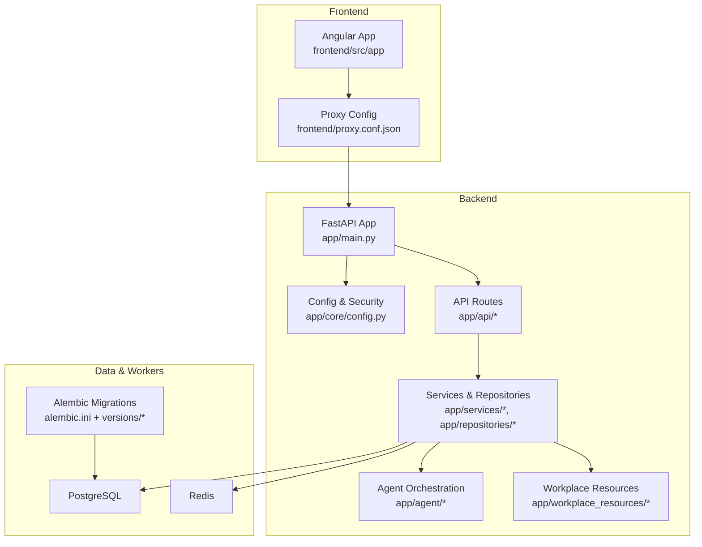
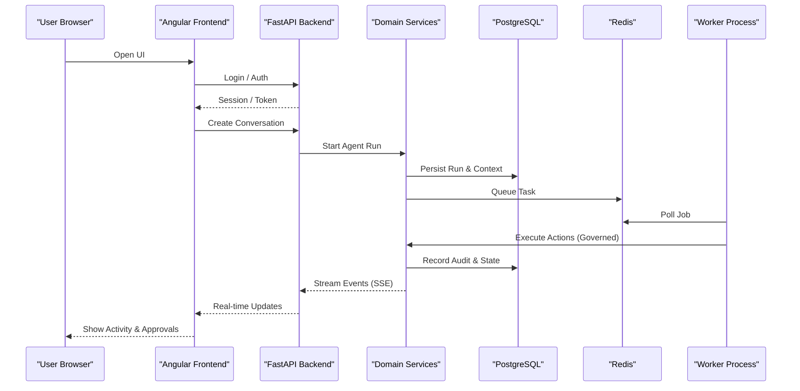
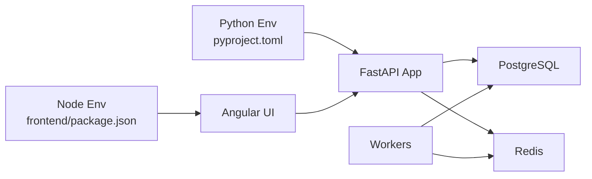

# Getting Started

<cite>
**Referenced Files in This Document**
- [README.md](file://README.md)
- [pyproject.toml](file://pyproject.toml)
- [app/main.py](file://app/main.py)
- [app/core/config.py](file://app/core/config.py)
- [alembic.ini](file://alembic.ini)
- [frontend/package.json](file://frontend/package.json)
- [frontend/angular.json](file://frontend/angular.json)
- [frontend/proxy.conf.json](file://frontend/proxy.conf.json)
- [docs/ARCHITECTURE.md](file://docs/ARCHITECTURE.md)
- [docs/GOVERNED_ACTION_CONTROL_PLANE.md](file://docs/GOVERNED_ACTION_CONTROL_PLANE.md)
</cite>

## Table of Contents
1. [Introduction](#introduction)
2. [Project Structure](#project-structure)
3. [Core Components](#core-components)
4. [Architecture Overview](#architecture-overview)
5. [Detailed Component Analysis](#detailed-component-analysis)
6. [Dependency Analysis](#dependency-analysis)
7. [Performance Considerations](#performance-considerations)
8. [Troubleshooting Guide](#troubleshooting-guide)
9. [Conclusion](#conclusion)

## Introduction
This guide helps you quickly set up and run the AI Agent Platform, a full-stack AI agent orchestration system with a governed action control plane and workplace intelligence features. You will install prerequisites, configure environment variables, initialize the database, start backend and frontend services, and perform your first agent conversation while exploring the approval workflow.

The platform consists of:
- Backend API (FastAPI) for agent orchestration, governed actions, and workplace resources
- Frontend UI (Angular) for conversations, approvals, and workspace views
- PostgreSQL as the persistent data store
- Redis for caching and background task coordination
- Alembic for database migrations

**Section sources**
- [README.md](file://README.md)
- [docs/ARCHITECTURE.md](file://docs/ARCHITECTURE.md)
- [docs/GOVERNED_ACTION_CONTROL_PLANE.md](file://docs/GOVERNED_ACTION_CONTROL_PLANE.md)

## Project Structure
At a high level, the repository is organized into:
- app: Python backend (FastAPI), domain models, repositories, services, API routes, and worker processes
- frontend: Angular application with components, services, and E2E tests
- alembic: Database migration scripts
- docs: Architecture and feature documentation
- scripts and tests: Validation and test utilities

**Diagram sources**
- [app/main.py](file://app/main.py)
- [app/core/config.py](file://app/core/config.py)
- [frontend/proxy.conf.json](file://frontend/proxy.conf.json)
- [alembic.ini](file://alembic.ini)

**Section sources**
- [README.md](file://README.md)
- [app/main.py](file://app/main.py)
- [app/core/config.py](file://app/core/config.py)
- [frontend/proxy.conf.json](file://frontend/proxy.conf.json)
- [alembic.ini](file://alembic.ini)

## Core Components
- FastAPI Application Entry Point: Initializes middleware, routers, lifespan events, and dependency wiring.
- Configuration: Centralized configuration loader for DB, Redis, auth, and feature flags.
- API Layer: REST endpoints for agents, runs, conversations, action control, and workplace resources.
- Services and Repositories: Business logic and persistence abstractions over PostgreSQL and Redis.
- Agent Orchestration: Orchestrator, providers, action registry, and governance hooks.
- Workplace Intelligence: Resource definitions, operation router, and workflow handlers.
- Frontend (Angular): SPA with authentication, conversation UI, approval center, and SSE streams.
- Data Layer: SQLAlchemy models and Alembic migrations.
- Background Workers: Processes that execute long-running agent runs and actions.

**Section sources**
- [app/main.py](file://app/main.py)
- [app/core/config.py](file://app/core/config.py)
- [docs/ARCHITECTURE.md](file://docs/ARCHITECTURE.md)

## Architecture Overview
The platform follows a layered architecture:
- Presentation: Angular UI communicates via HTTP and Server-Sent Events (SSE).
- API Gateway: FastAPI exposes typed endpoints and enforces security policies.
- Domain Services: Encapsulate business rules for agents, actions, and workplace operations.
- Persistence: PostgreSQL stores entities; Redis supports caching and job coordination.
- Governance: Action control plane validates and approves sensitive operations before execution.

**Diagram sources**
- [app/main.py](file://app/main.py)
- [app/core/config.py](file://app/core/config.py)
- [docs/GOVERNED_ACTION_CONTROL_PLANE.md](file://docs/GOVERNED_ACTION_CONTROL_PLANE.md)

## Detailed Component Analysis

### Installation Requirements
- Python 3.10+
- Node.js 18+
- PostgreSQL server accessible from the host
- Redis server accessible from the host

Verify versions before proceeding.

**Section sources**
- [README.md](file://README.md)
- [pyproject.toml](file://pyproject.toml)
- [frontend/package.json](file://frontend/package.json)

### Environment Setup
Create a .env file at the repository root with the following keys:
- DATABASE_URL: PostgreSQL connection string
- REDIS_URL: Redis connection URL
- AUTH_* settings as required by your identity provider
- Any additional feature flags referenced by the configuration loader

Ensure the values are correct and reachable from both backend and workers.

**Section sources**
- [app/core/config.py](file://app/core/config.py)

### Database Initialization
- Apply Alembic migrations to create or update schema:
  - Use the Alembic CLI configured by alembic.ini against the DATABASE_URL.
- Seed initial data if provided by seed scripts.

Tip: Confirm connectivity to PostgreSQL before running migrations.

**Section sources**
- [alembic.ini](file://alembic.ini)

### Backend Development
- Install Python dependencies using the project’s package manager.
- Start the FastAPI development server.
- Validate health endpoint availability.

**Section sources**
- [app/main.py](file://app/main.py)
- [pyproject.toml](file://pyproject.toml)

### Frontend Development
- Install Node.js dependencies.
- Start the Angular dev server with proxy configuration pointing to the backend.
- Access the UI on the configured local port.

**Section sources**
- [frontend/package.json](file://frontend/package.json)
- [frontend/angular.json](file://frontend/angular.json)
- [frontend/proxy.conf.json](file://frontend/proxy.conf.json)

### Running Background Workers
- Start one or more worker processes that consume tasks from Redis and execute agent runs.
- Ensure workers share the same configuration (DATABASE_URL, REDIS_URL, etc.).

**Section sources**
- [app/main.py](file://app/main.py)
- [app/core/config.py](file://app/core/config.py)

### Quick Start Examples

#### Start the Application
- Initialize the database with Alembic.
- Launch the backend server.
- Launch the frontend dev server.
- Open the browser and navigate to the frontend URL.

#### Create Your First Agent Conversation
- From the UI, open a new conversation.
- Send a message to trigger an agent run.
- Observe real-time activity updates via SSE.

#### Explore the Approval Workflow
- Trigger an action requiring governance.
- Review the proposal in the Approval Center.
- Approve or reject the action and observe state transitions.

For detailed API contracts and event schemas, refer to the frontend contracts and backend route modules.

**Section sources**
- [docs/GOVERNED_ACTION_CONTROL_PLANE.md](file://docs/GOVERNED_ACTION_CONTROL_PLANE.md)
- [frontend/contracts/README.md](file://frontend/contracts/README.md)

## Dependency Analysis
High-level runtime dependencies:
- Python packages defined in pyproject.toml
- Node.js packages defined in frontend/package.json
- External services: PostgreSQL and Redis

**Diagram sources**
- [pyproject.toml](file://pyproject.toml)
- [frontend/package.json](file://frontend/package.json)
- [app/main.py](file://app/main.py)

**Section sources**
- [pyproject.toml](file://pyproject.toml)
- [frontend/package.json](file://frontend/package.json)
- [app/main.py](file://app/main.py)

## Performance Considerations
- Tune PostgreSQL connection pooling and query plans for large datasets.
- Configure Redis memory limits and eviction policies appropriate for workload.
- Scale workers horizontally based on queue depth and CPU utilization.
- Enable compression and caching headers where applicable.
- Monitor SSE throughput and backpressure handling in the frontend.

[No sources needed since this section provides general guidance]

## Troubleshooting Guide
Common setup issues and resolutions:
- Cannot connect to PostgreSQL:
  - Verify DATABASE_URL format, credentials, and network reachability.
  - Ensure the database exists and permissions are granted.
- Redis connection failures:
  - Check REDIS_URL, firewall rules, and service availability.
- Migration errors:
  - Re-run migrations after fixing schema drift; inspect Alembic logs.
- CORS or proxy issues:
  - Confirm frontend proxy points to the correct backend host/port.
- Authentication problems:
  - Validate AUTH_* configuration and token issuance flow.
- Worker not processing jobs:
  - Ensure workers are started and share identical configuration.
  - Inspect Redis queues and worker logs.

**Section sources**
- [app/core/config.py](file://app/core/config.py)
- [alembic.ini](file://alembic.ini)
- [frontend/proxy.conf.json](file://frontend/proxy.conf.json)

## Conclusion
You now have the essentials to install, configure, and run the AI Agent Platform locally. Use the quick start examples to create your first conversation and explore the governed action approval workflow. For deeper insights into architecture and contracts, consult the linked documentation files.

[No sources needed since this section summarizes without analyzing specific files]