# Security & Compliance

<cite>
**Referenced Files in This Document**
- [app/core/security.py](file://app/core/security.py)
- [app/api/auth_routes.py](file://app/api/auth_routes.py)
- [app/db/nucleus_user_session.py](file://app/db/nucleus_user_session.py)
- [app/repositories/session_repository.py](file://app/repositories/session_repository.py)
- [app/permissions/permission_service.py](file://app/permissions/permission_service.py)
- [app/schemas/user.py](file://app/schemas/user.py)
- [app/schemas/audit.py](file://app/schemas/audit.py)
- [app/repositories/audit_repository.py](file://app/repositories/audit_repository.py)
- [app/services/action_execution_activity.py](file://app/services/action_execution_activity.py)
- [app/core/config.py](file://app/core/config.py)
- [app/main.py](file://app/main.py)
- [docs/SECURITY_MODEL.md](file://docs/SECURITY_MODEL.md)
- [tests/test_agent_action_security.py](file://tests/test_agent_action_security.py)
- [tests/test_permissions.py](file://tests/test_permissions.py)
- [tests/test_audit.py](file://tests/test_audit.py)
</cite>

## Table of Contents
1. [Introduction](#introduction)
2. [Project Structure](#project-structure)
3. [Core Components](#core-components)
4. [Architecture Overview](#architecture-overview)
5. [Detailed Component Analysis](#detailed-component-analysis)
6. [Dependency Analysis](#dependency-analysis)
7. [Performance Considerations](#performance-considerations)
8. [Troubleshooting Guide](#troubleshooting-guide)
9. [Conclusion](#conclusion)
10. [Appendices](#appendices)

## Introduction
This document describes the platform’s security architecture and compliance measures, focusing on authentication with JWT tokens, session management, secure password handling, authorization with role-based access control (RBAC), input validation and output sanitization, audit logging for compliance, data encryption at rest and in transit, secure API communication, vulnerability scanning, best practices, penetration testing guidelines, incident response procedures, GDPR compliance, data privacy controls, and security headers configuration. It maps these capabilities to concrete implementation points in the codebase and provides diagrams to aid understanding.

## Project Structure
Security-related functionality is implemented across core utilities, API routes, domain services, repositories, schemas, and tests:
- Core security utilities and configuration
- Authentication and session endpoints
- Authorization and permission resolution
- Audit logging and immutable records
- Input validation via Pydantic schemas
- Tests validating security behaviors

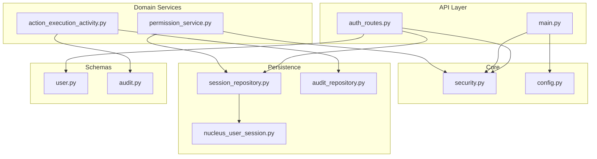

**Diagram sources**
- [app/api/auth_routes.py](file://app/api/auth_routes.py)
- [app/core/security.py](file://app/core/security.py)
- [app/core/config.py](file://app/core/config.py)
- [app/permissions/permission_service.py](file://app/permissions/permission_service.py)
- [app/services/action_execution_activity.py](file://app/services/action_execution_activity.py)
- [app/repositories/session_repository.py](file://app/repositories/session_repository.py)
- [app/repositories/audit_repository.py](file://app/repositories/audit_repository.py)
- [app/db/nucleus_user_session.py](file://app/db/nucleus_user_session.py)
- [app/schemas/user.py](file://app/schemas/user.py)
- [app/schemas/audit.py](file://app/schemas/audit.py)
- [app/main.py](file://app/main.py)

**Section sources**
- [app/core/security.py](file://app/core/security.py)
- [app/api/auth_routes.py](file://app/api/auth_routes.py)
- [app/permissions/permission_service.py](file://app/permissions/permission_service.py)
- [app/services/action_execution_activity.py](file://app/services/action_execution_activity.py)
- [app/repositories/session_repository.py](file://app/repositories/session_repository.py)
- [app/repositories/audit_repository.py](file://app/repositories/audit_repository.py)
- [app/db/nucleus_user_session.py](file://app/db/nucleus_user_session.py)
- [app/schemas/user.py](file://app/schemas/user.py)
- [app/schemas/audit.py](file://app/schemas/audit.py)
- [app/core/config.py](file://app/core/config.py)
- [app/main.py](file://app/main.py)

## Core Components
- Authentication and token issuance:
  - Endpoints for login and token operations are defined in the auth routes.
  - Token creation and verification leverage cryptographic utilities from the core security module.
  - Configuration for token lifetimes and secrets is centralized in the configuration module.
- Session management:
  - User sessions are persisted through a dedicated repository and database model.
  - Sessions are validated and refreshed as needed by authorization checks.
- Secure password handling:
  - Password hashing and verification are performed using secure algorithms provided by the core security module.
- Authorization and RBAC:
  - Permission resolution is handled by a dedicated service that evaluates roles, permissions, and organization boundaries.
  - Authorization decisions are enforced around sensitive operations.
- Input validation and output sanitization:
  - Request/response models are defined with Pydantic schemas to enforce strict typing and validation.
- Audit logging:
  - Action execution activities emit audit events recorded via an audit repository and schema.
  - Immutable records support compliance tracking and reporting.
- Data protection:
  - Encryption settings are configured centrally; transport security is enforced by application configuration.
- Security headers:
  - Global middleware or application startup configures standard security headers.

**Section sources**
- [app/api/auth_routes.py](file://app/api/auth_routes.py)
- [app/core/security.py](file://app/core/security.py)
- [app/core/config.py](file://app/core/config.py)
- [app/permissions/permission_service.py](file://app/permissions/permission_service.py)
- [app/repositories/session_repository.py](file://app/repositories/session_repository.py)
- [app/db/nucleus_user_session.py](file://app/db/nucleus_user_session.py)
- [app/schemas/user.py](file://app/schemas/user.py)
- [app/schemas/audit.py](file://app/schemas/audit.py)
- [app/repositories/audit_repository.py](file://app/repositories/audit_repository.py)
- [app/services/action_execution_activity.py](file://app/services/action_execution_activity.py)
- [app/main.py](file://app/main.py)

## Architecture Overview
The security architecture integrates authentication, authorization, session management, audit logging, and data protection into a cohesive system.

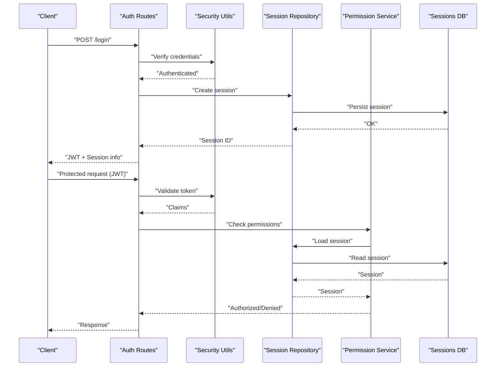

**Diagram sources**
- [app/api/auth_routes.py](file://app/api/auth_routes.py)
- [app/core/security.py](file://app/core/security.py)
- [app/repositories/session_repository.py](file://app/repositories/session_repository.py)
- [app/db/nucleus_user_session.py](file://app/db/nucleus_user_session.py)
- [app/permissions/permission_service.py](file://app/permissions/permission_service.py)

## Detailed Component Analysis

### Authentication System (JWT Tokens)
- Login flow:
  - Credentials are verified against stored user data.
  - A JWT is issued upon successful authentication.
  - The client receives the token and associated session information.
- Token lifecycle:
  - Tokens include claims such as user identity and organization context.
  - Expiration and refresh strategies are governed by configuration.
- Security considerations:
  - Secrets and algorithm parameters are loaded from configuration.
  - Tokens are validated on each protected request.

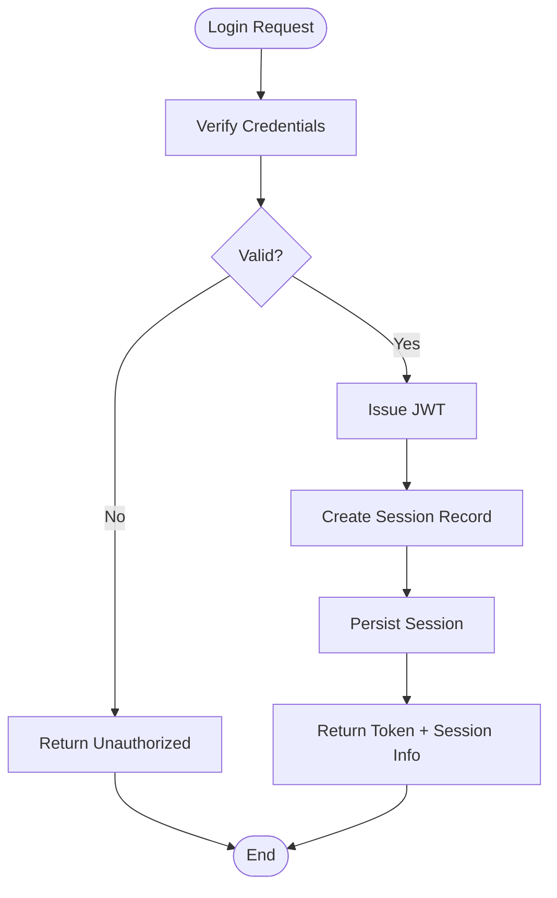

**Diagram sources**
- [app/api/auth_routes.py](file://app/api/auth_routes.py)
- [app/core/security.py](file://app/core/security.py)
- [app/repositories/session_repository.py](file://app/repositories/session_repository.py)
- [app/db/nucleus_user_session.py](file://app/db/nucleus_user_session.py)

**Section sources**
- [app/api/auth_routes.py](file://app/api/auth_routes.py)
- [app/core/security.py](file://app/core/security.py)
- [app/core/config.py](file://app/core/config.py)

### Session Management
- Session persistence:
  - Sessions are created, updated, and invalidated via the session repository.
  - Database model defines session attributes and constraints.
- Validation:
  - Authorization checks load and validate sessions before granting access.
- Lifecycle:
  - Sessions expire based on policy and can be revoked explicitly.

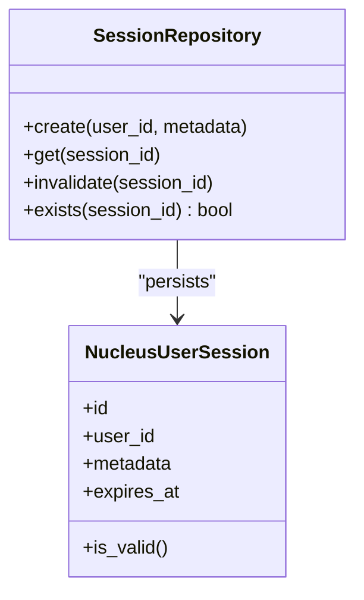

**Diagram sources**
- [app/repositories/session_repository.py](file://app/repositories/session_repository.py)
- [app/db/nucleus_user_session.py](file://app/db/nucleus_user_session.py)

**Section sources**
- [app/repositories/session_repository.py](file://app/repositories/session_repository.py)
- [app/db/nucleus_user_session.py](file://app/db/nucleus_user_session.py)

### Secure Password Handling
- Hashing:
  - Passwords are hashed using strong algorithms provided by the security module.
- Verification:
  - Credential checks use constant-time comparison to prevent timing attacks.
- Storage:
  - Only hashes are stored; plaintext passwords are never persisted.

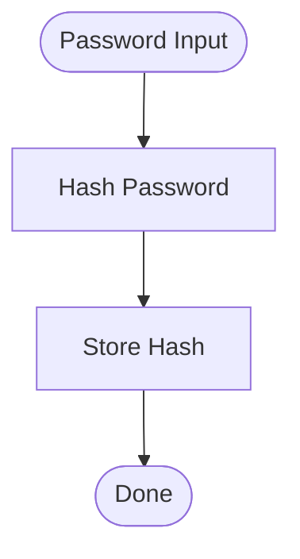

**Diagram sources**
- [app/core/security.py](file://app/core/security.py)

**Section sources**
- [app/core/security.py](file://app/core/security.py)

### Authorization Framework (RBAC, Permissions, Organization Boundaries)
- Role-based access control:
  - Roles map to permissions; permission checks evaluate current user roles and resource context.
- Permission resolution:
  - The permission service resolves effective permissions considering roles, policies, and organization scope.
- Organization boundary enforcement:
  - Access decisions incorporate organization identifiers to ensure multi-tenant isolation.

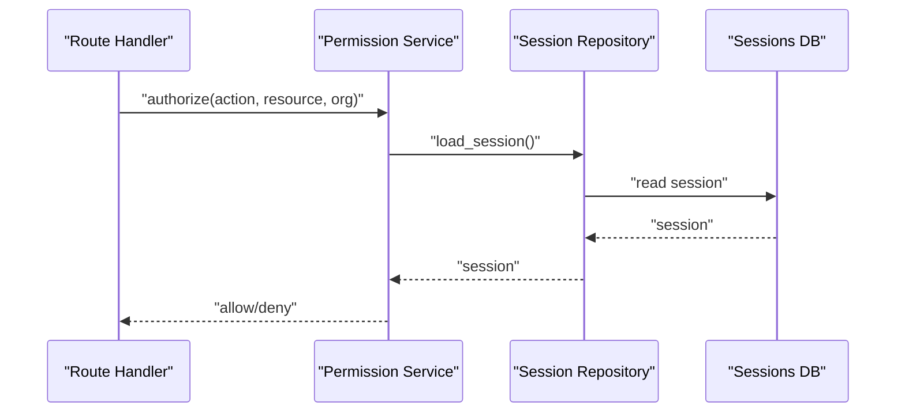

**Diagram sources**
- [app/permissions/permission_service.py](file://app/permissions/permission_service.py)
- [app/repositories/session_repository.py](file://app/repositories/session_repository.py)
- [app/db/nucleus_user_session.py](file://app/db/nucleus_user_session.py)

**Section sources**
- [app/permissions/permission_service.py](file://app/permissions/permission_service.py)
- [app/repositories/session_repository.py](file://app/repositories/session_repository.py)
- [app/db/nucleus_user_session.py](file://app/db/nucleus_user_session.py)

### Input Validation and Output Sanitization
- Input validation:
  - Pydantic schemas define strict request/response contracts.
  - Validation errors are normalized and returned consistently.
- Output sanitization:
  - Responses are serialized according to schemas, preventing leakage of internal structures.

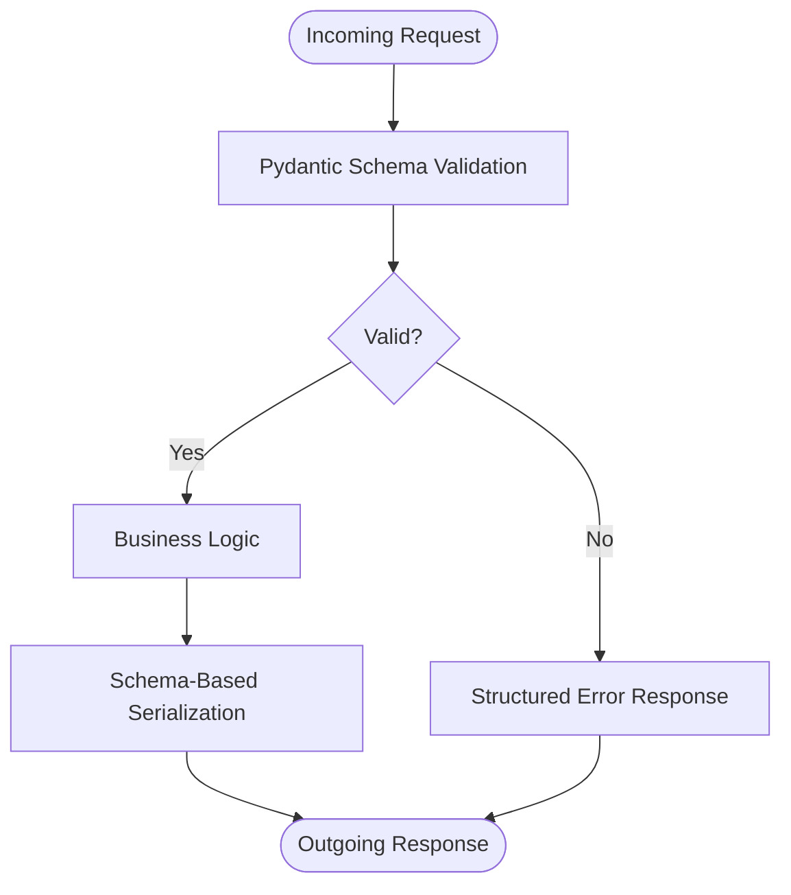

**Diagram sources**
- [app/schemas/user.py](file://app/schemas/user.py)
- [app/schemas/audit.py](file://app/schemas/audit.py)

**Section sources**
- [app/schemas/user.py](file://app/schemas/user.py)
- [app/schemas/audit.py](file://app/schemas/audit.py)

### Audit Logging and Immutable Records
- Event emission:
  - Action execution emits structured audit events.
- Persistence:
  - Audit repository persists immutable records for compliance and reporting.
- Reporting:
  - Audit data supports regulatory reporting and forensic analysis.

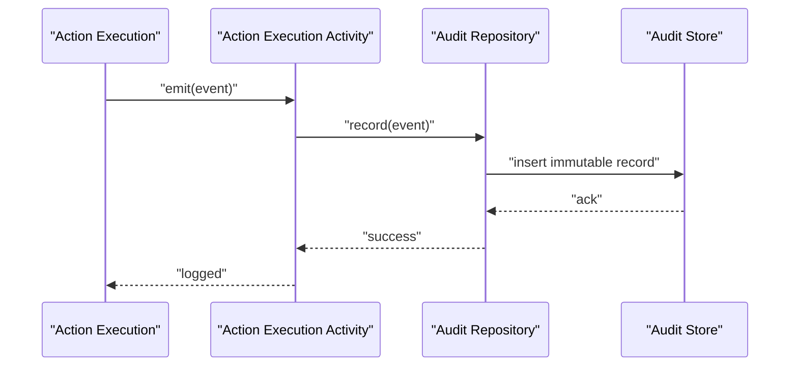

**Diagram sources**
- [app/services/action_execution_activity.py](file://app/services/action_execution_activity.py)
- [app/repositories/audit_repository.py](file://app/repositories/audit_repository.py)
- [app/schemas/audit.py](file://app/schemas/audit.py)

**Section sources**
- [app/services/action_execution_activity.py](file://app/services/action_execution_activity.py)
- [app/repositories/audit_repository.py](file://app/repositories/audit_repository.py)
- [app/schemas/audit.py](file://app/schemas/audit.py)

### Data Encryption at Rest and In Transit
- At rest:
  - Encryption settings are configured centrally; sensitive fields may be encrypted prior to storage depending on configuration.
- In transit:
  - TLS termination and HTTP Strict Transport Security are enforced via application configuration and middleware.

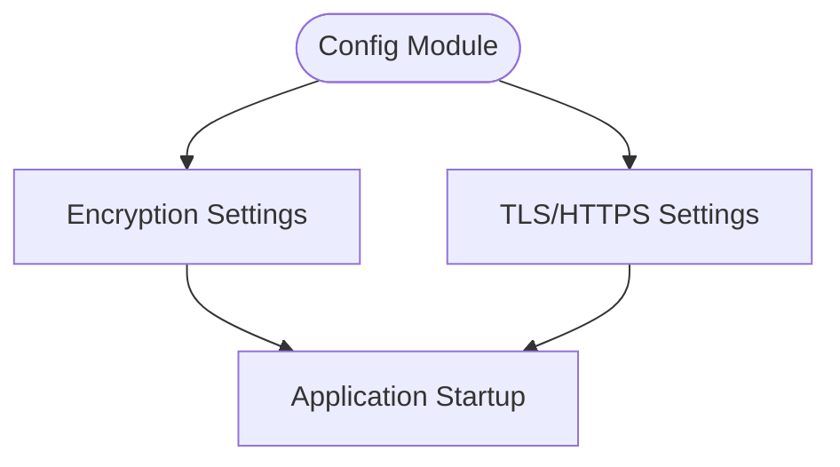

**Diagram sources**
- [app/core/config.py](file://app/core/config.py)
- [app/main.py](file://app/main.py)

**Section sources**
- [app/core/config.py](file://app/core/config.py)
- [app/main.py](file://app/main.py)

### Secure API Communication
- Authentication:
  - Protected endpoints require valid JWT tokens.
- Authorization:
  - Each endpoint enforces RBAC and organization boundaries.
- Headers:
  - Security headers are applied globally to mitigate common web vulnerabilities.

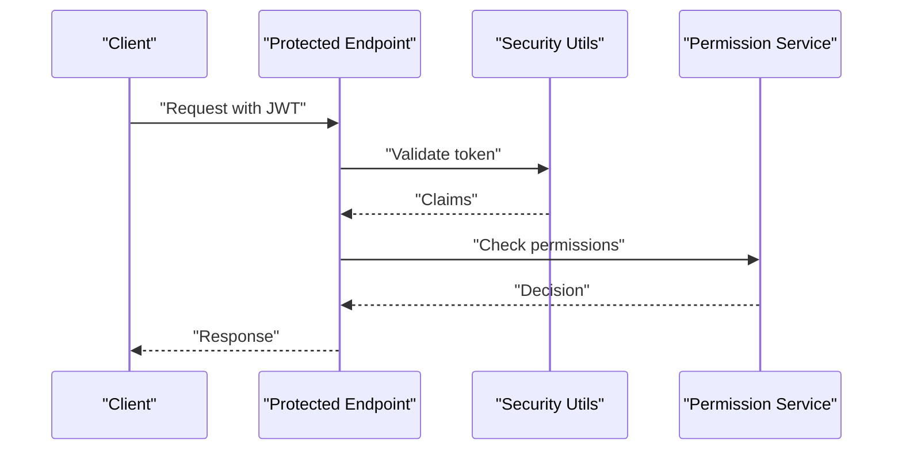

**Diagram sources**
- [app/api/auth_routes.py](file://app/api/auth_routes.py)
- [app/core/security.py](file://app/core/security.py)
- [app/permissions/permission_service.py](file://app/permissions/permission_service.py)

**Section sources**
- [app/api/auth_routes.py](file://app/api/auth_routes.py)
- [app/core/security.py](file://app/core/security.py)
- [app/permissions/permission_service.py](file://app/permissions/permission_service.py)

### Vulnerability Scanning Procedures
- Static analysis:
  - Automated scans integrated into CI pipelines detect known vulnerabilities and insecure patterns.
- Dependency checks:
  - Regular updates and advisories are monitored for third-party libraries.
- Runtime checks:
  - Health and security endpoints verify operational integrity.

[No sources needed since this section provides general guidance]

### Security Best Practices
- Use short-lived tokens with refresh mechanisms.
- Enforce least privilege in RBAC mappings.
- Validate all inputs and sanitize outputs strictly.
- Centralize secrets and rotate regularly.
- Apply security headers globally.
- Maintain comprehensive audit logs with tamper-evident storage.

[No sources needed since this section provides general guidance]

### Penetration Testing Guidelines
- Scope:
  - Authentication flows, authorization boundaries, session handling, and audit trails.
- Techniques:
  - Token forgery attempts, privilege escalation, session fixation, and cross-organization boundary tests.
- Reporting:
  - Document findings, severity, and remediation steps.

[No sources needed since this section provides general guidance]

### Incident Response Procedures
- Detection:
  - Monitor audit logs and anomaly signals.
- Containment:
  - Invalidate compromised sessions and revoke tokens.
- Eradication:
  - Patch vulnerabilities and rotate secrets.
- Recovery:
  - Restore from backups and validate integrity.
- Post-incident:
  - Update policies and run targeted retesting.

[No sources needed since this section provides general guidance]

### GDPR Compliance and Data Privacy Controls
- Data minimization:
  - Collect only necessary personal data.
- Consent and purpose limitation:
  - Ensure lawful basis and clear purposes for processing.
- Data subject rights:
  - Provide mechanisms for access, rectification, erasure, and portability.
- Retention and deletion:
  - Implement retention policies and automated deletion workflows.
- Cross-border transfers:
  - Apply appropriate safeguards and documentation.

[No sources needed since this section provides general guidance]

### Security Headers Configuration
- Recommended headers:
  - Strict-Transport-Security, Content-Security-Policy, X-Content-Type-Options, Referrer-Policy, Permissions-Policy.
- Enforcement:
  - Configure globally via application startup or middleware.

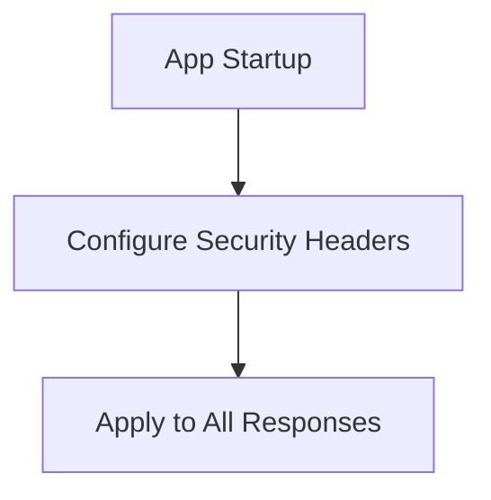

**Diagram sources**
- [app/main.py](file://app/main.py)

**Section sources**
- [app/main.py](file://app/main.py)

## Dependency Analysis
Security components depend on configuration, repositories, and schemas. The following diagram shows key relationships:

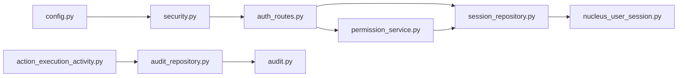

**Diagram sources**
- [app/core/config.py](file://app/core/config.py)
- [app/core/security.py](file://app/core/security.py)
- [app/api/auth_routes.py](file://app/api/auth_routes.py)
- [app/repositories/session_repository.py](file://app/repositories/session_repository.py)
- [app/db/nucleus_user_session.py](file://app/db/nucleus_user_session.py)
- [app/permissions/permission_service.py](file://app/permissions/permission_service.py)
- [app/services/action_execution_activity.py](file://app/services/action_execution_activity.py)
- [app/repositories/audit_repository.py](file://app/repositories/audit_repository.py)
- [app/schemas/audit.py](file://app/schemas/audit.py)

**Section sources**
- [app/core/config.py](file://app/core/config.py)
- [app/core/security.py](file://app/core/security.py)
- [app/api/auth_routes.py](file://app/api/auth_routes.py)
- [app/repositories/session_repository.py](file://app/repositories/session_repository.py)
- [app/db/nucleus_user_session.py](file://app/db/nucleus_user_session.py)
- [app/permissions/permission_service.py](file://app/permissions/permission_service.py)
- [app/services/action_execution_activity.py](file://app/services/action_execution_activity.py)
- [app/repositories/audit_repository.py](file://app/repositories/audit_repository.py)
- [app/schemas/audit.py](file://app/schemas/audit.py)

## Performance Considerations
- Token validation should be efficient; consider caching public keys if applicable.
- Session lookups must be indexed by session identifier and expiration time.
- Audit writes should be batched or asynchronous where possible without compromising immutability guarantees.
- Avoid heavy computations in hot paths; offload to background workers when feasible.

[No sources needed since this section provides general guidance]

## Troubleshooting Guide
- Authentication failures:
  - Verify token signature, expiration, and issuer configuration.
  - Check session existence and validity.
- Authorization denials:
  - Inspect role-permission mappings and organization context.
- Audit gaps:
  - Confirm event emission and repository write success.
- Security header issues:
  - Validate global header configuration and middleware ordering.

**Section sources**
- [app/api/auth_routes.py](file://app/api/auth_routes.py)
- [app/core/security.py](file://app/core/security.py)
- [app/permissions/permission_service.py](file://app/permissions/permission_service.py)
- [app/repositories/session_repository.py](file://app/repositories/session_repository.py)
- [app/repositories/audit_repository.py](file://app/repositories/audit_repository.py)
- [app/main.py](file://app/main.py)

## Conclusion
The platform implements a robust security architecture centered on JWT-based authentication, secure session management, RBAC-driven authorization, strict input validation, comprehensive audit logging, and configurable encryption. These components collectively support compliance requirements, including GDPR principles, and provide a foundation for ongoing security improvements, vulnerability management, and incident response.

[No sources needed since this section summarizes without analyzing specific files]

## Appendices

### Security Model Reference
- High-level security model documentation outlines design principles, threat assumptions, and architectural decisions.

**Section sources**
- [docs/SECURITY_MODEL.md](file://docs/SECURITY_MODEL.md)

### Security Test Coverage
- Tests validate authentication flows, authorization decisions, and audit logging behavior.

**Section sources**
- [tests/test_agent_action_security.py](file://tests/test_agent_action_security.py)
- [tests/test_permissions.py](file://tests/test_permissions.py)
- [tests/test_audit.py](file://tests/test_audit.py)