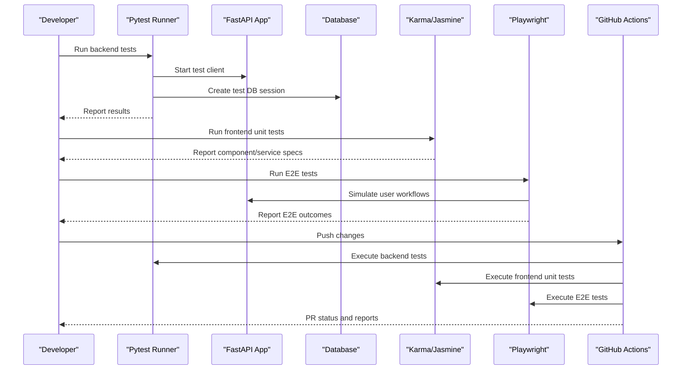
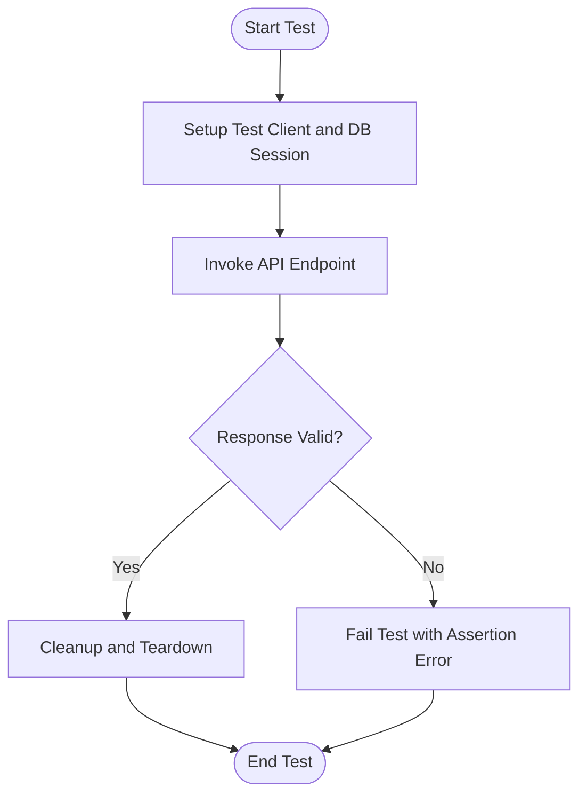
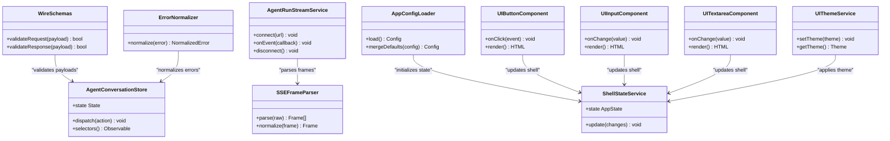
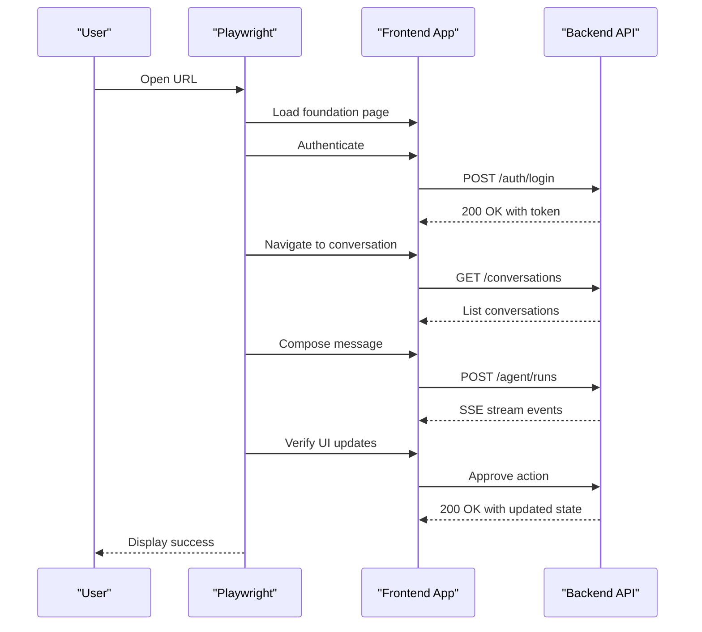
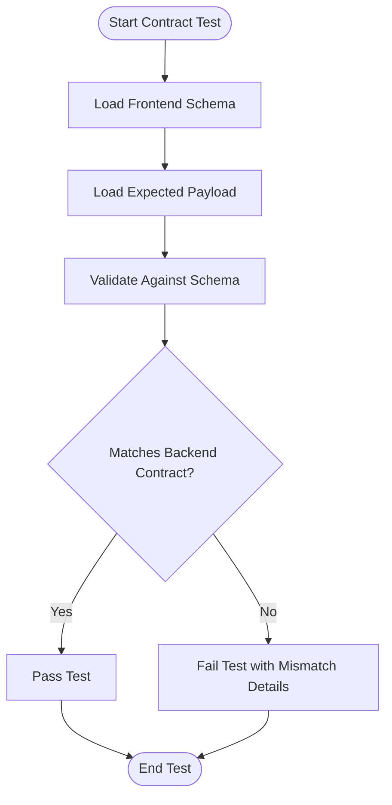
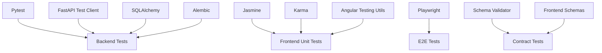

# Testing Strategy

<cite>
**Referenced Files in This Document**
- [tests/conftest.py](file://tests/conftest.py)
- [tests/test_agent_api.py](file://tests/test_agent_api.py)
- [tests/test_health.py](file://tests/test_health.py)
- [tests/test_migrations.py](file://tests/test_migrations.py)
- [tests/test_frontend_contracts.py](file://tests/test_frontend_contracts.py)
- [tests/test_phase5_contract.py](file://tests/test_phase5_contract.py)
- [tests/test_phase6_contract.py](file://tests/test_phase6_contract.py)
- [frontend/e2e/foundation.spec.ts](file://frontend/e2e/foundation.spec.ts)
- [frontend/e2e/assistant-conversation.spec.ts](file://frontend/e2e/assistant-conversation.spec.ts)
- [frontend/e2e/approval-center.spec.ts](file://frontend/e2e/approval-center.spec.ts)
- [frontend/playwright.config.ts](file://frontend/playwright.config.ts)
- [.github/workflows/tests.yml](file://.github/workflows/tests.yml)
- [pyproject.toml](file://pyproject.toml)
- [app/main.py](file://app/main.py)
- [app/api/health_routes.py](file://app/api/health_routes.py)
- [app/api/auth_routes.py](file://app/api/auth_routes.py)
- [app/db/session.py](file://app/db/session.py)
- [alembic/env.py](file://alembic/env.py)
- [frontend/src/app/core/api/wire.schemas.ts](file://frontend/src/app/core/api/wire.schemas.ts)
- [frontend/src/app/core/api/wire.schemas.spec.ts](file://frontend/src/app/core/api/wire.schemas.spec.ts)
- [frontend/src/app/features/assistant-conversation/agent-conversation.store.spec.ts](file://frontend/src/app/features/assistant-conversation/agent-conversation.store.spec.ts)
- [frontend/src/app/core/agent-run/agent-run-stream.service.spec.ts](file://frontend/src/app/core/agent-run/agent-run-stream.service.spec.ts)
- [frontend/src/app/core/agent-run/sse-frame-parser.spec.ts](file://frontend/src/app/core/agent-run/sse-frame-parser.spec.ts)
- [frontend/src/app/core/errors/error-normalizer.spec.ts](file://frontend/src/app/core/errors/error-normalizer.spec.ts)
- [frontend/src/app/core/config/app-config.loader.spec.ts](file://frontend/src/app/core/config/app-config.loader.spec.ts)
- [frontend/src/app/core/shell/shell-state.service.spec.ts](file://frontend/src/app/core/shell/shell-state.service.spec.ts)
- [frontend/src/app/shared/ui/ui-button.component.spec.ts](file://frontend/src/app/shared/ui/ui-button.component.spec.ts)
- [frontend/src/app/shared/ui/ui-input.component.spec.ts](file://frontend/src/app/shared/ui/ui-input.component.spec.ts)
- [frontend/src/app/shared/ui/ui-textarea.component.spec.ts](file://frontend/src/app/shared/ui/ui-textarea.component.spec.ts)
- [frontend/src/app/shared/theme/ui-theme.service.spec.ts](file://frontend/src/app/shared/theme/ui-theme.service.spec.ts)
- [frontend/src/app/app.component.spec.ts](file://frontend/src/app/app.component.spec.ts)
- [frontend/public/config/app-config.json](file://frontend/public/config/app-config.json)
</cite>

## Table of Contents
1. Introduction
2. Project Structure
3. Core Components
4. Architecture Overview
5. Detailed Component Analysis
6. Dependency Analysis
7. Performance Considerations
8. Troubleshooting Guide
9. Conclusion

## Introduction
This document describes the multi-layered testing strategy for the project, covering unit tests for backend services and frontend components, integration tests for API endpoints and database operations, end-to-end (E2E) tests using Playwright, and contract tests to validate API compatibility between frontend and backend. It also documents testing utilities, fixtures, mock strategies, test data management, parallel execution, continuous integration setup, code coverage requirements, best practices, and debugging techniques.

## Project Structure
The repository organizes tests across multiple layers:
- Backend unit and integration tests under tests/
- Frontend unit tests co-located with Angular components and services (*.spec.ts)
- E2E tests under frontend/e2e/ using Playwright
- Contract validation scripts and tests ensuring frontend-backend compatibility
- CI pipeline configuration under .github/workflows/

```mermaid
graph TB
subgraph "Backend Tests"
T_Conf["tests/conftest.py"]
T_API["tests/test_agent_api.py"]
T_Health["tests/test_health.py"]
T_Mig["tests/test_migrations.py"]
end
subgraph "Frontend Unit Tests"
F_SchemaSpec["frontend/src/app/core/api/wire.schemas.spec.ts"]
F_StoreSpec["frontend/src/app/features/assistant-conversation/agent-conversation.store.spec.ts"]
F_StreamSpec["frontend/src/app/core/agent-run/agent-run-stream.service.spec.ts"]
F_ParseSpec["frontend/src/app/core/agent-run/sse-frame-parser.spec.ts"]
F_ErrorSpec["frontend/src/app/core/errors/error-normalizer.spec.ts"]
F_ConfigSpec["frontend/src/app/core/config/app-config.loader.spec.ts"]
F_ShellSpec["frontend/src/app/core/shell/shell-state.service.spec.ts"]
F_UI_Btn["frontend/src/app/shared/ui/ui-button.component.spec.ts"]
F_UI_Input["frontend/src/app/shared/ui/ui-input.component.spec.ts"]
F_UI_Textarea["frontend/src/app/shared/ui/ui-textarea.component.spec.ts"]
F_Theme["frontend/src/app/shared/theme/ui-theme.service.spec.ts"]
F_AppSpec["frontend/src/app/app.component.spec.ts"]
end
subgraph "E2E Tests"
E_Foundation["frontend/e2e/foundation.spec.ts"]
E_Conversation["frontend/e2e/assistant-conversation.spec.ts"]
E_Approval["frontend/e2e/approval-center.spec.ts"]
PWConf["frontend/playwright.config.ts"]
end
subgraph "Contract Tests"
C_Frontend["tests/test_frontend_contracts.py"]
C_Phase5["tests/test_phase5_contract.py"]
C_Phase6["tests/test_phase6_contract.py"]
end
T_Conf --> T_API
T_Conf --> T_Health
T_Conf --> T_Mig
F_SchemaSpec --> C_Frontend
F_StoreSpec --> C_Frontend
F_StreamSpec --> C_Frontend
F_ParseSpec --> C_Frontend
F_ErrorSpec --> C_Frontend
F_ConfigSpec --> C_Frontend
F_ShellSpec --> C_Frontend
F_UI_Btn --> C_Frontend
F_UI_Input --> C_Frontend
F_UI_Textarea --> C_Frontend
F_Theme --> C_Frontend
F_AppSpec --> C_Frontend
E_Foundation --> PWConf
E_Conversation --> PWConf
E_Approval --> PWConf
```

**Diagram sources**
- [tests/conftest.py](file://tests/conftest.py)
- [tests/test_agent_api.py](file://tests/test_agent_api.py)
- [tests/test_health.py](file://tests/test_health.py)
- [tests/test_migrations.py](file://tests/test_migrations.py)
- [frontend/src/app/core/api/wire.schemas.spec.ts](file://frontend/src/app/core/api/wire.schemas.spec.ts)
- [frontend/src/app/features/assistant-conversation/agent-conversation.store.spec.ts](file://frontend/src/app/features/assistant-conversation/agent-conversation.store.spec.ts)
- [frontend/src/app/core/agent-run/agent-run-stream.service.spec.ts](file://frontend/src/app/core/agent-run/agent-run-stream.service.spec.ts)
- [frontend/src/app/core/agent-run/sse-frame-parser.spec.ts](file://frontend/src/app/core/agent-run/sse-frame-parser.spec.ts)
- [frontend/src/app/core/errors/error-normalizer.spec.ts](file://frontend/src/app/core/errors/error-normalizer.spec.ts)
- [frontend/src/app/core/config/app-config.loader.spec.ts](file://frontend/src/app/core/config/app-config.loader.spec.ts)
- [frontend/src/app/core/shell/shell-state.service.spec.ts](file://frontend/src/app/core/shell/shell-state.service.spec.ts)
- [frontend/src/app/shared/ui/ui-button.component.spec.ts](file://frontend/src/app/shared/ui/ui-button.component.spec.ts)
- [frontend/src/app/shared/ui/ui-input.component.spec.ts](file://frontend/src/app/shared/ui/ui-input.component.spec.ts)
- [frontend/src/app/shared/ui/ui-textarea.component.spec.ts](file://frontend/src/app/shared/ui/ui-textarea.component.spec.ts)
- [frontend/src/app/shared/theme/ui-theme.service.spec.ts](file://frontend/src/app/shared/theme/ui-theme.service.spec.ts)
- [frontend/src/app/app.component.spec.ts](file://frontend/src/app/app.component.spec.ts)
- [frontend/e2e/foundation.spec.ts](file://frontend/e2e/foundation.spec.ts)
- [frontend/e2e/assistant-conversation.spec.ts](file://frontend/e2e/assistant-conversation.spec.ts)
- [frontend/e2e/approval-center.spec.ts](file://frontend/e2e/approval-center.spec.ts)
- [frontend/playwright.config.ts](file://frontend/playwright.config.ts)
- [tests/test_frontend_contracts.py](file://tests/test_frontend_contracts.py)
- [tests/test_phase5_contract.py](file://tests/test_phase5_contract.py)
- [tests/test_phase6_contract.py](file://tests/test_phase6_contract.py)

**Section sources**
- [tests/conftest.py](file://tests/conftest.py)
- [frontend/playwright.config.ts](file://frontend/playwright.config.ts)
- [.github/workflows/tests.yml](file://.github/workflows/tests.yml)

## Core Components
This section outlines the primary testing components and their responsibilities:
- Backend test configuration and fixtures: centralized pytest configuration and shared fixtures for DB sessions, app clients, and test data.
- Frontend unit tests: Angular Jasmine/Karma specs validating schemas, stores, services, UI components, and error handling.
- E2E tests: Playwright scenarios simulating user workflows across authentication, conversation flows, and approval center interactions.
- Contract tests: Python-based validations ensuring frontend schemas and expected payloads match backend contracts.

Key areas covered:
- Unit testing strategies for backend services and utility functions
- Integration testing for API endpoints and database operations
- End-to-end testing with Playwright for user workflow simulation
- Contract testing for API compatibility and frontend-backend interface validation
- Test utilities, fixtures, and mock strategies for external dependencies
- Test data management, parallel test execution, and CI setup
- Code coverage requirements, best practices, and debugging techniques

**Section sources**
- [tests/conftest.py](file://tests/conftest.py)
- [frontend/src/app/core/api/wire.schemas.spec.ts](file://frontend/src/app/core/api/wire.schemas.spec.ts)
- [frontend/src/app/features/assistant-conversation/agent-conversation.store.spec.ts](file://frontend/src/app/features/assistant-conversation/agent-conversation.store.spec.ts)
- [frontend/src/app/core/agent-run/agent-run-stream.service.spec.ts](file://frontend/src/app/core/agent-run/agent-run-stream.service.spec.ts)
- [frontend/src/app/core/agent-run/sse-frame-parser.spec.ts](file://frontend/src/app/core/agent-run/sse-frame-parser.spec.ts)
- [frontend/src/app/core/errors/error-normalizer.spec.ts](file://frontend/src/app/core/errors/error-normalizer.spec.ts)
- [frontend/src/app/core/config/app-config.loader.spec.ts](file://frontend/src/app/core/config/app-config.loader.spec.ts)
- [frontend/src/app/core/shell/shell-state.service.spec.ts](file://frontend/src/app/core/shell/shell-state.service.spec.ts)
- [frontend/src/app/shared/ui/ui-button.component.spec.ts](file://frontend/src/app/shared/ui/ui-button.component.spec.ts)
- [frontend/src/app/shared/ui/ui-input.component.spec.ts](file://frontend/src/app/shared/ui/ui-input.component.spec.ts)
- [frontend/src/app/shared/ui/ui-textarea.component.spec.ts](file://frontend/src/app/shared/ui/ui-textarea.component.spec.ts)
- [frontend/src/app/shared/theme/ui-theme.service.spec.ts](file://frontend/src/app/shared/theme/ui-theme.service.spec.ts)
- [frontend/src/app/app.component.spec.ts](file://frontend/src/app/app.component.spec.ts)
- [frontend/e2e/foundation.spec.ts](file://frontend/e2e/foundation.spec.ts)
- [frontend/e2e/assistant-conversation.spec.ts](file://frontend/e2e/assistant-conversation.spec.ts)
- [frontend/e2e/approval-center.spec.ts](file://frontend/e2e/approval-center.spec.ts)
- [tests/test_frontend_contracts.py](file://tests/test_frontend_contracts.py)
- [tests/test_phase5_contract.py](file://tests/test_phase5_contract.py)
- [tests/test_phase6_contract.py](file://tests/test_phase6_contract.py)

## Architecture Overview
The testing architecture spans multiple layers with clear separation of concerns:
- Backend layer: Pytest-driven tests interacting with FastAPI application routes and database via session fixtures.
- Frontend layer: Angular unit tests validating schemas, state stores, streaming services, and UI components.
- E2E layer: Playwright orchestrating browser automation to simulate real user journeys.
- Contract layer: Python tests validating JSON schema compliance and payload shapes against frontend expectations.

**Diagram sources**
- [tests/conftest.py](file://tests/conftest.py)
- [app/main.py](file://app/main.py)
- [app/api/health_routes.py](file://app/api/health_routes.py)
- [app/db/session.py](file://app/db/session.py)
- [frontend/playwright.config.ts](file://frontend/playwright.config.ts)
- [.github/workflows/tests.yml](file://.github/workflows/tests.yml)

**Section sources**
- [app/main.py](file://app/main.py)
- [app/api/health_routes.py](file://app/api/health_routes.py)
- [app/db/session.py](file://app/db/session.py)
- [frontend/playwright.config.ts](file://frontend/playwright.config.ts)
- [.github/workflows/tests.yml](file://.github/workflows/tests.yml)

## Detailed Component Analysis

### Backend Unit and Integration Testing
- Pytest configuration and fixtures provide a consistent environment for tests, including database sessions, application clients, and shared helpers.
- API endpoint tests exercise route handlers and middleware, asserting response schemas and status codes.
- Health checks and migration tests ensure service readiness and schema evolution integrity.

**Diagram sources**
- [tests/conftest.py](file://tests/conftest.py)
- [tests/test_agent_api.py](file://tests/test_agent_api.py)
- [tests/test_health.py](file://tests/test_health.py)
- [tests/test_migrations.py](file://tests/test_migrations.py)

**Section sources**
- [tests/conftest.py](file://tests/conftest.py)
- [tests/test_agent_api.py](file://tests/test_agent_api.py)
- [tests/test_health.py](file://tests/test_health.py)
- [tests/test_migrations.py](file://tests/test_migrations.py)

### Frontend Unit Testing
- Schema validation specs ensure wire formats conform to expected structures.
- Store specs verify state transitions and side effects for conversation flows.
- Streaming service specs validate SSE frame parsing and event handling.
- UI component specs assert rendering, interactions, and accessibility attributes.
- Configuration loader specs confirm runtime config loading and defaults.

**Diagram sources**
- [frontend/src/app/core/api/wire.schemas.spec.ts](file://frontend/src/app/core/api/wire.schemas.spec.ts)
- [frontend/src/app/features/assistant-conversation/agent-conversation.store.spec.ts](file://frontend/src/app/features/assistant-conversation/agent-conversation.store.spec.ts)
- [frontend/src/app/core/agent-run/agent-run-stream.service.spec.ts](file://frontend/src/app/core/agent-run/agent-run-stream.service.spec.ts)
- [frontend/src/app/core/agent-run/sse-frame-parser.spec.ts](file://frontend/src/app/core/agent-run/sse-frame-parser.spec.ts)
- [frontend/src/app/core/errors/error-normalizer.spec.ts](file://frontend/src/app/core/errors/error-normalizer.spec.ts)
- [frontend/src/app/core/config/app-config.loader.spec.ts](file://frontend/src/app/core/config/app-config.loader.spec.ts)
- [frontend/src/app/core/shell/shell-state.service.spec.ts](file://frontend/src/app/core/shell/shell-state.service.spec.ts)
- [frontend/src/app/shared/ui/ui-button.component.spec.ts](file://frontend/src/app/shared/ui/ui-button.component.spec.ts)
- [frontend/src/app/shared/ui/ui-input.component.spec.ts](file://frontend/src/app/shared/ui/ui-input.component.spec.ts)
- [frontend/src/app/shared/ui/ui-textarea.component.spec.ts](file://frontend/src/app/shared/ui/ui-textarea.component.spec.ts)
- [frontend/src/app/shared/theme/ui-theme.service.spec.ts](file://frontend/src/app/shared/theme/ui-theme.service.spec.ts)

**Section sources**
- [frontend/src/app/core/api/wire.schemas.spec.ts](file://frontend/src/app/core/api/wire.schemas.spec.ts)
- [frontend/src/app/features/assistant-conversation/agent-conversation.store.spec.ts](file://frontend/src/app/features/assistant-conversation/agent-conversation.store.spec.ts)
- [frontend/src/app/core/agent-run/agent-run-stream.service.spec.ts](file://frontend/src/app/core/agent-run/agent-run-stream.service.spec.ts)
- [frontend/src/app/core/agent-run/sse-frame-parser.spec.ts](file://frontend/src/app/core/agent-run/sse-frame-parser.spec.ts)
- [frontend/src/app/core/errors/error-normalizer.spec.ts](file://frontend/src/app/core/errors/error-normalizer.spec.ts)
- [frontend/src/app/core/config/app-config.loader.spec.ts](file://frontend/src/app/core/config/app-config.loader.spec.ts)
- [frontend/src/app/core/shell/shell-state.service.spec.ts](file://frontend/src/app/shell/shell-state.service.spec.ts)
- [frontend/src/app/shared/ui/ui-button.component.spec.ts](file://frontend/src/app/shared/ui/ui-button.component.spec.ts)
- [frontend/src/app/shared/ui/ui-input.component.spec.ts](file://frontend/src/app/shared/ui/ui-input.component.spec.ts)
- [frontend/src/app/shared/ui/ui-textarea.component.spec.ts](file://frontend/src/app/shared/ui/ui-textarea.component.spec.ts)
- [frontend/src/app/shared/theme/ui-theme.service.spec.ts](file://frontend/src/app/shared/theme/ui-theme.service.spec.ts)

### End-to-End Testing with Playwright
- Foundation spec validates basic navigation, auth flow, and initial page load behavior.
- Assistant conversation spec simulates message composition, streaming responses, and UI updates.
- Approval center spec covers proposal review, approval actions, and state synchronization.

**Diagram sources**
- [frontend/e2e/foundation.spec.ts](file://frontend/e2e/foundation.spec.ts)
- [frontend/e2e/assistant-conversation.spec.ts](file://frontend/e2e/assistant-conversation.spec.ts)
- [frontend/e2e/approval-center.spec.ts](file://frontend/e2e/approval-center.spec.ts)
- [frontend/playwright.config.ts](file://frontend/playwright.config.ts)

**Section sources**
- [frontend/e2e/foundation.spec.ts](file://frontend/e2e/foundation.spec.ts)
- [frontend/e2e/assistant-conversation.spec.ts](file://frontend/e2e/assistant-conversation.spec.ts)
- [frontend/e2e/approval-center.spec.ts](file://frontend/e2e/approval-center.spec.ts)
- [frontend/playwright.config.ts](file://frontend/playwright.config.ts)

### Contract Testing for API Compatibility
- Frontend contract tests validate that wire schemas and expected payloads align with backend contracts.
- Phase-specific contract tests ensure evolving features maintain compatibility across versions.

**Diagram sources**
- [tests/test_frontend_contracts.py](file://tests/test_frontend_contracts.py)
- [tests/test_phase5_contract.py](file://tests/test_phase5_contract.py)
- [tests/test_phase6_contract.py](file://tests/test_phase6_contract.py)
- [frontend/src/app/core/api/wire.schemas.ts](file://frontend/src/app/core/api/wire.schemas.ts)

**Section sources**
- [tests/test_frontend_contracts.py](file://tests/test_frontend_contracts.py)
- [tests/test_phase5_contract.py](file://tests/test_phase5_contract.py)
- [tests/test_phase6_contract.py](file://tests/test_phase6_contract.py)
- [frontend/src/app/core/api/wire.schemas.ts](file://frontend/src/app/core/api/wire.schemas.ts)

## Dependency Analysis
Testing dependencies are organized by layer and tooling:
- Backend tests depend on pytest, FastAPI test client, SQLAlchemy session fixtures, and Alembic for migrations.
- Frontend unit tests rely on Angular testing utilities, Jasmine, and Karma.
- E2E tests use Playwright for browser automation and network interception.
- Contract tests integrate Python-based schema validation with frontend-generated schemas.

**Diagram sources**
- [tests/conftest.py](file://tests/conftest.py)
- [app/db/session.py](file://app/db/session.py)
- [alembic/env.py](file://alembic/env.py)
- [frontend/playwright.config.ts](file://frontend/playwright.config.ts)
- [frontend/src/app/core/api/wire.schemas.ts](file://frontend/src/app/core/api/wire.schemas.ts)

**Section sources**
- [tests/conftest.py](file://tests/conftest.py)
- [app/db/session.py](file://app/db/session.py)
- [alembic/env.py](file://alembic/env.py)
- [frontend/playwright.config.ts](file://frontend/playwright.config.ts)
- [frontend/src/app/core/api/wire.schemas.ts](file://frontend/src/app/core/api/wire.schemas.ts)

## Performance Considerations
- Use in-memory databases or lightweight fixtures for fast unit tests.
- Parallelize independent tests to reduce overall execution time.
- Mock external services and APIs to avoid flaky network calls.
- Cache expensive setup operations like database seeding where appropriate.
- Limit E2E test scope to critical user journeys to keep CI times reasonable.

[No sources needed since this section provides general guidance]

## Troubleshooting Guide
Common issues and debugging techniques:
- Backend tests failing due to DB state: reset fixtures, ensure transaction rollback, and isolate test data.
- Frontend unit tests timing out: increase timeouts for async operations, mock slow services.
- E2E tests flakiness: add explicit waits, stabilize selectors, and handle asynchronous UI updates.
- Contract mismatches: update frontend schemas to match backend changes or vice versa based on versioning policy.
- Coverage gaps: identify untested paths and add targeted assertions.

**Section sources**
- [tests/conftest.py](file://tests/conftest.py)
- [frontend/playwright.config.ts](file://frontend/playwright.config.ts)
- [pyproject.toml](file://pyproject.toml)

## Conclusion
The multi-layered testing strategy ensures robustness across backend services, frontend components, and end-to-end user workflows. By combining unit, integration, E2E, and contract tests with strong fixtures, mocks, and CI automation, the project maintains high quality and rapid feedback loops. Adhering to best practices for test data management, parallel execution, and debugging will further enhance reliability and developer productivity.

[No sources needed since this section summarizes without analyzing specific files]